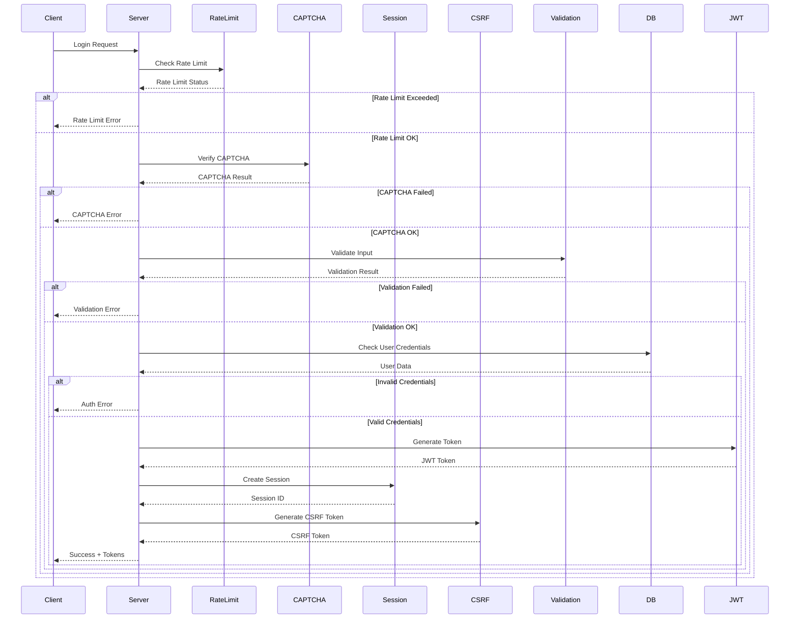

# 🔧 Backend Flow (Server-Side) - KAI Railway Ticketing Platform

## Server Architecture & Request Flow

```mermaid
flowchart TD
    Client[👤 Client Request] --> LoadBalancer[⚖️ Load Balancer]
    LoadBalancer --> Server[🖥️ Hono.js Server]
    
    Server --> CORS[🌐 CORS Middleware]
    CORS --> Prometheus[📊 Prometheus Metrics]
    Prometheus --> Logger[📝 Logger Middleware]
    Logger --> RouteRouter[🔀 Route Router]
    
    RouteRouter --> AuthRoutes{🔐 Authentication Routes}
    RouteRouter --> OrderRoutes{📋 Order Routes}
    RouteRouter --> MasterDataRoutes{🗃️ Master Data Routes}
    RouteRouter --> PaymentRoutes{💳 Payment Routes}
    
    AuthRoutes --> PentaSecurity[🛡️ PENTA Security System]
    
    PentaSecurity --> Layer1[🚦 Layer 1: Rate Limiting]
    Layer1 --> Layer2[🤖 Layer 2: CAPTCHA Verification]
    Layer2 --> Layer3[🔐 Layer 3: Session Security]
    Layer3 --> Layer4[🛡️ Layer 4: CSRF Protection]
    Layer4 --> Layer5[✅ Layer 5: Input Validation]
    
    Layer1 --> RateLimitCheck{🚦 Rate Limit Check}
    RateLimitCheck -->|Exceeded| RateLimitResponse[❌ Rate Limit Response]
    RateLimitCheck -->|OK| Layer2
    
    Layer2 --> CaptchaVerify{🤖 CAPTCHA Verify}
    CaptchaVerify -->|Failed| CaptchaResponse[❌ CAPTCHA Failed]
    CaptchaVerify -->|OK| Layer3
    
    Layer3 --> SessionCheck{🔐 Session Check}
    SessionCheck -->|Invalid| SessionResponse[❌ Session Invalid]
    SessionCheck -->|Valid| Layer4
    
    Layer4 --> CSRFValidate{🛡️ CSRF Validate}
    CSRFValidate -->|Failed| CSRFResponse[❌ CSRF Failed]
    CSRFValidate -->|OK| Layer5
    
    Layer5 --> InputValidation{✅ Input Validation}
    InputValidation -->|Failed| ValidationResponse[❌ Validation Failed]
    InputValidation -->|OK| AuthController[🎯 Auth Controller]
    
    AuthController --> AuthAction{🔐 Auth Action}
    AuthAction --> LoginFlow[🔑 Login Flow]
    AuthAction --> RegisterFlow[📝 Register Flow]
    AuthAction --> LogoutFlow[🚪 Logout Flow]
    
    LoginFlow --> LoginValidation[✅ Login Validation]
    LoginValidation --> PasswordCheck[🔒 Password Check]
    PasswordCheck --> JWTGeneration[🎫 JWT Generation]
    JWTGeneration --> SessionCreation[🔐 Session Creation]
    
    RegisterFlow --> RegisterValidation[✅ Register Validation]
    RegisterValidation --> PasswordHash[🔒 Password Hash]
    PasswordHash --> UserCreation[👤 User Creation]
    UserCreation --> AutoLogin[🔑 Auto Login]
    
    OrderRoutes --> OrderSecurity[🛡️ Order Security]
    OrderSecurity --> AuthMiddleware[🔐 Auth Middleware]
    AuthMiddleware --> OrderController[📋 Order Controller]
    
    OrderController --> OrderActions{📋 Order Actions}
    OrderActions --> CreateOrder[➕ Create Order]
    OrderActions --> GetOrder[📊 Get Order]
    OrderActions --> UpdateOrder[🔄 Update Order]
    OrderActions --> CancelOrder[❌ Cancel Order]
    
    CreateOrder --> OrderValidation[✅ Order Validation]
    OrderValidation --> AvailabilityCheck[📊 Availability Check]
    AvailabilityCheck --> PriceCalculation[💰 Price Calculation]
    PriceCalculation --> OrderPersistence[💾 Order Persistence]
    
    MasterDataRoutes --> MasterDataController[🗃️ Master Data Controller]
    MasterDataController --> DataActions{🗃️ Data Actions}
    
    DataActions --> GetStations[🚉 Get Stations]
    DataActions --> GetTrains[🚂 Get Trains]
    DataActions --> GetSchedules[📅 Get Schedules]
    DataActions --> GetTickets[🎫 Get Tickets]
    DataActions --> GetSeats[💺 Get Seats]
    
    PaymentRoutes --> PaymentController[💳 Payment Controller]
    PaymentController --> PaymentActions{💳 Payment Actions}
    
    PaymentActions --> CreatePayment[➕ Create Payment]
    PaymentActions --> CheckStatus[📊 Check Status]
    PaymentActions --> ProcessWebhook[🔗 Process Webhook]
    PaymentActions --> HandleRefund[🔄 Handle Refund]
    
    CreatePayment --> MidtransAPI[💳 Midtrans API]
    ProcessWebhook --> WebhookValidation[✅ Webhook Validation]
    WebhookValidation --> PaymentUpdate[🔄 Payment Update]
    
    DatabaseLayer[🗄️ Database Layer] --> DrizzleORM[🔧 Drizzle ORM]
    DrizzleORM --> PostgreSQL[🐘 PostgreSQL/Neon]
    
    OrderPersistence --> DatabaseLayer
    UserCreation --> DatabaseLayer
    PaymentUpdate --> DatabaseLayer
    
    ResponseFormatter[📝 Response Formatter] --> SuccessResponse[✅ Success Response]
    ResponseFormatter --> ErrorResponse[❌ Error Response]
    
    SuccessResponse --> Client
    ErrorResponse --> Client
    RateLimitResponse --> Client
    CaptchaResponse --> Client
    SessionResponse --> Client
    CSRFResponse --> Client
    ValidationResponse --> Client
    
    style PentaSecurity fill:#F44336,color:#fff
    style DatabaseLayer fill:#4CAF50,color:#fff
    style AuthController fill:#2196F3,color:#fff
    style PaymentController fill:#FF9800,color:#fff
```

## Database Operations Flow

```mermaid
flowchart TD
    Request[📡 API Request] --> Controller[🎯 Controller]
    Controller --> Repository[📦 Repository Layer]
    
    Repository --> OperationType{🔧 Operation Type}
    
    OperationType --> CreateOp[➕ Create Operation]
    OperationType --> ReadOp[📊 Read Operation]
    OperationType --> UpdateOp[🔄 Update Operation]
    OperationType --> DeleteOp[❌ Delete Operation]
    
    CreateOp --> CreateValidation[✅ Create Validation]
    CreateValidation --> CreateQuery[📝 Create Query]
    CreateQuery --> DrizzleInsert[➕ Drizzle Insert]
    
    ReadOp --> ReadParams[📋 Read Parameters]
    ReadParams --> QueryBuilder[🔧 Query Builder]
    QueryBuilder --> DrizzleSelect[📊 Drizzle Select]
    
    UpdateOp --> UpdateValidation[✅ Update Validation]
    UpdateValidation --> UpdateQuery[📝 Update Query]
    UpdateQuery --> DrizzleUpdate[🔄 Drizzle Update]
    
    DeleteOp --> DeleteValidation[✅ Delete Validation]
    DeleteValidation --> DeleteQuery[📝 Delete Query]
    DeleteQuery --> DrizzleDelete[❌ Drizzle Delete]
    
    DrizzleInsert --> DatabaseExec[🗄️ Database Execution]
    DrizzleSelect --> DatabaseExec
    DrizzleUpdate --> DatabaseExec
    DrizzleDelete --> DatabaseExec
    
    DatabaseExec --> TransactionCheck{🔄 Transaction?}
    
    TransactionCheck -->|Yes| BeginTransaction[🔄 Begin Transaction]
    TransactionCheck -->|No| ExecuteQuery[⚡ Execute Query]
    
    BeginTransaction --> ExecuteQueries[⚡ Execute Queries]
    ExecuteQueries --> QueryResult{📊 Query Result}
    
    QueryResult -->|Success| CommitTransaction[✅ Commit Transaction]
    QueryResult -->|Error| RollbackTransaction[❌ Rollback Transaction]
    
    CommitTransaction --> SuccessResult[✅ Success Result]
    RollbackTransaction --> ErrorResult[❌ Error Result]
    
    ExecuteQuery --> SingleQueryResult{📊 Single Query Result}
    SingleQueryResult -->|Success| SuccessResult
    SingleQueryResult -->|Error| ErrorResult
    
    SuccessResult --> DataTransformation[🔄 Data Transformation]
    ErrorResult --> ErrorHandler[❌ Error Handler]
    
    DataTransformation --> ResponseData[📊 Response Data]
    ErrorHandler --> ErrorResponse[❌ Error Response]
    
    ResponseData --> Controller
    ErrorResponse --> Controller
    
    style Repository fill:#4CAF50,color:#fff
    style DatabaseExec fill:#2196F3,color:#fff
    style TransactionCheck fill:#FF9800,color:#fff
    style ErrorHandler fill:#F44336,color:#fff
```

## Authentication & Session Management Flow

## Payment Processing Flow

```mermaid
flowchart TD
    PaymentRequest[💳 Payment Request] --> PaymentValidation[✅ Payment Validation]
    PaymentValidation --> ValidationResult{📋 Validation Result}
    
    ValidationResult -->|Invalid| ValidationError[❌ Validation Error]
    ValidationResult -->|Valid| MidtransCall[💳 Midtrans API Call]
    
    ValidationError --> ErrorResponse[❌ Error Response]
    
    MidtransCall --> MidtransAPI[🔗 Midtrans Gateway]
    MidtransAPI --> PaymentURL[🔗 Payment URL Generated]
    PaymentURL --> PaymentResponse[✅ Payment Response]
    
    PaymentResponse --> DatabaseUpdate[💾 Database Update]
    DatabaseUpdate --> UserNotification[📧 User Notification]
    
    MidtransAPI --> WebhookReceived[🔗 Webhook Received]
    WebhookReceived --> WebhookValidation[✅ Webhook Validation]
    
    WebhookValidation --> ValidWebhook{✅ Valid Webhook?}
    ValidWebhook -->|No| WebhookReject[❌ Reject Webhook]
    ValidWebhook -->|Yes| ProcessWebhook[⚡ Process Webhook]
    
    ProcessWebhook --> PaymentStatus{💰 Payment Status}
    
    PaymentStatus --> PaymentSuccess[✅ Payment Success]
    PaymentStatus --> PaymentPending[⏳ Payment Pending]
    PaymentStatus --> PaymentFailed[❌ Payment Failed]
    PaymentStatus --> PaymentExpired[⏰ Payment Expired]
    
    PaymentSuccess --> UpdateOrderStatus[📋 Update Order Status]
    PaymentSuccess --> GenerateTicket[🎫 Generate Ticket]
    PaymentSuccess --> SendConfirmation[📧 Send Confirmation]
    
    PaymentPending --> UpdatePendingStatus[⏳ Update Pending Status]
    PaymentFailed --> UpdateFailedStatus[❌ Update Failed Status]
    PaymentExpired --> UpdateExpiredStatus[⏰ Update Expired Status]
    
    UpdateOrderStatus --> TicketGeneration[🎫 Ticket Generation]
    TicketGeneration --> EmailDelivery[📧 Email Delivery]
    EmailDelivery --> ProcessComplete[✅ Process Complete]
    
    style PaymentRequest fill:#4CAF50,color:#fff
    style MidtransCall fill:#FF9800,color:#fff
    style PaymentSuccess fill:#8BC34A,color:#fff
    style PaymentFailed fill:#F44336,color:#fff
```

## Error Handling & Logging Flow

```mermaid
graph TD
    Error[❌ Error Occurred] --> ErrorHandler[🛠️ Error Handler]
    ErrorHandler --> ErrorType{❌ Error Type}
    
    ErrorType --> ValidationError[✅ Validation Error]
    ErrorType --> DatabaseError[🗄️ Database Error]
    ErrorType --> NetworkError[🌐 Network Error]
    ErrorType --> AuthenticationError[🔐 Authentication Error]
    ErrorType --> BusinessLogicError[📊 Business Logic Error]
    
    ValidationError --> ValidationLogger[📝 Validation Logger]
    DatabaseError --> DatabaseLogger[📝 Database Logger]
    NetworkError --> NetworkLogger[📝 Network Logger]
    AuthenticationError --> AuthLogger[📝 Auth Logger]
    BusinessLogicError --> BusinessLogger[📝 Business Logger]
    
    ValidationLogger --> LogLevel{📊 Log Level}
    DatabaseLogger --> LogLevel
    NetworkLogger --> LogLevel
    AuthLogger --> LogLevel
    BusinessLogger --> LogLevel
    
    LogLevel --> InfoLog[ℹ️ Info Log]
    LogLevel --> WarnLog[⚠️ Warning Log]
    LogLevel --> ErrorLog[❌ Error Log]
    LogLevel --> FatalLog[💀 Fatal Log]
    
    InfoLog --> LogStorage[💾 Log Storage]
    WarnLog --> LogStorage
    ErrorLog --> LogStorage
    FatalLog --> LogStorage
    
    LogStorage --> FileLog[📄 File Log]
    LogStorage --> DatabaseLog[🗄️ Database Log]
    LogStorage --> ExternalLog[🔗 External Log Service]
    
    ErrorHandler --> ResponseFormatter[📝 Response Formatter]
    ResponseFormatter --> ErrorResponse[❌ Error Response]
    
    ErrorResponse --> StatusCode{📊 Status Code}
    StatusCode --> 400Response[400 Bad Request]
    StatusCode --> 401Response[401 Unauthorized]
    StatusCode --> 403Response[403 Forbidden]
    StatusCode --> 404Response[404 Not Found]
    StatusCode --> 500Response[500 Internal Server Error]
    
    400Response --> ClientResponse[📱 Client Response]
    401Response --> ClientResponse
    403Response --> ClientResponse
    404Response --> ClientResponse
    500Response --> ClientResponse
    
    FatalLog --> AlertSystem[🚨 Alert System]
    AlertSystem --> NotifyAdmin[👨‍💼 Notify Admin]
    AlertSystem --> AutoRecovery[🔄 Auto Recovery]
    
    style Error fill:#F44336,color:#fff
    style ErrorHandler fill:#FF5722,color:#fff
    style LogStorage fill:#2196F3,color:#fff
    style AlertSystem fill:#FF9800,color:#fff
```

## API Middleware Chain Flow

```mermaid
flowchart LR
    Request[📡 Incoming Request] --> CORS[🌐 CORS]
    CORS --> Metrics[📊 Prometheus Metrics]
    Metrics --> Logger[📝 Logger]
    Logger --> RateLimit[🚦 Rate Limiting]
    RateLimit --> Auth[🔐 Authentication]
    Auth --> CSRF[🛡️ CSRF Protection]
    CSRF --> Validation[✅ Input Validation]
    Validation --> Controller[🎯 Controller]
    Controller --> Business[📊 Business Logic]
    Business --> Database[🗄️ Database]
    Database --> Response[📤 Response]
    Response --> ResponseFormat[📝 Format Response]
    ResponseFormat --> MetricsUpdate[📊 Update Metrics]
    MetricsUpdate --> LogResponse[📝 Log Response]
    LogResponse --> Client[👤 Client]
    
    RateLimit -.->|Rate Exceeded| RateLimitError[❌ Rate Limit Error]
    Auth -.->|Unauthorized| AuthError[❌ Auth Error]
    CSRF -.->|CSRF Failed| CSRFError[❌ CSRF Error]
    Validation -.->|Invalid Input| ValidationError[❌ Validation Error]
    Database -.->|DB Error| DatabaseError[❌ Database Error]
    
    RateLimitError --> ErrorHandler[🛠️ Error Handler]
    AuthError --> ErrorHandler
    CSRFError --> ErrorHandler
    ValidationError --> ErrorHandler
    DatabaseError --> ErrorHandler
    
    ErrorHandler --> ErrorResponse[❌ Error Response]
    ErrorResponse --> Client
    
    style Request fill:#4CAF50,color:#fff
    style Controller fill:#2196F3,color:#fff
    style Database fill:#FF9800,color:#fff
    style ErrorHandler fill:#F44336,color:#fff
```

