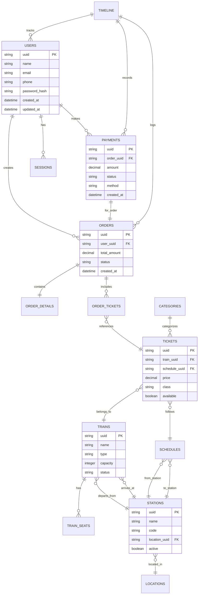

# 📊 Data Flow Diagram (DFD) - KAI Railway Ticketing Platform

## Level 0 DFD - Context Diagram

```mermaid
flowchart TD
    User[👤 Passenger/User] --> System((🚄 KAI Ticketing System))
    Admin[👨‍💼 Administrator] --> System
    PaymentGateway[💳 Midtrans Payment Gateway] --> System
    EmailService[📧 Email Service] --> System
    
    System --> User
    System --> Admin
    System --> PaymentGateway
    System --> EmailService
    
    User --> UserRequests[🔍 Search Trains<br/>📝 Book Tickets<br/>💳 Make Payment<br/>📱 View Tickets]
    UserRequests --> System
    
    Admin --> AdminRequests[📊 Manage System<br/>📈 View Reports<br/>⚙️ System Config]
    AdminRequests --> System
    
    System --> UserResponses[🚂 Train Information<br/>🎫 Digital Tickets<br/>📧 Confirmations<br/>📊 Booking History]
    UserResponses --> User
    
    System --> AdminResponses[📈 System Reports<br/>📊 Analytics<br/>🔧 System Status]
    AdminResponses --> Admin
    
    System --> PaymentRequests[💰 Payment Processing<br/>🔄 Transaction Status]
    PaymentRequests --> PaymentGateway
    
    PaymentGateway --> PaymentResponses[✅ Payment Confirmation<br/>❌ Payment Failed<br/>🔗 Webhook Notifications]
    PaymentResponses --> System
    
    System --> EmailRequests[📧 Send Tickets<br/>📨 Confirmations<br/>🔔 Notifications]
    EmailRequests --> EmailService
    
    style System fill:#2196F3,color:#fff
    style User fill:#4CAF50,color:#fff
    style Admin fill:#FF9800,color:#fff
    style PaymentGateway fill:#9C27B0,color:#fff
```

## Level 1 DFD - Main Processes

```mermaid
flowchart TD
    User[👤 User] --> P1((1.0<br/>🔐 User<br/>Authentication))
    User --> P2((2.0<br/>🔍 Train<br/>Search))
    User --> P3((3.0<br/>📝 Ticket<br/>Booking))
    User --> P4((4.0<br/>💳 Payment<br/>Processing))
    User --> P5((5.0<br/>🎫 Ticket<br/>Management))
    
    Admin[👨‍💼 Admin] --> P6((6.0<br/>📊 System<br/>Administration))
    
    PaymentGateway[💳 Payment Gateway] --> P4
    EmailService[📧 Email Service] --> P5
    
    P1 --> D1[(🗄️ Users<br/>Database)]
    P2 --> D2[(🗄️ Train<br/>Database)]
    P3 --> D3[(🗄️ Booking<br/>Database)]
    P4 --> D4[(🗄️ Payment<br/>Database)]
    P5 --> D5[(🗄️ Ticket<br/>Database)]
    P6 --> D6[(🗄️ System<br/>Database)]
    
    D1 --> P1
    D2 --> P2
    D3 --> P3
    D4 --> P4
    D5 --> P5
    D6 --> P6
    
    P1 --> User
    P2 --> User
    P3 --> User
    P4 --> User
    P5 --> User
    P6 --> Admin
    
    P4 --> PaymentGateway
    P5 --> EmailService
    
    DataFlow1[🔄 User Credentials] --> P1
    DataFlow2[🔍 Search Criteria] --> P2
    DataFlow3[📝 Booking Data] --> P3
    DataFlow4[💰 Payment Info] --> P4
    DataFlow5[🎫 Ticket Requests] --> P5
    DataFlow6[📊 Admin Commands] --> P6
    
    P1 --> DataFlow7[🔐 Auth Tokens]
    P2 --> DataFlow8[🚂 Train Results]
    P3 --> DataFlow9[📋 Booking Confirmation]
    P4 --> DataFlow10[💳 Payment Status]
    P5 --> DataFlow11[🎫 Digital Tickets]
    P6 --> DataFlow12[📈 System Reports]
    
    style P1 fill:#4CAF50,color:#fff
    style P2 fill:#2196F3,color:#fff
    style P3 fill:#FF9800,color:#fff
    style P4 fill:#9C27B0,color:#fff
    style P5 fill:#F44336,color:#fff
    style P6 fill:#795548,color:#fff
```

## Level 2 DFD - Authentication Process Detailed

```mermaid
flowchart TD
    User[👤 User] --> P11((1.1<br/>🔑 Login<br/>Process))
    User --> P12((1.2<br/>📝 Registration<br/>Process))
    User --> P13((1.3<br/>🚪 Logout<br/>Process))
    
    P11 --> P111((1.1.1<br/>🚦 Rate Limit<br/>Check))
    P111 --> P112((1.1.2<br/>🤖 CAPTCHA<br/>Verification))
    P112 --> P113((1.1.3<br/>✅ Credential<br/>Validation))
    P113 --> P114((1.1.4<br/>🎫 Token<br/>Generation))
    P114 --> P115((1.1.5<br/>🔐 Session<br/>Creation))
    
    P12 --> P121((1.2.1<br/>🚦 Rate Limit<br/>Check))
    P121 --> P122((1.2.2<br/>🤖 CAPTCHA<br/>Verification))
    P122 --> P123((1.2.3<br/>✅ Data<br/>Validation))
    P123 --> P124((1.2.4<br/>👤 User<br/>Creation))
    P124 --> P125((1.2.5<br/>🔑 Auto<br/>Login))
    
    P13 --> P131((1.3.1<br/>🔐 Session<br/>Validation))
    P131 --> P132((1.3.2<br/>🗑️ Token<br/>Cleanup))
    P132 --> P133((1.3.3<br/>🔒 Session<br/>Destruction))
    
    P111 --> D11[(📊 Rate Limit<br/>Store)]
    P112 --> D12[(🤖 CAPTCHA<br/>Store)]
    P113 --> D13[(👤 User<br/>Credentials)]
    P114 --> D14[(🎫 JWT<br/>Store)]
    P115 --> D15[(🔐 Session<br/>Store)]
    
    P121 --> D11
    P122 --> D12
    P123 --> D16[(✅ Validation<br/>Rules)]
    P124 --> D13
    P125 --> D14
    
    P131 --> D15
    P132 --> D14
    P133 --> D15
    
    D11 --> P111
    D12 --> P112
    D13 --> P113
    D14 --> P114
    D15 --> P115
    
    P115 --> User
    P125 --> User
    P133 --> User
    
    style P11 fill:#4CAF50,color:#fff
    style P12 fill:#2196F3,color:#fff
    style P13 fill:#FF5722,color:#fff
```

## Level 2 DFD - Booking Process Detailed

```mermaid
flowchart TD
    User[👤 Authenticated User] --> P31((3.1<br/>🔍 Search<br/>Trains))
    User --> P32((3.2<br/>🚂 Select<br/>Train))
    User --> P33((3.3<br/>👥 Enter<br/>Passengers))
    User --> P34((3.4<br/>💺 Select<br/>Seats))
    User --> P35((3.5<br/>📋 Confirm<br/>Booking))
    
    P31 --> P311((3.1.1<br/>🛤️ Route<br/>Validation))
    P311 --> P312((3.1.2<br/>📅 Date<br/>Validation))
    P312 --> P313((3.1.3<br/>🚂 Train<br/>Query))
    P313 --> P314((3.1.4<br/>📊 Availability<br/>Check))
    
    P32 --> P321((3.2.1<br/>🚂 Train<br/>Details))
    P321 --> P322((3.2.2<br/>💰 Price<br/>Calculation))
    P322 --> P323((3.2.3<br/>🎫 Class<br/>Selection))
    
    P33 --> P331((3.3.1<br/>👤 Passenger<br/>Validation))
    P331 --> P332((3.3.2<br/>📋 Contact<br/>Information))
    P332 --> P333((3.3.3<br/>🆔 Identity<br/>Verification))
    
    P34 --> P341((3.4.1<br/>🗺️ Seat Map<br/>Display))
    P341 --> P342((3.4.2<br/>💺 Seat<br/>Availability))
    P342 --> P343((3.4.3<br/>✅ Seat<br/>Reservation))
    
    P35 --> P351((3.5.1<br/>📄 Booking<br/>Summary))
    P351 --> P352((3.5.2<br/>💰 Total<br/>Calculation))
    P352 --> P353((3.5.3<br/>📝 Order<br/>Creation))
    
    P311 --> D31[(🗃️ Stations<br/>Master Data)]
    P312 --> D32[(📅 Schedule<br/>Data)]
    P313 --> D33[(🚂 Train<br/>Data)]
    P314 --> D34[(📊 Availability<br/>Data)]
    
    P321 --> D33
    P322 --> D35[(💰 Pricing<br/>Data)]
    P323 --> D36[(🎫 Class<br/>Data)]
    
    P331 --> D37[(✅ Validation<br/>Rules)]
    P332 --> D38[(📋 Contact<br/>Data)]
    P333 --> D39[(🆔 Identity<br/>Rules)]
    
    P341 --> D40[(🗺️ Seat Map<br/>Data)]
    P342 --> D41[(💺 Seat<br/>Status)]
    P343 --> D41
    
    P351 --> D42[(📄 Booking<br/>Template)]
    P352 --> D35
    P353 --> D43[(📝 Order<br/>Data)]
    
    D31 --> P311
    D32 --> P312
    D33 --> P313
    D34 --> P314
    
    P314 --> User
    P323 --> User
    P333 --> User
    P343 --> User
    P353 --> User
    
    style P31 fill:#4CAF50,color:#fff
    style P32 fill:#2196F3,color:#fff
    style P33 fill:#FF9800,color:#fff
    style P34 fill:#9C27B0,color:#fff
    style P35 fill:#F44336,color:#fff
```

## Data Store Relationships

## Data Transformation Flow

```mermaid
flowchart LR
    RawData[📥 Raw Input Data] --> Validation[✅ Data Validation]
    Validation --> Sanitization[🧹 Data Sanitization]
    Sanitization --> Transformation[🔄 Data Transformation]
    Transformation --> Enrichment[✨ Data Enrichment]
    Enrichment --> Storage[💾 Data Storage]
    
    Validation --> ValidationRules[📋 Validation Rules]
    ValidationRules --> FieldValidation[📝 Field Validation]
    ValidationRules --> TypeValidation[🔢 Type Validation]
    ValidationRules --> BusinessRules[📊 Business Rules]
    
    Sanitization --> InputSanitization[🧹 Input Sanitization]
    InputSanitization --> XSSPrevention[🛡️ XSS Prevention]
    InputSanitization --> SQLInjectionPrevention[🛡️ SQL Injection Prevention]
    InputSanitization --> HTMLEscape[🔒 HTML Escape]
    
    Transformation --> DataMapping[🗺️ Data Mapping]
    DataMapping --> FormatConversion[📐 Format Conversion]
    FormatConversion --> StructureNormalization[📊 Structure Normalization]
    
    Enrichment --> DefaultValues[🔧 Default Values]
    DefaultValues --> CalculatedFields[🧮 Calculated Fields]
    CalculatedFields --> RelationalData[🔗 Relational Data]
    
    Storage --> DatabaseWrite[💾 Database Write]
    DatabaseWrite --> IndexUpdate[📇 Index Update]
    IndexUpdate --> CacheUpdate[🚀 Cache Update]
    
    style RawData fill:#FF5722,color:#fff
    style Validation fill:#4CAF50,color:#fff
    style Storage fill:#2196F3,color:#fff
```

