# 📊 KAI Railway Ticketing Platform - Flowchart Documentation

## 🎯 Complete Flowchart Collection

Comprehensive documentation of all system flowcharts for the KAI Railway Ticketing Platform built with React 19, TypeScript 5.9+, Hono.js v4.9.9, PostgreSQL with Neon, Drizzle ORM, and PENTA Security Framework.

## 📋 Table of Contents

### 🔐 Authentication & Security
- **[01. Authentication Flow](./01-authentication-flow.md)** - Basic authentication system
- **[23. Authentication Flow (Detailed)](./23-authentication-flow-detailed.md)** - Deep dive authentication with 2FA, JWT, OAuth
- **[06. Security Flow](./06-security-flow.md)** - PENTA security framework implementation
- **[11. Session Management Flow](./11-session-management-flow.md)** - Session handling and security

### 💰 Business Operations
- **[04. Payment Processing Flow](./04-payment-processing-flow.md)** - Midtrans payment gateway integration
- **[05. Booking Flow](./05-booking-flow.md)** - Complete ticket booking journey
- **[13. Search Flow](./13-search-flow.md)** - Train search and filtering functionality
- **[14. Admin Flow](./14-admin-flow.md)** - Administrative operations and management

### 🏗️ Technical Architecture
- **[02. Data Flow](./02-data-flow.md)** - Data movement and processing
- **[24. Data Processing Flow](./24-data-processing-flowchart.md)** - ETL pipelines and data processing
- **[07. API Flow](./07-api-flow.md)** - Backend API architecture with Hono.js
- **[08. Database Flow](./08-database-flow.md)** - PostgreSQL with Drizzle ORM operations
- **[17. Integration Flow](./17-integration-flow.md)** - External service integrations

### 🎨 User Experience
- **[03. User Interface Flow](./03-user-interface-flow.md)** - UI/UX interactions with React 19
- **[16. Mobile Flow](./16-mobile-flow.md)** - Mobile-specific user experiences
- **[18. Navigation Flow](./18-navigation-flowchart.md)** - App navigation patterns and routing

### 🔄 Communication & Messaging
- **[21. Communication Flow](./21-communication-flow.md)** - Internal/external communication systems
- **[12. Notification Flow](./12-notification-flow.md)** - Multi-channel notification system

### 📊 Analytics & Monitoring
- **[15. Analytics Flow](./15-analytics-flow.md)** - Data analytics and business intelligence
- **[20. Cache & Performance Flow](./20-cache-performance-flowchart.md)** - Performance optimization strategies

### 🚨 Error Handling & Debugging
- **[10. Error Flow](./10-error-flow.md)** - Basic error handling
- **[19. Error Handling Flow](./19-error-handling-flowchart.md)** - Comprehensive error management
- **[22. Debugging Flow](./22-debugging-flowchart.md)** - Debugging and troubleshooting processes

### 🚀 DevOps & Deployment
- **[09. Deployment Flow](./09-deployment-flow.md)** - Basic deployment processes
- **[25. CI/CD Flow](./25-cicd-flowchart.md)** - Complete DevOps pipeline with GitHub Actions

## 🛠️ Technology Stack

### Frontend
- **React 19** - Modern React with Concurrent Features
- **TypeScript 5.9+** - Strong typing and latest features
- **Vite** - Fast build tool and development server
- **Tailwind CSS** - Utility-first CSS framework

### Backend
- **Hono.js v4.9.9** - Lightweight web framework for Edge
- **Node.js** - JavaScript runtime
- **TypeScript** - Backend type safety

### Database
- **PostgreSQL with Neon** - Serverless PostgreSQL
- **Drizzle ORM v0.44.5** - Type-safe database toolkit
- **Database migrations** - Automated schema management

### Security
- **PENTA Security Framework** - 5-layer security system:
  1. Rate Limiting
  2. CAPTCHA Verification  
  3. Session Security
  4. CSRF Protection
  5. Input Validation

### Payment & Integration
- **Midtrans** - Payment gateway integration
- **JWT** - Secure token-based authentication
- **bcrypt** - Password hashing
- **Google reCAPTCHA** - Bot protection

### Performance & Monitoring
- **Redis** - Caching layer
- **CDN** - Content delivery optimization
- **Prometheus** - Metrics collection
- **Real-time features** - WebSocket and Server-Sent Events

## 📝 How to Use These Flowcharts

### 1. **For Developers**
- Use flowcharts to understand system architecture
- Reference during feature development
- Follow patterns for consistency

### 2. **For System Architects**
- Review architectural decisions
- Plan system integrations
- Design new features

### 3. **For DevOps Engineers**
- Understand deployment processes
- Configure monitoring and alerts
- Plan infrastructure scaling

### 4. **For Security Teams**
- Review security implementations
- Validate security controls
- Plan security audits

### 5. **For Business Stakeholders**
- Understand business processes
- Review user journeys
- Plan feature requirements

## 🔧 Mermaid Syntax Usage

All flowcharts are written in Mermaid syntax and can be:
- Rendered in GitHub (native support)
- Used in documentation tools (GitBook, Notion, etc.)
- Integrated into VS Code with Mermaid extensions
- Exported as images using Mermaid CLI

### Example Usage:
# 🧮 Algorithm Flowchart - KAI Railway Ticketing Platform

## Train Search Algorithm

```mermaid
flowchart TD
    SearchRequest[🔍 Search Request] --> InputValidation[✅ Input Validation]
    InputValidation --> ValidInput{📋 Valid Input?}
    
    ValidInput -->|No| InputError[❌ Input Error]
    ValidInput -->|Yes| SearchParameters[📊 Extract Search Parameters]
    
    InputError --> ReturnError[📤 Return Error Response]
    
    SearchParameters --> Origin[🚉 Origin Station]
    SearchParameters --> Destination[🚉 Destination Station]
    SearchParameters --> DepartureDate[📅 Departure Date]
    SearchParameters --> PassengerCount[👥 Passenger Count]
    SearchParameters --> ClassPreference[🎫 Class Preference]
    
    Origin --> RouteQuery[🛤️ Route Query Algorithm]
    Destination --> RouteQuery
    DepartureDate --> RouteQuery
    
    RouteQuery --> RouteValidation[✅ Route Validation]
    RouteValidation --> ValidRoute{🛤️ Valid Route?}
    
    ValidRoute -->|No| NoRouteError[❌ No Route Available]
    ValidRoute -->|Yes| ScheduleQuery[📅 Schedule Query]
    
    NoRouteError --> ReturnError
    
    ScheduleQuery --> ScheduleSearch[🔍 Schedule Search Algorithm]
    ScheduleSearch --> TimeFilterAlgorithm[⏰ Time Filter Algorithm]
    
    TimeFilterAlgorithm --> TimeWindow[⏰ Time Window Calculation]
    TimeWindow --> ScheduleFilter[📅 Schedule Filter]
    ScheduleFilter --> AvailableSchedules[📋 Available Schedules]
    
    AvailableSchedules --> AvailabilityCheck[📊 Availability Check Algorithm]
    PassengerCount --> AvailabilityCheck
    ClassPreference --> AvailabilityCheck
    
    AvailabilityCheck --> SeatAvailabilityAlgorithm[💺 Seat Availability Algorithm]
    
    SeatAvailabilityAlgorithm --> SeatCountQuery[📊 Seat Count Query]
    SeatCountQuery --> BookedSeatsQuery[💺 Booked Seats Query]
    BookedSeatsQuery --> AvailableSeatsCalculation[🧮 Available Seats Calculation]
    
    AvailableSeatsCalculation --> SufficientSeats{💺 Sufficient Seats?}
    SufficientSeats -->|No| InsufficientSeatsFilter[❌ Insufficient Seats Filter]
    SufficientSeats -->|Yes| PriceCalculationAlgorithm[💰 Price Calculation Algorithm]
    
    InsufficientSeatsFilter --> RemainingSchedules{📋 More Schedules?}
    RemainingSchedules -->|Yes| AvailabilityCheck
    RemainingSchedules -->|No| NoAvailabilityError[❌ No Availability Error]
    
    NoAvailabilityError --> ReturnError
    
    PriceCalculationAlgorithm --> BasePriceQuery[💰 Base Price Query]
    BasePriceQuery --> DynamicPricingAlgorithm[📈 Dynamic Pricing Algorithm]
    
    DynamicPricingAlgorithm --> DemandFactor[📊 Demand Factor Calculation]
    DemandFactor --> SeasonalFactor[🌟 Seasonal Factor]
    SeasonalFactor --> TimeFactor[⏰ Time Factor]
    TimeFactor --> DiscountFactor[🎫 Discount Factor]
    
    DiscountFactor --> FinalPriceCalculation[💰 Final Price Calculation]
    FinalPriceCalculation --> ResultCompilation[📋 Result Compilation]
    
    ResultCompilation --> SortingAlgorithm[📊 Sorting Algorithm]
    SortingAlgorithm --> SortCriteria{📊 Sort Criteria}
    
    SortCriteria --> PriceSort[💰 Sort by Price]
    SortCriteria --> TimeSort[⏰ Sort by Time]
    SortCriteria --> DurationSort[⏱️ Sort by Duration]
    SortCriteria --> PopularitySort[⭐ Sort by Popularity]
    
    PriceSort --> SortedResults[📋 Sorted Results]
    TimeSort --> SortedResults
    DurationSort --> SortedResults
    PopularitySort --> SortedResults
    
    SortedResults --> PaginationAlgorithm[📄 Pagination Algorithm]
    PaginationAlgorithm --> PageCalculation[📊 Page Calculation]
    PageCalculation --> ResultsSubset[📋 Results Subset]
    ResultsSubset --> SearchResponse[📤 Search Response]
    
    style SearchRequest fill:#4CAF50,color:#fff
    style RouteQuery fill:#2196F3,color:#fff
    style SeatAvailabilityAlgorithm fill:#FF9800,color:#fff
    style DynamicPricingAlgorithm fill:#9C27B0,color:#fff
    style SearchResponse fill:#8BC34A,color:#fff
```

## Seat Recommendation Algorithm

```mermaid
flowchart TD
    SeatRequest[💺 Seat Recommendation Request] --> UserPreferences[👤 User Preferences Analysis]
    
    UserPreferences --> PreferenceFactors{🎯 Preference Factors}
    
    PreferenceFactors --> WindowPreference[🪟 Window Preference]
    PreferenceFactors --> AislePreference[🚶 Aisle Preference]
    PreferenceFactors --> GroupSeating[👥 Group Seating]
    PreferenceFactors --> SpecialNeeds[♿ Special Needs]
    PreferenceFactors --> PreviousSelections[📊 Previous Selections]
    
    WindowPreference --> SeatMappingAlgorithm[🗺️ Seat Mapping Algorithm]
    AislePreference --> SeatMappingAlgorithm
    GroupSeating --> SeatMappingAlgorithm
    SpecialNeeds --> SeatMappingAlgorithm
    PreviousSelections --> SeatMappingAlgorithm
    
    SeatMappingAlgorithm --> TrainLayoutQuery[🚂 Train Layout Query]
    TrainLayoutQuery --> SeatConfigurationMatrix[📊 Seat Configuration Matrix]
    
    SeatConfigurationMatrix --> AvailableSeatQuery[💺 Available Seat Query]
    AvailableSeatQuery --> AvailableSeatMatrix[📋 Available Seat Matrix]
    
    AvailableSeatMatrix --> ScoringAlgorithm[📊 Seat Scoring Algorithm]
    
    ScoringAlgorithm --> LocationScore[📍 Location Score Calculation]
    LocationScore --> ComfortScore[😌 Comfort Score Calculation]
    ComfortScore --> GroupScore[👥 Group Score Calculation]
    GroupScore --> AccessibilityScore[♿ Accessibility Score]
    AccessibilityScore --> PreferenceScore[🎯 Preference Score]
    
    PreferenceScore --> WeightedScoring[⚖️ Weighted Scoring Algorithm]
    
    WeightedScoring --> WeightCalculation[📊 Weight Calculation]
    WeightCalculation --> UserWeights[👤 User-specific Weights]
    UserWeights --> DefaultWeights[📋 Default Weights]
    DefaultWeights --> FinalScore[💯 Final Score Calculation]
    
    FinalScore --> RankingAlgorithm[📊 Ranking Algorithm]
    RankingAlgorithm --> SeatRanking[📋 Seat Ranking]
    
    SeatRanking --> OptimizationAlgorithm[🎯 Optimization Algorithm]
    
    OptimizationAlgorithm --> GroupOptimization{👥 Group Optimization?}
    
    GroupOptimization -->|Yes| GroupSeatingAlgorithm[👥 Group Seating Algorithm]
    GroupOptimization -->|No| IndividualSeatSelection[👤 Individual Seat Selection]
    
    GroupSeatingAlgorithm --> AdjacentSeatFinder[🔍 Adjacent Seat Finder]
    AdjacentSeatFinder --> GroupConfiguration[👥 Group Configuration]
    GroupConfiguration --> GroupScoreOptimization[📊 Group Score Optimization]
    
    GroupScoreOptimization --> OptimalGroupSeats[👥 Optimal Group Seats]
    IndividualSeatSelection --> OptimalIndividualSeat[👤 Optimal Individual Seat]
    
    OptimalGroupSeats --> RecommendationGeneration[💡 Recommendation Generation]
    OptimalIndividualSeat --> RecommendationGeneration
    
    RecommendationGeneration --> AlternativeOptions[🔄 Alternative Options]
    AlternativeOptions --> RecommendationRanking[📊 Recommendation Ranking]
    RecommendationRanking --> TopRecommendations[⭐ Top Recommendations]
    
    TopRecommendations --> RecommendationResponse[📤 Recommendation Response]
    
    style SeatRequest fill:#4CAF50,color:#fff
    style ScoringAlgorithm fill:#2196F3,color:#fff
    style OptimizationAlgorithm fill:#FF9800,color:#fff
    style GroupSeatingAlgorithm fill:#9C27B0,color:#fff
    style RecommendationResponse fill:#8BC34A,color:#fff
```

## Dynamic Pricing Algorithm

```mermaid
flowchart TD
    PricingRequest[💰 Pricing Request] --> BasePriceRetrieval[💰 Base Price Retrieval]
    
    BasePriceRetrieval --> BasePrice[💰 Base Price]
    BasePrice --> DynamicFactorsAnalysis[📊 Dynamic Factors Analysis]
    
    DynamicFactorsAnalysis --> DemandAnalysis[📈 Demand Analysis Algorithm]
    DynamicFactorsAnalysis --> SeasonalAnalysis[🌟 Seasonal Analysis Algorithm]
    DynamicFactorsAnalysis --> TimeAnalysis[⏰ Time Analysis Algorithm]
    DynamicFactorsAnalysis --> CapacityAnalysis[📊 Capacity Analysis Algorithm]
    
    DemandAnalysis --> BookingHistory[📊 Booking History Query]
    BookingHistory --> DemandPattern[📈 Demand Pattern Recognition]
    DemandPattern --> CurrentDemand[📊 Current Demand Calculation]
    CurrentDemand --> DemandMultiplier[📈 Demand Multiplier]
    
    SeasonalAnalysis --> SeasonalCalendar[📅 Seasonal Calendar]
    SeasonalCalendar --> HolidayDetection[🎉 Holiday Detection]
    HolidayDetection --> EventDetection[🎪 Special Event Detection]
    EventDetection --> SeasonalMultiplier[🌟 Seasonal Multiplier]
    
    TimeAnalysis --> DepartureTimeAnalysis[⏰ Departure Time Analysis]
    DepartureTimeAnalysis --> PeakTimeDetection[📊 Peak Time Detection]
    PeakTimeDetection --> OffPeakDiscount[🎫 Off-Peak Discount]
    OffPeakDiscount --> TimeMultiplier[⏰ Time Multiplier]
    
    CapacityAnalysis --> AvailableSeats[💺 Available Seats Query]
    AvailableSeats --> TotalCapacity[📊 Total Capacity]
    TotalCapacity --> CapacityUtilization[📊 Capacity Utilization]
    CapacityUtilization --> CapacityMultiplier[📊 Capacity Multiplier]
    
    DemandMultiplier --> PriceCalculationEngine[🧮 Price Calculation Engine]
    SeasonalMultiplier --> PriceCalculationEngine
    TimeMultiplier --> PriceCalculationEngine
    CapacityMultiplier --> PriceCalculationEngine
    
    PriceCalculationEngine --> MultiplierAggregation[📊 Multiplier Aggregation]
    MultiplierAggregation --> WeightedMultiplier[⚖️ Weighted Multiplier]
    WeightedMultiplier --> PriceAdjustment[💰 Price Adjustment]
    
    PriceAdjustment --> PriceBounds[📊 Price Bounds Check]
    PriceBounds --> MinPriceCheck[💰 Minimum Price Check]
    MinPriceCheck --> MaxPriceCheck[💰 Maximum Price Check]
    MaxPriceCheck --> PriceValidation[✅ Price Validation]
    
    PriceValidation --> DiscountEngine[🎫 Discount Engine]
    
    DiscountEngine --> DiscountEligibility[🎫 Discount Eligibility Check]
    DiscountEligibility --> UserDiscounts[👤 User-specific Discounts]
    DiscountEligibility --> PromoDiscounts[🎉 Promotional Discounts]
    DiscountEligibility --> LoyaltyDiscounts[⭐ Loyalty Discounts]
    DiscountEligibility --> GroupDiscounts[👥 Group Discounts]
    
    UserDiscounts --> DiscountCalculation[🧮 Discount Calculation]
    PromoDiscounts --> DiscountCalculation
    LoyaltyDiscounts --> DiscountCalculation
    GroupDiscounts --> DiscountCalculation
    
    DiscountCalculation --> BestDiscountSelection[🏆 Best Discount Selection]
    BestDiscountSelection --> FinalPriceCalculation[💰 Final Price Calculation]
    
    FinalPriceCalculation --> PriceRounding[🔄 Price Rounding Algorithm]
    PriceRounding --> CurrencyFormatting[💱 Currency Formatting]
    CurrencyFormatting --> PriceBreakdown[📋 Price Breakdown]
    
    PriceBreakdown --> BaseComponent[💰 Base Price Component]
    PriceBreakdown --> AdjustmentComponent[📊 Adjustment Component]
    PriceBreakdown --> DiscountComponent[🎫 Discount Component]
    PriceBreakdown --> TaxComponent[🏛️ Tax Component]
    PriceBreakdown --> FeeComponent[💳 Fee Component]
    
    BaseComponent --> PricingResponse[📤 Pricing Response]
    AdjustmentComponent --> PricingResponse
    DiscountComponent --> PricingResponse
    TaxComponent --> PricingResponse
    FeeComponent --> PricingResponse
    
    style PricingRequest fill:#4CAF50,color:#fff
    style DynamicFactorsAnalysis fill:#2196F3,color:#fff
    style PriceCalculationEngine fill:#FF9800,color:#fff
    style DiscountEngine fill:#9C27B0,color:#fff
    style PricingResponse fill:#8BC34A,color:#fff
```

## Route Optimization Algorithm

```mermaid
flowchart TD
    RouteRequest[🛤️ Route Optimization Request] --> RouteParameters[📊 Route Parameters]
    
    RouteParameters --> StartLocation[📍 Start Location]
    RouteParameters --> EndLocation[📍 End Location]
    RouteParameters --> Constraints[📋 Route Constraints]
    RouteParameters --> Objectives[🎯 Optimization Objectives]
    
    StartLocation --> NetworkGraph[🗺️ Railway Network Graph]
    EndLocation --> NetworkGraph
    Constraints --> NetworkGraph
    
    NetworkGraph --> GraphPreprocessing[🔧 Graph Preprocessing]
    GraphPreprocessing --> NodeWeighting[📊 Node Weighting]
    NodeWeighting --> EdgeWeighting[🔗 Edge Weighting]
    EdgeWeighting --> GraphValidation[✅ Graph Validation]
    
    GraphValidation --> PathfindingAlgorithm[🔍 Pathfinding Algorithm Selection]
    
    PathfindingAlgorithm --> AlgorithmChoice{🔍 Algorithm Choice}
    
    AlgorithmChoice --> DijkstraAlgorithm[🔍 Dijkstra's Algorithm]
    AlgorithmChoice --> AStarAlgorithm[⭐ A* Algorithm]
    AlgorithmChoice --> FloydWarshall[🌐 Floyd-Warshall Algorithm]
    AlgorithmChoice --> BellmanFord[🔄 Bellman-Ford Algorithm]
    
    Objectives --> ObjectiveWeighting[⚖️ Objective Weighting]
    ObjectiveWeighting --> TimeWeight[⏰ Time Weight]
    ObjectiveWeighting --> DistanceWeight[📏 Distance Weight]
    ObjectiveWeighting --> CostWeight[💰 Cost Weight]
    ObjectiveWeighting --> ComfortWeight[😌 Comfort Weight]
    
    DijkstraAlgorithm --> PathCalculation[🧮 Path Calculation]
    AStarAlgorithm --> PathCalculation
    FloydWarshall --> PathCalculation
    BellmanFord --> PathCalculation
    
    TimeWeight --> PathCalculation
    DistanceWeight --> PathCalculation
    CostWeight --> PathCalculation
    ComfortWeight --> PathCalculation
    
    PathCalculation --> HeuristicFunction[🎯 Heuristic Function]
    HeuristicFunction --> DistanceHeuristic[📏 Distance Heuristic]
    HeuristicFunction --> TimeHeuristic[⏰ Time Heuristic]
    HeuristicFunction --> CostHeuristic[💰 Cost Heuristic]
    
    DistanceHeuristic --> PathExploration[🔍 Path Exploration]
    TimeHeuristic --> PathExploration
    CostHeuristic --> PathExploration
    
    PathExploration --> OpenSet[📋 Open Set Management]
    OpenSet --> ClosedSet[📋 Closed Set Management]
    ClosedSet --> NodeExpansion[🔄 Node Expansion]
    
    NodeExpansion --> NeighborAnalysis[🔍 Neighbor Analysis]
    NeighborAnalysis --> CostCalculation[💰 Cost Calculation]
    CostCalculation --> PriorityQueue[📊 Priority Queue Update]
    
    PriorityQueue --> TerminationCheck[✅ Termination Check]
    TerminationCheck --> TargetReached{🎯 Target Reached?}
    
    TargetReached -->|No| NodeExpansion
    TargetReached -->|Yes| PathReconstruction[🔄 Path Reconstruction]
    
    PathReconstruction --> OptimalPath[🏆 Optimal Path]
    OptimalPath --> PathValidation[✅ Path Validation]
    PathValidation --> ConstraintCheck[📋 Constraint Validation]
    
    ConstraintCheck --> ValidPath{✅ Valid Path?}
    ValidPath -->|No| AlternativePathSearch[🔍 Alternative Path Search]
    ValidPath -->|Yes| PathOptimization[🎯 Path Optimization]
    
    AlternativePathSearch --> PathCalculation
    
    PathOptimization --> LocalOptimization[🔧 Local Optimization]
    LocalOptimization --> RouteSmoothing[🔄 Route Smoothing]
    RouteSmoothing --> TransferOptimization[🔄 Transfer Optimization]
    TransferOptimization --> ScheduleAlignment[📅 Schedule Alignment]
    
    ScheduleAlignment --> RouteMetrics[📊 Route Metrics Calculation]
    RouteMetrics --> TotalTime[⏰ Total Travel Time]
    RouteMetrics --> TotalDistance[📏 Total Distance]
    RouteMetrics --> TotalCost[💰 Total Cost]
    RouteMetrics --> TransferCount[🔄 Transfer Count]
    RouteMetrics --> ComfortScore[😌 Comfort Score]
    
    TotalTime --> RouteResponse[📤 Route Response]
    TotalDistance --> RouteResponse
    TotalCost --> RouteResponse
    TransferCount --> RouteResponse
    ComfortScore --> RouteResponse
    
    style RouteRequest fill:#4CAF50,color:#fff
    style PathfindingAlgorithm fill:#2196F3,color:#fff
    style PathCalculation fill:#FF9800,color:#fff
    style PathOptimization fill:#9C27B0,color:#fff
    style RouteResponse fill:#8BC34A,color:#fff
```

## Booking Optimization Algorithm

```mermaid
flowchart TD
    BookingRequest[📝 Booking Optimization Request] --> BookingParameters[📊 Booking Parameters Analysis]
    
    BookingParameters --> PassengerCount[👥 Passenger Count]
    BookingParameters --> TravelDate[📅 Travel Date]
    BookingParameters --> FlexibilityLevel[🔄 Flexibility Level]
    BookingParameters --> BudgetConstraints[💰 Budget Constraints]
    BookingParameters --> PreferenceWeights[⚖️ Preference Weights]
    
    PassengerCount --> GroupBookingOptimization[👥 Group Booking Optimization]
    TravelDate --> DateFlexibilityAnalysis[📅 Date Flexibility Analysis]
    FlexibilityLevel --> FlexibilityScoring[🔄 Flexibility Scoring]
    BudgetConstraints --> BudgetOptimization[💰 Budget Optimization]
    PreferenceWeights --> PreferenceOptimization[🎯 Preference Optimization]
    
    GroupBookingOptimization --> GroupSizeAnalysis[👥 Group Size Analysis]
    GroupSizeAnalysis --> SeatGroupingAlgorithm[💺 Seat Grouping Algorithm]
    SeatGroupingAlgorithm --> GroupDiscountEligibility[🎫 Group Discount Eligibility]
    
    DateFlexibilityAnalysis --> DateRangeExpansion[📅 Date Range Expansion]
    DateRangeExpansion --> FlexibleDateSearch[🔍 Flexible Date Search]
    FlexibleDateSearch --> PriceVariationAnalysis[📊 Price Variation Analysis]
    
    FlexibilityScoring --> TimeFlexibility[⏰ Time Flexibility]
    FlexibilityScoring --> ClassFlexibility[🎫 Class Flexibility]
    FlexibilityScoring --> RouteFlexibility[🛤️ Route Flexibility]
    
    BudgetOptimization --> CostBenefitAnalysis[📊 Cost-Benefit Analysis]
    CostBenefitAnalysis --> ValueOptimization[💎 Value Optimization]
    ValueOptimization --> CostMinimization[💰 Cost Minimization]
    
    PreferenceOptimization --> UserProfileAnalysis[👤 User Profile Analysis]
    UserProfileAnalysis --> HistoricalPreferences[📊 Historical Preferences]
    HistoricalPreferences --> PreferenceScoring[📊 Preference Scoring]
    
    SeatGroupingAlgorithm --> OptimizationEngine[🎯 Booking Optimization Engine]
    PriceVariationAnalysis --> OptimizationEngine
    TimeFlexibility --> OptimizationEngine
    ClassFlexibility --> OptimizationEngine
    RouteFlexibility --> OptimizationEngine
    CostMinimization --> OptimizationEngine
    PreferenceScoring --> OptimizationEngine
    
    OptimizationEngine --> ConstraintSolver[🧮 Constraint Solver]
    
    ConstraintSolver --> HardConstraints[🔒 Hard Constraints]
    ConstraintSolver --> SoftConstraints[🔄 Soft Constraints]
    
    HardConstraints --> AvailabilityConstraint[💺 Availability Constraint]
    HardConstraints --> BudgetConstraint[💰 Budget Constraint]
    HardConstraints --> TimeConstraint[⏰ Time Constraint]
    
    SoftConstraints --> ComfortConstraint[😌 Comfort Constraint]
    SoftConstraints --> PreferenceConstraint[🎯 Preference Constraint]
    SoftConstraints --> ConvenienceConstraint[🔧 Convenience Constraint]
    
    AvailabilityConstraint --> FeasibilityCheck[✅ Feasibility Check]
    BudgetConstraint --> FeasibilityCheck
    TimeConstraint --> FeasibilityCheck
    ComfortConstraint --> FeasibilityCheck
    PreferenceConstraint --> FeasibilityCheck
    ConvenienceConstraint --> FeasibilityCheck
    
    FeasibilityCheck --> SolutionGeneration[💡 Solution Generation]
    
    SolutionGeneration --> ParetoOptimization[📊 Pareto Optimization]
    ParetoOptimization --> MultiObjectiveOptimization[🎯 Multi-Objective Optimization]
    MultiObjectiveOptimization --> SolutionRanking[📊 Solution Ranking]
    
    SolutionRanking --> TopSolutions[🏆 Top Solutions]
    TopSolutions --> SolutionValidation[✅ Solution Validation]
    SolutionValidation --> RecommendationGeneration[💡 Recommendation Generation]
    
    RecommendationGeneration --> PrimarySolution[🥇 Primary Recommendation]
    RecommendationGeneration --> AlternativeSolutions[🔄 Alternative Recommendations]
    RecommendationGeneration --> BackupSolutions[🔄 Backup Options]
    
    PrimarySolution --> OptimizationResponse[📤 Optimization Response]
    AlternativeSolutions --> OptimizationResponse
    BackupSolutions --> OptimizationResponse
    
    OptimizationResponse --> BookingAdvice[💡 Booking Advice]
    BookingAdvice --> CostSavingTips[💰 Cost Saving Tips]
    BookingAdvice --> ComfortTips[😌 Comfort Tips]
    BookingAdvice --> TimingTips[⏰ Timing Tips]
    
    style BookingRequest fill:#4CAF50,color:#fff
    style OptimizationEngine fill:#2196F3,color:#fff
    style ConstraintSolver fill:#FF9800,color:#fff
    style ParetoOptimization fill:#9C27B0,color:#fff
    style OptimizationResponse fill:#8BC34A,color:#fff
```

## Load Balancing Algorithm

```mermaid
flowchart TD
    IncomingRequest[📡 Incoming Request] --> LoadBalancer[⚖️ Load Balancer]
    
    LoadBalancer --> AlgorithmSelection[🔧 Algorithm Selection]
    
    AlgorithmSelection --> AlgorithmType{🔧 Algorithm Type}
    
    AlgorithmType --> RoundRobin[🔄 Round Robin]
    AlgorithmType --> WeightedRoundRobin[⚖️ Weighted Round Robin]
    AlgorithmType --> LeastConnections[📊 Least Connections]
    AlgorithmType --> WeightedLeastConnections[⚖️ Weighted Least Connections]
    AlgorithmType --> ResourceBased[📊 Resource-Based]
    AlgorithmType --> IPHash[🔗 IP Hash]
    
    RoundRobin --> ServerList[📋 Server List]
    WeightedRoundRobin --> ServerWeights[⚖️ Server Weights]
    LeastConnections --> ConnectionCount[📊 Connection Count]
    WeightedLeastConnections --> WeightedConnections[⚖️ Weighted Connections]
    ResourceBased --> ResourceMonitoring[📊 Resource Monitoring]
    IPHash --> HashCalculation[🔗 Hash Calculation]
    
    ServerList --> NextServerSelection[➡️ Next Server Selection]
    ServerWeights --> WeightedSelection[⚖️ Weighted Selection]
    ConnectionCount --> MinConnectionServer[📊 Min Connection Server]
    WeightedConnections --> WeightedMinServer[⚖️ Weighted Min Server]
    ResourceMonitoring --> HealthCheck[❤️ Health Check]
    HashCalculation --> ConsistentHashing[🔗 Consistent Hashing]
    
    NextServerSelection --> ServerSelection[🎯 Server Selection]
    WeightedSelection --> ServerSelection
    MinConnectionServer --> ServerSelection
    WeightedMinServer --> ServerSelection
    HealthCheck --> ServerSelection
    ConsistentHashing --> ServerSelection
    
    ServerSelection --> ServerAvailability[✅ Server Availability Check]
    
    ServerAvailability --> AvailabilityStatus{✅ Server Available?}
    
    AvailabilityStatus -->|No| ServerFailover[🔄 Server Failover]
    AvailabilityStatus -->|Yes| ConnectionEstablishment[🔗 Connection Establishment]
    
    ServerFailover --> FailoverAlgorithm[🔄 Failover Algorithm]
    FailoverAlgorithm --> BackupServerSelection[🔄 Backup Server Selection]
    BackupServerSelection --> ServerAvailability
    
    ConnectionEstablishment --> RequestForwarding[📤 Request Forwarding]
    RequestForwarding --> ResponseHandling[📥 Response Handling]
    
    ResponseHandling --> ResponseTime[⏱️ Response Time Measurement]
    ResponseTime --> PerformanceMetrics[📊 Performance Metrics]
    PerformanceMetrics --> ServerScoring[📊 Server Scoring]
    
    ServerScoring --> AdaptiveWeighting[🔄 Adaptive Weighting]
    AdaptiveWeighting --> WeightUpdate[🔄 Weight Update]
    WeightUpdate --> AlgorithmOptimization[🎯 Algorithm Optimization]
    
    AlgorithmOptimization --> LoadDistribution[📊 Load Distribution Analysis]
    LoadDistribution --> BottleneckDetection[🔍 Bottleneck Detection]
    BottleneckDetection --> CapacityPlanning[📊 Capacity Planning]
    
    CapacityPlanning --> ScalingDecision[📈 Scaling Decision]
    ScalingDecision --> AutoScaling[🔄 Auto Scaling]
    AutoScaling --> ServerProvisioning[🖥️ Server Provisioning]
    
    ServerProvisioning --> NewServerIntegration[➕ New Server Integration]
    NewServerIntegration --> LoadRebalancing[⚖️ Load Rebalancing]
    LoadRebalancing --> AlgorithmSelection
    
    ResponseHandling --> ClientResponse[📤 Client Response]
    
    style IncomingRequest fill:#4CAF50,color:#fff
    style LoadBalancer fill:#2196F3,color:#fff
    style ServerSelection fill:#FF9800,color:#fff
    style PerformanceMetrics fill:#9C27B0,color:#fff
    style ClientResponse fill:#8BC34A,color:#fff
```

## 🚀 Quick Navigation

### Most Critical Flows
1. **[Authentication (Detailed)](./23-authentication-flow-detailed.md)** - Security foundation
2. **[Payment Processing](./04-payment-processing-flow.md)** - Revenue critical
3. **[Booking Flow](./05-booking-flow.md)** - Core business process
4. **[CI/CD Flow](./25-cicd-flowchart.md)** - Deployment automation

### Performance Critical
1. **[Cache & Performance](./20-cache-performance-flowchart.md)** - System optimization
2. **[Data Processing](./24-data-processing-flowchart.md)** - Data pipelines
3. **[Communication Flow](./21-communication-flow.md)** - System integration

### Error Management
1. **[Error Handling](./19-error-handling-flowchart.md)** - Comprehensive error strategy
2. **[Debugging Flow](./22-debugging-flowchart.md)** - Troubleshooting guide

## 📈 Version Information

- **Created**: October 2025
- **Platform**: KAI Railway Ticketing Platform
- **Documentation Version**: 1.0
- **Total Flowcharts**: 25 comprehensive diagrams
- **Coverage**: Complete system architecture and processes

## 🤝 Contributing

When updating flowcharts:
1. Maintain Mermaid syntax consistency
2. Follow naming conventions
3. Update this README when adding new flowcharts
4. Test rendering in multiple environments

## 📞 Support

For questions about these flowcharts or the KAI platform architecture, refer to the technical documentation or contact the development team.

---

**🚂 KAI Railway Ticketing Platform - Comprehensive Flowchart Documentation**  
*Complete system architecture and process flows for modern railway ticketing solutions*
