# 🔌 API Flow & Integration Flowchart - KAI Railway Ticketing Platform

## API Gateway Flow

```mermaid
flowchart TD
    ClientRequest[📱 Client Request] --> APIGateway[🚪 API Gateway]
    
    APIGateway --> RequestValidation[✅ Request Validation]
    RequestValidation --> AuthenticationCheck[🔐 Authentication Check]
    AuthenticationCheck --> AuthorizationCheck[🛡️ Authorization Check]
    AuthorizationCheck --> RateLimiting[⚡ Rate Limiting]
    RateLimiting --> RequestRouting[🛤️ Request Routing]
    
    RequestRouting --> ServiceDiscovery[🔍 Service Discovery]
    ServiceDiscovery --> LoadBalancing[⚖️ Load Balancing]
    LoadBalancing --> ServiceEndpoint[🎯 Service Endpoint]
    
    ServiceEndpoint --> RequestProcessing[⚙️ Request Processing]
    RequestProcessing --> ResponseGeneration[📤 Response Generation]
    ResponseGeneration --> ResponseValidation[✅ Response Validation]
    ResponseValidation --> ResponseTransformation[🔄 Response Transformation]
    ResponseTransformation --> ClientResponse[📱 Client Response]
    
    RequestValidation --> ValidationError[❌ Validation Error]
    AuthenticationCheck --> AuthError[🔐 Authentication Error]
    AuthorizationCheck --> AuthzError[🛡️ Authorization Error]
    RateLimiting --> RateLimitError[⚡ Rate Limit Exceeded]
    
    ValidationError --> ErrorResponse[❌ Error Response]
    AuthError --> ErrorResponse
    AuthzError --> ErrorResponse
    RateLimitError --> ErrorResponse
    
    ErrorResponse --> ClientResponse
    
    style APIGateway fill:#4CAF50,color:#fff
    style ServiceDiscovery fill:#2196F3,color:#fff
    style RequestProcessing fill:#FF9800,color:#fff
    style ClientResponse fill:#8BC34A,color:#fff
```

## Authentication API Flow

```mermaid
flowchart TD
    LoginRequest[🔐 Login Request] --> InputValidation[✅ Input Validation]
    
    InputValidation --> ValidInput{✅ Valid Input?}
    ValidInput -->|No| ValidationError[❌ Validation Error]
    ValidInput -->|Yes| UserLookup[👤 User Lookup]
    
    UserLookup --> UserExists{👤 User Exists?}
    UserExists -->|No| UserNotFound[❌ User Not Found]
    UserExists -->|Yes| PasswordVerification[🔐 Password Verification]
    
    PasswordVerification --> PasswordMatch{🔐 Password Match?}
    PasswordMatch -->|No| InvalidCredentials[❌ Invalid Credentials]
    PasswordMatch -->|Yes| MFACheck[🔒 MFA Check]
    
    MFACheck --> MFARequired{🔒 MFA Required?}
    MFARequired -->|Yes| MFAChallenge[🔒 MFA Challenge]
    MFARequired -->|No| TokenGeneration[🎫 Token Generation]
    
    MFAChallenge --> MFAValidation[🔒 MFA Validation]
    MFAValidation --> MFAValid{🔒 MFA Valid?}
    MFAValid -->|No| MFAError[❌ MFA Error]
    MFAValid -->|Yes| TokenGeneration
    
    TokenGeneration --> JWTCreation[🎫 JWT Creation]
    JWTCreation --> RefreshTokenCreation[🔄 Refresh Token Creation]
    RefreshTokenCreation --> SessionCreation[🔐 Session Creation]
    SessionCreation --> UserProfileRetrieval[👤 User Profile Retrieval]
    
    UserProfileRetrieval --> ResponseGeneration[📤 Response Generation]
    ResponseGeneration --> SuccessResponse[✅ Success Response]
    
    ValidationError --> ErrorLogging[📝 Error Logging]
    UserNotFound --> ErrorLogging
    InvalidCredentials --> ErrorLogging
    MFAError --> ErrorLogging
    
    ErrorLogging --> SecurityEvent[🛡️ Security Event]
    SecurityEvent --> ErrorResponse[❌ Error Response]
    
    style LoginRequest fill:#4CAF50,color:#fff
    style UserLookup fill:#2196F3,color:#fff
    style TokenGeneration fill:#FF9800,color:#fff
    style SuccessResponse fill:#8BC34A,color:#fff
```

## Train Search API Flow

```mermaid
flowchart TD
    SearchRequest[🔍 Search Request] --> RequestParsing[📋 Request Parsing]
    
    RequestParsing --> ParameterExtraction[📊 Parameter Extraction]
    ParameterExtraction --> ParameterValidation[✅ Parameter Validation]
    
    ParameterValidation --> ValidParams{✅ Valid Parameters?}
    ValidParams -->|No| ParameterError[❌ Parameter Error]
    ValidParams -->|Yes| CacheCheck[💾 Cache Check]
    
    CacheCheck --> CacheHit{💾 Cache Hit?}
    CacheHit -->|Yes| CacheRetrieval[💾 Cache Retrieval]
    CacheHit -->|No| DatabaseQuery[🗄️ Database Query]
    
    DatabaseQuery --> RouteQuery[🛤️ Route Query]
    RouteQuery --> ScheduleQuery[📅 Schedule Query]
    ScheduleQuery --> AvailabilityQuery[💺 Availability Query]
    AvailabilityQuery --> PricingQuery[💰 Pricing Query]
    
    PricingQuery --> DataAggregation[📊 Data Aggregation]
    DataAggregation --> ResultProcessing[⚙️ Result Processing]
    ResultProcessing --> ResultFiltering[🔍 Result Filtering]
    ResultFiltering --> ResultSorting[📊 Result Sorting]
    ResultSorting --> ResultPagination[📄 Result Pagination]
    
    ResultPagination --> CacheStorage[💾 Cache Storage]
    CacheStorage --> ResponseFormatting[📤 Response Formatting]
    CacheRetrieval --> ResponseFormatting
    
    ResponseFormatting --> SuccessResponse[✅ Success Response]
    ParameterError --> ErrorResponse[❌ Error Response]
    
    style SearchRequest fill:#4CAF50,color:#fff
    style DatabaseQuery fill:#2196F3,color:#fff
    style DataAggregation fill:#FF9800,color:#fff
    style SuccessResponse fill:#8BC34A,color:#fff
```

## Booking API Flow

```mermaid
flowchart TD
    BookingRequest[📝 Booking Request] --> BookingValidation[✅ Booking Validation]
    
    BookingValidation --> ValidationResult{✅ Valid Booking?}
    ValidationResult -->|No| ValidationError[❌ Validation Error]
    ValidationResult -->|Yes| InventoryLock[🔒 Inventory Lock]
    
    InventoryLock --> LockAcquired{🔒 Lock Acquired?}
    LockAcquired -->|No| LockTimeout[⏰ Lock Timeout]
    LockAcquired -->|Yes| AvailabilityCheck[💺 Availability Check]
    
    AvailabilityCheck --> SeatsAvailable{💺 Seats Available?}
    SeatsAvailable -->|No| NoAvailability[❌ No Availability]
    SeatsAvailable -->|Yes| PriceCalculation[💰 Price Calculation]
    
    PriceCalculation --> BookingCreation[📝 Booking Creation]
    BookingCreation --> TransactionStart[💳 Transaction Start]
    
    TransactionStart --> DatabaseTransaction[🗄️ Database Transaction]
    DatabaseTransaction --> BookingInsertion[📝 Booking Insertion]
    BookingInsertion --> SeatReservation[💺 Seat Reservation]
    SeatReservation --> PaymentInitiation[💳 Payment Initiation]
    
    PaymentInitiation --> PaymentGateway[💳 Payment Gateway]
    PaymentGateway --> PaymentProcessing[⚙️ Payment Processing]
    PaymentProcessing --> PaymentResult{💳 Payment Success?}
    
    PaymentResult -->|No| PaymentFailure[❌ Payment Failure]
    PaymentResult -->|Yes| PaymentConfirmation[✅ Payment Confirmation]
    
    PaymentFailure --> TransactionRollback[🔄 Transaction Rollback]
    PaymentConfirmation --> TransactionCommit[✅ Transaction Commit]
    
    TransactionCommit --> TicketGeneration[🎫 Ticket Generation]
    TicketGeneration --> NotificationSending[📧 Notification Sending]
    NotificationSending --> InventoryUnlock[🔓 Inventory Unlock]
    InventoryUnlock --> SuccessResponse[✅ Success Response]
    
    TransactionRollback --> InventoryUnlock
    LockTimeout --> TimeoutError[⏰ Timeout Error]
    NoAvailability --> InventoryUnlock
    ValidationError --> ErrorResponse[❌ Error Response]
    TimeoutError --> ErrorResponse
    
    InventoryUnlock --> ErrorResponse
    
    style BookingRequest fill:#4CAF50,color:#fff
    style InventoryLock fill:#2196F3,color:#fff
    style PaymentGateway fill:#FF9800,color:#fff
    style TicketGeneration fill:#9C27B0,color:#fff
    style SuccessResponse fill:#8BC34A,color:#fff
```

## Payment Integration Flow

```mermaid
flowchart TD
    PaymentRequest[💳 Payment Request] --> PaymentValidation[✅ Payment Validation]
    
    PaymentValidation --> PaymentMethod{💳 Payment Method}
    
    PaymentMethod --> CreditCard[💳 Credit Card]
    PaymentMethod --> DebitCard[💳 Debit Card]
    PaymentMethod --> DigitalWallet[📱 Digital Wallet]
    PaymentMethod --> BankTransfer[🏦 Bank Transfer]
    PaymentMethod --> QRIS[📱 QRIS]
    
    CreditCard --> MidtransGateway[💳 Midtrans Gateway]
    DebitCard --> MidtransGateway
    DigitalWallet --> MidtransGateway
    BankTransfer --> MidtransGateway
    QRIS --> MidtransGateway
    
    MidtransGateway --> PaymentTokenization[🔐 Payment Tokenization]
    PaymentTokenization --> SecurityValidation[🛡️ Security Validation]
    SecurityValidation --> FraudDetection[🔍 Fraud Detection]
    
    FraudDetection --> FraudCheck{🔍 Fraud Detected?}
    FraudCheck -->|Yes| FraudAlert[🚨 Fraud Alert]
    FraudCheck -->|No| PaymentProcessing[⚙️ Payment Processing]
    
    PaymentProcessing --> BankCommunication[🏦 Bank Communication]
    BankCommunication --> AuthorizationRequest[✅ Authorization Request]
    AuthorizationRequest --> BankResponse[🏦 Bank Response]
    
    BankResponse --> AuthorizationResult{✅ Authorized?}
    AuthorizationResult -->|No| PaymentDeclined[❌ Payment Declined]
    AuthorizationResult -->|Yes| PaymentCapture[💰 Payment Capture]
    
    PaymentCapture --> SettlementProcess[💰 Settlement Process]
    SettlementProcess --> PaymentConfirmation[✅ Payment Confirmation]
    PaymentConfirmation --> ReceiptGeneration[🧾 Receipt Generation]
    
    ReceiptGeneration --> WebhookNotification[🔔 Webhook Notification]
    WebhookNotification --> StatusUpdate[📊 Status Update]
    StatusUpdate --> SuccessResponse[✅ Success Response]
    
    FraudAlert --> PaymentRejection[❌ Payment Rejection]
    PaymentDeclined --> PaymentRejection
    PaymentRejection --> ErrorNotification[❌ Error Notification]
    ErrorNotification --> ErrorResponse[❌ Error Response]
    
    style PaymentRequest fill:#4CAF50,color:#fff
    style MidtransGateway fill:#2196F3,color:#fff
    style FraudDetection fill:#FF9800,color:#fff
    style PaymentCapture fill:#9C27B0,color:#fff
    style SuccessResponse fill:#8BC34A,color:#fff
```

## External Service Integration Flow

```mermaid
flowchart TD
    IntegrationRequest[🔌 Integration Request] --> ServiceIdentification[🔍 Service Identification]
    
    ServiceIdentification --> ServiceType{🔍 Service Type}
    
    ServiceType --> PaymentService[💳 Payment Service]
    ServiceType --> EmailService[📧 Email Service]
    ServiceType --> SMSService[📱 SMS Service]
    ServiceType --> MapService[🗺️ Map Service]
    ServiceType --> WeatherService[🌤️ Weather Service]
    ServiceType --> NotificationService[🔔 Notification Service]
    
    PaymentService --> MidtransIntegration[💳 Midtrans Integration]
    EmailService --> MailgunIntegration[📧 Mailgun Integration]
    SMSService --> TwilioIntegration[📱 Twilio Integration]
    MapService --> GoogleMapsIntegration[🗺️ Google Maps Integration]
    WeatherService --> OpenWeatherIntegration[🌤️ OpenWeather Integration]
    NotificationService --> FCMIntegration[🔔 FCM Integration]
    
    MidtransIntegration --> ServiceAuthentication[🔐 Service Authentication]
    MailgunIntegration --> ServiceAuthentication
    TwilioIntegration --> ServiceAuthentication
    GoogleMapsIntegration --> ServiceAuthentication
    OpenWeatherIntegration --> ServiceAuthentication
    FCMIntegration --> ServiceAuthentication
    
    ServiceAuthentication --> AuthMethod{🔐 Auth Method}
    
    AuthMethod --> APIKey[🔑 API Key]
    AuthMethod --> OAuth[🔐 OAuth]
    AuthMethod --> JWT[🎫 JWT]
    AuthMethod --> BasicAuth[🔐 Basic Auth]
    
    APIKey --> RequestPreparation[📋 Request Preparation]
    OAuth --> RequestPreparation
    JWT --> RequestPreparation
    BasicAuth --> RequestPreparation
    
    RequestPreparation --> HeadersSetup[📋 Headers Setup]
    HeadersSetup --> PayloadFormatting[📦 Payload Formatting]
    PayloadFormatting --> RequestSending[📤 Request Sending]
    
    RequestSending --> HTTPRequest[🌐 HTTP Request]
    HTTPRequest --> ResponseReceiving[📥 Response Receiving]
    ResponseReceiving --> StatusCheck[✅ Status Check]
    
    StatusCheck --> SuccessfulResponse{✅ Successful?}
    SuccessfulResponse -->|No| ErrorHandling[❌ Error Handling]
    SuccessfulResponse -->|Yes| ResponseParsing[📋 Response Parsing]
    
    ErrorHandling --> RetryLogic[🔄 Retry Logic]
    RetryLogic --> RetryAttempt{🔄 Retry Attempt?}
    RetryAttempt -->|Yes| RequestSending
    RetryAttempt -->|No| FailureLogging[📝 Failure Logging]
    
    ResponseParsing --> DataValidation[✅ Data Validation]
    DataValidation --> DataTransformation[🔄 Data Transformation]
    DataTransformation --> ResultCaching[💾 Result Caching]
    ResultCaching --> IntegrationResponse[📤 Integration Response]
    
    FailureLogging --> ErrorResponse[❌ Error Response]
    
    style IntegrationRequest fill:#4CAF50,color:#fff
    style ServiceAuthentication fill:#2196F3,color:#fff
    style RequestSending fill:#FF9800,color:#fff
    style ResponseParsing fill:#9C27B0,color:#fff
    style IntegrationResponse fill:#8BC34A,color:#fff
```

## Real-time WebSocket Flow

```mermaid
flowchart TD
    ClientConnection[📱 Client Connection] --> WebSocketHandshake[🤝 WebSocket Handshake]
    
    WebSocketHandshake --> ConnectionUpgrade[⬆️ Connection Upgrade]
    ConnectionUpgrade --> AuthenticationWS[🔐 WebSocket Authentication]
    AuthenticationWS --> ConnectionEstablished[✅ Connection Established]
    
    ConnectionEstablished --> EventSubscription[📡 Event Subscription]
    EventSubscription --> ChannelManagement[📺 Channel Management]
    ChannelManagement --> MessageRouting[📤 Message Routing]
    
    MessageRouting --> MessageType{📩 Message Type}
    
    MessageType --> BookingUpdate[📝 Booking Update]
    MessageType --> PaymentStatus[💳 Payment Status]
    MessageType --> TrainUpdate[🚂 Train Update]
    MessageType --> SeatAvailability[💺 Seat Availability]
    MessageType --> SystemNotification[🔔 System Notification]
    
    BookingUpdate --> BookingEventHandler[📝 Booking Event Handler]
    PaymentStatus --> PaymentEventHandler[💳 Payment Event Handler]
    TrainUpdate --> TrainEventHandler[🚂 Train Event Handler]
    SeatAvailability --> SeatEventHandler[💺 Seat Event Handler]
    SystemNotification --> NotificationHandler[🔔 Notification Handler]
    
    BookingEventHandler --> EventProcessing[⚙️ Event Processing]
    PaymentEventHandler --> EventProcessing
    TrainEventHandler --> EventProcessing
    SeatEventHandler --> EventProcessing
    NotificationHandler --> EventProcessing
    
    EventProcessing --> MessageFormatting[📋 Message Formatting]
    MessageFormatting --> MessageBroadcast[📡 Message Broadcast]
    MessageBroadcast --> ClientDelivery[📱 Client Delivery]
    
    ClientDelivery --> DeliveryConfirmation[✅ Delivery Confirmation]
    DeliveryConfirmation --> ConnectionMaintenance[🔧 Connection Maintenance]
    
    ConnectionMaintenance --> HeartbeatCheck[💓 Heartbeat Check]
    HeartbeatCheck --> ConnectionHealth[❤️ Connection Health]
    ConnectionHealth --> HealthyConnection{❤️ Healthy?}
    
    HealthyConnection -->|Yes| EventSubscription
    HealthyConnection -->|No| ConnectionRecovery[🔄 Connection Recovery]
    
    ConnectionRecovery --> ReconnectionAttempt[🔄 Reconnection Attempt]
    ReconnectionAttempt --> ConnectionEstablished
    
    style ClientConnection fill:#4CAF50,color:#fff
    style EventSubscription fill:#2196F3,color:#fff
    style EventProcessing fill:#FF9800,color:#fff
    style MessageBroadcast fill:#9C27B0,color:#fff
    style ClientDelivery fill:#8BC34A,color:#fff
```

## API Rate Limiting Flow

```mermaid
flowchart TD
    APIRequest[📡 API Request] --> RateLimitingLayer[⚡ Rate Limiting Layer]
    
    RateLimitingLayer --> ClientIdentification[👤 Client Identification]
    ClientIdentification --> IdentificationMethod{👤 ID Method}
    
    IdentificationMethod --> IPAddress[🌐 IP Address]
    IdentificationMethod --> APIKey[🔑 API Key]
    IdentificationMethod --> UserID[👤 User ID]
    IdentificationMethod --> SessionID[🔐 Session ID]
    
    IPAddress --> RateConfigRetrieval[📊 Rate Config Retrieval]
    APIKey --> RateConfigRetrieval
    UserID --> RateConfigRetrieval
    SessionID --> RateConfigRetrieval
    
    RateConfigRetrieval --> LimitTypeCheck{📊 Limit Type}
    
    LimitTypeCheck --> PerSecondLimit[⚡ Per Second Limit]
    LimitTypeCheck --> PerMinuteLimit[📊 Per Minute Limit]
    LimitTypeCheck --> PerHourLimit[⏰ Per Hour Limit]
    LimitTypeCheck --> PerDayLimit[📅 Per Day Limit]
    LimitTypeCheck --> ConcurrentLimit[🔄 Concurrent Limit]
    
    PerSecondLimit --> CounterCheck[📊 Counter Check]
    PerMinuteLimit --> CounterCheck
    PerHourLimit --> CounterCheck
    PerDayLimit --> CounterCheck
    ConcurrentLimit --> CounterCheck
    
    CounterCheck --> CurrentCount[📊 Current Count Retrieval]
    CurrentCount --> LimitExceeded{📊 Limit Exceeded?}
    
    LimitExceeded -->|Yes| RateLimitResponse[⚡ Rate Limit Response]
    LimitExceeded -->|No| CounterIncrement[➕ Counter Increment]
    
    RateLimitResponse --> RateLimitHeaders[📋 Rate Limit Headers]
    RateLimitHeaders --> HTTP429Response[🚫 HTTP 429 Response]
    
    CounterIncrement --> RequestProcessing[⚙️ Request Processing]
    RequestProcessing --> APIEndpoint[🎯 API Endpoint]
    APIEndpoint --> ResponseGeneration[📤 Response Generation]
    
    ResponseGeneration --> CounterDecrement[➖ Counter Decrement]
    CounterDecrement --> RateLimitHeaders
    RateLimitHeaders --> SuccessResponse[✅ Success Response]
    
    HTTP429Response --> RetryAfterHeader[⏰ Retry-After Header]
    RetryAfterHeader --> ClientResponse[📱 Client Response]
    SuccessResponse --> ClientResponse
    
    style APIRequest fill:#4CAF50,color:#fff
    style RateLimitingLayer fill:#2196F3,color:#fff
    style CounterCheck fill:#FF9800,color:#fff
    style RequestProcessing fill:#9C27B0,color:#fff
    style ClientResponse fill:#8BC34A,color:#fff
```

