# 📡 Communication Flow - KAI Railway Ticketing Platform

## Internal Communication Architecture

```mermaid
flowchart TD
    CommunicationHub[📡 Communication Hub] --> CommunicationType{📡 Communication Type?}
    
    CommunicationType --> ServiceToService[🔗 Service-to-Service]
    CommunicationType --> ClientServer[📱 Client-Server]
    CommunicationType --> DatabaseCommunication[🗄️ Database Communication]
    CommunicationType --> ExternalAPIs[🌐 External APIs]
    CommunicationType --> RealTimeCommunication[⚡ Real-time Communication]
    CommunicationType --> AsynchronousCommunication[🔄 Asynchronous Communication]
    
    ServiceToService --> MicroservicesArchitecture[🏗️ Microservices Architecture]
    MicroservicesArchitecture --> ServiceMesh[🕸️ Service Mesh]
    ServiceMesh --> ServiceDiscovery[🔍 Service Discovery]
    ServiceDiscovery --> LoadBalancing[⚖️ Load Balancing]
    LoadBalancing --> CircuitBreaker[🔌 Circuit Breaker]
    
    ServiceDiscovery --> ServiceRegistry[📋 Service Registry]
    ServiceRegistry --> HealthChecks[❤️ Health Checks]
    HealthChecks --> ServiceMonitoring[📊 Service Monitoring]
    
    CircuitBreaker --> FailureDetection[🚨 Failure Detection]
    FailureDetection --> FailoverMechanism[🔄 Failover Mechanism]
    FailoverMechanism --> ServiceRecovery[🔄 Service Recovery]
    
    ClientServer --> RESTAPIs[🌐 REST APIs]
    ClientServer --> GraphQLAPIs[📊 GraphQL APIs]
    ClientServer --> gRPCCommunication[⚡ gRPC Communication]
    
    RESTAPIs --> HTTPMethods[🌐 HTTP Methods]
    HTTPMethods --> GETRequests[📖 GET Requests]
    HTTPMethods --> POSTRequests[📝 POST Requests]
    HTTPMethods --> PUTRequests[✏️ PUT Requests]
    HTTPMethods --> DELETERequests[🗑️ DELETE Requests]
    HTTPMethods --> PATCHRequests[🔧 PATCH Requests]
    
    GraphQLAPIs --> QueryExecution[📊 Query Execution]
    QueryExecution --> MutationHandling[✏️ Mutation Handling]
    MutationHandling --> SubscriptionManagement[📡 Subscription Management]
    
    gRPCCommunication --> ProtocolBuffers[📦 Protocol Buffers]
    ProtocolBuffers --> StreamingCommunication[🌊 Streaming Communication]
    StreamingCommunication --> BidirectionalStreaming[↔️ Bidirectional Streaming]
    
    DatabaseCommunication --> ConnectionPooling[🏊 Connection Pooling]
    ConnectionPooling --> QueryOptimization[🔍 Query Optimization]
    QueryOptimization --> TransactionManagement[💳 Transaction Management]
    TransactionManagement --> DataConsistency[🔄 Data Consistency]
    
    ExternalAPIs --> APIGateway[🚪 API Gateway]
    APIGateway --> Authentication[🔐 Authentication]
    Authentication --> RateLimiting[⚡ Rate Limiting]
    RateLimiting --> APIVersioning[📋 API Versioning]
    APIVersioning --> ResponseCaching[💾 Response Caching]
    
    RealTimeCommunication --> WebSocketConnections[🔌 WebSocket Connections]
    WebSocketConnections --> ServerSentEvents[📡 Server-Sent Events]
    ServerSentEvents --> EventStreaming[🌊 Event Streaming]
    EventStreaming --> RealTimeUpdates[⚡ Real-time Updates]
    
    AsynchronousCommunication --> MessageQueues[📮 Message Queues]
    MessageQueues --> EventBus[🚌 Event Bus]
    EventBus --> PublishSubscribe[📡 Publish-Subscribe]
    PublishSubscribe --> MessageBrokers[📬 Message Brokers]
    
    style CommunicationHub fill:#4CAF50,color:#fff
    style MicroservicesArchitecture fill:#2196F3,color:#fff
    style RESTAPIs fill:#FF9800,color:#fff
    style MessageQueues fill:#9C27B0,color:#fff
    style RealTimeUpdates fill:#8BC34A,color:#fff
```

## Message Queue Communication Flow

```mermaid
flowchart TD
    MessageProducer[📤 Message Producer] --> MessageQueue[📮 Message Queue]
    
    MessageQueue --> QueueType{📮 Queue Type?}
    
    QueueType --> FIFOQueue[📥 FIFO Queue]
    QueueType --> PriorityQueue[⭐ Priority Queue]
    QueueType --> DelayQueue[⏰ Delay Queue]
    QueueType --> DeadLetterQueue[💀 Dead Letter Queue]
    QueueType --> TopicQueue[📡 Topic Queue]
    
    FIFOQueue --> FIFOProcessing[📥 FIFO Processing]
    PriorityQueue --> PriorityProcessing[⭐ Priority Processing]
    DelayQueue --> DelayedProcessing[⏰ Delayed Processing]
    DeadLetterQueue --> FailedMessageHandling[💀 Failed Message Handling]
    TopicQueue --> TopicSubscription[📡 Topic Subscription]
    
    FIFOProcessing --> MessageConsumer[📥 Message Consumer]
    PriorityProcessing --> MessageConsumer
    DelayedProcessing --> MessageConsumer
    FailedMessageHandling --> MessageConsumer
    TopicSubscription --> MessageConsumer
    
    MessageConsumer --> MessageProcessing[⚙️ Message Processing]
    
    MessageProcessing --> ProcessingResult{⚙️ Processing Result?}
    
    ProcessingResult -->|Success| AcknowledgeMessage[✅ Acknowledge Message]
    ProcessingResult -->|Failure| RejectMessage[❌ Reject Message]
    ProcessingResult -->|Retry| RequeueMessage[🔄 Requeue Message]
    
    AcknowledgeMessage --> MessageCompletion[✅ Message Completion]
    RejectMessage --> ErrorHandling[❌ Error Handling]
    RequeueMessage --> RetryLogic[🔄 Retry Logic]
    
    RetryLogic --> RetryCount[🔢 Retry Count]
    RetryCount --> MaxRetriesCheck[❓ Max Retries Check]
    
    MaxRetriesCheck -->|Not Reached| ExponentialBackoff[📈 Exponential Backoff]
    MaxRetriesCheck -->|Reached| DeadLetterQueue
    
    ExponentialBackoff --> DelayedRetry[⏰ Delayed Retry]
    DelayedRetry --> MessageProcessing
    
    style MessageProducer fill:#4CAF50,color:#fff
    style MessageQueue fill:#2196F3,color:#fff
    style MessageProcessing fill:#FF9800,color:#fff
    style RetryLogic fill:#9C27B0,color:#fff
    style MessageCompletion fill:#8BC34A,color:#fff
```

## Real-time Communication Flow

```mermaid
flowchart TD
    RealTimeRequest[⚡ Real-time Request] --> ConnectionEstablishment[🔌 Connection Establishment]
    
    ConnectionEstablishment --> ConnectionType{🔌 Connection Type?}
    
    ConnectionType --> WebSocketConnection[🔌 WebSocket Connection]
    ConnectionType --> ServerSentEvents[📡 Server-Sent Events]
    ConnectionType --> LongPolling[⏰ Long Polling]
    ConnectionType --> Webhooks[🪝 Webhooks]
    
    WebSocketConnection --> WebSocketHandshake[🤝 WebSocket Handshake]
    WebSocketHandshake --> BidirectionalCommunication[↔️ Bidirectional Communication]
    BidirectionalCommunication --> MessageExchange[💬 Message Exchange]
    
    ServerSentEvents --> SSEConnection[📡 SSE Connection]
    SSEConnection --> UnidirectionalStreaming[➡️ Unidirectional Streaming]
    UnidirectionalStreaming --> EventStreaming[🌊 Event Streaming]
    
    LongPolling --> PersistentConnection[⏰ Persistent Connection]
    PersistentConnection --> PollingLoop[🔄 Polling Loop]
    PollingLoop --> ResponseHolding[⏰ Response Holding]
    
    Webhooks --> WebhookRegistration[🪝 Webhook Registration]
    WebhookRegistration --> EventNotification[📡 Event Notification]
    EventNotification --> HTTPCallback[🌐 HTTP Callback]
    
    MessageExchange --> MessageTypes{💬 Message Types?}
    
    MessageTypes --> ChatMessages[💬 Chat Messages]
    MessageTypes --> StatusUpdates[📊 Status Updates]
    MessageTypes --> NotificationMessages[🔔 Notification Messages]
    MessageTypes --> SystemAlerts[🚨 System Alerts]
    MessageTypes --> DataSync[🔄 Data Sync]
    
    ChatMessages --> ChatHandling[💬 Chat Handling]
    StatusUpdates --> StatusBroadcast[📊 Status Broadcast]
    NotificationMessages --> NotificationDelivery[🔔 Notification Delivery]
    SystemAlerts --> AlertDistribution[🚨 Alert Distribution]
    DataSync --> SynchronizationHandling[🔄 Synchronization Handling]
    
    style RealTimeRequest fill:#4CAF50,color:#fff
    style ConnectionEstablishment fill:#2196F3,color:#fff
    style MessageExchange fill:#FF9800,color:#fff
    style MessageTypes fill:#9C27B0,color:#fff
    style DataSync fill:#8BC34A,color:#fff
```

## Event-Driven Architecture Flow

```mermaid
flowchart TD
    EventTrigger[⚡ Event Trigger] --> EventGeneration[⚡ Event Generation]
    
    EventGeneration --> EventType{⚡ Event Type?}
    
    EventType --> DomainEvent[🏢 Domain Event]
    EventType --> IntegrationEvent[🔗 Integration Event]
    EventType --> SystemEvent[🖥️ System Event]
    EventType --> UserEvent[👤 User Event]
    EventType --> ApplicationEvent[📱 Application Event]
    
    DomainEvent --> BusinessLogicEvent[🏢 Business Logic Event]
    IntegrationEvent --> CrossServiceEvent[🔗 Cross-Service Event]
    SystemEvent --> InfrastructureEvent[🖥️ Infrastructure Event]
    UserEvent --> UserInteractionEvent[👤 User Interaction Event]
    ApplicationEvent --> AppStateChangeEvent[📱 App State Change Event]
    
    BusinessLogicEvent --> EventBus[🚌 Event Bus]
    CrossServiceEvent --> EventBus
    InfrastructureEvent --> EventBus
    UserInteractionEvent --> EventBus
    AppStateChangeEvent --> EventBus
    
    EventBus --> EventDispatcher[📡 Event Dispatcher]
    EventDispatcher --> EventSubscribers[📡 Event Subscribers]
    
    EventSubscribers --> SubscriberType{📡 Subscriber Type?}
    
    SubscriberType --> SynchronousSubscriber[⚡ Synchronous Subscriber]
    SubscriberType --> AsynchronousSubscriber[🔄 Asynchronous Subscriber]
    SubscriberType --> BatchSubscriber[📦 Batch Subscriber]
    SubscriberType --> FilteredSubscriber[🔍 Filtered Subscriber]
    
    SynchronousSubscriber --> ImmediateProcessing[⚡ Immediate Processing]
    AsynchronousSubscriber --> QueuedProcessing[📮 Queued Processing]
    BatchSubscriber --> BatchProcessing[📦 Batch Processing]
    FilteredSubscriber --> EventFiltering[🔍 Event Filtering]
    
    ImmediateProcessing --> EventHandler[⚙️ Event Handler]
    QueuedProcessing --> EventHandler
    BatchProcessing --> EventHandler
    EventFiltering --> EventHandler
    
    EventHandler --> HandlerExecution[⚙️ Handler Execution]
    HandlerExecution --> HandlerResult{⚙️ Handler Result?}
    
    HandlerResult -->|Success| EventCompletion[✅ Event Completion]
    HandlerResult -->|Failure| EventError[❌ Event Error]
    HandlerResult -->|Partial| EventPartialSuccess[⚠️ Event Partial Success]
    
    EventError --> ErrorHandlingEvent[❌ Error Handling]
    ErrorHandlingEvent --> RetryMechanism[🔄 Retry Mechanism]
    RetryMechanism --> DeadLetterHandling[💀 Dead Letter Handling]
    
    style EventTrigger fill:#4CAF50,color:#fff
    style EventBus fill:#2196F3,color:#fff
    style EventHandler fill:#FF9800,color:#fff
    style EventCompletion fill:#9C27B0,color:#fff
    style EventError fill:#8BC34A,color:#fff
```

