# 📊 Process Flowchart (Business Flow) - KAI Railway Ticketing Platform

## High-Level Business Process Flow

```mermaid
flowchart TD
    Start[🚀 Customer Journey Starts] --> Discovery{🔍 How did customer discover us?}
    
    Discovery -->|Website| DirectVisit[🌐 Direct Website Visit]
    Discovery -->|Mobile App| AppVisit[📱 Mobile App Visit]
    Discovery -->|Social Media| SocialVisit[📱 Social Media Visit]
    Discovery -->|Advertisement| AdVisit[📢 Advertisement Click]
    Discovery -->|Word of Mouth| ReferralVisit[👥 Referral Visit]
    
    DirectVisit --> LandingPage[🎯 Landing Page Experience]
    AppVisit --> LandingPage
    SocialVisit --> LandingPage
    AdVisit --> LandingPage
    ReferralVisit --> LandingPage
    
    LandingPage --> UserType{👤 User Type}
    
    UserType -->|New User| Registration[📝 User Registration Process]
    UserType -->|Existing User| Login[🔑 User Login Process]
    UserType -->|Guest| GuestMode[👤 Guest Mode]
    
    Registration --> RegistrationSteps[📋 Registration Steps]
    RegistrationSteps --> EmailVerification[📧 Email Verification]
    EmailVerification --> ProfileSetup[👤 Profile Setup]
    ProfileSetup --> Welcome[🎉 Welcome Experience]
    
    Login --> LoginValidation[✅ Login Validation]
    LoginValidation --> LoginSuccess{✅ Login Success?}
    LoginSuccess -->|No| LoginRetry[🔄 Login Retry]
    LoginSuccess -->|Yes| Dashboard[🏠 User Dashboard]
    
    LoginRetry --> ForgotPassword{❓ Forgot Password?}
    ForgotPassword -->|Yes| PasswordReset[🔒 Password Reset]
    ForgotPassword -->|No| Login
    
    PasswordReset --> EmailReset[📧 Reset Email Sent]
    EmailReset --> NewPassword[🔑 New Password Setup]
    NewPassword --> Login
    
    Welcome --> Dashboard
    GuestMode --> SearchInterface[🔍 Search Interface]
    Dashboard --> SearchInterface
    
    SearchInterface --> TripPlanning[🗺️ Trip Planning]
    TripPlanning --> RouteSelection[🛤️ Route Selection]
    RouteSelection --> DateSelection[📅 Date Selection]
    DateSelection --> TrainSearch[🚂 Train Search]
    
    TrainSearch --> SearchResults[📋 Search Results]
    SearchResults --> FilterOptions[🎛️ Filter Options]
    FilterOptions --> TrainComparison[⚖️ Train Comparison]
    
    TrainComparison --> TrainSelection[🚂 Train Selection]
    TrainSelection --> ClassSelection[🎫 Class Selection]
    ClassSelection --> SeatSelection[💺 Seat Selection]
    
    SeatSelection --> PassengerInfo[👥 Passenger Information]
    PassengerInfo --> ContactDetails[📞 Contact Details]
    ContactDetails --> SpecialRequests[⭐ Special Requests]
    
    SpecialRequests --> BookingSummary[📄 Booking Summary]
    BookingSummary --> PriceBreakdown[💰 Price Breakdown]
    PriceBreakdown --> TermsAcceptance[📋 Terms Acceptance]
    
    TermsAcceptance --> PaymentOptions[💳 Payment Options]
    PaymentOptions --> PaymentMethod[💳 Payment Method Selection]
    PaymentMethod --> PaymentDetails[💳 Payment Details]
    
    PaymentDetails --> PaymentProcessing[⚡ Payment Processing]
    PaymentProcessing --> PaymentValidation[✅ Payment Validation]
    PaymentValidation --> PaymentResult{💰 Payment Result}
    
    PaymentResult -->|Success| PaymentSuccess[✅ Payment Success]
    PaymentResult -->|Failed| PaymentFailure[❌ Payment Failure]
    PaymentResult -->|Pending| PaymentPending[⏳ Payment Pending]
    
    PaymentFailure --> PaymentRetry[🔄 Payment Retry]
    PaymentRetry --> PaymentOptions
    
    PaymentPending --> PaymentMonitoring[👁️ Payment Monitoring]
    PaymentMonitoring --> PaymentUpdate[🔄 Payment Status Update]
    PaymentUpdate --> PaymentResult
    
    PaymentSuccess --> TicketGeneration[🎫 Ticket Generation]
    TicketGeneration --> OrderConfirmation[✅ Order Confirmation]
    OrderConfirmation --> DigitalTicket[📱 Digital Ticket]
    
    DigitalTicket --> TicketDelivery[📧 Ticket Delivery]
    TicketDelivery --> EmailConfirmation[📧 Email Confirmation]
    TicketDelivery --> SMSNotification[📱 SMS Notification]
    
    EmailConfirmation --> CustomerNotification[📢 Customer Notification]
    SMSNotification --> CustomerNotification
    
    CustomerNotification --> PostBookingServices[🔄 Post-Booking Services]
    PostBookingServices --> TripReminders[⏰ Trip Reminders]
    PostBookingServices --> BookingModification[✏️ Booking Modification]
    PostBookingServices --> CancellationRequest[❌ Cancellation Request]
    
    BookingModification --> ModificationValidation[✅ Modification Validation]
    ModificationValidation --> ModificationAllowed{✅ Modification Allowed?}
    ModificationAllowed -->|Yes| ModificationProcess[🔄 Modification Process]
    ModificationAllowed -->|No| ModificationDenied[❌ Modification Denied]
    
    ModificationProcess --> AdditionalPayment{💰 Additional Payment?}
    AdditionalPayment -->|Yes| PaymentOptions
    AdditionalPayment -->|No| ModificationConfirmed[✅ Modification Confirmed]
    
    CancellationRequest --> CancellationValidation[✅ Cancellation Validation]
    CancellationValidation --> RefundCalculation[💰 Refund Calculation]
    RefundCalculation --> RefundProcessing[💰 Refund Processing]
    RefundProcessing --> RefundConfirmation[✅ Refund Confirmation]
    
    TripReminders --> TripDay[📅 Trip Day]
    TripDay --> CheckInProcess[✅ Check-in Process]
    CheckInProcess --> BoardingPass[🎫 Boarding Pass]
    BoardingPass --> TripExperience[🚂 Trip Experience]
    
    TripExperience --> TripCompletion[✅ Trip Completion]
    TripCompletion --> FeedbackRequest[📝 Feedback Request]
    FeedbackRequest --> CustomerSatisfaction[😊 Customer Satisfaction]
    
    CustomerSatisfaction --> LoyaltyProgram[⭐ Loyalty Program]
    LoyaltyProgram --> PointsAwarded[🏆 Points Awarded]
    PointsAwarded --> FutureBookings[🔄 Future Bookings]
    
    FutureBookings --> SearchInterface
    
    ModificationConfirmed --> PostBookingServices
    RefundConfirmation --> CustomerFeedback[📝 Customer Feedback]
    CustomerFeedback --> ServiceImprovement[📈 Service Improvement]
    
    style Start fill:#4CAF50,color:#fff
    style PaymentSuccess fill:#8BC34A,color:#fff
    style TripCompletion fill:#2196F3,color:#fff
    style CustomerSatisfaction fill:#FF9800,color:#fff
```

## Customer Service & Support Business Flow

```mermaid
flowchart TD
    CustomerIssue[📞 Customer Issue/Inquiry] --> IssueChannel{📢 Contact Channel}
    
    IssueChannel -->|Phone| PhoneSupport[📞 Phone Support]
    IssueChannel -->|Email| EmailSupport[📧 Email Support]
    IssueChannel -->|Chat| LiveChat[💬 Live Chat]
    IssueChannel -->|FAQ| SelfService[❓ Self-Service FAQ]
    IssueChannel -->|Social Media| SocialSupport[📱 Social Media Support]
    
    PhoneSupport --> CallRouting[📞 Call Routing]
    CallRouting --> AgentAvailable{👨‍💼 Agent Available?}
    AgentAvailable -->|No| CallQueue[⏳ Call Queue]
    AgentAvailable -->|Yes| AgentAssignment[👨‍💼 Agent Assignment]
    
    CallQueue --> EstimatedWait[⏰ Estimated Wait Time]
    EstimatedWait --> CallbackOption[📞 Callback Option]
    CallbackOption --> AgentAssignment
    
    EmailSupport --> TicketCreation[🎫 Support Ticket Creation]
    LiveChat --> ChatQueue[💬 Chat Queue]
    SelfService --> FAQSearch[🔍 FAQ Search]
    SocialSupport --> SocialMonitoring[👁️ Social Monitoring]
    
    AgentAssignment --> IssueIdentification[🔍 Issue Identification]
    TicketCreation --> TicketPrioritization[📊 Ticket Prioritization]
    ChatQueue --> ChatAgentAssignment[👨‍💼 Chat Agent Assignment]
    FAQSearch --> SolutionFound{✅ Solution Found?}
    SocialMonitoring --> PublicResponse[📢 Public Response]
    
    IssueIdentification --> IssueCategory{📋 Issue Category}
    
    IssueCategory -->|Booking| BookingIssue[📝 Booking Issue]
    IssueCategory -->|Payment| PaymentIssue[💳 Payment Issue]
    IssueCategory -->|Technical| TechnicalIssue[🔧 Technical Issue]
    IssueCategory -->|Refund| RefundIssue[💰 Refund Issue]
    IssueCategory -->|General| GeneralInquiry[❓ General Inquiry]
    
    BookingIssue --> BookingResolution[🔧 Booking Resolution]
    PaymentIssue --> PaymentResolution[💳 Payment Resolution]
    TechnicalIssue --> TechnicalResolution[🔧 Technical Resolution]
    RefundIssue --> RefundProcess[💰 Refund Process]
    GeneralInquiry --> InformationProvision[ℹ️ Information Provision]
    
    BookingResolution --> ResolutionImplemented{✅ Resolution Implemented?}
    PaymentResolution --> ResolutionImplemented
    TechnicalResolution --> ResolutionImplemented
    RefundProcess --> RefundApproval[✅ Refund Approval]
    InformationProvision --> CustomerSatisfied{😊 Customer Satisfied?}
    
    ResolutionImplemented -->|Yes| CustomerSatisfied
    ResolutionImplemented -->|No| EscalationRequired[📈 Escalation Required]
    
    EscalationRequired --> SupervisorEscalation[👨‍💼 Supervisor Escalation]
    SupervisorEscalation --> AdvancedResolution[🔧 Advanced Resolution]
    AdvancedResolution --> CustomerSatisfied
    
    RefundApproval --> RefundProcessing[💰 Refund Processing]
    RefundProcessing --> RefundConfirmation[✅ Refund Confirmation]
    RefundConfirmation --> CustomerSatisfied
    
    CustomerSatisfied -->|Yes| CaseResolution[✅ Case Resolution]
    CustomerSatisfied -->|No| FurtherAssistance[🔄 Further Assistance]
    
    FurtherAssistance --> SpecializedSupport[🎯 Specialized Support]
    SpecializedSupport --> ExpertConsultation[👨‍🔬 Expert Consultation]
    ExpertConsultation --> CustomSolution[🔧 Custom Solution]
    CustomSolution --> CustomerSatisfied
    
    CaseResolution --> FollowUpScheduled[📅 Follow-up Scheduled]
    FollowUpScheduled --> FeedbackCollection[📝 Feedback Collection]
    FeedbackCollection --> ServiceImprovement[📈 Service Improvement]
    
    SolutionFound -->|Yes| SelfResolution[✅ Self-Resolution]
    SolutionFound -->|No| ContactSupport[📞 Contact Support]
    ContactSupport --> PhoneSupport
    
    SelfResolution --> SatisfactionSurvey[📊 Satisfaction Survey]
    SatisfactionSurvey --> ServiceImprovement
    
    style CustomerIssue fill:#F44336,color:#fff
    style CaseResolution fill:#4CAF50,color:#fff
    style ServiceImprovement fill:#2196F3,color:#fff
```

## Revenue & Financial Business Flow

```mermaid
flowchart TD
    BookingComplete[✅ Booking Completed] --> RevenueRecognition[💰 Revenue Recognition]
    RevenueRecognition --> PaymentReceived[💳 Payment Received]
    
    PaymentReceived --> RevenueCategories{💰 Revenue Categories}
    
    RevenueCategories --> TicketRevenue[🎫 Ticket Revenue]
    RevenueCategories --> ServiceFees[🔧 Service Fees]
    RevenueCategories --> InsuranceFees[🛡️ Insurance Fees]
    RevenueCategories --> ConvenienceFees[💳 Convenience Fees]
    
    TicketRevenue --> TicketAccounting[📊 Ticket Accounting]
    ServiceFees --> ServiceAccounting[📊 Service Accounting]
    InsuranceFees --> InsuranceAccounting[📊 Insurance Accounting]
    ConvenienceFees --> ConvenienceAccounting[📊 Convenience Accounting]
    
    TicketAccounting --> RevenueAllocation[📊 Revenue Allocation]
    ServiceAccounting --> RevenueAllocation
    InsuranceAccounting --> RevenueAllocation
    ConvenienceAccounting --> RevenueAllocation
    
    RevenueAllocation --> Stakeholders{🏢 Stakeholder Allocation}
    
    Stakeholders --> RailwayCompany[🚂 Railway Company Share]
    Stakeholders --> PlatformFee[💻 Platform Fee]
    Stakeholders --> PaymentGateway[💳 Payment Gateway Fee]
    Stakeholders --> TaxAllocation[🏛️ Tax Allocation]
    
    RailwayCompany --> RailwayPayment[💰 Railway Payment]
    PlatformFee --> PlatformRevenue[💰 Platform Revenue]
    PaymentGateway --> GatewayPayment[💰 Gateway Payment]
    TaxAllocation --> TaxPayment[🏛️ Tax Payment]
    
    PlatformRevenue --> OperationalCosts[🔧 Operational Costs]
    OperationalCosts --> CostCategories{💰 Cost Categories}
    
    CostCategories --> TechnologyCosts[💻 Technology Costs]
    CostCategories --> PersonnelCosts[👥 Personnel Costs]
    CostCategories --> MarketingCosts[📢 Marketing Costs]
    CostCategories --> InfrastructureCosts[🏗️ Infrastructure Costs]
    
    TechnologyCosts --> TechExpenses[💻 Tech Expenses]
    PersonnelCosts --> HRExpenses[👥 HR Expenses]
    MarketingCosts --> MarketingExpenses[📢 Marketing Expenses]
    InfrastructureCosts --> InfraExpenses[🏗️ Infrastructure Expenses]
    
    TechExpenses --> NetRevenue[💰 Net Revenue Calculation]
    HRExpenses --> NetRevenue
    MarketingExpenses --> NetRevenue
    InfraExpenses --> NetRevenue
    
    NetRevenue --> ProfitLoss[📊 Profit & Loss Statement]
    ProfitLoss --> FinancialReporting[📈 Financial Reporting]
    
    FinancialReporting --> PerformanceMetrics[📊 Performance Metrics]
    PerformanceMetrics --> BusinessIntelligence[🧠 Business Intelligence]
    BusinessIntelligence --> StrategicDecisions[🎯 Strategic Decisions]
    
    StrategicDecisions --> RevenueOptimization[📈 Revenue Optimization]
    RevenueOptimization --> PricingStrategy[💰 Pricing Strategy]
    PricingStrategy --> MarketExpansion[🌐 Market Expansion]
    
    MarketExpansion --> BookingComplete
    
    RefundRequests[💰 Refund Requests] --> RefundValidation[✅ Refund Validation]
    RefundValidation --> RefundApproval[✅ Refund Approval]
    RefundApproval --> RefundProcessing[💰 Refund Processing]
    RefundProcessing --> RevenueAdjustment[📊 Revenue Adjustment]
    RevenueAdjustment --> RevenueRecognition
    
    style BookingComplete fill:#4CAF50,color:#fff
    style RevenueRecognition fill:#2196F3,color:#fff
    style NetRevenue fill:#FF9800,color:#fff
    style StrategicDecisions fill:#9C27B0,color:#fff
```

## Quality Assurance & Compliance Business Flow

```mermaid
flowchart TD
    SystemOperation[⚙️ System Operation] --> QualityMonitoring[👁️ Quality Monitoring]
    QualityMonitoring --> PerformanceMetrics[📊 Performance Metrics]
    
    PerformanceMetrics --> MetricCategories{📊 Metric Categories}
    
    MetricCategories --> SystemPerformance[🔧 System Performance]
    MetricCategories --> UserExperience[😊 User Experience]
    MetricCategories --> SecurityMetrics[🔒 Security Metrics]
    MetricCategories --> BusinessMetrics[📈 Business Metrics]
    
    SystemPerformance --> ResponseTime[⚡ Response Time]
    SystemPerformance --> Uptime[🔄 System Uptime]
    SystemPerformance --> ErrorRates[❌ Error Rates]
    
    UserExperience --> UserSatisfaction[😊 User Satisfaction]
    UserExperience --> ConversionRates[📊 Conversion Rates]
    UserExperience --> UsabilityScore[🎯 Usability Score]
    
    SecurityMetrics --> ThreatDetection[🔍 Threat Detection]
    SecurityMetrics --> ComplianceScore[📋 Compliance Score]
    SecurityMetrics --> IncidentResponse[🚨 Incident Response]
    
    BusinessMetrics --> BookingSuccess[✅ Booking Success Rate]
    BusinessMetrics --> RevenueMetrics[💰 Revenue Metrics]
    BusinessMetrics --> CustomerRetention[🔄 Customer Retention]
    
    ResponseTime --> PerformanceThresholds{📊 Performance Thresholds}
    Uptime --> PerformanceThresholds
    ErrorRates --> PerformanceThresholds
    
    PerformanceThresholds -->|Within Limits| ContinuousOperation[✅ Continuous Operation]
    PerformanceThresholds -->|Exceeded| PerformanceAlert[🚨 Performance Alert]
    
    PerformanceAlert --> IncidentManagement[🔧 Incident Management]
    IncidentManagement --> RootCauseAnalysis[🔍 Root Cause Analysis]
    RootCauseAnalysis --> CorrectiveAction[🔧 Corrective Action]
    CorrectiveAction --> ValidationTesting[✅ Validation Testing]
    ValidationTesting --> ContinuousOperation
    
    UserSatisfaction --> SatisfactionThresholds{😊 Satisfaction Thresholds}
    ConversionRates --> SatisfactionThresholds
    UsabilityScore --> SatisfactionThresholds
    
    SatisfactionThresholds -->|Acceptable| UserExperienceOptimization[🎯 UX Optimization]
    SatisfactionThresholds -->|Below Target| UXImprovement[🔧 UX Improvement]
    
    UXImprovement --> UserFeedbackAnalysis[📝 User Feedback Analysis]
    UserFeedbackAnalysis --> DesignChanges[🎨 Design Changes]
    DesignChanges --> UserTesting[🧪 User Testing]
    UserTesting --> UserExperienceOptimization
    
    ThreatDetection --> SecurityAssessment[🔒 Security Assessment]
    ComplianceScore --> ComplianceCheck[📋 Compliance Check]
    
    SecurityAssessment --> SecurityStatus{🔒 Security Status}
    SecurityStatus -->|Secure| SecurityMaintenance[🔧 Security Maintenance]
    SecurityStatus -->|Threats Detected| SecurityResponse[🚨 Security Response]
    
    SecurityResponse --> ThreatMitigation[🛡️ Threat Mitigation]
    ThreatMitigation --> SecurityPatching[🔧 Security Patching]
    SecurityPatching --> SecurityValidation[✅ Security Validation]
    SecurityValidation --> SecurityMaintenance
    
    ComplianceCheck --> ComplianceStatus{📋 Compliance Status}
    ComplianceStatus -->|Compliant| ComplianceMaintenance[📋 Compliance Maintenance]
    ComplianceStatus -->|Non-Compliant| ComplianceRemediation[🔧 Compliance Remediation]
    
    ComplianceRemediation --> PolicyUpdate[📋 Policy Update]
    PolicyUpdate --> ProcessImprovement[🔧 Process Improvement]
    ProcessImprovement --> ComplianceValidation[✅ Compliance Validation]
    ComplianceValidation --> ComplianceMaintenance
    
    ContinuousOperation --> ContinuousImprovement[📈 Continuous Improvement]
    UserExperienceOptimization --> ContinuousImprovement
    SecurityMaintenance --> ContinuousImprovement
    ComplianceMaintenance --> ContinuousImprovement
    
    ContinuousImprovement --> QualityAssurance[✅ Quality Assurance]
    QualityAssurance --> BestPractices[🏆 Best Practices]
    BestPractices --> SystemOperation
    
    style SystemOperation fill:#4CAF50,color:#fff
    style QualityMonitoring fill:#2196F3,color:#fff
    style ContinuousImprovement fill:#FF9800,color:#fff
    style QualityAssurance fill:#9C27B0,color:#fff
```

