# 🧠 Logic Decision Flow - KAI Railway Ticketing Platform

## Booking Decision Tree

```mermaid
flowchart TD
    BookingStart[📝 Booking Start] --> UserAuthenticated{🔐 User Authenticated?}
    
    UserAuthenticated -->|No| LoginRequired[🔐 Login Required]
    UserAuthenticated -->|Yes| SearchCriteria[🔍 Search Criteria Check]
    
    LoginRequired --> AuthenticationFlow[🔐 Authentication Flow]
    AuthenticationFlow --> SearchCriteria
    
    SearchCriteria --> ValidCriteria{✅ Valid Search Criteria?}
    ValidCriteria -->|No| SearchError[❌ Search Error]
    ValidCriteria -->|Yes| TrainAvailability[🚂 Train Availability Check]
    
    TrainAvailability --> TrainsFound{🚂 Trains Found?}
    TrainsFound -->|No| NoTrainsMessage[❌ No Trains Available]
    TrainsFound -->|Yes| SeatClassSelection[🎫 Seat Class Selection]
    
    SeatClassSelection --> ClassType{🎫 Class Type?}
    
    ClassType --> Economy[💺 Economy Class]
    ClassType --> Business[🥉 Business Class]
    ClassType --> Executive[🥇 Executive Class]
    ClassType --> Sleeper[😴 Sleeper Class]
    
    Economy --> EconomyAvailability[💺 Economy Availability Check]
    Business --> BusinessAvailability[🥉 Business Availability Check]
    Executive --> ExecutiveAvailability[🥇 Executive Availability Check]
    Sleeper --> SleeperAvailability[😴 Sleeper Availability Check]
    
    EconomyAvailability --> EconomySeats{💺 Economy Seats Available?}
    BusinessAvailability --> BusinessSeats{🥉 Business Seats Available?}
    ExecutiveAvailability --> ExecutiveSeats{🥇 Executive Seats Available?}
    SleeperAvailability --> SleeperSeats{😴 Sleeper Seats Available?}
    
    EconomySeats -->|Yes| PassengerCount[👥 Passenger Count Check]
    BusinessSeats -->|Yes| PassengerCount
    ExecutiveSeats -->|Yes| PassengerCount
    SleeperSeats -->|Yes| PassengerCount
    
    EconomySeats -->|No| EconomyUnavailable[❌ Economy Unavailable]
    BusinessSeats -->|No| BusinessUnavailable[❌ Business Unavailable]
    ExecutiveSeats -->|No| ExecutiveUnavailable[❌ Executive Unavailable]
    SleeperSeats -->|No| SleeperUnavailable[❌ Sleeper Unavailable]
    
    PassengerCount --> SufficientSeats{👥 Sufficient Seats?}
    SufficientSeats -->|No| InsufficientSeats[❌ Insufficient Seats]
    SufficientSeats -->|Yes| AgeVerification[👶 Age Verification]
    
    AgeVerification --> ChildPassengers{👶 Child Passengers?}
    ChildPassengers -->|Yes| ChildDiscountApplicable[🎫 Child Discount Applicable]
    ChildPassengers -->|No| SeniorPassengers{👴 Senior Passengers?}
    
    SeniorPassengers -->|Yes| SeniorDiscountApplicable[🎫 Senior Discount Applicable]
    SeniorPassengers -->|No| StudentPassengers{🎓 Student Passengers?}
    
    StudentPassengers -->|Yes| StudentDiscountApplicable[🎫 Student Discount Applicable]
    StudentPassengers -->|No| GroupBooking{👥 Group Booking?}
    
    ChildDiscountApplicable --> DiscountCalculation[💰 Discount Calculation]
    SeniorDiscountApplicable --> DiscountCalculation
    StudentDiscountApplicable --> DiscountCalculation
    
    GroupBooking -->|Yes| GroupDiscountApplicable[👥 Group Discount Applicable]
    GroupBooking -->|No| RegularPricing[💰 Regular Pricing]
    
    GroupDiscountApplicable --> DiscountCalculation
    RegularPricing --> PriceCalculation[💰 Price Calculation]
    DiscountCalculation --> PriceCalculation
    
    PriceCalculation --> PaymentMethod[💳 Payment Method Selection]
    PaymentMethod --> PaymentFlow[💳 Payment Flow]
    PaymentFlow --> BookingConfirmation[✅ Booking Confirmation]
    
    SearchError --> ErrorHandling[❌ Error Handling]
    NoTrainsMessage --> ErrorHandling
    InsufficientSeats --> ErrorHandling
    EconomyUnavailable --> AlternativeOptions[🔄 Alternative Options]
    BusinessUnavailable --> AlternativeOptions
    ExecutiveUnavailable --> AlternativeOptions
    SleeperUnavailable --> AlternativeOptions
    
    AlternativeOptions --> ClassType
    ErrorHandling --> BookingEnd[📝 Booking End]
    BookingConfirmation --> BookingEnd
    
    style BookingStart fill:#4CAF50,color:#fff
    style UserAuthenticated fill:#2196F3,color:#fff
    style SeatClassSelection fill:#FF9800,color:#fff
    style PaymentFlow fill:#9C27B0,color:#fff
    style BookingConfirmation fill:#8BC34A,color:#fff
```

## Payment Method Decision Tree

```mermaid
flowchart TD
    PaymentStart[💳 Payment Start] --> PaymentAmount[💰 Payment Amount Check]
    
    PaymentAmount --> AmountValid{💰 Amount Valid?}
    AmountValid -->|No| AmountError[❌ Invalid Amount]
    AmountValid -->|Yes| UserBalance[👤 User Balance Check]
    
    UserBalance --> WalletBalance{💰 Wallet Balance?}
    WalletBalance -->|Sufficient| WalletPayment[💰 Wallet Payment]
    WalletBalance -->|Insufficient| PaymentMethodSelection[💳 Payment Method Selection]
    
    PaymentMethodSelection --> PaymentType{💳 Payment Type?}
    
    PaymentType --> CreditCard[💳 Credit Card]
    PaymentType --> DebitCard[💳 Debit Card]
    PaymentType --> DigitalWallet[📱 Digital Wallet]
    PaymentType --> BankTransfer[🏦 Bank Transfer]
    PaymentType --> QRIS[📱 QRIS Payment]
    PaymentType --> Installment[📅 Installment]
    
    CreditCard --> CreditCardValidation[💳 Credit Card Validation]
    DebitCard --> DebitCardValidation[💳 Debit Card Validation]
    DigitalWallet --> DigitalWalletValidation[📱 Digital Wallet Validation]
    BankTransfer --> BankTransferValidation[🏦 Bank Transfer Validation]
    QRIS --> QRISValidation[📱 QRIS Validation]
    Installment --> InstallmentEligibility[📅 Installment Eligibility]
    
    CreditCardValidation --> CreditCardValid{💳 Card Valid?}
    DebitCardValidation --> DebitCardValid{💳 Card Valid?}
    DigitalWalletValidation --> WalletValid{📱 Wallet Valid?}
    BankTransferValidation --> BankValid{🏦 Bank Valid?}
    QRISValidation --> QRISValid{📱 QRIS Valid?}
    InstallmentEligibility --> InstallmentEligible{📅 Installment Eligible?}
    
    CreditCardValid -->|No| CardError[❌ Card Error]
    CreditCardValid -->|Yes| CreditLimit[💰 Credit Limit Check]
    
    DebitCardValid -->|No| CardError
    DebitCardValid -->|Yes| AccountBalance[💰 Account Balance Check]
    
    WalletValid -->|No| WalletError[❌ Wallet Error]
    WalletValid -->|Yes| WalletBalanceCheck[💰 Wallet Balance Check]
    
    BankValid -->|No| BankError[❌ Bank Error]
    BankValid -->|Yes| BankAccountVerification[🏦 Bank Account Verification]
    
    QRISValid -->|No| QRISError[❌ QRIS Error]
    QRISValid -->|Yes| QRISProcessing[📱 QRIS Processing]
    
    InstallmentEligible -->|No| InstallmentError[❌ Installment Error]
    InstallmentEligible -->|Yes| InstallmentTerms[📅 Installment Terms]
    
    CreditLimit --> SufficientCredit{💰 Sufficient Credit?}
    AccountBalance --> SufficientBalance{💰 Sufficient Balance?}
    WalletBalanceCheck --> SufficientWalletBalance{💰 Sufficient Wallet Balance?}
    
    SufficientCredit -->|No| InsufficientCredit[❌ Insufficient Credit]
    SufficientCredit -->|Yes| CreditCardProcessing[💳 Credit Card Processing]
    
    SufficientBalance -->|No| InsufficientBalance[❌ Insufficient Balance]
    SufficientBalance -->|Yes| DebitCardProcessing[💳 Debit Card Processing]
    
    SufficientWalletBalance -->|No| InsufficientWalletBalance[❌ Insufficient Wallet Balance]
    SufficientWalletBalance -->|Yes| DigitalWalletProcessing[📱 Digital Wallet Processing]
    
    BankAccountVerification --> BankTransferProcessing[🏦 Bank Transfer Processing]
    InstallmentTerms --> InstallmentProcessing[📅 Installment Processing]
    
    WalletPayment --> PaymentProcessing[⚙️ Payment Processing]
    CreditCardProcessing --> PaymentProcessing
    DebitCardProcessing --> PaymentProcessing
    DigitalWalletProcessing --> PaymentProcessing
    BankTransferProcessing --> PaymentProcessing
    QRISProcessing --> PaymentProcessing
    InstallmentProcessing --> PaymentProcessing
    
    PaymentProcessing --> PaymentResult{💳 Payment Successful?}
    PaymentResult -->|No| PaymentFailure[❌ Payment Failure]
    PaymentResult -->|Yes| PaymentSuccess[✅ Payment Success]
    
    AmountError --> ErrorHandling[❌ Error Handling]
    CardError --> ErrorHandling
    WalletError --> ErrorHandling
    BankError --> ErrorHandling
    QRISError --> ErrorHandling
    InstallmentError --> ErrorHandling
    InsufficientCredit --> ErrorHandling
    InsufficientBalance --> ErrorHandling
    InsufficientWalletBalance --> ErrorHandling
    PaymentFailure --> ErrorHandling
    
    ErrorHandling --> PaymentEnd[💳 Payment End]
    PaymentSuccess --> PaymentEnd
    
    style PaymentStart fill:#4CAF50,color:#fff
    style PaymentMethodSelection fill:#2196F3,color:#fff
    style PaymentProcessing fill:#FF9800,color:#fff
    style PaymentSuccess fill:#8BC34A,color:#fff
```

## Seat Selection Decision Logic

```mermaid
flowchart TD
    SeatSelectionStart[💺 Seat Selection Start] --> TrainLayout[🚂 Train Layout Check]
    
    TrainLayout --> LayoutType{🚂 Layout Type?}
    
    LayoutType --> SingleLevel[🚂 Single Level]
    LayoutType --> DoubleLevel[🚂 Double Level]
    LayoutType --> SleeperCar[😴 Sleeper Car]
    
    SingleLevel --> SingleLevelLayout[🚂 Single Level Layout]
    DoubleLevel --> DoubleLevelLayout[🚂 Double Level Layout]
    SleeperCar --> SleeperCarLayout[😴 Sleeper Car Layout]
    
    SingleLevelLayout --> SeatConfiguration[💺 Seat Configuration]
    DoubleLevelLayout --> SeatConfiguration
    SleeperCarLayout --> SeatConfiguration
    
    SeatConfiguration --> ConfigurationType{💺 Configuration Type?}
    
    ConfigurationType --> Economy2x2[💺 Economy 2+2]
    ConfigurationType --> Business2x1[🥉 Business 2+1]
    ConfigurationType --> Executive1x1[🥇 Executive 1+1]
    ConfigurationType --> Sleeper1x1[😴 Sleeper 1+1]
    
    Economy2x2 --> EconomySeating[💺 Economy Seating Logic]
    Business2x1 --> BusinessSeating[🥉 Business Seating Logic]
    Executive1x1 --> ExecutiveSeating[🥇 Executive Seating Logic]
    Sleeper1x1 --> SleeperSeating[😴 Sleeper Seating Logic]
    
    EconomySeating --> PassengerPreferences[👤 Passenger Preferences]
    BusinessSeating --> PassengerPreferences
    ExecutiveSeating --> PassengerPreferences
    SleeperSeating --> PassengerPreferences
    
    PassengerPreferences --> PreferenceType{👤 Preference Type?}
    
    PreferenceType --> WindowPreference[🪟 Window Preference]
    PreferenceType --> AislePreference[🚶 Aisle Preference]
    PreferenceType --> GroupSeating[👥 Group Seating]
    PreferenceType --> AccessibilityNeeds[♿ Accessibility Needs]
    PreferenceType --> NoPreference[🔄 No Preference]
    
    WindowPreference --> WindowSeatAvailability[🪟 Window Seat Availability]
    AislePreference --> AisleSeatAvailability[🚶 Aisle Seat Availability]
    GroupSeating --> GroupSeatAvailability[👥 Group Seat Availability]
    AccessibilityNeeds --> AccessibilitySeatAvailability[♿ Accessibility Seat Availability]
    NoPreference --> AnySeatAvailability[🔄 Any Seat Availability]
    
    WindowSeatAvailability --> WindowAvailable{🪟 Window Available?}
    AisleSeatAvailability --> AisleAvailable{🚶 Aisle Available?}
    GroupSeatAvailability --> GroupAvailable{👥 Group Available?}
    AccessibilitySeatAvailability --> AccessibilityAvailable{♿ Accessibility Available?}
    AnySeatAvailability --> AnyAvailable{🔄 Any Seat Available?}
    
    WindowAvailable -->|Yes| WindowSeatRecommendation[🪟 Window Seat Recommendation]
    WindowAvailable -->|No| AlternativeWindowSearch[🔍 Alternative Window Search]
    
    AisleAvailable -->|Yes| AisleSeatRecommendation[🚶 Aisle Seat Recommendation]
    AisleAvailable -->|No| AlternativeAisleSearch[🔍 Alternative Aisle Search]
    
    GroupAvailable -->|Yes| GroupSeatRecommendation[👥 Group Seat Recommendation]
    GroupAvailable -->|No| AlternativeGroupSearch[🔍 Alternative Group Search]
    
    AccessibilityAvailable -->|Yes| AccessibilitySeatRecommendation[♿ Accessibility Seat Recommendation]
    AccessibilityAvailable -->|No| AlternativeAccessibilitySearch[🔍 Alternative Accessibility Search]
    
    AnyAvailable -->|Yes| AnySeatRecommendation[🔄 Any Seat Recommendation]
    AnyAvailable -->|No| NoSeatsAvailable[❌ No Seats Available]
    
    AlternativeWindowSearch --> AlternativeWindowAvailable{🔍 Alternative Window Available?}
    AlternativeAisleSearch --> AlternativeAisleAvailable{🔍 Alternative Aisle Available?}
    AlternativeGroupSearch --> AlternativeGroupAvailable{🔍 Alternative Group Available?}
    AlternativeAccessibilitySearch --> AlternativeAccessibilityAvailable{🔍 Alternative Accessibility Available?}
    
    AlternativeWindowAvailable -->|Yes| AlternativeWindowRecommendation[🔍 Alternative Window Recommendation]
    AlternativeWindowAvailable -->|No| GeneralSeatSearch[🔍 General Seat Search]
    
    AlternativeAisleAvailable -->|Yes| AlternativeAisleRecommendation[🔍 Alternative Aisle Recommendation]
    AlternativeAisleAvailable -->|No| GeneralSeatSearch
    
    AlternativeGroupAvailable -->|Yes| AlternativeGroupRecommendation[🔍 Alternative Group Recommendation]
    AlternativeGroupAvailable -->|No| GeneralSeatSearch
    
    AlternativeAccessibilityAvailable -->|Yes| AlternativeAccessibilityRecommendation[🔍 Alternative Accessibility Recommendation]
    AlternativeAccessibilityAvailable -->|No| GeneralSeatSearch
    
    GeneralSeatSearch --> GeneralSeatAvailable{🔍 General Seat Available?}
    GeneralSeatAvailable -->|Yes| GeneralSeatRecommendation[🔍 General Seat Recommendation]
    GeneralSeatAvailable -->|No| NoSeatsAvailable
    
    WindowSeatRecommendation --> SeatConfirmation[✅ Seat Confirmation]
    AisleSeatRecommendation --> SeatConfirmation
    GroupSeatRecommendation --> SeatConfirmation
    AccessibilitySeatRecommendation --> SeatConfirmation
    AnySeatRecommendation --> SeatConfirmation
    AlternativeWindowRecommendation --> SeatConfirmation
    AlternativeAisleRecommendation --> SeatConfirmation
    AlternativeGroupRecommendation --> SeatConfirmation
    AlternativeAccessibilityRecommendation --> SeatConfirmation
    GeneralSeatRecommendation --> SeatConfirmation
    
    SeatConfirmation --> SeatSelectionEnd[💺 Seat Selection End]
    NoSeatsAvailable --> SeatSelectionEnd
    
    style SeatSelectionStart fill:#4CAF50,color:#fff
    style PassengerPreferences fill:#2196F3,color:#fff
    style SeatConfirmation fill:#FF9800,color:#fff
    style SeatSelectionEnd fill:#8BC34A,color:#fff
```

## Security Decision Matrix

```mermaid
flowchart TD
    SecurityRequest[🛡️ Security Request] --> ThreatAssessment[🔍 Threat Assessment]
    
    ThreatAssessment --> ThreatLevel{🔍 Threat Level?}
    
    ThreatLevel --> LowThreat[🟢 Low Threat]
    ThreatLevel --> MediumThreat[🟡 Medium Threat]
    ThreatLevel --> HighThreat[🔴 High Threat]
    ThreatLevel --> CriticalThreat[🚨 Critical Threat]
    
    LowThreat --> BasicSecurity[🔒 Basic Security Measures]
    MediumThreat --> EnhancedSecurity[🔒 Enhanced Security Measures]
    HighThreat --> AdvancedSecurity[🔒 Advanced Security Measures]
    CriticalThreat --> MaximumSecurity[🔒 Maximum Security Measures]
    
    BasicSecurity --> RateLimiting[⚡ Rate Limiting]
    BasicSecurity --> InputValidation[✅ Input Validation]
    BasicSecurity --> BasicLogging[📝 Basic Logging]
    
    EnhancedSecurity --> RateLimiting
    EnhancedSecurity --> InputValidation
    EnhancedSecurity --> CAPTCHA[🤖 CAPTCHA Verification]
    EnhancedSecurity --> EnhancedLogging[📝 Enhanced Logging]
    EnhancedSecurity --> IPTracking[🌐 IP Tracking]
    
    AdvancedSecurity --> RateLimiting
    AdvancedSecurity --> InputValidation
    AdvancedSecurity --> CAPTCHA
    AdvancedSecurity --> MFA[🔒 Multi-Factor Authentication]
    AdvancedSecurity --> SessionAnalysis[🔐 Session Analysis]
    AdvancedSecurity --> BehaviorAnalysis[🧠 Behavior Analysis]
    AdvancedSecurity --> AdvancedLogging[📝 Advanced Logging]
    
    MaximumSecurity --> RateLimiting
    MaximumSecurity --> InputValidation
    MaximumSecurity --> CAPTCHA
    MaximumSecurity --> MFA
    MaximumSecurity --> SessionAnalysis
    MaximumSecurity --> BehaviorAnalysis
    MaximumSecurity --> AccountLockdown[🔒 Account Lockdown]
    MaximumSecurity --> IPBlocking[🚫 IP Blocking]
    MaximumSecurity --> SecurityAlert[🚨 Security Alert]
    MaximumSecurity --> ForensicLogging[📝 Forensic Logging]
    
    RateLimiting --> SecurityDecision[🛡️ Security Decision]
    InputValidation --> SecurityDecision
    BasicLogging --> SecurityDecision
    CAPTCHA --> SecurityDecision
    EnhancedLogging --> SecurityDecision
    IPTracking --> SecurityDecision
    MFA --> SecurityDecision
    SessionAnalysis --> SecurityDecision
    BehaviorAnalysis --> SecurityDecision
    AdvancedLogging --> SecurityDecision
    AccountLockdown --> SecurityDecision
    IPBlocking --> SecurityDecision
    SecurityAlert --> SecurityDecision
    ForensicLogging --> SecurityDecision
    
    SecurityDecision --> AccessGranted{🛡️ Access Granted?}
    AccessGranted -->|Yes| RequestProcessing[⚙️ Request Processing]
    AccessGranted -->|No| AccessDenied[🚫 Access Denied]
    
    RequestProcessing --> SuccessResponse[✅ Success Response]
    AccessDenied --> SecurityResponse[🛡️ Security Response]
    
    style SecurityRequest fill:#4CAF50,color:#fff
    style ThreatAssessment fill:#2196F3,color:#fff
    style SecurityDecision fill:#FF9800,color:#fff
    style SuccessResponse fill:#8BC34A,color:#fff
```

## User Experience Decision Flow

```mermaid
flowchart TD
    UserAction[👤 User Action] --> ActionType{👤 Action Type?}
    
    ActionType --> SearchAction[🔍 Search Action]
    ActionType --> BookingAction[📝 Booking Action]
    ActionType --> PaymentAction[💳 Payment Action]
    ActionType --> ProfileAction[👤 Profile Action]
    ActionType --> HelpAction[❓ Help Action]
    
    SearchAction --> SearchContext[🔍 Search Context Analysis]
    BookingAction --> BookingContext[📝 Booking Context Analysis]
    PaymentAction --> PaymentContext[💳 Payment Context Analysis]
    ProfileAction --> ProfileContext[👤 Profile Context Analysis]
    HelpAction --> HelpContext[❓ Help Context Analysis]
    
    SearchContext --> UserExperience{👤 User Experience Level?}
    BookingContext --> UserExperience
    PaymentContext --> UserExperience
    ProfileContext --> UserExperience
    HelpContext --> UserExperience
    
    UserExperience --> NewUser[🆕 New User]
    UserExperience --> ExperiencedUser[👨‍💼 Experienced User]
    UserExperience --> PowerUser[⚡ Power User]
    
    NewUser --> OnboardingFlow[🆕 Onboarding Flow]
    ExperiencedUser --> StandardFlow[👨‍💼 Standard Flow]
    PowerUser --> AdvancedFlow[⚡ Advanced Flow]
    
    OnboardingFlow --> GuidedTutorial[📚 Guided Tutorial]
    OnboardingFlow --> TooltipHelp[💡 Tooltip Help]
    OnboardingFlow --> StepByStepGuide[📋 Step-by-Step Guide]
    OnboardingFlow --> SimplifiedInterface[🎨 Simplified Interface]
    
    StandardFlow --> StandardInterface[🎨 Standard Interface]
    StandardFlow --> ContextualHelp[💡 Contextual Help]
    StandardFlow --> RecommendationEngine[💡 Recommendation Engine]
    
    AdvancedFlow --> AdvancedInterface[🎨 Advanced Interface]
    AdvancedFlow --> BulkOperations[📊 Bulk Operations]
    AdvancedFlow --> PowerUserFeatures[⚡ Power User Features]
    AdvancedFlow --> CustomizationOptions[🔧 Customization Options]
    
    GuidedTutorial --> PersonalizationCheck[🎯 Personalization Check]
    TooltipHelp --> PersonalizationCheck
    StepByStepGuide --> PersonalizationCheck
    SimplifiedInterface --> PersonalizationCheck
    StandardInterface --> PersonalizationCheck
    ContextualHelp --> PersonalizationCheck
    RecommendationEngine --> PersonalizationCheck
    AdvancedInterface --> PersonalizationCheck
    BulkOperations --> PersonalizationCheck
    PowerUserFeatures --> PersonalizationCheck
    CustomizationOptions --> PersonalizationCheck
    
    PersonalizationCheck --> DeviceType{📱 Device Type?}
    
    DeviceType --> MobileDevice[📱 Mobile Device]
    DeviceType --> TabletDevice[📄 Tablet Device]
    DeviceType --> DesktopDevice[🖥️ Desktop Device]
    
    MobileDevice --> MobileOptimization[📱 Mobile Optimization]
    TabletDevice --> TabletOptimization[📄 Tablet Optimization]
    DesktopDevice --> DesktopOptimization[🖥️ Desktop Optimization]
    
    MobileOptimization --> ResponsiveDesign[📱 Responsive Design]
    TabletOptimization --> ResponsiveDesign
    DesktopOptimization --> ResponsiveDesign
    
    ResponsiveDesign --> AccessibilityCheck[♿ Accessibility Check]
    AccessibilityCheck --> UserInterface[🎨 User Interface]
    UserInterface --> UserExperienceResponse[👤 User Experience Response]
    
    style UserAction fill:#4CAF50,color:#fff
    style UserExperience fill:#2196F3,color:#fff
    style PersonalizationCheck fill:#FF9800,color:#fff
    style ResponsiveDesign fill:#9C27B0,color:#fff
    style UserExperienceResponse fill:#8BC34A,color:#fff
```

