# 📋 Workflow Diagram - KAI Railway Ticketing Platform

## Customer Service Workflow

```mermaid
flowchart TD
    CustomerInquiry[📞 Customer Inquiry] --> InquiryChannel{📞 Inquiry Channel?}
    
    InquiryChannel --> PhoneCall[📞 Phone Call]
    InquiryChannel --> LiveChat[💬 Live Chat]
    InquiryChannel --> Email[📧 Email]
    InquiryChannel --> SocialMedia[📱 Social Media]
    InquiryChannel --> InPersonVisit[🏢 In-Person Visit]
    
    PhoneCall --> CallQueue[📞 Call Queue]
    LiveChat --> ChatQueue[💬 Chat Queue]
    Email --> EmailQueue[📧 Email Queue]
    SocialMedia --> SocialMediaQueue[📱 Social Media Queue]
    InPersonVisit --> CounterService[🏢 Counter Service]
    
    CallQueue --> AgentAssignment[👤 Agent Assignment]
    ChatQueue --> AgentAssignment
    EmailQueue --> AgentAssignment
    SocialMediaQueue --> AgentAssignment
    CounterService --> StaffAssignment[👤 Staff Assignment]
    
    AgentAssignment --> InquiryType[❓ Inquiry Type Assessment]
    StaffAssignment --> InquiryType
    
    InquiryType --> InquiryCategory{❓ Inquiry Category?}
    
    InquiryCategory --> BookingInquiry[📝 Booking Inquiry]
    InquiryCategory --> PaymentIssue[💳 Payment Issue]
    InquiryCategory --> ScheduleInquiry[📅 Schedule Inquiry]
    InquiryCategory --> RefundRequest[💰 Refund Request]
    InquiryCategory --> ComplaintIssue[😠 Complaint Issue]
    InquiryCategory --> TechnicalSupport[🔧 Technical Support]
    InquiryCategory --> GeneralInformation[ℹ️ General Information]
    
    BookingInquiry --> BookingProcess[📝 Booking Process Assistance]
    PaymentIssue --> PaymentResolution[💳 Payment Resolution Process]
    ScheduleInquiry --> ScheduleInformation[📅 Schedule Information Provision]
    RefundRequest --> RefundProcess[💰 Refund Process Initiation]
    ComplaintIssue --> ComplaintHandling[😠 Complaint Handling Process]
    TechnicalSupport --> TechnicalResolution[🔧 Technical Resolution Process]
    GeneralInformation --> InformationProvision[ℹ️ Information Provision]
    
    BookingProcess --> BookingResolution[📝 Booking Resolution]
    PaymentResolution --> PaymentSolution[💳 Payment Solution]
    ScheduleInformation --> ScheduleResponse[📅 Schedule Response]
    RefundProcess --> RefundDecision[💰 Refund Decision]
    ComplaintHandling --> ComplaintResolution[😠 Complaint Resolution]
    TechnicalResolution --> TechnicalSolution[🔧 Technical Solution]
    InformationProvision --> InformationResponse[ℹ️ Information Response]
    
    BookingResolution --> CustomerSatisfaction[😊 Customer Satisfaction Check]
    PaymentSolution --> CustomerSatisfaction
    ScheduleResponse --> CustomerSatisfaction
    RefundDecision --> CustomerSatisfaction
    ComplaintResolution --> CustomerSatisfaction
    TechnicalSolution --> CustomerSatisfaction
    InformationResponse --> CustomerSatisfaction
    
    CustomerSatisfaction --> SatisfactionLevel{😊 Satisfaction Level?}
    
    SatisfactionLevel --> Satisfied[😊 Satisfied]
    SatisfactionLevel --> Unsatisfied[😞 Unsatisfied]
    
    Satisfied --> CaseDocumentation[📝 Case Documentation]
    Unsatisfied --> EscalationProcess[⬆️ Escalation Process]
    
    EscalationProcess --> SupervisorReview[👨‍💼 Supervisor Review]
    SupervisorReview --> AdditionalAction[🔄 Additional Action]
    AdditionalAction --> CustomerSatisfaction
    
    CaseDocumentation --> FollowUpScheduling[📅 Follow-up Scheduling]
    FollowUpScheduling --> CaseClosure[✅ Case Closure]
    CaseClosure --> FeedbackCollection[📊 Feedback Collection]
    FeedbackCollection --> ServiceImprovement[📈 Service Improvement]
    
    style CustomerInquiry fill:#4CAF50,color:#fff
    style InquiryType fill:#2196F3,color:#fff
    style CustomerSatisfaction fill:#FF9800,color:#fff
    style ServiceImprovement fill:#8BC34A,color:#fff
```

## Ticket Cancellation Workflow

```mermaid
flowchart TD
    CancellationRequest[❌ Cancellation Request] --> RequestValidation[✅ Request Validation]
    
    RequestValidation --> ValidRequest{✅ Valid Request?}
    ValidRequest -->|No| ValidationError[❌ Validation Error]
    ValidRequest -->|Yes| TicketLookup[🎫 Ticket Lookup]
    
    TicketLookup --> TicketFound{🎫 Ticket Found?}
    TicketFound -->|No| TicketNotFound[❌ Ticket Not Found]
    TicketFound -->|Yes| TicketStatus[📊 Ticket Status Check]
    
    TicketStatus --> StatusCheck{📊 Current Status?}
    
    StatusCheck --> ActiveTicket[✅ Active Ticket]
    StatusCheck --> UsedTicket[✅ Used Ticket]
    StatusCheck --> CancelledTicket[❌ Already Cancelled]
    StatusCheck --> ExpiredTicket[⏰ Expired Ticket]
    
    ActiveTicket --> CancellationEligibility[📋 Cancellation Eligibility Check]
    UsedTicket --> UsedTicketError[❌ Used Ticket Error]
    CancelledTicket --> AlreadyCancelledError[❌ Already Cancelled Error]
    ExpiredTicket --> ExpiredTicketError[❌ Expired Ticket Error]
    
    CancellationEligibility --> EligibilityFactors{📋 Eligibility Factors}
    
    EligibilityFactors --> TimeBeforeDeparture[⏰ Time Before Departure]
    EligibilityFactors --> TicketType[🎫 Ticket Type]
    EligibilityFactors --> CancellationPolicy[📋 Cancellation Policy]
    EligibilityFactors --> PaymentMethod[💳 Payment Method]
    
    TimeBeforeDeparture --> TimeCheck{⏰ Within Cancellation Window?}
    TimeCheck -->|No| CancellationNotAllowed[❌ Cancellation Not Allowed]
    TimeCheck -->|Yes| TicketTypeCheck[🎫 Ticket Type Check]
    
    TicketTypeCheck --> TypeEligibility{🎫 Type Eligible?}
    TypeEligibility -->|No| TypeNotEligible[❌ Type Not Eligible]
    TypeEligibility -->|Yes| PolicyCheck[📋 Policy Check]
    
    PolicyCheck --> PolicyCompliance{📋 Policy Compliant?}
    PolicyCompliance -->|No| PolicyViolation[❌ Policy Violation]
    PolicyCompliance -->|Yes| CancellationFeeCalculation[💰 Cancellation Fee Calculation]
    
    CancellationFeeCalculation --> FeeStructure{💰 Fee Structure}
    
    FeeStructure --> NoFee[💰 No Fee]
    FeeStructure --> StandardFee[💰 Standard Fee]
    FeeStructure --> PenaltyFee[💰 Penalty Fee]
    FeeStructure --> FullForfeiture[💰 Full Forfeiture]
    
    NoFee --> RefundCalculation[💰 Refund Calculation]
    StandardFee --> RefundCalculation
    PenaltyFee --> RefundCalculation
    FullForfeiture --> NoRefund[❌ No Refund]
    
    RefundCalculation --> RefundAmount[💰 Refund Amount Determination]
    RefundAmount --> RefundMethod[💳 Refund Method Selection]
    
    RefundMethod --> MethodType{💳 Refund Method?}
    
    MethodType --> OriginalPayment[💳 Original Payment Method]
    MethodType --> BankTransfer[🏦 Bank Transfer]
    MethodType --> WalletCredit[💰 Wallet Credit]
    MethodType --> Voucher[🎫 Travel Voucher]
    
    OriginalPayment --> PaymentGatewayRefund[💳 Payment Gateway Refund]
    BankTransfer --> BankRefundProcess[🏦 Bank Refund Process]
    WalletCredit --> WalletCreditProcess[💰 Wallet Credit Process]
    Voucher --> VoucherGeneration[🎫 Voucher Generation]
    
    PaymentGatewayRefund --> RefundProcessing[⚙️ Refund Processing]
    BankRefundProcess --> RefundProcessing
    WalletCreditProcess --> RefundProcessing
    VoucherGeneration --> RefundProcessing
    
    RefundProcessing --> TicketCancellation[❌ Ticket Cancellation]
    NoRefund --> TicketCancellation
    
    TicketCancellation --> SeatRelease[💺 Seat Release]
    SeatRelease --> InventoryUpdate[📊 Inventory Update]
    InventoryUpdate --> CancellationConfirmation[✅ Cancellation Confirmation]
    
    CancellationConfirmation --> NotificationSending[📧 Notification Sending]
    NotificationSending --> RefundNotification[💰 Refund Notification]
    RefundNotification --> CancellationComplete[✅ Cancellation Complete]
    
    ValidationError --> ErrorHandling[❌ Error Handling]
    TicketNotFound --> ErrorHandling
    UsedTicketError --> ErrorHandling
    AlreadyCancelledError --> ErrorHandling
    ExpiredTicketError --> ErrorHandling
    CancellationNotAllowed --> ErrorHandling
    TypeNotEligible --> ErrorHandling
    PolicyViolation --> ErrorHandling
    
    ErrorHandling --> ErrorResponse[❌ Error Response]
    
    style CancellationRequest fill:#4CAF50,color:#fff
    style CancellationEligibility fill:#2196F3,color:#fff
    style RefundCalculation fill:#FF9800,color:#fff
    style TicketCancellation fill:#9C27B0,color:#fff
    style CancellationComplete fill:#8BC34A,color:#fff
```

## Train Schedule Management Workflow

```mermaid
flowchart TD
    ScheduleUpdate[📅 Schedule Update Request] --> UpdateSource{📅 Update Source?}
    
    UpdateSource --> OperationalChange[🚂 Operational Change]
    UpdateSource --> MaintenanceSchedule[🔧 Maintenance Schedule]
    UpdateSource --> WeatherCondition[🌤️ Weather Condition]
    UpdateSource --> EmergencyEvent[🚨 Emergency Event]
    UpdateSource --> RegularUpdate[📅 Regular Update]
    
    OperationalChange --> OperationalAssessment[🚂 Operational Assessment]
    MaintenanceSchedule --> MaintenanceImpact[🔧 Maintenance Impact Assessment]
    WeatherCondition --> WeatherImpact[🌤️ Weather Impact Assessment]
    EmergencyEvent --> EmergencyResponse[🚨 Emergency Response]
    RegularUpdate --> ScheduledUpdate[📅 Scheduled Update Process]
    
    OperationalAssessment --> ImpactAnalysis[📊 Impact Analysis]
    MaintenanceImpact --> ImpactAnalysis
    WeatherImpact --> ImpactAnalysis
    EmergencyResponse --> ImpactAnalysis
    ScheduledUpdate --> ImpactAnalysis
    
    ImpactAnalysis --> ImpactLevel{📊 Impact Level?}
    
    ImpactLevel --> MinorImpact[🟡 Minor Impact]
    ImpactLevel --> ModerateImpact[🟠 Moderate Impact]
    ImpactLevel --> MajorImpact[🔴 Major Impact]
    ImpactLevel --> CriticalImpact[🚨 Critical Impact]
    
    MinorImpact --> MinorAdjustment[🟡 Minor Schedule Adjustment]
    ModerateImpact --> ModerateAdjustment[🟠 Moderate Schedule Adjustment]
    MajorImpact --> MajorRescheduling[🔴 Major Rescheduling]
    CriticalImpact --> CriticalRescheduling[🚨 Critical Rescheduling]
    
    MinorAdjustment --> AffectedTrains[🚂 Affected Trains Identification]
    ModerateAdjustment --> AffectedTrains
    MajorRescheduling --> AffectedTrains
    CriticalRescheduling --> AffectedTrains
    
    AffectedTrains --> PassengerImpact[👥 Passenger Impact Assessment]
    PassengerImpact --> BookingAffected[📝 Affected Bookings Identification]
    BookingAffected --> NotificationStrategy[📧 Notification Strategy]
    
    NotificationStrategy --> NotificationMethod{📧 Notification Method?}
    
    NotificationMethod --> EmailNotification[📧 Email Notification]
    NotificationMethod --> SMSNotification[📱 SMS Notification]
    NotificationMethod --> AppNotification[📱 App Notification]
    NotificationMethod --> WebsiteNotification[🌐 Website Notification]
    NotificationMethod --> StationAnnouncement[📢 Station Announcement]
    
    EmailNotification --> NotificationSending[📧 Notification Sending]
    SMSNotification --> NotificationSending
    AppNotification --> NotificationSending
    WebsiteNotification --> NotificationSending
    StationAnnouncement --> NotificationSending
    
    NotificationSending --> AlternativeOptions[🔄 Alternative Options]
    AlternativeOptions --> RefundOptions[💰 Refund Options]
    RefundOptions --> RebookingOptions[📝 Rebooking Options]
    RebookingOptions --> CompensationOptions[💰 Compensation Options]
    
    CompensationOptions --> PassengerResponse[👥 Passenger Response]
    PassengerResponse --> ResponseType{👥 Response Type?}
    
    ResponseType --> AcceptAlternative[✅ Accept Alternative]
    ResponseType --> RequestRefund[💰 Request Refund]
    ResponseType --> RequestRebooking[📝 Request Rebooking]
    ResponseType --> RequestCompensation[💰 Request Compensation]
    ResponseType --> NoResponse[🔇 No Response]
    
    AcceptAlternative --> AlternativeProcessing[🔄 Alternative Processing]
    RequestRefund --> RefundProcessing[💰 Refund Processing]
    RequestRebooking --> RebookingProcessing[📝 Rebooking Processing]
    RequestCompensation --> CompensationProcessing[💰 Compensation Processing]
    NoResponse --> FollowUpReminder[📧 Follow-up Reminder]
    
    AlternativeProcessing --> UpdateResolution[📊 Update Resolution]
    RefundProcessing --> UpdateResolution
    RebookingProcessing --> UpdateResolution
    CompensationProcessing --> UpdateResolution
    FollowUpReminder --> UpdateResolution
    
    UpdateResolution --> ScheduleFinalization[📅 Schedule Finalization]
    ScheduleFinalization --> SystemUpdate[🔄 System Update]
    SystemUpdate --> StakeholderNotification[📧 Stakeholder Notification]
    StakeholderNotification --> UpdateComplete[✅ Update Complete]
    
    style ScheduleUpdate fill:#4CAF50,color:#fff
    style ImpactAnalysis fill:#2196F3,color:#fff
    style NotificationStrategy fill:#FF9800,color:#fff
    style PassengerResponse fill:#9C27B0,color:#fff
    style UpdateComplete fill:#8BC34A,color:#fff
```

## Revenue Management Workflow

```mermaid
flowchart TD
    RevenueAnalysis[💰 Revenue Analysis] --> DataCollection[📊 Data Collection]
    
    DataCollection --> RevenueStreams{💰 Revenue Streams}
    
    RevenueStreams --> TicketSales[🎫 Ticket Sales]
    RevenueStreams --> Cancellations[❌ Cancellations]
    RevenueStreams --> UpgradeRevenue[⬆️ Upgrade Revenue]
    RevenueStreams --> ServiceRevenue[🛎️ Service Revenue]
    RevenueStreams --> PartnershipRevenue[🤝 Partnership Revenue]
    
    TicketSales --> SalesAnalysis[📊 Sales Analysis]
    Cancellations --> CancellationAnalysis[📊 Cancellation Analysis]
    UpgradeRevenue --> UpgradeAnalysis[📊 Upgrade Analysis]
    ServiceRevenue --> ServiceAnalysis[📊 Service Analysis]
    PartnershipRevenue --> PartnershipAnalysis[📊 Partnership Analysis]
    
    SalesAnalysis --> PerformanceMetrics[📊 Performance Metrics]
    CancellationAnalysis --> PerformanceMetrics
    UpgradeAnalysis --> PerformanceMetrics
    ServiceAnalysis --> PerformanceMetrics
    PartnershipAnalysis --> PerformanceMetrics
    
    PerformanceMetrics --> MetricTypes{📊 Metric Types}
    
    MetricTypes --> DailyRevenue[📅 Daily Revenue]
    MetricTypes --> MonthlyRevenue[📊 Monthly Revenue]
    MetricTypes --> RouteRevenue[🛤️ Route Revenue]
    MetricTypes --> ClassRevenue[🎫 Class Revenue]
    MetricTypes --> SeasonalRevenue[🌟 Seasonal Revenue]
    
    DailyRevenue --> TrendAnalysis[📈 Trend Analysis]
    MonthlyRevenue --> TrendAnalysis
    RouteRevenue --> TrendAnalysis
    ClassRevenue --> TrendAnalysis
    SeasonalRevenue --> TrendAnalysis
    
    TrendAnalysis --> ForecastingModel[🔮 Forecasting Model]
    ForecastingModel --> DemandPrediction[📊 Demand Prediction]
    DemandPrediction --> PricingStrategy[💰 Pricing Strategy]
    
    PricingStrategy --> StrategyType{💰 Strategy Type?}
    
    StrategyType --> DynamicPricing[📈 Dynamic Pricing]
    StrategyType --> PromotionalPricing[🎫 Promotional Pricing]
    StrategyType --> SeasonalPricing[🌟 Seasonal Pricing]
    StrategyType --> CompetitivePricing[⚔️ Competitive Pricing]
    
    DynamicPricing --> PriceOptimization[💰 Price Optimization]
    PromotionalPricing --> PromotionDesign[🎫 Promotion Design]
    SeasonalPricing --> SeasonalAdjustment[🌟 Seasonal Adjustment]
    CompetitivePricing --> CompetitiveAnalysis[⚔️ Competitive Analysis]
    
    PriceOptimization --> RevenueProjection[📊 Revenue Projection]
    PromotionDesign --> RevenueProjection
    SeasonalAdjustment --> RevenueProjection
    CompetitiveAnalysis --> RevenueProjection
    
    RevenueProjection --> PerformanceTargets[🎯 Performance Targets]
    PerformanceTargets --> TargetSetting[🎯 Target Setting]
    TargetSetting --> MonitoringSetup[📊 Monitoring Setup]
    
    MonitoringSetup --> RealTimeTracking[⏱️ Real-time Tracking]
    RealTimeTracking --> PerformanceReview[📊 Performance Review]
    PerformanceReview --> ReviewResults{📊 Review Results?}
    
    ReviewResults --> TargetsMet[✅ Targets Met]
    ReviewResults --> TargetsMissed[❌ Targets Missed]
    ReviewResults --> ExceededTargets[🚀 Exceeded Targets]
    
    TargetsMet --> MaintenanceStrategy[🔧 Maintenance Strategy]
    TargetsMissed --> CorrectiveActions[🔄 Corrective Actions]
    ExceededTargets --> GrowthStrategy[📈 Growth Strategy]
    
    MaintenanceStrategy --> StrategyReview[📊 Strategy Review]
    CorrectiveActions --> StrategyReview
    GrowthStrategy --> StrategyReview
    
    StrategyReview --> NextCyclePreparation[🔄 Next Cycle Preparation]
    NextCyclePreparation --> RevenueAnalysis
    
    style RevenueAnalysis fill:#4CAF50,color:#fff
    style PerformanceMetrics fill:#2196F3,color:#fff
    style PricingStrategy fill:#FF9800,color:#fff
    style PerformanceReview fill:#9C27B0,color:#fff
    style StrategyReview fill:#8BC34A,color:#fff
```

## Quality Assurance Workflow

```mermaid
flowchart TD
    QAProcess[🔍 QA Process Initiation] --> QAScope[📋 QA Scope Definition]
    
    QAScope --> ScopeAreas{📋 Scope Areas}
    
    ScopeAreas --> FunctionalTesting[⚙️ Functional Testing]
    ScopeAreas --> PerformanceTesting[🚀 Performance Testing]
    ScopeAreas --> SecurityTesting[🛡️ Security Testing]
    ScopeAreas --> UsabilityTesting[👤 Usability Testing]
    ScopeAreas --> CompatibilityTesting[🔧 Compatibility Testing]
    
    FunctionalTesting --> TestCaseDesign[📝 Test Case Design]
    PerformanceTesting --> TestCaseDesign
    SecurityTesting --> TestCaseDesign
    UsabilityTesting --> TestCaseDesign
    CompatibilityTesting --> TestCaseDesign
    
    TestCaseDesign --> TestEnvironmentSetup[🔧 Test Environment Setup]
    TestEnvironmentSetup --> TestDataPreparation[📊 Test Data Preparation]
    TestDataPreparation --> TestExecution[▶️ Test Execution]
    
    TestExecution --> ExecutionResults{📊 Execution Results}
    
    ExecutionResults --> TestPassed[✅ Test Passed]
    ExecutionResults --> TestFailed[❌ Test Failed]
    ExecutionResults --> TestBlocked[🚫 Test Blocked]
    ExecutionResults --> TestSkipped[⏭️ Test Skipped]
    
    TestFailed --> DefectLogging[🐛 Defect Logging]
    TestBlocked --> BlockerResolution[🚫 Blocker Resolution]
    TestSkipped --> SkipReasonAnalysis[⏭️ Skip Reason Analysis]
    TestPassed --> PassedTestDocumentation[✅ Passed Test Documentation]
    
    DefectLogging --> DefectSeverity{🐛 Defect Severity}
    
    DefectSeverity --> CriticalDefect[🚨 Critical Defect]
    DefectSeverity --> HighDefect[🔴 High Defect]
    DefectSeverity --> MediumDefect[🟡 Medium Defect]
    DefectSeverity --> LowDefect[🟢 Low Defect]
    
    CriticalDefect --> ImmediateEscalation[🚨 Immediate Escalation]
    HighDefect --> HighPriorityAssignment[🔴 High Priority Assignment]
    MediumDefect --> StandardAssignment[🟡 Standard Assignment]
    LowDefect --> LowPriorityAssignment[🟢 Low Priority Assignment]
    
    ImmediateEscalation --> DefectResolution[🔧 Defect Resolution]
    HighPriorityAssignment --> DefectResolution
    StandardAssignment --> DefectResolution
    LowPriorityAssignment --> DefectResolution
    
    BlockerResolution --> BlockerFixed{🚫 Blocker Fixed?}
    BlockerFixed -->|Yes| TestExecution
    BlockerFixed -->|No| EscalationRequired[⬆️ Escalation Required]
    
    EscalationRequired --> ManagementEscalation[👨‍💼 Management Escalation]
    ManagementEscalation --> ResourceAllocation[📊 Resource Allocation]
    ResourceAllocation --> BlockerResolution
    
    DefectResolution --> DefectVerification[✅ Defect Verification]
    DefectVerification --> VerificationResult{✅ Verification Result}
    
    VerificationResult --> DefectFixed[✅ Defect Fixed]
    VerificationResult --> DefectNotFixed[❌ Defect Not Fixed]
    
    DefectFixed --> RegressionTesting[🔄 Regression Testing]
    DefectNotFixed --> DefectReopened[🔄 Defect Reopened]
    DefectReopened --> DefectResolution
    
    RegressionTesting --> RegressionResults{🔄 Regression Results}
    RegressionResults -->|Pass| QualityGate[🚪 Quality Gate]
    RegressionResults -->|Fail| NewDefects[🐛 New Defects]
    
    NewDefects --> DefectLogging
    
    PassedTestDocumentation --> QualityGate
    QualityGate --> QualityMetrics[📊 Quality Metrics]
    
    QualityMetrics --> MetricsAnalysis[📊 Metrics Analysis]
    MetricsAnalysis --> QualityReport[📝 Quality Report]
    QualityReport --> StakeholderReview[👥 Stakeholder Review]
    
    StakeholderReview --> ReviewDecision{👥 Review Decision}
    
    ReviewDecision --> QualityApproved[✅ Quality Approved]
    ReviewDecision --> QualityRejected[❌ Quality Rejected]
    ReviewDecision --> ConditionalApproval[⚠️ Conditional Approval]
    
    QualityApproved --> ProductionRelease[🚀 Production Release]
    QualityRejected --> AdditionalTesting[🔄 Additional Testing]
    ConditionalApproval --> ConditionalRelease[⚠️ Conditional Release]
    
    AdditionalTesting --> TestExecution
    ConditionalRelease --> PostReleaseMonitoring[📊 Post-Release Monitoring]
    ProductionRelease --> PostReleaseMonitoring
    
    PostReleaseMonitoring --> QAProcessComplete[✅ QA Process Complete]
    
    style QAProcess fill:#4CAF50,color:#fff
    style TestExecution fill:#2196F3,color:#fff
    style DefectResolution fill:#FF9800,color:#fff
    style QualityGate fill:#9C27B0,color:#fff
    style QAProcessComplete fill:#8BC34A,color:#fff
```

