# 🚨 Error Handling Flowchart - KAI Railway Ticketing Platform

## Global Error Handling Flow

```mermaid
flowchart TD
    ErrorOccurrence[🚨 Error Occurrence] --> ErrorCapture[📥 Error Capture]
    
    ErrorCapture --> ErrorType{🚨 Error Type?}
    
    ErrorType --> ClientError[📱 Client-side Error]
    ErrorType --> ServerError[🖥️ Server-side Error]
    ErrorType --> NetworkError[🌐 Network Error]
    ErrorType --> ValidationError[✅ Validation Error]
    ErrorType --> AuthenticationError[🔐 Authentication Error]
    ErrorType --> AuthorizationError[🛡️ Authorization Error]
    ErrorType --> BusinessLogicError[🧠 Business Logic Error]
    ErrorType --> ExternalServiceError[🔌 External Service Error]
    
    ClientError --> ClientErrorHandling[📱 Client Error Handling]
    ServerError --> ServerErrorHandling[🖥️ Server Error Handling]
    NetworkError --> NetworkErrorHandling[🌐 Network Error Handling]
    ValidationError --> ValidationErrorHandling[✅ Validation Error Handling]
    AuthenticationError --> AuthErrorHandling[🔐 Auth Error Handling]
    AuthorizationError --> AuthzErrorHandling[🛡️ Authz Error Handling]
    BusinessLogicError --> BusinessErrorHandling[🧠 Business Error Handling]
    ExternalServiceError --> ExternalErrorHandling[🔌 External Error Handling]
    
    ClientErrorHandling --> ClientErrorSeverity{📱 Client Error Severity?}
    
    ClientErrorSeverity --> JSError[⚠️ JavaScript Error]
    ClientErrorSeverity --> RenderError[🎨 Render Error]
    ClientErrorSeverity --> StateError[🧠 State Error]
    ClientErrorSeverity --> ComponentError[⚙️ Component Error]
    
    JSError --> JSErrorBoundary[⚠️ JS Error Boundary]
    RenderError --> RenderErrorBoundary[🎨 Render Error Boundary]
    StateError --> StateErrorRecovery[🧠 State Error Recovery]
    ComponentError --> ComponentErrorBoundary[⚙️ Component Error Boundary]
    
    JSErrorBoundary --> ErrorLogging[📝 Error Logging]
    RenderErrorBoundary --> ErrorLogging
    StateErrorRecovery --> ErrorLogging
    ComponentErrorBoundary --> ErrorLogging
    
    ServerErrorHandling --> ServerErrorSeverity{🖥️ Server Error Severity?}
    
    ServerErrorSeverity --> HTTP400Error[🚫 HTTP 400 Error]
    ServerErrorSeverity --> HTTP401Error[🔐 HTTP 401 Error]
    ServerErrorSeverity --> HTTP403Error[🛡️ HTTP 403 Error]
    ServerErrorSeverity --> HTTP404Error[❌ HTTP 404 Error]
    ServerErrorSeverity --> HTTP500Error[💥 HTTP 500 Error]
    ServerErrorSeverity --> HTTP503Error[🚫 HTTP 503 Error]
    
    HTTP400Error --> BadRequestHandling[🚫 Bad Request Handling]
    HTTP401Error --> UnauthorizedHandling[🔐 Unauthorized Handling]
    HTTP403Error --> ForbiddenHandling[🛡️ Forbidden Handling]
    HTTP404Error --> NotFoundHandling[❌ Not Found Handling]
    HTTP500Error --> InternalErrorHandling[💥 Internal Error Handling]
    HTTP503Error --> ServiceUnavailableHandling[🚫 Service Unavailable Handling]
    
    NetworkErrorHandling --> NetworkErrorType{🌐 Network Error Type?}
    
    NetworkErrorType --> TimeoutError[⏰ Timeout Error]
    NetworkErrorType --> ConnectionError[🔌 Connection Error]
    NetworkErrorType --> DNSError[🌐 DNS Error]
    NetworkErrorType --> SSLError[🔒 SSL Error]
    
    TimeoutError --> TimeoutRecovery[⏰ Timeout Recovery]
    ConnectionError --> ConnectionRecovery[🔌 Connection Recovery]
    DNSError --> DNSRecovery[🌐 DNS Recovery]
    SSLError --> SSLRecovery[🔒 SSL Recovery]
    
    TimeoutRecovery --> RetryLogic[🔄 Retry Logic]
    ConnectionRecovery --> RetryLogic
    DNSRecovery --> RetryLogic
    SSLRecovery --> RetryLogic
    
    RetryLogic --> RetryAttempt{🔄 Retry Attempt?}
    
    RetryAttempt -->|Yes| ExponentialBackoff[📈 Exponential Backoff]
    RetryAttempt -->|No| FallbackStrategy[🔄 Fallback Strategy]
    
    ExponentialBackoff --> RetryExecution[🔄 Retry Execution]
    RetryExecution --> RetryResult{🔄 Retry Result?}
    
    RetryResult -->|Success| SuccessRecovery[✅ Success Recovery]
    RetryResult -->|Failure| MaxRetriesReached[❌ Max Retries Reached]
    
    MaxRetriesReached --> FallbackStrategy
    
    FallbackStrategy --> FallbackType{🔄 Fallback Type?}
    
    FallbackType --> CachedData[💾 Cached Data]
    FallbackType --> DefaultValues[📋 Default Values]
    FallbackType --> AlternativeService[🔄 Alternative Service]
    FallbackType --> GracefulDegradation[📉 Graceful Degradation]
    
    ErrorLogging --> LoggingDestination{📝 Logging Destination?}
    
    LoggingDestination --> ConsoleLogging[📺 Console Logging]
    LoggingDestination --> FileLogging[📁 File Logging]
    LoggingDestination --> RemoteLogging[🌐 Remote Logging]
    LoggingDestination --> DatabaseLogging[🗄️ Database Logging]
    
    ConsoleLogging --> ErrorReporting[📊 Error Reporting]
    FileLogging --> ErrorReporting
    RemoteLogging --> ErrorReporting
    DatabaseLogging --> ErrorReporting
    
    ErrorReporting --> UserNotification[📢 User Notification]
    UserNotification --> RecoveryAction[🔄 Recovery Action]
    
    SuccessRecovery --> RecoveryAction
    CachedData --> RecoveryAction
    DefaultValues --> RecoveryAction
    AlternativeService --> RecoveryAction
    GracefulDegradation --> RecoveryAction
    
    style ErrorOccurrence fill:#4CAF50,color:#fff
    style ErrorCapture fill:#2196F3,color:#fff
    style RetryLogic fill:#FF9800,color:#fff
    style ErrorReporting fill:#9C27B0,color:#fff
    style RecoveryAction fill:#8BC34A,color:#fff
```

## Payment Error Handling Flow

```mermaid
flowchart TD
    PaymentError[💳 Payment Error] --> PaymentErrorClassification[💳 Payment Error Classification]
    
    PaymentErrorClassification --> PaymentErrorType{💳 Payment Error Type?}
    
    PaymentErrorType --> InsufficientFunds[💰 Insufficient Funds]
    PaymentErrorType --> CardDeclined[💳 Card Declined]
    PaymentErrorType --> ExpiredCard[📅 Expired Card]
    PaymentErrorType --> InvalidCVV[🔢 Invalid CVV]
    PaymentErrorType --> NetworkTimeout[⏰ Network Timeout]
    PaymentErrorType --> GatewayError[🌐 Gateway Error]
    PaymentErrorType --> FraudDetection[🕵️ Fraud Detection]
    PaymentErrorType --> BankRejection[🏦 Bank Rejection]
    
    InsufficientFunds --> InsufficientFundsHandling[💰 Insufficient Funds Handling]
    CardDeclined --> CardDeclinedHandling[💳 Card Declined Handling]
    ExpiredCard --> ExpiredCardHandling[📅 Expired Card Handling]
    InvalidCVV --> InvalidCVVHandling[🔢 Invalid CVV Handling]
    NetworkTimeout --> NetworkTimeoutHandling[⏰ Network Timeout Handling]
    GatewayError --> GatewayErrorHandling[🌐 Gateway Error Handling]
    FraudDetection --> FraudDetectionHandling[🕵️ Fraud Detection Handling]
    BankRejection --> BankRejectionHandling[🏦 Bank Rejection Handling]
    
    InsufficientFundsHandling --> SuggestAlternativePayment[🔄 Suggest Alternative Payment]
    CardDeclinedHandling --> ContactBankMessage[📞 Contact Bank Message]
    ExpiredCardHandling --> UpdateCardPrompt[✏️ Update Card Prompt]
    InvalidCVVHandling --> ReenterCVVPrompt[🔢 Re-enter CVV Prompt]
    NetworkTimeoutHandling --> RetryPaymentOption[🔄 Retry Payment Option]
    GatewayErrorHandling --> TryLaterMessage[⏰ Try Later Message]
    FraudDetectionHandling --> VerifyIdentityPrompt[🆔 Verify Identity Prompt]
    BankRejectionHandling --> ContactBankMessage
    
    SuggestAlternativePayment --> AlternativePaymentMethods[💳 Alternative Payment Methods]
    
    AlternativePaymentMethods --> DigitalWallet[📱 Digital Wallet]
    AlternativePaymentMethods --> BankTransfer[🏦 Bank Transfer]
    AlternativePaymentMethods --> QRIS[📱 QRIS Payment]
    AlternativePaymentMethods --> InstallmentOption[📅 Installment Option]
    
    UpdateCardPrompt --> CardUpdateForm[💳 Card Update Form]
    ReenterCVVPrompt --> CVVReentryForm[🔢 CVV Re-entry Form]
    
    RetryPaymentOption --> PaymentRetry[🔄 Payment Retry]
    PaymentRetry --> RetryAttemptCount[🔢 Retry Attempt Count]
    RetryAttemptCount --> MaxRetriesCheck[❓ Max Retries Check]
    
    MaxRetriesCheck -->|Not Reached| PaymentProcessing[💳 Payment Processing]
    MaxRetriesCheck -->|Reached| PaymentTimeout[⏰ Payment Timeout]
    
    PaymentTimeout --> BookingHold[⏰ Booking Hold]
    BookingHold --> HoldDuration[⏰ Hold Duration]
    HoldDuration --> HoldExpiry[⏰ Hold Expiry]
    
    VerifyIdentityPrompt --> IdentityVerification[🆔 Identity Verification]
    IdentityVerification --> AdditionalDocuments[📄 Additional Documents]
    AdditionalDocuments --> VerificationReview[✅ Verification Review]
    
    PaymentRecovery[🔄 Payment Recovery] --> RecoveryOptions{🔄 Recovery Options?}
    
    RecoveryOptions --> SaveForLater[💾 Save for Later]
    RecoveryOptions --> ContactSupport[📞 Contact Support]
    RecoveryOptions --> ReturnToSearch[🔍 Return to Search]
    RecoveryOptions --> BookmarkJourney[🔖 Bookmark Journey]
    
    SaveForLater --> SavedBookingDraft[💾 Saved Booking Draft]
    ContactSupport --> SupportTicket[🎫 Support Ticket]
    ReturnToSearch --> SearchResults[🔍 Search Results]
    BookmarkJourney --> BookmarkedTrip[🔖 Bookmarked Trip]
    
    PaymentErrorAnalytics[📊 Payment Error Analytics] --> ErrorPattern[📊 Error Pattern Analysis]
    ErrorPattern --> ErrorTrends[📈 Error Trends]
    ErrorTrends --> ErrorReduction[📉 Error Reduction Strategies]
    
    style PaymentError fill:#4CAF50,color:#fff
    style PaymentErrorClassification fill:#2196F3,color:#fff
    style AlternativePaymentMethods fill:#FF9800,color:#fff
    style PaymentRecovery fill:#9C27B0,color:#fff
    style PaymentErrorAnalytics fill:#8BC34A,color:#fff
```

## Booking Error Handling Flow

```mermaid
flowchart TD
    BookingError[📝 Booking Error] --> BookingErrorDetection[📝 Booking Error Detection]
    
    BookingErrorDetection --> BookingErrorCategory{📝 Booking Error Category?}
    
    BookingErrorCategory --> SeatUnavailable[💺 Seat Unavailable]
    BookingErrorCategory --> TrainCancelled[🚂 Train Cancelled]
    BookingErrorCategory --> ScheduleChanged[📅 Schedule Changed]
    BookingErrorCategory --> SystemOverload[🔥 System Overload]
    BookingErrorCategory --> InventoryLockTimeout[🔒 Inventory Lock Timeout]
    BookingErrorCategory --> DuplicateBooking[🔄 Duplicate Booking]
    BookingErrorCategory --> DataValidationError[✅ Data Validation Error]
    
    SeatUnavailable --> SeatUnavailableHandling[💺 Seat Unavailable Handling]
    TrainCancelled --> TrainCancelledHandling[🚂 Train Cancelled Handling]
    ScheduleChanged --> ScheduleChangedHandling[📅 Schedule Changed Handling]
    SystemOverload --> SystemOverloadHandling[🔥 System Overload Handling]
    InventoryLockTimeout --> LockTimeoutHandling[🔒 Lock Timeout Handling]
    DuplicateBooking --> DuplicateBookingHandling[🔄 Duplicate Booking Handling]
    DataValidationError --> ValidationErrorHandling[✅ Validation Error Handling]
    
    SeatUnavailableHandling --> AlternativeSeatSearch[💺 Alternative Seat Search]
    AlternativeSeatSearch --> SeatAlternatives{💺 Seat Alternatives?}
    
    SeatAlternatives -->|Available| AlternativeSeatOffer[💺 Alternative Seat Offer]
    SeatAlternatives -->|None| SuggestAlternativeTrains[🚂 Suggest Alternative Trains]
    
    AlternativeSeatOffer --> UserChoice[👤 User Choice]
    UserChoice --> AcceptAlternative[✅ Accept Alternative]
    UserChoice --> RejectAlternative[❌ Reject Alternative]
    
    AcceptAlternative --> NewBookingProcess[📝 New Booking Process]
    RejectAlternative --> SuggestAlternativeTrains
    
    TrainCancelledHandling --> CancellationReason[📋 Cancellation Reason]
    CancellationReason --> CancellationOptions{📋 Cancellation Options?}
    
    CancellationOptions --> FullRefund[💰 Full Refund]
    CancellationOptions --> RebookingOption[📝 Rebooking Option]
    CancellationOptions --> TravelVoucher[🎫 Travel Voucher]
    CancellationOptions --> CompensationPackage[💰 Compensation Package]
    
    ScheduleChangedHandling --> ScheduleChangeNotification[📅 Schedule Change Notification]
    ScheduleChangeNotification --> ChangeAcceptance{📅 Change Acceptance?}
    
    ChangeAcceptance -->|Accept| UpdatedBooking[📝 Updated Booking]
    ChangeAcceptance -->|Reject| CancellationOptions
    
    SystemOverloadHandling --> QueueManagement[⏳ Queue Management]
    QueueManagement --> QueuePosition[📊 Queue Position]
    QueuePosition --> WaitTimeEstimate[⏰ Wait Time Estimate]
    WaitTimeEstimate --> QueueUpdates[📊 Queue Updates]
    
    LockTimeoutHandling --> LockTimeoutRecovery[🔒 Lock Timeout Recovery]
    LockTimeoutRecovery --> InventoryRecheck[📊 Inventory Recheck]
    InventoryRecheck --> InventoryStatus{📊 Inventory Status?}
    
    InventoryStatus -->|Available| RetryBooking[🔄 Retry Booking]
    InventoryStatus -->|Unavailable| AlternativeSeatSearch
    
    DuplicateBookingHandling --> DuplicateDetection[🔄 Duplicate Detection]
    DuplicateDetection --> ExistingBookingCheck[📋 Existing Booking Check]
    ExistingBookingCheck --> DuplicateResolution{🔄 Duplicate Resolution?}
    
    DuplicateResolution --> ShowExistingBooking[📋 Show Existing Booking]
    DuplicateResolution --> AllowNewBooking[✅ Allow New Booking]
    DuplicateResolution --> MergeBookings[🔄 Merge Bookings]
    
    ValidationErrorHandling --> ValidationErrorType{✅ Validation Error Type?}
    
    ValidationErrorType --> PassengerInfoError[👤 Passenger Info Error]
    ValidationErrorType --> DateFormatError[📅 Date Format Error]
    ValidationErrorType --> ContactInfoError[📞 Contact Info Error]
    ValidationErrorType --> IdentityError[🆔 Identity Error]
    
    PassengerInfoError --> PassengerInfoCorrection[👤 Passenger Info Correction]
    DateFormatError --> DateFormatCorrection[📅 Date Format Correction]
    ContactInfoError --> ContactInfoCorrection[📞 Contact Info Correction]
    IdentityError --> IdentityCorrection[🆔 Identity Correction]
    
    BookingRecoveryStrategies[🔄 Booking Recovery Strategies] --> RecoveryStrategyType{🔄 Recovery Strategy Type?}
    
    RecoveryStrategyType --> AutomaticRecovery[🤖 Automatic Recovery]
    RecoveryStrategyType --> AssistedRecovery[👨‍💼 Assisted Recovery]
    RecoveryStrategyType --> ManualRecovery[👤 Manual Recovery]
    
    AutomaticRecovery --> AutoRetry[🤖 Auto Retry]
    AssistedRecovery --> CustomerServiceEscalation[👨‍💼 Customer Service Escalation]
    ManualRecovery --> UserGuidance[👤 User Guidance]
    
    BookingErrorMonitoring[📊 Booking Error Monitoring] --> ErrorMetrics[📊 Error Metrics]
    ErrorMetrics --> ErrorDashboard[📊 Error Dashboard]
    ErrorDashboard --> ErrorAlerts[🚨 Error Alerts]
    ErrorAlerts --> ErrorResponse[🔄 Error Response]
    
    style BookingError fill:#4CAF50,color:#fff
    style BookingErrorDetection fill:#2196F3,color:#fff
    style QueueManagement fill:#FF9800,color:#fff
    style BookingRecoveryStrategies fill:#9C27B0,color:#fff
    style BookingErrorMonitoring fill:#8BC34A,color:#fff
```

## API Error Handling Flow

## User Experience Error Recovery

```mermaid
flowchart TD
    UXError[😞 UX Error] --> ErrorImpactAssessment[📊 Error Impact Assessment]
    
    ErrorImpactAssessment --> ImpactLevel{📊 Impact Level?}
    
    ImpactLevel --> CriticalImpact[🚨 Critical Impact]
    ImpactLevel --> HighImpact[🔴 High Impact]
    ImpactLevel --> MediumImpact[🟡 Medium Impact]
    ImpactLevel --> LowImpact[🟢 Low Impact]
    
    CriticalImpact --> EmergencyResponse[🚨 Emergency Response]
    HighImpact --> UrgentResponse[🔴 Urgent Response]
    MediumImpact --> StandardResponse[🟡 Standard Response]
    LowImpact --> MinimalResponse[🟢 Minimal Response]
    
    EmergencyResponse --> ImmediateNotification[🚨 Immediate Notification]
    UrgentResponse --> HighPriorityNotification[🔴 High Priority Notification]
    StandardResponse --> RegularNotification[🟡 Regular Notification]
    MinimalResponse --> SubtleNotification[🟢 Subtle Notification]
    
    ImmediateNotification --> EmergencyRecovery[🚨 Emergency Recovery]
    HighPriorityNotification --> UrgentRecovery[🔴 Urgent Recovery]
    RegularNotification --> StandardRecovery[🟡 Standard Recovery]
    SubtleNotification --> MinimalRecovery[🟢 Minimal Recovery]
    
    EmergencyRecovery --> SystemMaintenance[🛠️ System Maintenance]
    UrgentRecovery --> HotfixDeployment[🔧 Hotfix Deployment]
    StandardRecovery --> ScheduledFix[📅 Scheduled Fix]
    MinimalRecovery --> LoggedForReview[📝 Logged for Review]
    
    UserCommunication[📢 User Communication] --> CommunicationChannel{📢 Communication Channel?}
    
    CommunicationChannel --> InAppNotification[📱 In-app Notification]
    CommunicationChannel --> EmailNotification[📧 Email Notification]
    CommunicationChannel --> SMSAlert[📱 SMS Alert]
    CommunicationChannel --> WebsiteBanner[🌐 Website Banner]
    CommunicationChannel --> SocialMediaUpdate[📱 Social Media Update]
    
    InAppNotification --> NotificationDesign[🎨 Notification Design]
    NotificationDesign --> ErrorMessage[📝 Error Message]
    NotificationDesign --> RecoveryActions[🔄 Recovery Actions]
    NotificationDesign --> SupportOptions[🆘 Support Options]
    
    UserGuidance[👤 User Guidance] --> GuidanceType{👤 Guidance Type?}
    
    GuidanceType --> StepByStepInstructions[📋 Step-by-step Instructions]
    GuidanceType --> VideoTutorial[🎥 Video Tutorial]
    GuidanceType --> LiveChatSupport[💬 Live Chat Support]
    GuidanceType --> PhoneSupport[📞 Phone Support]
    GuidanceType --> FAQRedirection[❓ FAQ Redirection]
    
    StepByStepInstructions --> InteractiveGuide[📋 Interactive Guide]
    VideoTutorial --> VideoPlayback[🎥 Video Playback]
    LiveChatSupport --> ChatInterface[💬 Chat Interface]
    PhoneSupport --> CallbackScheduling[📞 Callback Scheduling]
    FAQRedirection --> RelevantFAQ[❓ Relevant FAQ]
    
    RecoveryVerification[✅ Recovery Verification] --> VerificationMethod{✅ Verification Method?}
    
    VerificationMethod --> UserConfirmation[👤 User Confirmation]
    VerificationMethod --> SystemCheck[🔧 System Check]
    VerificationMethod --> FunctionalTest[🧪 Functional Test]
    VerificationMethod --> UserFeedback[📊 User Feedback]
    
    UserConfirmation --> ConfirmationDialog[✅ Confirmation Dialog]
    SystemCheck --> HealthCheck[❤️ Health Check]
    FunctionalTest --> AutomatedTest[🤖 Automated Test]
    UserFeedback --> FeedbackCollection[📊 Feedback Collection]
    
    LearningFromErrors[📚 Learning from Errors] --> ErrorAnalysis[📊 Error Analysis]
    ErrorAnalysis --> RootCauseAnalysis[🔍 Root Cause Analysis]
    RootCauseAnalysis --> PreventiveMeasures[🛡️ Preventive Measures]
    PreventiveMeasures --> ProcessImprovement[📈 Process Improvement]
    
    ProcessImprovement --> DocumentationUpdate[📝 Documentation Update]
    ProcessImprovement --> TrainingUpdate[👨‍🏫 Training Update]
    ProcessImprovement --> SystemEnhancement[🔧 System Enhancement]
    ProcessImprovement --> MonitoringImprovement[📊 Monitoring Improvement]
    
    style UXError fill:#4CAF50,color:#fff
    style ErrorImpactAssessment fill:#2196F3,color:#fff
    style UserCommunication fill:#FF9800,color:#fff
    style RecoveryVerification fill:#9C27B0,color:#fff
    style LearningFromErrors fill:#8BC34A,color:#fff
```

