# 🗄️ Database Flowchart (ERD/Entity Flow) - KAI Railway Ticketing Platform

## Entity Relationship Diagram (ERD)

## Database Data Flow Diagram

```mermaid
flowchart TD
    UserRegistration[👤 User Registration] --> UserTable[(👤 USERS Table)]
    UserRegistration --> ProfileTable[(👤 USER_PROFILES Table)]
    
    TrainSearch[🔍 Train Search] --> ScheduleQuery[(📅 SCHEDULES Query)]
    ScheduleQuery --> TrainTable[(🚂 TRAINS Table)]
    ScheduleQuery --> RouteTable[(🛤️ ROUTES Table)]
    ScheduleQuery --> StationTable[(🚉 STATIONS Table)]
    ScheduleQuery --> TrainClassTable[(🎫 TRAIN_CLASSES Table)]
    
    BookingCreation[📝 Booking Creation] --> BookingTable[(📝 BOOKINGS Table)]
    BookingCreation --> PassengerTable[(👥 PASSENGERS Table)]
    BookingCreation --> SeatAllocation[(💺 SEATS Update)]
    
    PaymentProcessing[💳 Payment Processing] --> PaymentTable[(💳 PAYMENTS Table)]
    PaymentProcessing --> BookingUpdate[(📝 BOOKINGS Update)]
    
    TicketGeneration[🎫 Ticket Generation] --> TicketTable[(🎫 TICKETS Table)]
    TicketGeneration --> QRCodeGeneration[📱 QR Code Generation]
    
    PromotionApplication[🎫 Promotion Application] --> PromotionTable[(🎫 PROMOTIONS Table)]
    PromotionApplication --> BookingPromotionTable[(🎫 BOOKING_PROMOTIONS Table)]
    
    RefundProcessing[💰 Refund Processing] --> RefundTable[(💰 REFUNDS Table)]
    RefundProcessing --> PaymentUpdate[(💳 PAYMENTS Update)]
    RefundProcessing --> BookingCancellation[(📝 BOOKINGS Update)]
    
    SessionManagement[🔐 Session Management] --> SessionTable[(🔐 USER_SESSIONS Table)]
    
    AuditLogging[📝 Audit Logging] --> AuditTable[(📝 AUDIT_LOGS Table)]
    
    NotificationSending[📧 Notification Sending] --> NotificationTable[(📧 NOTIFICATIONS Table)]
    
    UserTable --> UserAuthentication[🔐 User Authentication]
    ProfileTable --> UserProfile[👤 User Profile Display]
    
    ScheduleQuery --> SearchResults[📋 Search Results]
    
    BookingTable --> BookingConfirmation[✅ Booking Confirmation]
    PassengerTable --> PassengerManagement[👥 Passenger Management]
    
    PaymentTable --> PaymentStatus[💳 Payment Status]
    
    TicketTable --> TicketDisplay[🎫 Ticket Display]
    
    RefundTable --> RefundStatus[💰 Refund Status]
    
    SessionTable --> SessionValidation[✅ Session Validation]
    
    AuditTable --> SecurityMonitoring[🛡️ Security Monitoring]
    AuditTable --> ComplianceReporting[📊 Compliance Reporting]
    
    NotificationTable --> UserNotifications[📧 User Notifications]
    
    style UserTable fill:#4CAF50,color:#fff
    style BookingTable fill:#2196F3,color:#fff
    style PaymentTable fill:#FF9800,color:#fff
    style TicketTable fill:#9C27B0,color:#fff
    style ScheduleQuery fill:#8BC34A,color:#fff
```

## Database Transaction Flow

```mermaid
flowchart TD
    TransactionStart[🔄 Transaction Start] --> LockAcquisition[🔒 Lock Acquisition]
    
    LockAcquisition --> LockType{🔒 Lock Type?}
    
    LockType --> ReadLock[📖 Read Lock]
    LockType --> WriteLock[✍️ Write Lock]
    LockType --> ExclusiveLock[🔒 Exclusive Lock]
    
    ReadLock --> ReadOperation[📖 Read Operation]
    WriteLock --> WriteOperation[✍️ Write Operation]
    ExclusiveLock --> ExclusiveOperation[🔒 Exclusive Operation]
    
    ReadOperation --> DataRetrieval[📊 Data Retrieval]
    WriteOperation --> DataModification[✍️ Data Modification]
    ExclusiveOperation --> CriticalOperation[🔒 Critical Operation]
    
    DataRetrieval --> ValidationCheck[✅ Validation Check]
    DataModification --> ValidationCheck
    CriticalOperation --> ValidationCheck
    
    ValidationCheck --> ValidationResult{✅ Valid?}
    
    ValidationResult -->|No| ValidationError[❌ Validation Error]
    ValidationResult -->|Yes| BusinessLogic[🧠 Business Logic Processing]
    
    ValidationError --> Rollback[🔄 Transaction Rollback]
    
    BusinessLogic --> LogicResult{🧠 Logic Result?}
    
    LogicResult -->|Error| BusinessError[❌ Business Logic Error]
    LogicResult -->|Success| DatabaseWrite[💾 Database Write]
    
    BusinessError --> Rollback
    
    DatabaseWrite --> WriteResult{💾 Write Result?}
    
    WriteResult -->|Error| WriteError[❌ Write Error]
    WriteResult -->|Success| IntegrityCheck[🔍 Integrity Check]
    
    WriteError --> Rollback
    
    IntegrityCheck --> IntegrityResult{🔍 Integrity Valid?}
    
    IntegrityResult -->|No| IntegrityError[❌ Integrity Error]
    IntegrityResult -->|Yes| PreCommitValidation[✅ Pre-commit Validation]
    
    IntegrityError --> Rollback
    
    PreCommitValidation --> CommitReady{✅ Ready to Commit?}
    
    CommitReady -->|No| PreCommitError[❌ Pre-commit Error]
    CommitReady -->|Yes| TransactionCommit[✅ Transaction Commit]
    
    PreCommitError --> Rollback
    
    TransactionCommit --> CommitResult{✅ Commit Result?}
    
    CommitResult -->|Error| CommitError[❌ Commit Error]
    CommitResult -->|Success| LockRelease[🔓 Lock Release]
    
    CommitError --> Rollback
    
    Rollback --> RollbackExecution[🔄 Rollback Execution]
    RollbackExecution --> ErrorLogging[📝 Error Logging]
    ErrorLogging --> LockRelease
    
    LockRelease --> TransactionEnd[🔄 Transaction End]
    
    TransactionEnd --> PostTransactionCleanup[🧹 Post-transaction Cleanup]
    PostTransactionCleanup --> TransactionComplete[✅ Transaction Complete]
    
    style TransactionStart fill:#4CAF50,color:#fff
    style ValidationCheck fill:#2196F3,color:#fff
    style DatabaseWrite fill:#FF9800,color:#fff
    style TransactionCommit fill:#9C27B0,color:#fff
    style TransactionComplete fill:#8BC34A,color:#fff
```

## Database Backup and Recovery Flow

```mermaid
flowchart TD
    BackupInitiation[💾 Backup Initiation] --> BackupType{💾 Backup Type?}
    
    BackupType --> FullBackup[📦 Full Backup]
    BackupType --> IncrementalBackup[📈 Incremental Backup]
    BackupType --> DifferentialBackup[📊 Differential Backup]
    BackupType --> LogBackup[📝 Log Backup]
    
    FullBackup --> DatabaseSnapshot[📸 Database Snapshot]
    IncrementalBackup --> ChangeIdentification[🔍 Change Identification]
    DifferentialBackup --> DifferenceIdentification[🔍 Difference Identification]
    LogBackup --> TransactionLogCapture[📝 Transaction Log Capture]
    
    DatabaseSnapshot --> SnapshotValidation[✅ Snapshot Validation]
    ChangeIdentification --> IncrementalValidation[✅ Incremental Validation]
    DifferenceIdentification --> DifferentialValidation[✅ Differential Validation]
    TransactionLogCapture --> LogValidation[✅ Log Validation]
    
    SnapshotValidation --> CompressionProcess[🗜️ Compression Process]
    IncrementalValidation --> CompressionProcess
    DifferentialValidation --> CompressionProcess
    LogValidation --> CompressionProcess
    
    CompressionProcess --> EncryptionProcess[🔐 Encryption Process]
    EncryptionProcess --> StorageDestination[📦 Storage Destination]
    
    StorageDestination --> StorageType{📦 Storage Type?}
    
    StorageType --> LocalStorage[💾 Local Storage]
    StorageType --> CloudStorage[☁️ Cloud Storage]
    StorageType --> OffSiteStorage[🏢 Off-site Storage]
    StorageType --> HybridStorage[🔄 Hybrid Storage]
    
    LocalStorage --> LocalVerification[✅ Local Verification]
    CloudStorage --> CloudVerification[✅ Cloud Verification]
    OffSiteStorage --> OffSiteVerification[✅ Off-site Verification]
    HybridStorage --> HybridVerification[✅ Hybrid Verification]
    
    LocalVerification --> BackupComplete[✅ Backup Complete]
    CloudVerification --> BackupComplete
    OffSiteVerification --> BackupComplete
    HybridVerification --> BackupComplete
    
    BackupComplete --> BackupCatalog[📋 Backup Catalog Update]
    BackupCatalog --> RetentionPolicy[📅 Retention Policy Check]
    RetentionPolicy --> OldBackupCleanup[🧹 Old Backup Cleanup]
    
    RecoveryRequest[🔄 Recovery Request] --> RecoveryType{🔄 Recovery Type?}
    
    RecoveryType --> PointInTimeRecovery[⏰ Point-in-Time Recovery]
    RecoveryType --> FullRecovery[📦 Full Recovery]
    RecoveryType --> PartialRecovery[📋 Partial Recovery]
    RecoveryType --> DisasterRecovery[🚨 Disaster Recovery]
    
    PointInTimeRecovery --> TimePointIdentification[⏰ Time Point Identification]
    FullRecovery --> FullBackupRetrieval[📦 Full Backup Retrieval]
    PartialRecovery --> PartialBackupRetrieval[📋 Partial Backup Retrieval]
    DisasterRecovery --> DisasterProcedure[🚨 Disaster Procedure]
    
    TimePointIdentification --> LogSequenceReconstruction[📝 Log Sequence Reconstruction]
    FullBackupRetrieval --> FullRestoreProcess[📦 Full Restore Process]
    PartialBackupRetrieval --> PartialRestoreProcess[📋 Partial Restore Process]
    DisasterProcedure --> EmergencyRestoreProcess[🚨 Emergency Restore Process]
    
    LogSequenceReconstruction --> RecoveryValidation[✅ Recovery Validation]
    FullRestoreProcess --> RecoveryValidation
    PartialRestoreProcess --> RecoveryValidation
    EmergencyRestoreProcess --> RecoveryValidation
    
    RecoveryValidation --> ValidationResult{✅ Validation Result?}
    
    ValidationResult -->|Success| RecoveryComplete[✅ Recovery Complete]
    ValidationResult -->|Failure| RecoveryRetry[🔄 Recovery Retry]
    
    RecoveryRetry --> RecoveryType
    RecoveryComplete --> SystemValidation[✅ System Validation]
    SystemValidation --> ServiceRestoration[🔄 Service Restoration]
    
    style BackupInitiation fill:#4CAF50,color:#fff
    style CompressionProcess fill:#2196F3,color:#fff
    style RecoveryRequest fill:#FF9800,color:#fff
    style RecoveryValidation fill:#9C27B0,color:#fff
    style ServiceRestoration fill:#8BC34A,color:#fff
```

## Database Performance Optimization Flow

```mermaid
flowchart TD
    PerformanceMonitoring[📊 Performance Monitoring] --> MetricCollection[📊 Metric Collection]
    
    MetricCollection --> MetricTypes{📊 Metric Types}
    
    MetricTypes --> QueryPerformance[🔍 Query Performance]
    MetricTypes --> IndexUsage[📇 Index Usage]
    MetricTypes --> LockContention[🔒 Lock Contention]
    MetricTypes --> IOStatistics[💾 I/O Statistics]
    MetricTypes --> MemoryUsage[🧠 Memory Usage]
    MetricTypes --> ConnectionPool[🔗 Connection Pool]
    
    QueryPerformance --> SlowQueryIdentification[🐌 Slow Query Identification]
    IndexUsage --> IndexAnalysis[📇 Index Analysis]
    LockContention --> DeadlockAnalysis[🔒 Deadlock Analysis]
    IOStatistics --> DiskUsageAnalysis[💾 Disk Usage Analysis]
    MemoryUsage --> MemoryOptimization[🧠 Memory Optimization]
    ConnectionPool --> ConnectionAnalysis[🔗 Connection Analysis]
    
    SlowQueryIdentification --> QueryOptimization[🔍 Query Optimization]
    IndexAnalysis --> IndexOptimization[📇 Index Optimization]
    DeadlockAnalysis --> LockOptimization[🔒 Lock Optimization]
    DiskUsageAnalysis --> StorageOptimization[💾 Storage Optimization]
    MemoryOptimization --> CacheOptimization[🧠 Cache Optimization]
    ConnectionAnalysis --> PoolOptimization[🔗 Pool Optimization]
    
    QueryOptimization --> OptimizationTechniques{🔍 Optimization Techniques}
    
    OptimizationTechniques --> QueryRewriting[✍️ Query Rewriting]
    OptimizationTechniques --> IndexCreation[📇 Index Creation]
    OptimizationTechniques --> Partitioning[📊 Table Partitioning]
    OptimizationTechniques --> MaterializedViews[👁️ Materialized Views]
    OptimizationTechniques --> QueryPlanning[📋 Query Planning]
    
    QueryRewriting --> RewriteValidation[✅ Rewrite Validation]
    IndexCreation --> IndexValidation[✅ Index Validation]
    Partitioning --> PartitionValidation[✅ Partition Validation]
    MaterializedViews --> ViewValidation[✅ View Validation]
    QueryPlanning --> PlanValidation[✅ Plan Validation]
    
    RewriteValidation --> PerformanceTesting[🧪 Performance Testing]
    IndexValidation --> PerformanceTesting
    PartitionValidation --> PerformanceTesting
    ViewValidation --> PerformanceTesting
    PlanValidation --> PerformanceTesting
    
    PerformanceTesting --> TestResults{🧪 Test Results}
    
    TestResults -->|Improved| OptimizationSuccess[✅ Optimization Success]
    TestResults -->|Degraded| OptimizationRollback[🔄 Optimization Rollback]
    TestResults -->|Neutral| OptimizationEvaluation[📊 Optimization Evaluation]
    
    OptimizationSuccess --> DeploymentPreparation[🚀 Deployment Preparation]
    OptimizationRollback --> AlternativeOptimization[🔄 Alternative Optimization]
    OptimizationEvaluation --> CostBenefitAnalysis[💰 Cost-Benefit Analysis]
    
    AlternativeOptimization --> OptimizationTechniques
    CostBenefitAnalysis --> DeploymentDecision[📊 Deployment Decision]
    
    DeploymentDecision --> DeploymentApproved{📊 Deployment Approved?}
    DeploymentApproved -->|Yes| DeploymentPreparation
    DeploymentApproved -->|No| OptimizationArchive[📦 Optimization Archive]
    
    DeploymentPreparation --> StagingDeployment[🏗️ Staging Deployment]
    StagingDeployment --> StagingValidation[✅ Staging Validation]
    StagingValidation --> ProductionDeployment[🚀 Production Deployment]
    
    ProductionDeployment --> ProductionValidation[✅ Production Validation]
    ProductionValidation --> MonitoringSetup[📊 Monitoring Setup]
    MonitoringSetup --> ContinuousMonitoring[🔄 Continuous Monitoring]
    
    ContinuousMonitoring --> PerformanceMonitoring
    
    style PerformanceMonitoring fill:#4CAF50,color:#fff
    style QueryOptimization fill:#2196F3,color:#fff
    style PerformanceTesting fill:#FF9800,color:#fff
    style ProductionDeployment fill:#9C27B0,color:#fff
    style ContinuousMonitoring fill:#8BC34A,color:#fff
```

