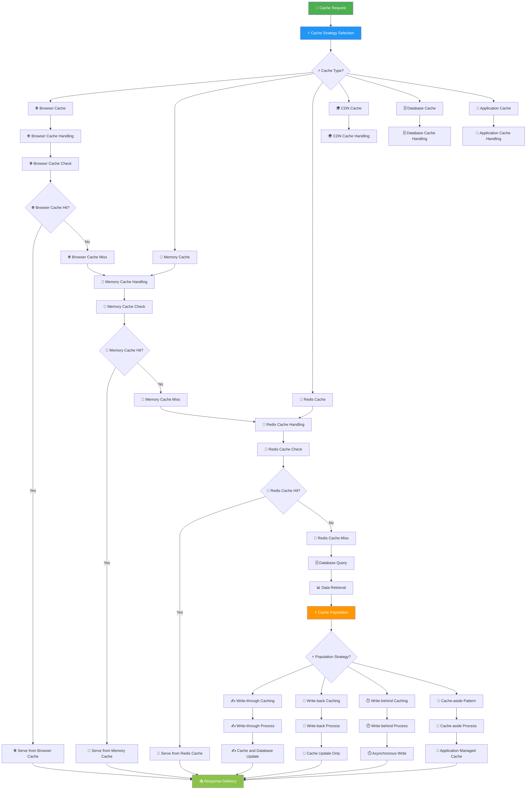
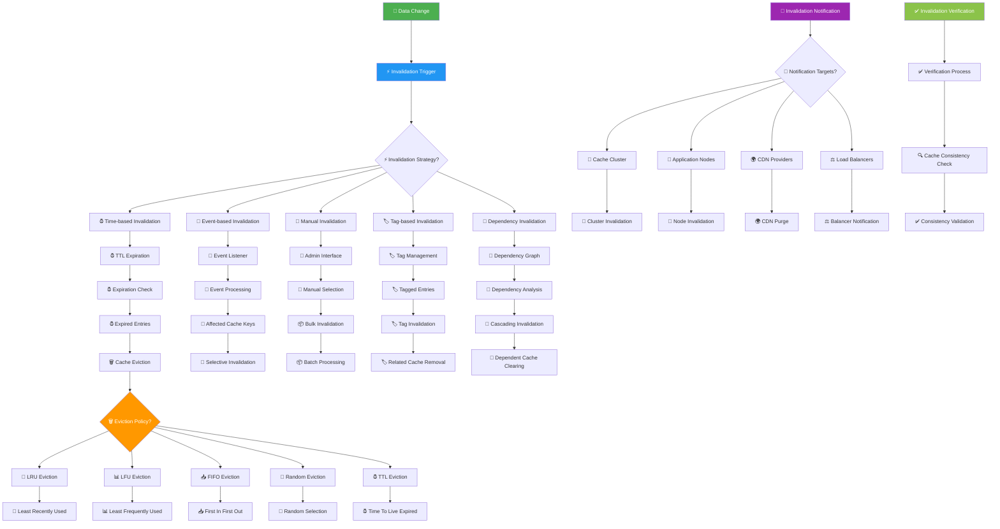

# ⚡ Cache & Performance Flowchart - KAI Railway Ticketing Platform

## Caching Strategy Flow



## Cache Invalidation Flow



## Performance Optimization Flow

```mermaid
flowchart TD
    PerformanceMonitoring[📊 Performance Monitoring] --> MetricCollection[📊 Metric Collection]
    
    MetricCollection --> PerformanceMetrics{📊 Performance Metrics?}
    
    PerformanceMetrics --> ResponseTime[⏱️ Response Time]
    PerformanceMetrics --> Throughput[📈 Throughput]
    PerformanceMetrics --> CPUUsage[💻 CPU Usage]
    PerformanceMetrics --> MemoryUsage[🧠 Memory Usage]
    PerformanceMetrics --> DiskIO[💾 Disk I/O]
    PerformanceMetrics --> NetworkLatency[🌐 Network Latency]
    PerformanceMetrics --> CacheHitRatio[⚡ Cache Hit Ratio]
    PerformanceMetrics --> ErrorRate[🚨 Error Rate]
    
    ResponseTime --> ResponseTimeAnalysis[⏱️ Response Time Analysis]
    Throughput --> ThroughputAnalysis[📈 Throughput Analysis]
    CPUUsage --> CPUAnalysis[💻 CPU Analysis]
    MemoryUsage --> MemoryAnalysis[🧠 Memory Analysis]
    DiskIO --> DiskAnalysis[💾 Disk Analysis]
    NetworkLatency --> NetworkAnalysis[🌐 Network Analysis]
    CacheHitRatio --> CacheAnalysis[⚡ Cache Analysis]
    ErrorRate --> ErrorAnalysis[🚨 Error Analysis]
    
    ResponseTimeAnalysis --> SlowEndpointIdentification[🐌 Slow Endpoint Identification]
    ThroughputAnalysis --> BottleneckDetection[🔍 Bottleneck Detection]
    CPUAnalysis --> CPUOptimization[💻 CPU Optimization]
    MemoryAnalysis --> MemoryOptimization[🧠 Memory Optimization]
    DiskAnalysis --> DiskOptimization[💾 Disk Optimization]
    NetworkAnalysis --> NetworkOptimization[🌐 Network Optimization]
    CacheAnalysis --> CacheOptimization[⚡ Cache Optimization]
    ErrorAnalysis --> ErrorReduction[🚨 Error Reduction]
    
    SlowEndpointIdentification --> QueryOptimization[🔍 Query Optimization]
    QueryOptimization --> DatabaseIndexing[📇 Database Indexing]
    DatabaseIndexing --> QueryPlanOptimization[📋 Query Plan Optimization]
    
    BottleneckDetection --> LoadBalancing[⚖️ Load Balancing]
    LoadBalancing --> HorizontalScaling[📈 Horizontal Scaling]
    HorizontalScaling --> VerticalScaling[📊 Vertical Scaling]
    
    CPUOptimization --> CodeOptimization[⚙️ Code Optimization]
    CodeOptimization --> AlgorithmImprovement[🧮 Algorithm Improvement]
    AlgorithmImprovement --> ParallelProcessing[🔄 Parallel Processing]
    
    MemoryOptimization --> MemoryPooling[🧠 Memory Pooling]
    MemoryPooling --> GarbageCollection[🗑️ Garbage Collection]
    GarbageCollection --> MemoryLeakDetection[🔍 Memory Leak Detection]
    
    DiskOptimization --> DiskCaching[💾 Disk Caching]
    DiskCaching --> SSDUpgrade[💾 SSD Upgrade]
    SSDUpgrade --> FileSystemOptimization[📁 File System Optimization]
    
    NetworkOptimization --> ConnectionPooling[🔗 Connection Pooling]
    ConnectionPooling --> CompressionOptimization[🗜️ Compression Optimization]
    CompressionOptimization --> CDNImplementation[🌍 CDN Implementation]
    
    CacheOptimization --> CacheStrategyTuning[⚡ Cache Strategy Tuning]
    CacheStrategyTuning --> CacheHitImprovement[📈 Cache Hit Improvement]
    CacheHitImprovement --> CacheWarming[🔥 Cache Warming]
    
    ErrorReduction --> ErrorPrevention[🛡️ Error Prevention]
    ErrorPrevention --> RobustnessImprovement[💪 Robustness Improvement]
    RobustnessImprovement --> FailoverMechanism[🔄 Failover Mechanism]
    
    PerformanceTesting[🧪 Performance Testing] --> TestingTypes{🧪 Testing Types?}
    
    TestingTypes --> LoadTesting[📊 Load Testing]
    TestingTypes --> StressTesting[💪 Stress Testing]
    TestingTypes --> SpikeTesting[📈 Spike Testing]
    TestingTypes --> VolumeT testing[📦 Volume Testing]
    TestingTypes --> EnduranceTesting[⏰ Endurance Testing]
    
    LoadTesting --> SimulatedLoad[📊 Simulated Load]
    StressTesting --> StressSimulation[💪 Stress Simulation]
    SpikeTesting --> SpikeSimulation[📈 Spike Simulation]
    VolumeT testing --> VolumeSimulation[📦 Volume Simulation]
    EnduranceTesting --> EnduranceSimulation[⏰ Endurance Simulation]
    
    SimulatedLoad --> LoadTestResults[📊 Load Test Results]
    StressSimulation --> StressTestResults[💪 Stress Test Results]
    SpikeSimulation --> SpikeTestResults[📈 Spike Test Results]
    VolumeSimulation --> VolumeTestResults[📦 Volume Test Results]
    EnduranceSimulation --> EnduranceTestResults[⏰ Endurance Test Results]
    
    LoadTestResults --> PerformanceReport[📋 Performance Report]
    StressTestResults --> PerformanceReport
    SpikeTestResults --> PerformanceReport
    VolumeTestResults --> PerformanceReport
    EnduranceTestResults --> PerformanceReport
    
    PerformanceReport --> OptimizationRecommendations[💡 Optimization Recommendations]
    OptimizationRecommendations --> ImplementationPlan[📋 Implementation Plan]
    ImplementationPlan --> PerformanceImprovement[📈 Performance Improvement]
    
    style PerformanceMonitoring fill:#4CAF50,color:#fff
    style MetricCollection fill:#2196F3,color:#fff
    style PerformanceTesting fill:#FF9800,color:#fff
    style OptimizationRecommendations fill:#9C27B0,color:#fff
    style PerformanceImprovement fill:#8BC34A,color:#fff
```

## Database Performance Optimization

```mermaid
flowchart TD
    DatabasePerformance[🗄️ Database Performance] --> DatabaseMetrics[📊 Database Metrics]
    
    DatabaseMetrics --> MetricsType{📊 Metrics Type?}
    
    MetricsType --> QueryExecutionTime[⏱️ Query Execution Time]
    MetricsType --> ConnectionCount[🔗 Connection Count]
    MetricsType --> LockWaitTime[🔒 Lock Wait Time]
    MetricsType --> IndexUsage[📇 Index Usage]
    MetricsType --> TableScans[📋 Table Scans]
    MetricsType --> DeadlockCount[🔒 Deadlock Count]
    MetricsType --> CacheHitRatio[⚡ Cache Hit Ratio]
    MetricsType --> DiskUsage[💾 Disk Usage]
    
    QueryExecutionTime --> SlowQueryIdentification[🐌 Slow Query Identification]
    ConnectionCount --> ConnectionPoolOptimization[🔗 Connection Pool Optimization]
    LockWaitTime --> LockOptimization[🔒 Lock Optimization]
    IndexUsage --> IndexOptimization[📇 Index Optimization]
    TableScans --> ScanOptimization[📋 Scan Optimization]
    DeadlockCount --> DeadlockPrevention[🔒 Deadlock Prevention]
    CacheHitRatio --> DatabaseCacheOptimization[⚡ Database Cache Optimization]
    DiskUsage --> StorageOptimization[💾 Storage Optimization]
    
    SlowQueryIdentification --> QueryAnalysis[🔍 Query Analysis]
    QueryAnalysis --> ExecutionPlanAnalysis[📋 Execution Plan Analysis]
    ExecutionPlanAnalysis --> QueryRewriting[✍️ Query Rewriting]
    QueryRewriting --> QueryOptimization[🔍 Query Optimization]
    
    ConnectionPoolOptimization --> PoolSizeAdjustment[🔗 Pool Size Adjustment]
    PoolSizeAdjustment --> ConnectionTimeout[⏰ Connection Timeout]
    ConnectionTimeout --> PoolConfiguration[🔗 Pool Configuration]
    
    LockOptimization --> IsolationLevelAdjustment[🔒 Isolation Level Adjustment]
    IsolationLevelAdjustment --> TransactionOptimization[💳 Transaction Optimization]
    TransactionOptimization --> LockGranularity[🔒 Lock Granularity]
    
    IndexOptimization --> IndexCreation[📇 Index Creation]
    IndexCreation --> IndexMaintenance[🔧 Index Maintenance]
    IndexMaintenance --> IndexRebuild[🔄 Index Rebuild]
    IndexRebuild --> CompositeIndexing[📇 Composite Indexing]
    
    ScanOptimization --> PartitioningStrategy[📊 Partitioning Strategy]
    PartitioningStrategy --> TablePartitioning[📋 Table Partitioning]
    TablePartitioning --> ShardingImplementation[📊 Sharding Implementation]
    
    DeadlockPrevention --> DeadlockDetection[🔍 Deadlock Detection]
    DeadlockDetection --> TransactionOrdering[📋 Transaction Ordering]
    TransactionOrdering --> TimeoutConfiguration[⏰ Timeout Configuration]
    
    DatabaseCacheOptimization --> BufferPoolTuning[⚡ Buffer Pool Tuning]
    BufferPoolTuning --> QueryCacheOptimization[⚡ Query Cache Optimization]
    QueryCacheOptimization --> ResultCaching[💾 Result Caching]
    
    StorageOptimization --> DataCompression[🗜️ Data Compression]
    DataCompression --> ArchivalStrategy[📦 Archival Strategy]
    ArchivalStrategy --> PurgePolicy[🗑️ Purge Policy]
    
    DatabaseMaintenance[🔧 Database Maintenance] --> MaintenanceTasks{🔧 Maintenance Tasks?}
    
    MaintenanceTasks --> StatisticsUpdate[📊 Statistics Update]
    MaintenanceTasks --> IndexDefragmentation[📇 Index Defragmentation]
    MaintenanceTasks --> DatabaseBackup[💾 Database Backup]
    MaintenanceTasks --> LogMaintenance[📝 Log Maintenance]
    MaintenanceTasks --> IntegrityCheck[✅ Integrity Check]
    
    StatisticsUpdate --> QueryPlanUpdate[📋 Query Plan Update]
    IndexDefragmentation --> PerformanceImprovement[📈 Performance Improvement]
    DatabaseBackup --> DataProtection[🛡️ Data Protection]
    LogMaintenance --> LogCleanup[🧹 Log Cleanup]
    IntegrityCheck --> DataValidation[✅ Data Validation]
    
    DatabaseMonitoring[📊 Database Monitoring] --> RealTimeMonitoring[⏱️ Real-time Monitoring]
    RealTimeMonitoring --> AlertConfiguration[🚨 Alert Configuration]
    AlertConfiguration --> AutomatedResponse[🤖 Automated Response]
    AutomatedResponse --> PerformanceTuning[🔧 Performance Tuning]
    
    style DatabasePerformance fill:#4CAF50,color:#fff
    style DatabaseMetrics fill:#2196F3,color:#fff
    style QueryOptimization fill:#FF9800,color:#fff
    style DatabaseMaintenance fill:#9C27B0,color:#fff
    style PerformanceTuning fill:#8BC34A,color:#fff
```



## Frontend Performance Optimization

```mermaid
flowchart TD
    FrontendPerformance[🎨 Frontend Performance] --> PerformanceAudit[📊 Performance Audit]
    
    PerformanceAudit --> AuditTools{📊 Audit Tools?}
    
    AuditTools --> LighthouseAudit[💡 Lighthouse Audit]
    AuditTools --> WebPageTest[🌐 WebPageTest]
    AuditTools --> GTMetrix[📊 GTMetrix]
    AuditTools --> PageSpeedInsights[⚡ PageSpeed Insights]
    AuditTools --> ChromeDevTools[🔧 Chrome DevTools]
    
    LighthouseAudit --> CoreWebVitals[⚡ Core Web Vitals]
    WebPageTest --> WaterfallAnalysis[💧 Waterfall Analysis]
    GTMetrix --> PerformanceScore[📊 Performance Score]
    PageSpeedInsights --> SpeedRecommendations[💡 Speed Recommendations]
    ChromeDevTools --> RuntimeAnalysis[⚙️ Runtime Analysis]
    
    CoreWebVitals --> LCP[⚡ Largest Contentful Paint]
    CoreWebVitals --> FID[👆 First Input Delay]
    CoreWebVitals --> CLS[📐 Cumulative Layout Shift]
    
    LCP --> ImageOptimization[🖼️ Image Optimization]
    FID --> JavaScriptOptimization[⚙️ JavaScript Optimization]
    CLS --> LayoutStabilization[📐 Layout Stabilization]
    
    ImageOptimization --> ImageCompression[🗜️ Image Compression]
    ImageCompression --> WebPConversion[🖼️ WebP Conversion]
    WebPConversion --> LazyLoading[⚡ Lazy Loading]
    LazyLoading --> ResponsiveImages[📱 Responsive Images]
    
    JavaScriptOptimization --> CodeSplitting[✂️ Code Splitting]
    CodeSplitting --> TreeShaking[🌳 Tree Shaking]
    TreeShaking --> BundleOptimization[📦 Bundle Optimization]
    BundleOptimization --> MinificationCompression[🗜️ Minification & Compression]
    
    LayoutStabilization --> SizeAttributes[📐 Size Attributes]
    SizeAttributes --> FontDisplay[🔤 Font Display]
    FontDisplay --> PreloadCriticalResources[⚡ Preload Critical Resources]
    
    ResourceOptimization[📦 Resource Optimization] --> OptimizationStrategy{📦 Optimization Strategy?}
    
    OptimizationStrategy --> CriticalResourcePrioritization[⚡ Critical Resource Prioritization]
    OptimizationStrategy --> ResourcePreloading[⚡ Resource Preloading]
    OptimizationStrategy --> ResourcePrefetching[🔮 Resource Prefetching]
    OptimizationStrategy --> ServiceWorkerCaching[👷 Service Worker Caching]
    
    CriticalResourcePrioritization --> CriticalCSS[🎨 Critical CSS]
    CriticalCSS --> InlineCSS[🎨 Inline CSS]
    InlineCSS --> CSSOptimization[🎨 CSS Optimization]
    
    ResourcePreloading --> PreloadLinks[⚡ Preload Links]
    PreloadLinks --> ResourceHints[💡 Resource Hints]
    ResourceHints --> DNSPrefetch[🌐 DNS Prefetch]
    
    ResourcePrefetching --> IntelligentPrefetching[🧠 Intelligent Prefetching]
    IntelligentPrefetching --> PredictivePrefetching[🔮 Predictive Prefetching]
    PredictivePrefetching --> UserBehaviorAnalysis[👤 User Behavior Analysis]
    
    ServiceWorkerCaching --> CacheStrategies[💾 Cache Strategies]
    CacheStrategies --> CacheFirst[💾 Cache First]
    CacheStrategies --> NetworkFirst[🌐 Network First]
    CacheStrategies --> StaleWhileRevalidate[🔄 Stale While Revalidate]
    
    RenderOptimization[🎨 Render Optimization] --> RenderingStrategy{🎨 Rendering Strategy?}
    
    RenderingStrategy --> ServerSideRendering[🖥️ Server-Side Rendering]
    RenderingStrategy --> StaticSiteGeneration[📄 Static Site Generation]
    RenderingStrategy --> IncrementalStaticRegeneration[🔄 Incremental Static Regeneration]
    RenderingStrategy --> ClientSideRendering[🎨 Client-Side Rendering]
    
    ServerSideRendering --> SSROptimization[🖥️ SSR Optimization]
    StaticSiteGeneration --> SSGOptimization[📄 SSG Optimization]
    IncrementalStaticRegeneration --> ISROptimization[🔄 ISR Optimization]
    ClientSideRendering --> CSROptimization[🎨 CSR Optimization]
    
    SSROptimization --> HydrationOptimization[💧 Hydration Optimization]
    SSGOptimization --> BuildTimeOptimization[🔧 Build Time Optimization]
    ISROptimization --> RevalidationStrategy[🔄 Revalidation Strategy]
    CSROptimization --> VirtualScrolling[📜 Virtual Scrolling]
    
    PerformanceMonitoring[📊 Performance Monitoring] --> RealUserMonitoring[👤 Real User Monitoring]
    RealUserMonitoring --> SyntheticMonitoring[🤖 Synthetic Monitoring]
    SyntheticMonitoring --> PerformanceBudgets[💰 Performance Budgets]
    PerformanceBudgets --> ContinuousOptimization[🔄 Continuous Optimization]
    
    style FrontendPerformance fill:#4CAF50,color:#fff
    style PerformanceAudit fill:#2196F3,color:#fff
    style ResourceOptimization fill:#FF9800,color:#fff
    style RenderOptimization fill:#9C27B0,color:#fff
    style ContinuousOptimization fill:#8BC34A,color:#fff
```


