# 📊 Data Processing Flowchart - KAI Railway Ticketing Platform

## Comprehensive Data Processing Architecture

```mermaid
flowchart TD
    DataIngestion[📥 Data Ingestion] --> DataSources[📊 Data Sources]
    
    DataSources --> SourceType{📊 Source Type?}
    
    SourceType --> UserInteractions[👤 User Interactions]
    SourceType --> TransactionData[💰 Transaction Data]
    SourceType --> OperationalData[🚂 Operational Data]
    SourceType --> ExternalAPIs[🌐 External APIs]
    SourceType --> LogData[📝 Log Data]
    SourceType --> SensorData[📡 Sensor Data]
    SourceType --> PartnerData[🤝 Partner Data]
    
    UserInteractions --> WebClicks[🖱️ Web Clicks]
    UserInteractions --> MobileEvents[📱 Mobile Events]
    UserInteractions --> SearchQueries[🔍 Search Queries]
    UserInteractions --> BookingAttempts[🎫 Booking Attempts]
    UserInteractions --> UserFeedback[💬 User Feedback]
    
    TransactionData --> PaymentRecords[💳 Payment Records]
    TransactionData --> BookingConfirmations[✅ Booking Confirmations]
    TransactionData --> RefundRequests[↩️ Refund Requests]
    TransactionData --> CancellationData[❌ Cancellation Data]
    
    OperationalData --> TrainSchedules[🚂 Train Schedules]
    OperationalData --> StationData[🏢 Station Data]
    OperationalData --> CapacityData[📊 Capacity Data]
    OperationalData --> DelayInformation[⏰ Delay Information]
    OperationalData --> MaintenanceRecords[🔧 Maintenance Records]
    
    ExternalAPIs --> WeatherServices[🌤️ Weather Services]
    ExternalAPIs --> PaymentGateways[💳 Payment Gateways]
    ExternalAPIs --> GovernmentSystems[🏛️ Government Systems]
    ExternalAPIs --> PartnerRailways[🚄 Partner Railways]
    
    LogData --> ApplicationLogs[📱 Application Logs]
    LogData --> SecurityLogs[🔒 Security Logs]
    LogData --> AccessLogs[🚪 Access Logs]
    LogData --> ErrorLogs[❌ Error Logs]
    
    SensorData --> TrainLocationGPS[📍 Train Location GPS]
    SensorData --> StationOccupancy[👥 Station Occupancy]
    SensorData --> EnvironmentalData[🌱 Environmental Data]
    
    PartnerData --> TravelAgencies[✈️ Travel Agencies]
    PartnerData --> HotelBookings[🏨 Hotel Bookings]
    PartnerData --> TourOperators[🗺️ Tour Operators]
    
    DataValidation[✅ Data Validation] --> ValidationRules[📋 Validation Rules]
    
    ValidationRules --> SchemaValidation[📄 Schema Validation]
    ValidationRules --> DataTypeValidation[🔢 Data Type Validation]
    ValidationRules --> BusinessRuleValidation[💼 Business Rule Validation]
    ValidationRules --> ReferentialIntegrity[🔗 Referential Integrity]
    ValidationRules --> DuplicateDetection[🔍 Duplicate Detection]
    
    SchemaValidation --> JSONSchemaCheck[📄 JSON Schema Check]
    SchemaValidation --> XMLValidation[📄 XML Validation]
    SchemaValidation --> CSVFormatCheck[📄 CSV Format Check]
    
    DataTypeValidation --> NumericValidation[🔢 Numeric Validation]
    DataTypeValidation --> DateTimeValidation[📅 Date/Time Validation]
    DataTypeValidation --> StringValidation[📝 String Validation]
    DataTypeValidation --> BooleanValidation[✓ Boolean Validation]
    
    BusinessRuleValidation --> SeatAvailabilityCheck[💺 Seat Availability Check]
    BusinessRuleValidation --> PriceConsistencyCheck[💰 Price Consistency Check]
    BusinessRuleValidation --> ScheduleValidation[🕐 Schedule Validation]
    BusinessRuleValidation --> CapacityLimitsCheck[📊 Capacity Limits Check]
    
    ReferentialIntegrity --> ForeignKeyCheck[🔑 Foreign Key Check]
    ReferentialIntegrity --> CrossTableValidation[🔄 Cross-table Validation]
    
    DuplicateDetection --> HashComparison[#️⃣ Hash Comparison]
    DuplicateDetection --> FuzzyMatching[🔍 Fuzzy Matching]
    
    DataTransformation[🔄 Data Transformation] --> TransformationStages[🔄 Transformation Stages]
    
    TransformationStages --> DataCleaning[🧹 Data Cleaning]
    TransformationStages --> DataNormalization[📏 Data Normalization]
    TransformationStages --> DataEnrichment[➕ Data Enrichment]
    TransformationStages --> DataAggregation[📊 Data Aggregation]
    TransformationStages --> DataFormatting[📋 Data Formatting]
    
    DataCleaning --> NullValueHandling[🚫 Null Value Handling]
    DataCleaning --> OutlierDetection[📈 Outlier Detection]
    DataCleaning --> InconsistencyResolution[🔧 Inconsistency Resolution]
    DataCleaning --> DataDeduplication[🔍 Data Deduplication]
    
    DataNormalization --> StandardizeFormats[📐 Standardize Formats]
    DataNormalization --> UnitConversion[🔄 Unit Conversion]
    DataNormalization --> EncodingStandardization[🔤 Encoding Standardization]
    
    DataEnrichment --> GeolocationEnrichment[📍 Geolocation Enrichment]
    DataEnrichment --> DemographicEnrichment[👥 Demographic Enrichment]
    DataEnrichment --> HistoricalDataJoin[📚 Historical Data Join]
    DataEnrichment --> ExternalDataMerge[🌐 External Data Merge]
    
    DataAggregation --> TimeBasedAggregation[⏰ Time-based Aggregation]
    DataAggregation --> RouteBasedAggregation[🗺️ Route-based Aggregation]
    DataAggregation --> UserSegmentAggregation[👤 User Segment Aggregation]
    DataAggregation --> RevenueSummaries[💰 Revenue Summaries]
    
    DataFormatting --> JSONTransformation[📄 JSON Transformation]
    DataFormatting --> XMLConversion[📄 XML Conversion]
    DataFormatting --> CSVGeneration[📄 CSV Generation]
    DataFormatting --> ProtobufSerialization[📦 Protobuf Serialization]
    
    style DataIngestion fill:#4CAF50,color:#fff
    style DataValidation fill:#2196F3,color:#fff
    style DataTransformation fill:#FF9800,color:#fff
    style TransformationStages fill:#9C27B0,color:#fff
    style DataAggregation fill:#8BC34A,color:#fff
```

## ETL Pipeline Flow

```mermaid
flowchart TD
    ETLProcess[🔄 ETL Process] --> ExtractPhase[📤 Extract Phase]
    
    ExtractPhase --> ExtractionMethod{📤 Extraction Method?}
    
    ExtractionMethod --> BatchExtraction[📦 Batch Extraction]
    ExtractionMethod --> StreamingExtraction[🌊 Streaming Extraction]
    ExtractionMethod --> RealTimeExtraction[⚡ Real-time Extraction]
    ExtractionMethod --> IncrementalExtraction[➕ Incremental Extraction]
    
    BatchExtraction --> ScheduledJobs[⏰ Scheduled Jobs]
    StreamingExtraction --> KafkaStreams[🌊 Kafka Streams]
    RealTimeExtraction --> WebhookListeners[🔗 Webhook Listeners]
    IncrementalExtraction --> ChangeDataCapture[🔍 Change Data Capture]
    
    ScheduledJobs --> CronJobs[⏰ Cron Jobs]
    KafkaStreams --> StreamProcessing[🌊 Stream Processing]
    WebhookListeners --> EventProcessing[⚡ Event Processing]
    ChangeDataCapture --> CDCLog[📝 CDC Log]
    
    CronJobs --> DatabaseQueries[🗄️ Database Queries]
    StreamProcessing --> MessageConsumption[📧 Message Consumption]
    EventProcessing --> APIPolling[🔄 API Polling]
    CDCLog --> LogAnalysis[📊 Log Analysis]
    
    TransformPhase[🔄 Transform Phase] --> TransformationEngine[🔄 Transformation Engine]
    
    TransformationEngine --> TransformationType{🔄 Transformation Type?}
    
    TransformationType --> DataMapping[🗺️ Data Mapping]
    TransformationType --> BusinessLogic[💼 Business Logic]
    TransformationType --> CalculatedFields[🧮 Calculated Fields]
    TransformationType --> DataJoins[🔗 Data Joins]
    TransformationType --> FilteringRules[🔍 Filtering Rules]
    
    DataMapping --> FieldMapping[🗺️ Field Mapping]
    DataMapping --> TypeConversion[🔄 Type Conversion]
    DataMapping --> ValueMapping[💰 Value Mapping]
    
    BusinessLogic --> RevenueCalculation[💰 Revenue Calculation]
    BusinessLogic --> DiscountApplication[🏷️ Discount Application]
    BusinessLogic --> TaxCalculation[💸 Tax Calculation]
    BusinessLogic --> CommissionCalculation[💼 Commission Calculation]
    
    CalculatedFields --> DerivedMetrics[📊 Derived Metrics]
    CalculatedFields --> KPICalculation[📈 KPI Calculation]
    CalculatedFields --> TrendAnalysis[📈 Trend Analysis]
    
    DataJoins --> InnerJoins[🔗 Inner Joins]
    DataJoins --> LeftJoins[⬅️ Left Joins]
    DataJoins --> OuterJoins[↔️ Outer Joins]
    DataJoins --> CrossJoins[✖️ Cross Joins]
    
    FilteringRules --> DateRangeFilters[📅 Date Range Filters]
    FilteringRules --> QualityFilters[✅ Quality Filters]
    FilteringRules --> BusinessFilters[💼 Business Filters]
    
    LoadPhase[📥 Load Phase] --> LoadingStrategy{📥 Loading Strategy?}
    
    LoadingStrategy --> FullLoad[📦 Full Load]
    LoadingStrategy --> IncrementalLoad[➕ Incremental Load]
    LoadingStrategy --> UpsertLoad[🔄 Upsert Load]
    LoadingStrategy --> AppendLoad[➕ Append Load]
    
    FullLoad --> TruncateAndLoad[🗑️ Truncate and Load]
    IncrementalLoad --> DeltaLoad[📈 Delta Load]
    UpsertLoad --> MergeOperation[🔄 Merge Operation]
    AppendLoad --> InsertOnly[➕ Insert Only]
    
    TruncateAndLoad --> TableTruncation[🗑️ Table Truncation]
    TableTruncation --> BulkInsert[📦 Bulk Insert]
    
    DeltaLoad --> ChangeDetection[🔍 Change Detection]
    ChangeDetection --> ModifiedRecords[📝 Modified Records]
    ModifiedRecords --> ConditionalUpdate[🔄 Conditional Update]
    
    MergeOperation --> MatchCondition[🔍 Match Condition]
    MatchCondition --> UpdateOperation[🔄 Update Operation]
    MatchCondition --> InsertOperation[➕ Insert Operation]
    
    InsertOnly --> NewRecordsOnly[🆕 New Records Only]
    NewRecordsOnly --> AppendToTable[➕ Append to Table]
    
    style ETLProcess fill:#4CAF50,color:#fff
    style ExtractPhase fill:#2196F3,color:#fff
    style TransformPhase fill:#FF9800,color:#fff
    style LoadPhase fill:#9C27B0,color:#fff
    style LoadingStrategy fill:#8BC34A,color:#fff
```

## Real-time Data Processing Flow

```mermaid
flowchart TD
    RealTimeData[⚡ Real-time Data] --> StreamIngestion[🌊 Stream Ingestion]
    
    StreamIngestion --> EventSources{📡 Event Sources?}
    
    EventSources --> UserActions[👤 User Actions]
    EventSources --> SystemEvents[🖥️ System Events]
    EventSources --> IoTSensors[📡 IoT Sensors]
    EventSources --> ExternalFeeds[🌐 External Feeds]
    EventSources --> TransactionStreams[💰 Transaction Streams]
    
    UserActions --> ClickEvents[🖱️ Click Events]
    UserActions --> BookingEvents[🎫 Booking Events]
    UserActions --> SearchEvents[🔍 Search Events]
    UserActions --> NavigationEvents[🧭 Navigation Events]
    
    SystemEvents --> LogEvents[📝 Log Events]
    SystemEvents --> MetricEvents[📊 Metric Events]
    SystemEvents --> AlertEvents[🚨 Alert Events]
    SystemEvents --> StatusEvents[📡 Status Events]
    
    IoTSensors --> TrainSensors[🚂 Train Sensors]
    IoTSensors --> StationSensors[🏢 Station Sensors]
    IoTSensors --> WeatherSensors[🌤️ Weather Sensors]
    IoTSensors --> SecuritySensors[🔒 Security Sensors]
    
    ExternalFeeds --> WeatherUpdates[🌤️ Weather Updates]
    ExternalFeeds --> TrafficUpdates[🚦 Traffic Updates]
    ExternalFeeds --> NewsFeeds[📰 News Feeds]
    ExternalFeeds --> PartnerUpdates[🤝 Partner Updates]
    
    TransactionStreams --> PaymentEvents[💳 Payment Events]
    TransactionStreams --> RefundEvents[↩️ Refund Events]
    TransactionStreams --> CancellationEvents[❌ Cancellation Events]
    
    StreamProcessingEngine[🌊 Stream Processing] --> ProcessingEngine{⚙️ Processing Engine?}
    
    ProcessingEngine --> ApacheKafka[🌊 Apache Kafka]
    ProcessingEngine --> ApacheStorm[⛈️ Apache Storm]
    ProcessingEngine --> ApacheFlink[🌊 Apache Flink]
    ProcessingEngine --> AmazonKinesis[🚀 Amazon Kinesis]
    ProcessingEngine --> NodejsStreams[⚡ Node.js Streams]
    
    ApacheKafka --> KafkaProducers[📤 Kafka Producers]
    ApacheKafka --> KafkaConsumers[📥 Kafka Consumers]
    ApacheKafka --> KafkaTopics[📂 Kafka Topics]
    
    KafkaProducers --> MessageProduction[📤 Message Production]
    KafkaConsumers --> MessageConsumptionData[📥 Message Consumption]
    KafkaTopics --> TopicPartitioning[📂 Topic Partitioning]
    
    ApacheStorm --> StormTopology[⛈️ Storm Topology]
    StormTopology --> SpoutComponents[🌊 Spout Components]
    SpoutComponents --> BoltComponents[⚡ Bolt Components]
    
    ApacheFlink --> FlinkStreams[🌊 Flink Streams]
    FlinkStreams --> WindowOperations[🔲 Window Operations]
    WindowOperations --> StateManagement[💾 State Management]
    
    AmazonKinesis --> KinesisShards[📊 Kinesis Shards]
    KinesisShards --> KinesisAnalytics[📈 Kinesis Analytics]
    
    NodejsStreams --> TransformStreams[🔄 Transform Streams]
    TransformStreams --> WritableStreams[📝 Writable Streams]
    
    style RealTimeData fill:#4CAF50,color:#fff
    style StreamIngestion fill:#2196F3,color:#fff
    style StreamProcessingEngine fill:#FF9800,color:#fff
    style ProcessingEngine fill:#9C27B0,color:#fff
    style ApacheKafka fill:#8BC34A,color:#fff
```

## Data Analytics and Reporting Flow

```mermaid
flowchart TD
    AnalyticsRequest[📊 Analytics Request] --> AnalyticsType{📊 Analytics Type?}
    
    AnalyticsType --> DescriptiveAnalytics[📈 Descriptive Analytics]
    AnalyticsType --> DiagnosticAnalytics[🔍 Diagnostic Analytics]
    AnalyticsType --> PredictiveAnalytics[🔮 Predictive Analytics]
    AnalyticsType --> PrescriptiveAnalytics[💡 Prescriptive Analytics]
    AnalyticsType --> RealTimeAnalyticsData[⚡ Real-time Analytics]
    
    DescriptiveAnalytics --> HistoricalReports[📚 Historical Reports]
    DescriptiveAnalytics --> StatisticalSummaries[📊 Statistical Summaries]
    DescriptiveAnalytics --> TrendAnalysisData[📈 Trend Analysis]
    DescriptiveAnalytics --> ComparisonReports[🔄 Comparison Reports]
    
    HistoricalReports --> RevenueReports[💰 Revenue Reports]
    HistoricalReports --> PassengerReports[👥 Passenger Reports]
    HistoricalReports --> RoutePerformance[🗺️ Route Performance]
    HistoricalReports --> SeasonalAnalysis[🌤️ Seasonal Analysis]
    
    StatisticalSummaries --> AverageMetrics[📊 Average Metrics]
    StatisticalSummaries --> MedianAnalysis[📊 Median Analysis]
    StatisticalSummaries --> StandardDeviationAnalysis[📊 Standard Deviation]
    StatisticalSummaries --> PercentileAnalysis[📊 Percentile Analysis]
    
    TrendAnalysisData --> GrowthTrends[📈 Growth Trends]
    TrendAnalysisData --> BookingPatterns[🎫 Booking Patterns]
    TrendAnalysisData --> UsagePatterns[👤 Usage Patterns]
    TrendAnalysisData --> SeasonalTrends[🌤️ Seasonal Trends]
    
    ComparisonReports --> YearOverYear[📅 Year-over-Year]
    ComparisonReports --> QuarterOverQuarter[📅 Quarter-over-Quarter]
    ComparisonReports --> RouteComparison[🗺️ Route Comparison]
    ComparisonReports --> CompetitorAnalysis[🏆 Competitor Analysis]
    
    DiagnosticAnalytics --> RootCauseAnalysis[🔍 Root Cause Analysis]
    DiagnosticAnalytics --> CorrelationAnalysis[🔗 Correlation Analysis]
    DiagnosticAnalytics --> AnomalyInvestigation[🚨 Anomaly Investigation]
    DiagnosticAnalytics --> PerformanceAnalysisData[⚡ Performance Analysis]
    
    RootCauseAnalysis --> DrillDownAnalysis[🔍 Drill-down Analysis]
    RootCauseAnalysis --> FishboneAnalysis[🐟 Fishbone Analysis]
    RootCauseAnalysis --> FiveWhysMethod[❓ Five Whys Method]
    
    CorrelationAnalysis --> StatisticalCorrelation[📊 Statistical Correlation]
    CorrelationAnalysis --> CausalInference[🎯 Causal Inference]
    CorrelationAnalysis --> DependencyMapping[🗺️ Dependency Mapping]
    
    AnomalyInvestigation --> OutlierDetectionData[📈 Outlier Detection]
    AnomalyInvestigation --> DeviationAnalysis[📊 Deviation Analysis]
    AnomalyInvestigation --> PatternBreaks[🔍 Pattern Breaks]
    
    PerformanceAnalysisData --> BottleneckIdentification[🚫 Bottleneck Identification]
    PerformanceAnalysisData --> EfficiencyMetrics[⚡ Efficiency Metrics]
    PerformanceAnalysisData --> CapacityAnalysisData[📊 Capacity Analysis]
    
    PredictiveAnalytics --> ForecastingModels[🔮 Forecasting Models]
    PredictiveAnalytics --> MachineLearningModels[🤖 Machine Learning Models]
    PredictiveAnalytics --> RiskPrediction[⚠️ Risk Prediction]
    PredictiveAnalytics --> DemandForecasting[📊 Demand Forecasting]
    
    ForecastingModels --> TimeSeriesAnalysisData[📈 Time Series Analysis]
    ForecastingModels --> RegressionAnalysisData[📊 Regression Analysis]
    ForecastingModels --> MovingAverages[📊 Moving Averages]
    ForecastingModels --> ExponentialSmoothing[📈 Exponential Smoothing]
    
    MachineLearningModels --> ClassificationModels[🏷️ Classification Models]
    MachineLearningModels --> ClusteringModels[🎯 Clustering Models]
    MachineLearningModels --> RecommendationModels[💡 Recommendation Models]
    MachineLearningModels --> DeepLearningModels[🧠 Deep Learning Models]
    
    RiskPrediction --> CreditRiskAssessment[💳 Credit Risk Assessment]
    RiskPrediction --> OperationalRiskAnalysis[⚠️ Operational Risk Analysis]
    RiskPrediction --> FraudDetectionData[🚨 Fraud Detection]
    
    DemandForecasting --> PassengerDemand[👥 Passenger Demand]
    DemandForecasting --> RouteCapacityPlanning[🗺️ Route Capacity Planning]
    DemandForecasting --> PricingOptimization[💰 Pricing Optimization]
    
    PrescriptiveAnalytics --> OptimizationModels[🎯 Optimization Models]
    PrescriptiveAnalytics --> DecisionSupport[💡 Decision Support]
    PrescriptiveAnalytics --> ScenarioAnalysisData[🎭 Scenario Analysis]
    PrescriptiveAnalytics --> ResourceAllocationData[📊 Resource Allocation]
    
    OptimizationModels --> LinearProgramming[📊 Linear Programming]
    OptimizationModels --> GeneticAlgorithms[🧬 Genetic Algorithms]
    OptimizationModels --> SimulatedAnnealing[🌡️ Simulated Annealing]
    
    DecisionSupport --> BusinessIntelligence[💼 Business Intelligence]
    DecisionSupport --> WhatIfAnalysis[❓ What-if Analysis]
    DecisionSupport --> SensitivityAnalysisData[📊 Sensitivity Analysis]
    
    ScenarioAnalysisData --> BestCaseScenario[✅ Best Case Scenario]
    ScenarioAnalysisData --> WorstCaseScenario[❌ Worst Case Scenario]
    ScenarioAnalysisData --> MostLikelyScenario[🎯 Most Likely Scenario]
    
    ResourceAllocationData --> TrainAllocation[🚂 Train Allocation]
    ResourceAllocationData --> StaffScheduling[👥 Staff Scheduling]
    ResourceAllocationData --> BudgetAllocation[💰 Budget Allocation]
    
    style AnalyticsRequest fill:#4CAF50,color:#fff
    style DescriptiveAnalytics fill:#2196F3,color:#fff
    style PredictiveAnalytics fill:#FF9800,color:#fff
    style PrescriptiveAnalytics fill:#9C27B0,color:#fff
    style OptimizationModels fill:#8BC34A,color:#fff
```

## Data Quality Management Flow

```mermaid
flowchart TD
    DataQuality[✅ Data Quality] --> QualityDimensions[📊 Quality Dimensions]
    
    QualityDimensions --> Accuracy[🎯 Accuracy]
    QualityDimensions --> Completeness[📋 Completeness]
    QualityDimensions --> Consistency[🔄 Consistency]
    QualityDimensions --> Timeliness[⏰ Timeliness]
    QualityDimensions --> Validity[✅ Validity]
    QualityDimensions --> Uniqueness[🆔 Uniqueness]
    
    Accuracy --> SourceVerification[🔍 Source Verification]
    Accuracy --> CrossValidationData[🔄 Cross Validation]
    Accuracy --> BusinessRuleChecks[💼 Business Rule Checks]
    
    Completeness --> NullValueDetectionData[🚫 Null Value Detection]
    Completeness --> MissingRecordIdentification[📋 Missing Record Identification]
    Completeness --> RequiredFieldValidationData[✅ Required Field Validation]
    
    Consistency --> FormatStandardization[📐 Format Standardization]
    Consistency --> CrossSystemConsistency[🔄 Cross-system Consistency]
    Consistency --> TemporalConsistency[⏰ Temporal Consistency]
    
    Timeliness --> DataFreshness[🕐 Data Freshness]
    Timeliness --> UpdateFrequency[🔄 Update Frequency]
    Timeliness --> LatencyMeasurementData[⚡ Latency Measurement]
    
    Validity --> DataTypeValidationData[🔢 Data Type Validation]
    Validity --> RangeValidationData[📊 Range Validation]
    Validity --> PatternMatchingData[🔍 Pattern Matching]
    
    Uniqueness --> DuplicateDetectionData[🔍 Duplicate Detection]
    Uniqueness --> IdentifierValidationData[🆔 Identifier Validation]
    Uniqueness --> FuzzyMatchingData[🔍 Fuzzy Matching]
    
    QualityAssessment[📊 Quality Assessment] --> AssessmentMethods{📊 Assessment Methods?}
    
    AssessmentMethods --> DataProfiling[📊 Data Profiling]
    AssessmentMethods --> QualityMetrics[📈 Quality Metrics]
    AssessmentMethods --> QualityScoring[🎯 Quality Scoring]
    AssessmentMethods --> QualityReporting[📄 Quality Reporting]
    
    DataProfiling --> ColumnAnalysis[📊 Column Analysis]
    DataProfiling --> StatisticalSummaryData[📊 Statistical Summary]
    DataProfiling --> PatternAnalysisData[🔍 Pattern Analysis]
    DataProfiling --> RelationshipAnalysisData[🔗 Relationship Analysis]
    
    ColumnAnalysis --> DataTypeAnalysisData[🔢 Data Type Analysis]
    ColumnAnalysis --> ValueDistribution[📊 Value Distribution]
    ColumnAnalysis --> NullPercentage[🚫 Null Percentage]
    
    StatisticalSummaryData --> MinMaxValues[📊 Min/Max Values]
    StatisticalSummaryData --> AverageValuesData[📊 Average Values]
    StatisticalSummaryData --> StandardDeviationData[📊 Standard Deviation]
    
    PatternAnalysisData --> FormatPatterns[📐 Format Patterns]
    PatternAnalysisData --> CommonPatterns[🔍 Common Patterns]
    PatternAnalysisData --> OutlierPatterns[📈 Outlier Patterns]
    
    RelationshipAnalysisData --> ForeignKeyValidationData[🔑 Foreign Key Validation]
    RelationshipAnalysisData --> ReferentialIntegrityData[🔗 Referential Integrity]
    RelationshipAnalysisData --> DataLineage[📈 Data Lineage]
    
    QualityMetrics --> AccuracyMetrics[🎯 Accuracy Metrics]
    QualityMetrics --> CompletenessMetrics[📋 Completeness Metrics]
    QualityMetrics --> ConsistencyMetrics[🔄 Consistency Metrics]
    QualityMetrics --> TimelinessMetrics[⏰ Timeliness Metrics]
    
    QualityScoring --> WeightedScoring[⚖️ Weighted Scoring]
    QualityScoring --> ThresholdBasedScoring[📊 Threshold-based Scoring]
    QualityScoring --> CompositeScoring[🏆 Composite Scoring]
    
    QualityReporting --> QualityDashboards[📊 Quality Dashboards]
    QualityReporting --> TrendReportsData[📈 Trend Reports]
    QualityReporting --> IssueReports[🚨 Issue Reports]
    
    style DataQuality fill:#4CAF50,color:#fff
    style QualityAssessment fill:#2196F3,color:#fff
    style QualityMetrics fill:#FF9800,color:#fff
    style QualityScoring fill:#9C27B0,color:#fff
    style QualityReporting fill:#8BC34A,color:#fff
```

