# 🚀 Deployment Flow / DevOps Flow - KAI Railway Ticketing Platform

## CI/CD Pipeline Flow

```mermaid
flowchart TD
    Developer[👨‍💻 Developer] --> CodeCommit[📝 Code Commit]
    CodeCommit --> GitRepo[📂 Git Repository]
    
    GitRepo --> Webhook[🔗 Webhook Trigger]
    Webhook --> CIPipeline[🔄 CI Pipeline Start]
    
    CIPipeline --> CodeCheckout[📥 Code Checkout]
    CodeCheckout --> DependencyInstall[📦 Install Dependencies]
    
    DependencyInstall --> FrontendBuild{🏗️ Frontend Build}
    DependencyInstall --> BackendBuild{🏗️ Backend Build}
    
    FrontendBuild --> FELinting[✅ Frontend Linting]
    FELinting --> FETypeCheck[🔍 TypeScript Check]
    FETypeCheck --> FEUnitTests[🧪 Frontend Unit Tests]
    FEUnitTests --> FEE2ETests[🎭 E2E Tests]
    FEE2ETests --> FEBuild[🏗️ Frontend Build]
    
    BackendBuild --> BELinting[✅ Backend Linting]
    BELinting --> BETypeCheck[🔍 TypeScript Check]
    BETypeCheck --> BEUnitTests[🧪 Backend Unit Tests]
    BEUnitTests --> BEIntegrationTests[🔗 Integration Tests]
    BEIntegrationTests --> BESecurityScan[🔒 Security Scan]
    
    FEBuild --> BuildArtifacts[📦 Build Artifacts]
    BESecurityScan --> BuildArtifacts
    
    BuildArtifacts --> QualityGate{🚦 Quality Gate}
    
    QualityGate -->|Pass| ContainerBuild[🐳 Container Build]
    QualityGate -->|Fail| BuildFailed[❌ Build Failed]
    
    BuildFailed --> NotificationFail[📧 Failure Notification]
    NotificationFail --> Developer
    
    ContainerBuild --> DockerBuild[🐳 Docker Build]
    DockerBuild --> SecurityScan[🔒 Container Security Scan]
    SecurityScan --> ImageRegistry[📦 Push to Registry]
    
    ImageRegistry --> DeploymentStage{🎯 Deployment Stage}
    
    DeploymentStage -->|Development| DevDeploy[🔧 Deploy to Dev]
    DeploymentStage -->|Staging| StagingDeploy[🎭 Deploy to Staging]
    DeploymentStage -->|Production| ProdDeploy[🚀 Deploy to Production]
    
    DevDeploy --> DevTesting[🧪 Dev Environment Testing]
    DevTesting --> DevNotification[📧 Dev Deployment Notification]
    
    StagingDeploy --> StagingTests[🎭 Staging Tests]
    StagingTests --> UATTests[👤 User Acceptance Tests]
    UATTests --> PerformanceTests[⚡ Performance Tests]
    PerformanceTests --> StagingApproval[✅ Staging Approval]
    
    StagingApproval --> ProdDeploy
    
    ProdDeploy --> BlueGreenDeploy[🔄 Blue-Green Deployment]
    BlueGreenDeploy --> HealthChecks[❤️ Health Checks]
    HealthChecks --> TrafficSwitch[🔀 Traffic Switch]
    TrafficSwitch --> ProdMonitoring[📊 Production Monitoring]
    ProdMonitoring --> ProdNotification[📧 Prod Deployment Notification]
    
    ProdNotification --> Stakeholders[👥 Notify Stakeholders]
    
    style Developer fill:#4CAF50,color:#fff
    style CIPipeline fill:#2196F3,color:#fff
    style QualityGate fill:#FF9800,color:#fff
    style ProdDeploy fill:#F44336,color:#fff
    style Stakeholders fill:#9C27B0,color:#fff
```

## Infrastructure as Code (IaC) Flow

```mermaid
flowchart TD
    InfraRequest[🏗️ Infrastructure Request] --> IaCRepo[📂 IaC Repository]
    
    IaCRepo --> TerraformPlan[📋 Terraform Plan]
    TerraformPlan --> PlanReview[👁️ Plan Review]
    
    PlanReview --> PlanApproval{✅ Plan Approved?}
    PlanApproval -->|No| PlanRejected[❌ Plan Rejected]
    PlanApproval -->|Yes| TerraformApply[⚡ Terraform Apply]
    
    PlanRejected --> PlanRevision[🔄 Plan Revision]
    PlanRevision --> IaCRepo
    
    TerraformApply --> InfraProvisioning[🏗️ Infrastructure Provisioning]
    
    InfraProvisioning --> CloudResources{☁️ Cloud Resources}
    
    CloudResources --> NetworkSetup[🌐 Network Setup]
    CloudResources --> ComputeInstances[🖥️ Compute Instances]
    CloudResources --> DatabaseSetup[🗄️ Database Setup]
    CloudResources --> StorageSetup[💾 Storage Setup]
    CloudResources --> SecurityGroups[🔒 Security Groups]
    
    NetworkSetup --> VPCCreation[🌐 VPC Creation]
    VPCCreation --> SubnetCreation[🔗 Subnet Creation]
    SubnetCreation --> RouteTables[🛤️ Route Tables]
    RouteTables --> InternetGateway[🌍 Internet Gateway]
    
    ComputeInstances --> EC2Instances[🖥️ EC2 Instances]
    EC2Instances --> LoadBalancer[⚖️ Load Balancer]
    LoadBalancer --> AutoScaling[📈 Auto Scaling Groups]
    
    DatabaseSetup --> RDSInstance[🗄️ RDS Instance]
    RDSInstance --> DatabaseBackup[💾 Database Backup]
    DatabaseBackup --> DatabaseMonitoring[📊 Database Monitoring]
    
    StorageSetup --> S3Buckets[📁 S3 Buckets]
    S3Buckets --> CDNSetup[🚀 CloudFront CDN]
    
    SecurityGroups --> IAMRoles[👤 IAM Roles]
    IAMRoles --> SecurityPolicies[🔒 Security Policies]
    SecurityPolicies --> Encryption[🔐 Encryption Setup]
    
    InternetGateway --> InfraValidation[✅ Infrastructure Validation]
    AutoScaling --> InfraValidation
    DatabaseMonitoring --> InfraValidation
    CDNSetup --> InfraValidation
    Encryption --> InfraValidation
    
    InfraValidation --> InfraReady[✅ Infrastructure Ready]
    InfraReady --> ApplicationDeployment[🚀 Application Deployment]
    
    style InfraRequest fill:#4CAF50,color:#fff
    style TerraformApply fill:#FF9800,color:#fff
    style InfraValidation fill:#2196F3,color:#fff
    style ApplicationDeployment fill:#9C27B0,color:#fff
```

## Container Deployment Flow

```mermaid
flowchart TD
    SourceCode[📝 Source Code] --> Dockerfile[🐳 Dockerfile]
    Dockerfile --> BuildContext[📦 Build Context]
    
    BuildContext --> DockerBuild[🔨 Docker Build]
    DockerBuild --> BaseImage[📦 Base Image]
    DockerBuild --> AppLayer[📱 Application Layer]
    DockerBuild --> DependencyLayer[📚 Dependency Layer]
    DockerBuild --> ConfigLayer[⚙️ Configuration Layer]
    
    BaseImage --> ImageOptimization[🎯 Image Optimization]
    AppLayer --> ImageOptimization
    DependencyLayer --> ImageOptimization
    ConfigLayer --> ImageOptimization
    
    ImageOptimization --> SecurityScan[🔒 Security Scanning]
    SecurityScan --> VulnerabilityCheck[🔍 Vulnerability Check]
    VulnerabilityCheck --> ComplianceCheck[📋 Compliance Check]
    
    ComplianceCheck --> ScanResults{🔍 Scan Results}
    ScanResults -->|Pass| ImageTagging[🏷️ Image Tagging]
    ScanResults -->|Fail| ScanReport[📋 Security Report]
    
    ScanReport --> SecurityRemediation[🔧 Security Remediation]
    SecurityRemediation --> DockerBuild
    
    ImageTagging --> RegistryPush[📤 Push to Registry]
    RegistryPush --> ContainerRegistry[📦 Container Registry]
    
    ContainerRegistry --> DeploymentTarget{🎯 Deployment Target}
    
    DeploymentTarget -->|Development| DevCluster[🔧 Development Cluster]
    DeploymentTarget -->|Staging| StagingCluster[🎭 Staging Cluster]
    DeploymentTarget -->|Production| ProdCluster[🚀 Production Cluster]
    
    DevCluster --> DevNamespace[📁 Dev Namespace]
    DevNamespace --> DevConfigMaps[⚙️ Dev ConfigMaps]
    DevConfigMaps --> DevSecrets[🔒 Dev Secrets]
    DevSecrets --> DevDeployment[🚀 Dev Deployment]
    
    StagingCluster --> StagingNamespace[📁 Staging Namespace]
    StagingNamespace --> StagingConfigMaps[⚙️ Staging ConfigMaps]
    StagingConfigMaps --> StagingSecrets[🔒 Staging Secrets]
    StagingSecrets --> StagingDeployment[🚀 Staging Deployment]
    
    ProdCluster --> ProdNamespace[📁 Prod Namespace]
    ProdNamespace --> ProdConfigMaps[⚙️ Prod ConfigMaps]
    ProdConfigMaps --> ProdSecrets[🔒 Prod Secrets]
    ProdSecrets --> ProdDeployment[🚀 Prod Deployment]
    
    DevDeployment --> DevService[🔗 Dev Service]
    StagingDeployment --> StagingService[🔗 Staging Service]
    ProdDeployment --> ProdService[🔗 Prod Service]
    
    DevService --> DevIngress[🌐 Dev Ingress]
    StagingService --> StagingIngress[🌐 Staging Ingress]
    ProdService --> ProdIngress[🌐 Prod Ingress]
    
    DevIngress --> DevMonitoring[📊 Dev Monitoring]
    StagingIngress --> StagingMonitoring[📊 Staging Monitoring]
    ProdIngress --> ProdMonitoring[📊 Prod Monitoring]
    
    DevMonitoring --> HealthDashboard[📋 Health Dashboard]
    StagingMonitoring --> HealthDashboard
    ProdMonitoring --> HealthDashboard
    
    style SourceCode fill:#4CAF50,color:#fff
    style SecurityScan fill:#F44336,color:#fff
    style ContainerRegistry fill:#2196F3,color:#fff
    style ProdDeployment fill:#FF9800,color:#fff
```

## Kubernetes Deployment Flow

```mermaid
flowchart TD
    K8sManifests[📋 Kubernetes Manifests] --> ManifestValidation[✅ Manifest Validation]
    ManifestValidation --> HelmChart[📦 Helm Chart]
    
    HelmChart --> HelmValidation[✅ Helm Validation]
    HelmValidation --> ValueFiles[📄 Values Files]
    
    ValueFiles --> EnvironmentValues{🌍 Environment Values}
    EnvironmentValues --> DevValues[🔧 Development Values]
    EnvironmentValues --> StagingValues[🎭 Staging Values]
    EnvironmentValues --> ProdValues[🚀 Production Values]
    
    DevValues --> DevHelm[📦 Dev Helm Install]
    StagingValues --> StagingHelm[📦 Staging Helm Install]
    ProdValues --> ProdHelm[📦 Prod Helm Install]
    
    DevHelm --> DevResources{🔧 Dev K8s Resources}
    StagingHelm --> StagingResources{🎭 Staging K8s Resources}
    ProdHelm --> ProdResources{🚀 Prod K8s Resources}
    
    DevResources --> DevDeployment[🚀 Dev Deployment]
    DevResources --> DevService[🔗 Dev Service]
    DevResources --> DevConfigMap[⚙️ Dev ConfigMap]
    DevResources --> DevSecret[🔒 Dev Secret]
    DevResources --> DevIngress[🌐 Dev Ingress]
    
    StagingResources --> StagingDeployment[🚀 Staging Deployment]
    StagingResources --> StagingService[🔗 Staging Service]
    StagingResources --> StagingConfigMap[⚙️ Staging ConfigMap]
    StagingResources --> StagingSecret[🔒 Staging Secret]
    StagingResources --> StagingIngress[🌐 Staging Ingress]
    
    ProdResources --> ProdDeployment[🚀 Prod Deployment]
    ProdResources --> ProdService[🔗 Prod Service]
    ProdResources --> ProdConfigMap[⚙️ Prod ConfigMap]
    ProdResources --> ProdSecret[🔒 Prod Secret]
    ProdResources --> ProdIngress[🌐 Prod Ingress]
    ProdResources --> ProdHPA[📈 Horizontal Pod Autoscaler]
    ProdResources --> ProdPDB[🛡️ Pod Disruption Budget]
    
    DevDeployment --> DevPods[📦 Dev Pods]
    StagingDeployment --> StagingPods[📦 Staging Pods]
    ProdDeployment --> ProdPods[📦 Prod Pods]
    
    DevPods --> DevReadiness[✅ Dev Readiness Check]
    StagingPods --> StagingReadiness[✅ Staging Readiness Check]
    ProdPods --> ProdReadiness[✅ Prod Readiness Check]
    
    DevReadiness --> DevLiveness[❤️ Dev Liveness Check]
    StagingReadiness --> StagingLiveness[❤️ Staging Liveness Check]
    ProdReadiness --> ProdLiveness[❤️ Prod Liveness Check]
    
    DevLiveness --> DevHealthy[✅ Dev Environment Healthy]
    StagingLiveness --> StagingHealthy[✅ Staging Environment Healthy]
    ProdLiveness --> ProdHealthy[✅ Prod Environment Healthy]
    
    DevHealthy --> DevMonitoring[📊 Dev Monitoring]
    StagingHealthy --> StagingMonitoring[📊 Staging Monitoring]
    ProdHealthy --> ProdMonitoring[📊 Prod Monitoring]
    
    DevMonitoring --> LogAggregation[📝 Log Aggregation]
    StagingMonitoring --> LogAggregation
    ProdMonitoring --> LogAggregation
    
    LogAggregation --> MetricsCollection[📊 Metrics Collection]
    MetricsCollection --> AlertingSystem[🚨 Alerting System]
    AlertingSystem --> OperationsTeam[👥 Operations Team]
    
    style K8sManifests fill:#4CAF50,color:#fff
    style ProdHelm fill:#F44336,color:#fff
    style ProdHealthy fill:#8BC34A,color:#fff
    style AlertingSystem fill:#FF9800,color:#fff
```

## Database Migration & Deployment Flow

```mermaid
flowchart TD
    DatabaseChanges[🗄️ Database Changes] --> MigrationScripts[📝 Migration Scripts]
    MigrationScripts --> MigrationValidation[✅ Migration Validation]
    
    MigrationValidation --> SchemaValidation[📋 Schema Validation]
    SchemaValidation --> BackwardCompatibility[🔄 Backward Compatibility Check]
    BackwardCompatibility --> DataIntegrityCheck[🔒 Data Integrity Check]
    
    DataIntegrityCheck --> MigrationApproval{✅ Migration Approved?}
    MigrationApproval -->|No| MigrationRevision[🔄 Migration Revision]
    MigrationApproval -->|Yes| BackupProcess[💾 Database Backup]
    
    MigrationRevision --> MigrationScripts
    
    BackupProcess --> FullBackup[💾 Full Database Backup]
    FullBackup --> BackupVerification[✅ Backup Verification]
    BackupVerification --> BackupStorage[📁 Backup Storage]
    
    BackupStorage --> MigrationExecution[⚡ Migration Execution]
    
    MigrationExecution --> EnvironmentTarget{🎯 Target Environment}
    
    EnvironmentTarget -->|Development| DevMigration[🔧 Dev DB Migration]
    EnvironmentTarget -->|Staging| StagingMigration[🎭 Staging DB Migration]
    EnvironmentTarget -->|Production| ProdMigration[🚀 Prod DB Migration]
    
    DevMigration --> DevMigrationSteps[📋 Dev Migration Steps]
    StagingMigration --> StagingMigrationSteps[📋 Staging Migration Steps]
    ProdMigration --> ProdMigrationSteps[📋 Prod Migration Steps]
    
    DevMigrationSteps --> DevSchemaUpdate[📊 Dev Schema Update]
    DevSchemaUpdate --> DevDataMigration[🔄 Dev Data Migration]
    DevDataMigration --> DevIndexUpdate[📇 Dev Index Update]
    DevIndexUpdate --> DevMigrationTest[🧪 Dev Migration Test]
    
    StagingMigrationSteps --> StagingSchemaUpdate[📊 Staging Schema Update]
    StagingSchemaUpdate --> StagingDataMigration[🔄 Staging Data Migration]
    StagingDataMigration --> StagingIndexUpdate[📇 Staging Index Update]
    StagingIndexUpdate --> StagingMigrationTest[🧪 Staging Migration Test]
    
    ProdMigrationSteps --> ProdSchemaUpdate[📊 Prod Schema Update]
    ProdSchemaUpdate --> ProdDataMigration[🔄 Prod Data Migration]
    ProdDataMigration --> ProdIndexUpdate[📇 Prod Index Update]
    ProdIndexUpdate --> ProdMigrationTest[🧪 Prod Migration Test]
    
    DevMigrationTest --> DevMigrationResult{✅ Dev Migration Success?}
    StagingMigrationTest --> StagingMigrationResult{✅ Staging Migration Success?}
    ProdMigrationTest --> ProdMigrationResult{✅ Prod Migration Success?}
    
    DevMigrationResult -->|No| DevRollback[🔄 Dev Rollback]
    DevMigrationResult -->|Yes| DevMigrationComplete[✅ Dev Migration Complete]
    
    StagingMigrationResult -->|No| StagingRollback[🔄 Staging Rollback]
    StagingMigrationResult -->|Yes| StagingMigrationComplete[✅ Staging Migration Complete]
    
    ProdMigrationResult -->|No| ProdRollback[🔄 Prod Rollback]
    ProdMigrationResult -->|Yes| ProdMigrationComplete[✅ Prod Migration Complete]
    
    DevRollback --> DevBackupRestore[💾 Dev Backup Restore]
    StagingRollback --> StagingBackupRestore[💾 Staging Backup Restore]
    ProdRollback --> ProdBackupRestore[💾 Prod Backup Restore]
    
    DevBackupRestore --> DevIncidentReport[📋 Dev Incident Report]
    StagingBackupRestore --> StagingIncidentReport[📋 Staging Incident Report]
    ProdBackupRestore --> ProdIncidentReport[📋 Prod Incident Report]
    
    DevMigrationComplete --> PostMigrationValidation[✅ Post-Migration Validation]
    StagingMigrationComplete --> PostMigrationValidation
    ProdMigrationComplete --> PostMigrationValidation
    
    PostMigrationValidation --> PerformanceCheck[⚡ Performance Check]
    PerformanceCheck --> ApplicationCompatibility[🔧 Application Compatibility]
    ApplicationCompatibility --> MigrationSuccess[✅ Migration Success]
    
    MigrationSuccess --> NotificationSuccess[📧 Success Notification]
    DevIncidentReport --> NotificationFailure[📧 Failure Notification]
    StagingIncidentReport --> NotificationFailure
    ProdIncidentReport --> NotificationFailure
    
    style DatabaseChanges fill:#4CAF50,color:#fff
    style BackupProcess fill:#2196F3,color:#fff
    style ProdMigration fill:#F44336,color:#fff
    style MigrationSuccess fill:#8BC34A,color:#fff
    style NotificationFailure fill:#FF5722,color:#fff
```

## Monitoring & Observability Setup Flow

```mermaid
flowchart TD
    MonitoringRequest[📊 Monitoring Setup Request] --> MonitoringPlan[📋 Monitoring Plan]
    MonitoringPlan --> MetricsDefinition[📊 Metrics Definition]
    
    MetricsDefinition --> ApplicationMetrics[📱 Application Metrics]
    MetricsDefinition --> InfrastructureMetrics[🏗️ Infrastructure Metrics]
    MetricsDefinition --> BusinessMetrics[📈 Business Metrics]
    MetricsDefinition --> SecurityMetrics[🔒 Security Metrics]
    
    ApplicationMetrics --> PrometheusSetup[📊 Prometheus Setup]
    InfrastructureMetrics --> PrometheusSetup
    BusinessMetrics --> PrometheusSetup
    SecurityMetrics --> PrometheusSetup
    
    PrometheusSetup --> MetricsCollection[📊 Metrics Collection]
    MetricsCollection --> MetricsStorage[💾 Metrics Storage]
    MetricsStorage --> GrafanaSetup[📈 Grafana Setup]
    
    GrafanaSetup --> DashboardCreation[📋 Dashboard Creation]
    DashboardCreation --> SystemDashboard[🖥️ System Dashboard]
    DashboardCreation --> ApplicationDashboard[📱 Application Dashboard]
    DashboardCreation --> BusinessDashboard[📈 Business Dashboard]
    
    MetricsStorage --> AlertingSetup[🚨 Alerting Setup]
    AlertingSetup --> AlertRules[📋 Alert Rules]
    AlertRules --> CriticalAlerts[🔴 Critical Alerts]
    AlertRules --> WarningAlerts[🟡 Warning Alerts]
    AlertRules --> InfoAlerts[🔵 Info Alerts]
    
    CriticalAlerts --> PagerDuty[📟 PagerDuty Integration]
    WarningAlerts --> SlackNotification[💬 Slack Notification]
    InfoAlerts --> EmailNotification[📧 Email Notification]
    
    ApplicationMetrics --> LoggingSetup[📝 Logging Setup]
    LoggingSetup --> LogAggregation[📊 Log Aggregation]
    LogAggregation --> ElasticsearchSetup[🔍 Elasticsearch Setup]
    ElasticsearchSetup --> KibanaSetup[📊 Kibana Setup]
    
    KibanaSetup --> LogDashboards[📋 Log Dashboards]
    LogDashboards --> ErrorTracking[❌ Error Tracking]
    LogDashboards --> PerformanceTracking[⚡ Performance Tracking]
    LogDashboards --> SecurityTracking[🔒 Security Tracking]
    
    MetricsCollection --> TracingSetup[🔍 Distributed Tracing]
    TracingSetup --> JaegerSetup[🔍 Jaeger Setup]
    JaegerSetup --> TraceCollection[📊 Trace Collection]
    TraceCollection --> PerformanceAnalysis[⚡ Performance Analysis]
    
    SystemDashboard --> MonitoringValidation[✅ Monitoring Validation]
    ApplicationDashboard --> MonitoringValidation
    BusinessDashboard --> MonitoringValidation
    ErrorTracking --> MonitoringValidation
    PerformanceAnalysis --> MonitoringValidation
    
    MonitoringValidation --> MonitoringDeployment[🚀 Monitoring Deployment]
    MonitoringDeployment --> MonitoringActive[✅ Monitoring Active]
    
    MonitoringActive --> ContinuousMonitoring[🔄 Continuous Monitoring]
    ContinuousMonitoring --> HealthCheck[❤️ Health Check]
    HealthCheck --> IncidentDetection[🔍 Incident Detection]
    IncidentDetection --> IncidentResponse[🚨 Incident Response]
    IncidentResponse --> IncidentResolution[✅ Incident Resolution]
    IncidentResolution --> PostMortem[📋 Post-Mortem Analysis]
    PostMortem --> MonitoringImprovement[📈 Monitoring Improvement]
    MonitoringImprovement --> ContinuousMonitoring
    
    style MonitoringRequest fill:#4CAF50,color:#fff
    style PrometheusSetup fill:#FF9800,color:#fff
    style AlertingSetup fill:#F44336,color:#fff
    style MonitoringActive fill:#8BC34A,color:#fff
    style IncidentResponse fill:#E91E63,color:#fff
```

