# 🐛 Debugging Flowchart - KAI Railway Ticketing Platform

## Debugging Process Flow

```mermaid
flowchart TD
    BugReport[🐛 Bug Report] --> BugTriage[📋 Bug Triage]
    
    BugTriage --> BugClassification{📋 Bug Classification?}
    
    BugClassification --> CriticalBug[🚨 Critical Bug]
    BugClassification --> HighPriorityBug[🔴 High Priority Bug]
    BugClassification --> MediumPriorityBug[🟡 Medium Priority Bug]
    BugClassification --> LowPriorityBug[🟢 Low Priority Bug]
    BugClassification --> EnhancementRequest[✨ Enhancement Request]
    
    CriticalBug --> ImmediateResponse[🚨 Immediate Response]
    HighPriorityBug --> UrgentInvestigation[🔴 Urgent Investigation]
    MediumPriorityBug --> ScheduledInvestigation[🟡 Scheduled Investigation]
    LowPriorityBug --> BacklogAssignment[🟢 Backlog Assignment]
    EnhancementRequest --> FeatureBacklog[✨ Feature Backlog]
    
    ImmediateResponse --> EmergencyDebugging[🚨 Emergency Debugging]
    UrgentInvestigation --> DebuggingProcess[🔍 Debugging Process]
    ScheduledInvestigation --> DebuggingProcess
    BacklogAssignment --> DebuggingProcess
    
    DebuggingProcess --> ProblemAnalysis[🔍 Problem Analysis]
    
    ProblemAnalysis --> BugReproduction[🔄 Bug Reproduction]
    BugReproduction --> ReproductionResult{🔄 Reproduction Result?}
    
    ReproductionResult -->|Success| ReproducibleBug[✅ Reproducible Bug]
    ReproductionResult -->|Failure| NonReproducibleBug[❌ Non-Reproducible Bug]
    ReproductionResult -->|Intermittent| IntermittentBug[⚠️ Intermittent Bug]
    
    ReproducibleBug --> EnvironmentSetup[🔧 Environment Setup]
    NonReproducibleBug --> AdditionalInformation[📋 Additional Information]
    IntermittentBug --> PatternAnalysis[📊 Pattern Analysis]
    
    EnvironmentSetup --> DebuggingEnvironment{🔧 Debugging Environment?}
    
    DebuggingEnvironment --> LocalDebugging[💻 Local Debugging]
    DebuggingEnvironment --> StagingDebugging[🏗️ Staging Debugging]
    DebuggingEnvironment --> ProductionDebugging[🚀 Production Debugging]
    DebuggingEnvironment --> ContainerDebugging[📦 Container Debugging]
    
    LocalDebugging --> LocalTools[💻 Local Debugging Tools]
    StagingDebugging --> StagingTools[🏗️ Staging Debugging Tools]
    ProductionDebugging --> ProductionTools[🚀 Production Debugging Tools]
    ContainerDebugging --> ContainerTools[📦 Container Debugging Tools]
    
    style BugReport fill:#4CAF50,color:#fff
    style DebuggingProcess fill:#2196F3,color:#fff
    style EnvironmentSetup fill:#FF9800,color:#fff
    style LocalDebugging fill:#9C27B0,color:#fff
    style ProductionDebugging fill:#8BC34A,color:#fff
```

## Frontend Debugging Flow

```mermaid
flowchart TD
    FrontendIssue[⚛️ Frontend Issue] --> IssueIdentification[🔍 Issue Identification]
    
    IssueIdentification --> IssueType{🔍 Issue Type?}
    
    IssueType --> UIRenderingIssue[🎨 UI Rendering Issue]
    IssueType --> StateManagementIssue[📊 State Management Issue]
    IssueType --> APIIntegrationIssue[🔌 API Integration Issue]
    IssueType --> PerformanceIssue[⚡ Performance Issue]
    IssueType --> CompatibilityIssue[🌐 Compatibility Issue]
    
    UIRenderingIssue --> ReactDevTools[⚛️ React DevTools]
    StateManagementIssue --> StateInspection[📊 State Inspection]
    APIIntegrationIssue --> NetworkInspection[🌐 Network Inspection]
    PerformanceIssue --> PerformanceProfiling[⚡ Performance Profiling]
    CompatibilityIssue --> CrossBrowserTesting[🌐 Cross-browser Testing]
    
    ReactDevTools --> ComponentTree[⚛️ Component Tree]
    ReactDevTools --> PropsInspection[📋 Props Inspection]
    ReactDevTools --> HooksDebugging[🪝 Hooks Debugging]
    ReactDevTools --> RerenderTracking[🔄 Rerender Tracking]
    
    StateInspection --> ReduxDevTools[📊 Redux DevTools]
    StateInspection --> ContextDebugging[📊 Context Debugging]
    StateInspection --> LocalStateInspection[📊 Local State Inspection]
    
    NetworkInspection --> BrowserDevTools[🌐 Browser DevTools]
    NetworkInspection --> RequestResponseAnalysis[📡 Request/Response Analysis]
    NetworkInspection --> CORSDebugging[🔒 CORS Debugging]
    NetworkInspection --> APIErrorAnalysis[❌ API Error Analysis]
    
    PerformanceProfiling --> ReactProfiler[⚛️ React Profiler]
    PerformanceProfiling --> LighthouseAudit[💡 Lighthouse Audit]
    PerformanceProfiling --> WebVitalsAnalysis[📊 Web Vitals Analysis]
    PerformanceProfiling --> BundleAnalysis[📦 Bundle Analysis]
    
    CrossBrowserTesting --> BrowserCompatibility[🌐 Browser Compatibility]
    CrossBrowserTesting --> DeviceCompatibility[📱 Device Compatibility]
    CrossBrowserTesting --> ResponsiveDesignTesting[📱 Responsive Design Testing]
    
    DebuggingTools[🛠️ Debugging Tools] --> ToolCategories{🛠️ Tool Categories?}
    
    ToolCategories --> BrowserTools[🌐 Browser Tools]
    ToolCategories --> ReactSpecificTools[⚛️ React Specific Tools]
    ToolCategories --> TypeScriptTools[📝 TypeScript Tools]
    ToolCategories --> TestingTools[🧪 Testing Tools]
    
    BrowserTools --> ChromeDevTools[🌐 Chrome DevTools]
    BrowserTools --> FirefoxDevTools[🦊 Firefox DevTools]
    BrowserTools --> SafariWebInspector[🧭 Safari Web Inspector]
    
    ReactSpecificTools --> ReactDevToolsExtension[⚛️ React DevTools Extension]
    ReactSpecificTools --> ReactErrorBoundaries[🛡️ React Error Boundaries]
    ReactSpecificTools --> ReactStrictMode[⚛️ React Strict Mode]
    
    TypeScriptTools --> TypeScriptCompiler[📝 TypeScript Compiler]
    TypeScriptTools --> ESLintTypeScript[📝 ESLint TypeScript]
    TypeScriptTools --> TypeScriptPlayground[📝 TypeScript Playground]
    
    TestingTools --> JestDebugging[🧪 Jest Debugging]
    TestingTools --> PlaywrightDebugging[🎭 Playwright Debugging]
    TestingTools --> CypressDebugging[🌲 Cypress Debugging]
    
    style FrontendIssue fill:#4CAF50,color:#fff
    style ReactDevTools fill:#2196F3,color:#fff
    style PerformanceProfiling fill:#FF9800,color:#fff
    style DebuggingTools fill:#9C27B0,color:#fff
    style TestingTools fill:#8BC34A,color:#fff
```

## Backend Debugging Flow

```mermaid
flowchart TD
    BackendIssue[🚀 Backend Issue] --> IssueAnalysis[🔍 Issue Analysis]
    
    IssueAnalysis --> BackendIssueType{🔍 Backend Issue Type?}
    
    BackendIssueType --> APIError[🔌 API Error]
    BackendIssueType --> DatabaseIssue[🗄️ Database Issue]
    BackendIssueType --> AuthenticationIssue[🔐 Authentication Issue]
    BackendIssueType --> PerformanceBottleneck[⚡ Performance Bottleneck]
    BackendIssueType --> MemoryLeak[🧠 Memory Leak]
    BackendIssueType --> SecurityVulnerability[🔒 Security Vulnerability]
    
    APIError --> APIDebugging[🔌 API Debugging]
    DatabaseIssue --> DatabaseDebugging[🗄️ Database Debugging]
    AuthenticationIssue --> AuthDebugging[🔐 Auth Debugging]
    PerformanceBottleneck --> PerformanceDebugging[⚡ Performance Debugging]
    MemoryLeak --> MemoryDebugging[🧠 Memory Debugging]
    SecurityVulnerability --> SecurityDebugging[🔒 Security Debugging]
    
    APIDebugging --> RequestInspection[📥 Request Inspection]
    APIDebugging --> ResponseAnalysis[📤 Response Analysis]
    APIDebugging --> MiddlewareDebugging[🔄 Middleware Debugging]
    APIDebugging --> RouteDebugging[🛤️ Route Debugging]
    
    DatabaseDebugging --> QueryAnalysis[🗄️ Query Analysis]
    DatabaseDebugging --> ConnectionDebugging[🔌 Connection Debugging]
    DatabaseDebugging --> TransactionDebugging[💳 Transaction Debugging]
    DatabaseDebugging --> IndexOptimization[📊 Index Optimization]
    
    AuthDebugging --> TokenValidation[🎫 Token Validation]
    AuthDebugging --> SessionDebugging[🔐 Session Debugging]
    AuthDebugging --> PermissionDebugging[🛡️ Permission Debugging]
    AuthDebugging --> OAuthDebugging[🔐 OAuth Debugging]
    
    PerformanceDebugging --> CPUProfiling[🖥️ CPU Profiling]
    PerformanceDebugging --> MemoryProfiling[🧠 Memory Profiling]
    PerformanceDebugging --> IOAnalysis[💾 I/O Analysis]
    PerformanceDebugging --> BottleneckIdentification[🚫 Bottleneck Identification]
    
    MemoryDebugging --> HeapAnalysis[🧠 Heap Analysis]
    MemoryDebugging --> GarbageCollectionAnalysis[🗑️ Garbage Collection Analysis]
    MemoryDebugging --> MemoryLeakDetection[🔍 Memory Leak Detection]
    
    SecurityDebugging --> VulnerabilityScanning[🔍 Vulnerability Scanning]
    SecurityDebugging --> PenetrationTesting[🔓 Penetration Testing]
    SecurityDebugging --> SecurityAudit[🔒 Security Audit]
    
    BackendTools[🛠️ Backend Tools] --> BackendToolTypes{🛠️ Backend Tool Types?}
    
    BackendToolTypes --> NodeJSTools[🟢 Node.js Tools]
    BackendToolTypes --> HonoSpecificTools[🚀 Hono Specific Tools]
    BackendToolTypes --> DatabaseTools[🗄️ Database Tools]
    BackendToolTypes --> MonitoringTools[📊 Monitoring Tools]
    
    NodeJSTools --> NodeInspector[🟢 Node Inspector]
    NodeJSTools --> NPMDebug[📦 NPM Debug]
    NodeJSTools --> PM2Monitoring[🔄 PM2 Monitoring]
    
    HonoSpecificTools --> HonoDebugging[🚀 Hono Debugging]
    HonoSpecificTools --> MiddlewareLogging[📝 Middleware Logging]
    HonoSpecificTools --> RequestTracing[📡 Request Tracing]
    
    DatabaseTools --> DrizzleStudio[🗄️ Drizzle Studio]
    DatabaseTools --> PostgreSQLLogs[🐘 PostgreSQL Logs]
    DatabaseTools --> QueryPlanner[📊 Query Planner]
    
    MonitoringTools --> PrometheusMetrics[📊 Prometheus Metrics]
    MonitoringTools --> GrafanaDashboards[📈 Grafana Dashboards]
    MonitoringTools --> LogAggregation[📝 Log Aggregation]
    
    style BackendIssue fill:#4CAF50,color:#fff
    style APIDebugging fill:#2196F3,color:#fff
    style PerformanceDebugging fill:#FF9800,color:#fff
    style BackendTools fill:#9C27B0,color:#fff
    style MonitoringTools fill:#8BC34A,color:#fff
```

## Database Debugging Flow

```mermaid
flowchart TD
    DatabaseProblem[🗄️ Database Problem] --> ProblemDiagnosis[🔍 Problem Diagnosis]
    
    ProblemDiagnosis --> DatabaseIssueType{🗄️ Database Issue Type?}
    
    DatabaseIssueType --> SlowQueries[🐌 Slow Queries]
    DatabaseIssueType --> ConnectionIssues[🔌 Connection Issues]
    DatabaseIssueType --> DataInconsistency[❌ Data Inconsistency]
    DatabaseIssueType --> LockingIssues[🔒 Locking Issues]
    DatabaseIssueType --> StorageIssues[💾 Storage Issues]
    DatabaseIssueType --> MigrationProblems[🔄 Migration Problems]
    
    SlowQueries --> QueryAnalysis[🔍 Query Analysis]
    QueryAnalysis --> ExecutionPlanAnalysis[📊 Execution Plan Analysis]
    QueryAnalysis --> IndexAnalysis[📊 Index Analysis]
    QueryAnalysis --> StatisticsUpdate[📈 Statistics Update]
    
    ExecutionPlanAnalysis --> CostAnalysis[💰 Cost Analysis]
    ExecutionPlanAnalysis --> JoinOptimization[🔗 Join Optimization]
    ExecutionPlanAnalysis --> FilterOptimization[🔍 Filter Optimization]
    
    IndexAnalysis --> MissingIndexes[❌ Missing Indexes]
    IndexAnalysis --> UnusedIndexes[🗑️ Unused Indexes]
    IndexAnalysis --> IndexFragmentation[🧩 Index Fragmentation]
    
    ConnectionIssues --> ConnectionPoolAnalysis[🏊 Connection Pool Analysis]
    ConnectionIssues --> TimeoutAnalysis[⏰ Timeout Analysis]
    ConnectionIssues --> ConnectionLeakDetection[🔍 Connection Leak Detection]
    
    DataInconsistency --> TransactionAnalysis[💳 Transaction Analysis]
    DataInconsistency --> ConstraintViolations[⚠️ Constraint Violations]
    DataInconsistency --> ReferentialIntegrityCheck[🔗 Referential Integrity Check]
    
    LockingIssues --> DeadlockDetection[🔒 Deadlock Detection]
    LockingIssues --> LockWaitAnalysis[⏰ Lock Wait Analysis]
    LockingIssues --> ConcurrencyAnalysis[🔄 Concurrency Analysis]
    
    StorageIssues --> DiskSpaceAnalysis[💾 Disk Space Analysis]
    StorageIssues --> TableSizeAnalysis[📊 Table Size Analysis]
    StorageIssues --> VacuumAnalysis[🧹 Vacuum Analysis]
    
    MigrationProblems --> SchemaComparison[🔄 Schema Comparison]
    MigrationProblems --> DataMigrationValidation[✅ Data Migration Validation]
    MigrationProblems --> RollbackStrategy[↩️ Rollback Strategy]
    
    DatabaseMonitoring[📊 Database Monitoring] --> MonitoringAspects{📊 Monitoring Aspects?}
    
    MonitoringAspects --> PerformanceMetrics[⚡ Performance Metrics]
    MonitoringAspects --> ErrorMonitoring[❌ Error Monitoring]
    MonitoringAspects --> ResourceUtilization[📊 Resource Utilization]
    MonitoringAspects --> QueryMonitoring[🔍 Query Monitoring]
    
    PerformanceMetrics --> ResponseTime[⏱️ Response Time]
    PerformanceMetrics --> Throughput[📈 Throughput]
    PerformanceMetrics --> Latency[⏰ Latency]
    
    ErrorMonitoring --> ErrorRates[📊 Error Rates]
    ErrorMonitoring --> ErrorClassification[❌ Error Classification]
    ErrorMonitoring --> ErrorAlerting[🚨 Error Alerting]
    
    ResourceUtilization --> CPUUsage[🖥️ CPU Usage]
    ResourceUtilization --> MemoryUsage[🧠 Memory Usage]
    ResourceUtilization --> DiskUsage[💾 Disk Usage]
    ResourceUtilization --> NetworkUsage[🌐 Network Usage]
    
    QueryMonitoring --> SlowQueryLog[📝 Slow Query Log]
    QueryMonitoring --> QueryFrequency[📊 Query Frequency]
    QueryMonitoring --> QueryOptimization[⚡ Query Optimization]
    
    style DatabaseProblem fill:#4CAF50,color:#fff
    style QueryAnalysis fill:#2196F3,color:#fff
    style DatabaseMonitoring fill:#FF9800,color:#fff
    style PerformanceMetrics fill:#9C27B0,color:#fff
    style QueryMonitoring fill:#8BC34A,color:#fff
```

## Performance Debugging Flow

```mermaid
flowchart TD
    PerformanceProblem[⚡ Performance Problem] --> PerformanceAnalysis[📊 Performance Analysis]
    
    PerformanceAnalysis --> PerformanceArea{📊 Performance Area?}
    
    PerformanceArea --> FrontendPerformance[⚛️ Frontend Performance]
    PerformanceArea --> BackendPerformance[🚀 Backend Performance]
    PerformanceArea --> DatabasePerformance[🗄️ Database Performance]
    PerformanceArea --> NetworkPerformance[🌐 Network Performance]
    PerformanceArea --> InfrastructurePerformance[🏗️ Infrastructure Performance]
    
    FrontendPerformance --> RenderingPerformance[🎨 Rendering Performance]
    FrontendPerformance --> JavaScriptPerformance[📜 JavaScript Performance]
    FrontendPerformance --> AssetLoadingPerformance[📦 Asset Loading Performance]
    FrontendPerformance --> MemoryUsageAnalysis[🧠 Memory Usage Analysis]
    
    RenderingPerformance --> ComponentProfiling[⚛️ Component Profiling]
    RenderingPerformance --> RerenderOptimization[🔄 Rerender Optimization]
    RenderingPerformance --> VirtualDOMAnalysis[🌐 Virtual DOM Analysis]
    
    JavaScriptPerformance --> CodeProfiling[📜 Code Profiling]
    JavaScriptPerformance --> BundleOptimization[📦 Bundle Optimization]
    JavaScriptPerformance --> CodeSplitting[✂️ Code Splitting]
    
    AssetLoadingPerformance --> ImageOptimization[🖼️ Image Optimization]
    AssetLoadingPerformance --> LazyLoading[💤 Lazy Loading]
    AssetLoadingPerformance --> CachingStrategy[💾 Caching Strategy]
    
    BackendPerformance --> APIResponseTime[🔌 API Response Time]
    BackendPerformance --> ServerResourceUsage[🖥️ Server Resource Usage]
    BackendPerformance --> ConcurrencyAnalysis[🔄 Concurrency Analysis]
    BackendPerformance --> MiddlewarePerformance[🔄 Middleware Performance]
    
    APIResponseTime --> EndpointProfiling[🎯 Endpoint Profiling]
    APIResponseTime --> RequestProcessingTime[⏱️ Request Processing Time]
    APIResponseTime --> ResponseSizeOptimization[📦 Response Size Optimization]
    
    ServerResourceUsage --> CPUProfiler[🖥️ CPU Profiler]
    ServerResourceUsage --> MemoryProfiler[🧠 Memory Profiler]
    ServerResourceUsage --> IOProfiler[💾 I/O Profiler]
    
    DatabasePerformance --> QueryOptimization[🔍 Query Optimization]
    DatabasePerformance --> IndexOptimization[📊 Index Optimization]
    DatabasePerformance --> ConnectionPoolOptimization[🏊 Connection Pool Optimization]
    
    NetworkPerformance --> BandwidthAnalysis[📡 Bandwidth Analysis]
    NetworkPerformance --> LatencyMeasurement[⏰ Latency Measurement]
    NetworkPerformance --> CDNOptimization[🌐 CDN Optimization]
    
    InfrastructurePerformance --> ServerCapacity[🖥️ Server Capacity]
    InfrastructurePerformance --> LoadBalancerOptimization[⚖️ Load Balancer Optimization]
    InfrastructurePerformance --> ContainerOptimization[📦 Container Optimization]
    
    PerformanceMetrics[📊 Performance Metrics] --> MetricTypes{📊 Metric Types?}
    
    MetricTypes --> UserExperienceMetrics[👤 User Experience Metrics]
    MetricTypes --> SystemMetrics[🖥️ System Metrics]
    MetricTypes --> BusinessMetrics[💼 Business Metrics]
    
    UserExperienceMetrics --> PageLoadTime[⏰ Page Load Time]
    UserExperienceMetrics --> FirstContentfulPaint[🎨 First Contentful Paint]
    UserExperienceMetrics --> LargestContentfulPaint[🖼️ Largest Contentful Paint]
    UserExperienceMetrics --> CumulativeLayoutShift[📐 Cumulative Layout Shift]
    UserExperienceMetrics --> FirstInputDelay[👆 First Input Delay]
    
    SystemMetrics --> ResponseTime[⏱️ Response Time]
    SystemMetrics --> Throughput[📈 Throughput]
    SystemMetrics --> ErrorRate[❌ Error Rate]
    SystemMetrics --> ResourceUtilizationMetrics[📊 Resource Utilization]
    
    BusinessMetrics --> ConversionRate[💰 Conversion Rate]
    BusinessMetrics --> UserSatisfaction[😊 User Satisfaction]
    BusinessMetrics --> RevenueImpact[💼 Revenue Impact]
    
    PerformanceOptimization[🚀 Performance Optimization] --> OptimizationStrategies{🚀 Optimization Strategies?}
    
    OptimizationStrategies --> CodeOptimization[📜 Code Optimization]
    OptimizationStrategies --> CachingOptimization[💾 Caching Optimization]
    OptimizationStrategies --> DatabaseOptimization[🗄️ Database Optimization]
    OptimizationStrategies --> InfrastructureOptimization[🏗️ Infrastructure Optimization]
    
    CodeOptimization --> AlgorithmOptimization[🧮 Algorithm Optimization]
    CodeOptimization --> DataStructureOptimization[📊 Data Structure Optimization]
    CodeOptimization --> MemoryManagement[🧠 Memory Management]
    
    CachingOptimization --> ApplicationCaching[📱 Application Caching]
    CachingOptimization --> DatabaseCaching[🗄️ Database Caching]
    CachingOptimization --> CDNCaching[🌐 CDN Caching]
    
    DatabaseOptimization --> QueryTuning[🔧 Query Tuning]
    DatabaseOptimization --> IndexTuning[📊 Index Tuning]
    DatabaseOptimization --> SchemaOptimization[🏗️ Schema Optimization]
    
    InfrastructureOptimization --> ScalingStrategies[📈 Scaling Strategies]
    InfrastructureOptimization --> ResourceAllocation[📊 Resource Allocation]
    InfrastructureOptimization --> LoadDistribution[⚖️ Load Distribution]
    
    style PerformanceProblem fill:#4CAF50,color:#fff
    style PerformanceAnalysis fill:#2196F3,color:#fff
    style PerformanceMetrics fill:#FF9800,color:#fff
    style PerformanceOptimization fill:#9C27B0,color:#fff
    style OptimizationStrategies fill:#8BC34A,color:#fff
```

