# 🚀 CI/CD Flowchart - KAI Railway Ticketing Platform

## Comprehensive CI/CD Pipeline Architecture

```mermaid
flowchart TD
    SourceControl[📂 Source Control] --> GitRepository[📁 Git Repository]
    
    GitRepository --> BranchStrategy{🌿 Branch Strategy?}
    
    BranchStrategy --> GitFlow[🌊 Git Flow]
    BranchStrategy --> GitHubFlow[📁 GitHub Flow]
    BranchStrategy --> GitLabFlow[🦊 GitLab Flow]
    BranchStrategy --> FeatureBranching[🌿 Feature Branching]
    
    GitFlow --> MainBranch[🌿 Main Branch]
    GitFlow --> DevelopBranch[🔧 Develop Branch]
    GitFlow --> FeatureBranches[✨ Feature Branches]
    GitFlow --> ReleaseBranches[🚀 Release Branches]
    GitFlow --> HotfixBranches[🔥 Hotfix Branches]
    
    GitHubFlow --> MainBranch
    GitHubFlow --> FeatureBranches
    GitHubFlow --> PullRequests[📥 Pull Requests]
    
    GitLabFlow --> MainBranch
    GitLabFlow --> FeatureBranches
    GitLabFlow --> MergeRequests[🔄 Merge Requests]
    GitLabFlow --> EnvironmentBranches[🌍 Environment Branches]
    
    CodeCommit[💾 Code Commit] --> TriggerPipeline[🎯 Trigger Pipeline]
    
    TriggerPipeline --> TriggerType{🎯 Trigger Type?}
    
    TriggerType --> PushTrigger[📤 Push Trigger]
    TriggerType --> PullRequestTrigger[📥 Pull Request Trigger]
    TriggerType --> ScheduledTrigger[⏰ Scheduled Trigger]
    TriggerType --> ManualTrigger[👤 Manual Trigger]
    TriggerType --> TagTrigger[🏷️ Tag Trigger]
    
    PushTrigger --> BranchFilter[🌿 Branch Filter]
    PullRequestTrigger --> PRValidation[✅ PR Validation]
    ScheduledTrigger --> CronSchedule[⏰ Cron Schedule]
    ManualTrigger --> ManualExecution[👤 Manual Execution]
    TagTrigger --> VersionTag[🏷️ Version Tag]
    
    BranchFilter --> FilteredBranches[🌿 Filtered Branches]
    PRValidation --> ValidationChecks[✅ Validation Checks]
    CronSchedule --> ScheduledExecution[⏰ Scheduled Execution]
    ManualExecution --> UserInitiated[👤 User Initiated]
    VersionTag --> ReleaseDeployment[🚀 Release Deployment]
    
    ContinuousIntegration[🔄 Continuous Integration] --> CIStages[🔄 CI Stages]
    
    CIStages --> SourceCheckout[📥 Source Checkout]
    CIStages --> BuildStage[🔨 Build Stage]
    CIStages --> TestStage[🧪 Test Stage]
    CIStages --> CodeQualityStage[📊 Code Quality Stage]
    CIStages --> SecurityStage[🔒 Security Stage]
    CIStages --> PackagingStage[📦 Packaging Stage]
    
    SourceCheckout --> GitClone[📥 Git Clone]
    GitClone --> DependencyInstallation[📦 Dependency Installation]
    
    DependencyInstallation --> FrontendDependencies[⚛️ Frontend Dependencies]
    DependencyInstallation --> BackendDependencies[🚀 Backend Dependencies]
    DependencyInstallation --> DatabaseDependencies[🗄️ Database Dependencies]
    
    FrontendDependencies --> NPMInstall[📦 NPM Install]
    BackendDependencies --> NPMInstallBackend[📦 NPM Install Backend]
    DatabaseDependencies --> DrizzleInstall[🗄️ Drizzle Install]
    
    BuildStage --> BuildType{🔨 Build Type?}
    
    BuildType --> FrontendBuild[⚛️ Frontend Build]
    BuildType --> BackendBuild[🚀 Backend Build]
    BuildType --> DatabaseBuild[🗄️ Database Build]
    BuildType --> DockerBuild[🐳 Docker Build]
    
    FrontendBuild --> ReactBuild[⚛️ React Build]
    ReactBuild --> TypeScriptCompilation[📝 TypeScript Compilation]
    TypeScriptCompilation --> ViteBuild[⚡ Vite Build]
    ViteBuild --> AssetOptimization[🎨 Asset Optimization]
    
    BackendBuild --> HonoBuild[🚀 Hono Build]
    HonoBuild --> TypeScriptBackendCompilation[📝 TypeScript Backend Compilation]
    TypeScriptBackendCompilation --> ESBuildOptimization[⚡ ESBuild Optimization]
    
    DatabaseBuild --> DrizzleGenerate[🗄️ Drizzle Generate]
    DrizzleGenerate --> SchemaMigration[🔄 Schema Migration]
    SchemaMigration --> DatabaseValidation[✅ Database Validation]
    
    DockerBuild --> DockerfileValidation[🐳 Dockerfile Validation]
    DockerfileValidation --> ImageBuild[🖼️ Image Build]
    ImageBuild --> ImageOptimization[🎯 Image Optimization]
    ImageOptimization --> ImagePush[📤 Image Push]
    
    TestStage --> TestTypes{🧪 Test Types?}
    
    TestTypes --> UnitTests[🧪 Unit Tests]
    TestTypes --> IntegrationTests[🔗 Integration Tests]
    TestTypes --> EndToEndTests[🎯 End-to-End Tests]
    TestTypes --> PerformanceTests[⚡ Performance Tests]
    TestTypes --> SecurityTests[🔒 Security Tests]
    
    UnitTests --> JestTests[🧪 Jest Tests]
    JestTests --> ComponentTests[⚛️ Component Tests]
    ComponentTests --> ServiceTests[🚀 Service Tests]
    ServiceTests --> UtilityTests[🔧 Utility Tests]
    
    IntegrationTests --> APITests[🔗 API Tests]
    APITests --> DatabaseTests[🗄️ Database Tests]
    DatabaseTests --> AuthenticationTests[🔐 Authentication Tests]
    
    EndToEndTests --> PlaywrightTests[🎭 Playwright Tests]
    PlaywrightTests --> UserJourneyTests[👤 User Journey Tests]
    UserJourneyTests --> CrossBrowserTests[🌐 Cross-browser Tests]
    
    PerformanceTests --> LoadTests[⚖️ Load Tests]
    LoadTests --> StressTests[💪 Stress Tests]
    StressTests --> SpikeTesting[📈 Spike Testing]
    
    SecurityTests --> VulnerabilityScanning[🔍 Vulnerability Scanning]
    VulnerabilityScanning --> DependencyCheck[📦 Dependency Check]
    DependencyCheck --> PenetrationTesting[🔓 Penetration Testing]
    
    CodeQualityStage --> QualityChecks{📊 Quality Checks?}
    
    QualityChecks --> StaticAnalysis[📊 Static Analysis]
    QualityChecks --> CodeCoverage[📈 Code Coverage]
    QualityChecks --> LintingChecks[🔍 Linting Checks]
    QualityChecks --> CodeComplexity[🧠 Code Complexity]
    QualityChecks --> DuplicationDetection[🔍 Duplication Detection]
    
    StaticAnalysis --> SonarQubeAnalysis[📊 SonarQube Analysis]
    SonarQubeAnalysis --> QualityGates[🚪 Quality Gates]
    QualityGates --> PassFailDecision[✅❌ Pass/Fail Decision]
    
    CodeCoverage --> JestCoverage[📈 Jest Coverage]
    JestCoverage --> CoverageReports[📊 Coverage Reports]
    CoverageReports --> CoverageThresholds[📊 Coverage Thresholds]
    
    LintingChecks --> ESLintCheck[🔍 ESLint Check]
    ESLintCheck --> PrettierCheck[🎨 Prettier Check]
    PrettierCheck --> TypeScriptLinting[📝 TypeScript Linting]
    
    CodeComplexity --> CyclomaticComplexity[🧠 Cyclomatic Complexity]
    CyclomaticComplexity --> CognitiveComplexity[🧠 Cognitive Complexity]
    
    DuplicationDetection --> CodeClones[🔍 Code Clones]
    CodeClones --> DuplicationMetrics[📊 Duplication Metrics]
    
    SecurityStage --> SecurityAnalysis{🔒 Security Analysis?}
    
    SecurityAnalysis --> VulnerabilityAssessment[🔍 Vulnerability Assessment]
    SecurityAnalysis --> DependencyAudit[📦 Dependency Audit]
    SecurityAnalysis --> SecretScanning[🔐 Secret Scanning]
    SecurityAnalysis --> ContainerScanning[🐳 Container Scanning]
    SecurityAnalysis --> LicenseCompliance[📜 License Compliance]
    
    VulnerabilityAssessment --> SASTScanning[🔍 SAST Scanning]
    VulnerabilityAssessment --> DASTScanning[🔍 DAST Scanning]
    
    DependencyAudit --> NPMAudit[📦 NPM Audit]
    DependencyAudit --> SnykScanning[🛡️ Snyk Scanning]
    
    SecretScanning --> GitSecretsCheck[🔐 Git Secrets Check]
    SecretScanning --> TrufflehogScanning[🔍 Trufflehog Scanning]
    
    ContainerScanning --> TrivyScanning[🐳 Trivy Scanning]
    ContainerScanning --> ClairScanning[🔍 Clair Scanning]
    
    LicenseCompliance --> LicenseCheck[📜 License Check]
    LicenseCheck --> ComplianceReport[📊 Compliance Report]
    
    style SourceControl fill:#4CAF50,color:#fff
    style ContinuousIntegration fill:#2196F3,color:#fff
    style TestStage fill:#FF9800,color:#fff
    style CodeQualityStage fill:#9C27B0,color:#fff
    style SecurityStage fill:#8BC34A,color:#fff
```

## Continuous Deployment Pipeline Flow

```mermaid
flowchart TD
    ContinuousDeployment[🚀 Continuous Deployment] --> DeploymentStrategy[📋 Deployment Strategy]
    
    DeploymentStrategy --> StrategyType{📋 Strategy Type?}
    
    StrategyType --> BlueGreenDeployment[🔵🟢 Blue-Green Deployment]
    StrategyType --> RollingDeployment[🔄 Rolling Deployment]
    StrategyType --> CanaryDeployment[🐦 Canary Deployment]
    StrategyType --> RecreateDeployment[🔄 Recreate Deployment]
    StrategyType --> ABDeployment[🅰️🅱️ A/B Deployment]
    
    BlueGreenDeployment --> BlueEnvironment[🔵 Blue Environment]
    BlueGreenDeployment --> GreenEnvironment[🟢 Green Environment]
    BlueEnvironment --> ProductionTraffic[🌐 Production Traffic]
    GreenEnvironment --> StagingValidation[✅ Staging Validation]
    StagingValidation --> TrafficSwitch[🔄 Traffic Switch]
    TrafficSwitch --> BlueDecommission[💀 Blue Decommission]
    
    RollingDeployment --> RollingStrategy[🔄 Rolling Strategy]
    RollingStrategy --> InstanceByInstance[📈 Instance by Instance]
    InstanceByInstance --> HealthChecks[✅ Health Checks]
    HealthChecks --> NextInstance[➡️ Next Instance]
    NextInstance --> RollbackOnFailure[↩️ Rollback on Failure]
    
    CanaryDeployment --> CanaryReleaseStrategy[🐦 Canary Release Strategy]
    CanaryReleaseStrategy --> SmallUserPercentage[👥 Small User Percentage]
    SmallUserPercentage --> MetricsMonitoring[📊 Metrics Monitoring]
    MetricsMonitoring --> ProgressiveRollout[📈 Progressive Rollout]
    ProgressiveRollout --> FullDeployment[🚀 Full Deployment]
    
    RecreateDeployment --> StopAllInstances[⏹️ Stop All Instances]
    StopAllInstances --> DeployNewVersion[🚀 Deploy New Version]
    DeployNewVersion --> StartNewInstances[▶️ Start New Instances]
    
    ABDeployment --> VersionA[🅰️ Version A]
    ABDeployment --> VersionB[🅱️ Version B]
    VersionA --> UserGroupA[👥 User Group A]
    VersionB --> UserGroupB[👥 User Group B]
    UserGroupA --> PerformanceComparison[📊 Performance Comparison]
    UserGroupB --> PerformanceComparison
    
    EnvironmentPromotion[⬆️ Environment Promotion] --> PromotionStages[📈 Promotion Stages]
    
    PromotionStages --> DevelopmentEnvironment[🔧 Development Environment]
    PromotionStages --> TestingEnvironment[🧪 Testing Environment]
    PromotionStages --> StagingEnvironment[🎭 Staging Environment]
    PromotionStages --> ProductionEnvironment[🌐 Production Environment]
    
    DevelopmentEnvironment --> DevelopmentValidation[🔧 Development Validation]
    DevelopmentValidation --> PromoteToTest[⬆️ Promote to Test]
    
    TestingEnvironment --> TestingValidation[🧪 Testing Validation]
    TestingValidation --> AutomatedTesting[🤖 Automated Testing]
    AutomatedTesting --> PromoteToStaging[⬆️ Promote to Staging]
    
    StagingEnvironment --> StagingValidationCD[🎭 Staging Validation]
    StagingValidationCD --> UserAcceptanceTesting[👤 User Acceptance Testing]
    UserAcceptanceTesting --> PerformanceTesting[⚡ Performance Testing]
    PerformanceTesting --> PromoteToProduction[⬆️ Promote to Production]
    
    ProductionEnvironment --> ProductionDeployment[🌐 Production Deployment]
    ProductionDeployment --> ProductionMonitoring[📊 Production Monitoring]
    ProductionMonitoring --> ProductionValidation[✅ Production Validation]
    
    InfrastructureAsCode[🏗️ Infrastructure as Code] --> IaCTool{🏗️ IaC Tool?}
    
    IaCTool --> Terraform[🌍 Terraform]
    IaCTool --> AWSCloudFormation[☁️ AWS CloudFormation]
    IaCTool --> AzureResourceManager[☁️ Azure Resource Manager]
    IaCTool --> GoogleCloudDeployment[☁️ Google Cloud Deployment]
    IaCTool --> Kubernetes[☸️ Kubernetes]
    IaCTool --> Ansible[📋 Ansible]
    
    Terraform --> TerraformPlan[📋 Terraform Plan]
    TerraformPlan --> TerraformApply[✅ Terraform Apply]
    TerraformApply --> InfrastructureValidation[🏗️ Infrastructure Validation]
    
    AWSCloudFormation --> CloudFormationTemplate[📄 CloudFormation Template]
    CloudFormationTemplate --> StackDeployment[📚 Stack Deployment]
    StackDeployment --> ResourceProvisioning[🏗️ Resource Provisioning]
    
    AzureResourceManager --> ARMTemplate[📄 ARM Template]
    ARMTemplate --> ResourceGroupDeployment[📚 Resource Group Deployment]
    ResourceGroupDeployment --> AzureResourceProvisioning[🏗️ Azure Resource Provisioning]
    
    GoogleCloudDeployment --> GCPDeploymentManager[📄 GCP Deployment Manager]
    GCPDeploymentManager --> GCPResourceProvisioning[🏗️ GCP Resource Provisioning]
    
    Kubernetes --> KubernetesManifests[📄 Kubernetes Manifests]
    KubernetesManifests --> HelmCharts[⚓ Helm Charts]
    HelmCharts --> KubernetesDeployment[☸️ Kubernetes Deployment]
    KubernetesDeployment --> PodOrchestration[🚀 Pod Orchestration]
    
    Ansible --> AnsiblePlaybooks[📋 Ansible Playbooks]
    AnsiblePlaybooks --> ConfigurationManagement[⚙️ Configuration Management]
    ConfigurationManagement --> ServerProvisioning[🖥️ Server Provisioning]
    
    ContainerOrchestration[🐳 Container Orchestration] --> OrchestrationPlatform{🐳 Orchestration Platform?}
    
    OrchestrationPlatform --> DockerSwarm[🐳 Docker Swarm]
    OrchestrationPlatform --> KubernetesOrchestration[☸️ Kubernetes]
    OrchestrationPlatform --> AmazonECS[☁️ Amazon ECS]
    OrchestrationPlatform --> AzureContainerInstances[☁️ Azure Container Instances]
    OrchestrationPlatform --> GoogleKubernetesEngine[☁️ Google Kubernetes Engine]
    
    DockerSwarm --> SwarmServices[🐳 Swarm Services]
    SwarmServices --> ServiceScaling[📈 Service Scaling]
    ServiceScaling --> LoadBalancing[⚖️ Load Balancing]
    
    KubernetesOrchestration --> KubernetesPods[☸️ Kubernetes Pods]
    KubernetesPods --> ReplicaSets[🔄 Replica Sets]
    ReplicaSets --> KubernetesServices[☸️ Kubernetes Services]
    KubernetesServices --> Ingress[🚪 Ingress]
    
    AmazonECS --> ECSServices[☁️ ECS Services]
    ECSServices --> TaskDefinitions[📋 Task Definitions]
    TaskDefinitions --> ECSClusters[☁️ ECS Clusters]
    
    AzureContainerInstances --> ACIContainerGroups[☁️ ACI Container Groups]
    ACIContainerGroups --> ACINetworking[🌐 ACI Networking]
    
    GoogleKubernetesEngine --> GKEClusters[☁️ GKE Clusters]
    GKEClusters --> GKENodePools[🏊 GKE Node Pools]
    GKENodePools --> GKEServices[☁️ GKE Services]
    
    MonitoringAndObservability[📊 Monitoring & Observability] --> ObservabilityTools{📊 Observability Tools?}
    
    ObservabilityTools --> PrometheusMonitoring[📊 Prometheus Monitoring]
    ObservabilityTools --> GrafanaDashboards[📈 Grafana Dashboards]
    ObservabilityTools --> ElasticsearchLogging[🔍 Elasticsearch Logging]
    ObservabilityTools --> JaegerTracing[🔍 Jaeger Tracing]
    ObservabilityTools --> DatadogAPM[📊 Datadog APM]
    
    PrometheusMonitoring --> MetricsCollection[📊 Metrics Collection]
    MetricsCollection --> AlertManager[🚨 Alert Manager]
    AlertManager --> AlertNotifications[📢 Alert Notifications]
    
    GrafanaDashboards --> VisualizationDashboards[📈 Visualization Dashboards]
    VisualizationDashboards --> CustomPanels[🎨 Custom Panels]
    CustomPanels --> RealTimeMonitoring[⚡ Real-time Monitoring]
    
    ElasticsearchLogging --> LogAggregation[📝 Log Aggregation]
    LogAggregation --> LogstashProcessing[🔄 Logstash Processing]
    LogstashProcessing --> KibanaVisualization[📊 Kibana Visualization]
    
    JaegerTracing --> DistributedTracing[🔍 Distributed Tracing]
    DistributedTracing --> TraceAnalysis[📊 Trace Analysis]
    TraceAnalysis --> PerformanceInsights[⚡ Performance Insights]
    
    DatadogAPM --> ApplicationPerformanceMonitoring[📊 Application Performance Monitoring]
    ApplicationPerformanceMonitoring --> ErrorTracking[❌ Error Tracking]
    ErrorTracking --> PerformanceOptimization[⚡ Performance Optimization]
    
    RollbackStrategies[↩️ Rollback Strategies] --> RollbackTriggers{↩️ Rollback Triggers?}
    
    RollbackTriggers --> FailedHealthChecks[❌ Failed Health Checks]
    RollbackTriggers --> PerformanceDegradation[📉 Performance Degradation]
    RollbackTriggers --> ErrorRateIncrease[📈 Error Rate Increase]
    RollbackTriggers --> ManualRollback[👤 Manual Rollback]
    RollbackTriggers --> SecurityIncident[🚨 Security Incident]
    
    FailedHealthChecks --> AutomaticRollback[🤖 Automatic Rollback]
    PerformanceDegradation --> PerformanceBasedRollback[📉 Performance-based Rollback]
    ErrorRateIncrease --> ErrorThresholdRollback[📈 Error Threshold Rollback]
    ManualRollback --> UserInitiatedRollback[👤 User Initiated Rollback]
    SecurityIncident --> EmergencyRollback[🚨 Emergency Rollback]
    
    AutomaticRollback --> PreviousVersionRestore[⏮️ Previous Version Restore]
    PerformanceBasedRollback --> PerformanceValidationCD[⚡ Performance Validation]
    ErrorThresholdRollback --> ErrorRateValidation[❌ Error Rate Validation]
    UserInitiatedRollback --> UserConfirmation[👤 User Confirmation]
    EmergencyRollback --> ImmediateRollback[⚡ Immediate Rollback]
    
    PreviousVersionRestore --> DatabaseMigrationRollback[🗄️ Database Migration Rollback]
    DatabaseMigrationRollback --> DataIntegrityCheck[✅ Data Integrity Check]
    DataIntegrityCheck --> RollbackValidation[✅ Rollback Validation]
    
    style ContinuousDeployment fill:#4CAF50,color:#fff
    style EnvironmentPromotion fill:#2196F3,color:#fff
    style InfrastructureAsCode fill:#FF9800,color:#fff
    style ContainerOrchestration fill:#9C27B0,color:#fff
    style RollbackStrategies fill:#8BC34A,color:#fff
```

## Release Management Flow

```mermaid
flowchart TD
    ReleaseManagement[🚀 Release Management] --> ReleasePlanning[📋 Release Planning]
    
    ReleasePlanning --> PlanningActivities{📋 Planning Activities?}
    
    PlanningActivities --> FeaturePrioritization[🎯 Feature Prioritization]
    PlanningActivities --> ReleaseScheduling[📅 Release Scheduling]
    PlanningActivities --> ResourceAllocation[👥 Resource Allocation]
    PlanningActivities --> RiskAssessment[⚠️ Risk Assessment]
    PlanningActivities --> DependencyMapping[🔗 Dependency Mapping]
    
    FeaturePrioritization --> BusinessValue[💼 Business Value]
    FeaturePrioritization --> TechnicalComplexity[🔧 Technical Complexity]
    FeaturePrioritization --> UserImpact[👤 User Impact]
    FeaturePrioritization --> CompetitivePriority[🏆 Competitive Priority]
    
    ReleaseScheduling --> MilestoneDefinition[🎯 Milestone Definition]
    ReleaseScheduling --> TimelineEstimation[⏰ Timeline Estimation]
    ReleaseScheduling --> DeliveryDates[📅 Delivery Dates]
    
    ResourceAllocation --> TeamAssignment[👥 Team Assignment]
    ResourceAllocation --> SkillMatching[🎯 Skill Matching]
    ResourceAllocation --> CapacityPlanning[📊 Capacity Planning]
    
    RiskAssessment --> TechnicalRisks[🔧 Technical Risks]
    RiskAssessment --> BusinessRisks[💼 Business Risks]
    RiskAssessment --> OperationalRisks[⚙️ Operational Risks]
    RiskAssessment --> SecurityRisks[🔒 Security Risks]
    
    DependencyMapping --> FeatureDependencies[🔗 Feature Dependencies]
    DependencyMapping --> SystemDependencies[🖥️ System Dependencies]
    DependencyMapping --> ExternalDependencies[🌐 External Dependencies]
    
    VersionControl[🏷️ Version Control] --> VersioningStrategy{🏷️ Versioning Strategy?}
    
    VersioningStrategy --> SemanticVersioning[📊 Semantic Versioning]
    VersioningStrategy --> CalendarVersioning[📅 Calendar Versioning]
    VersioningStrategy --> SequentialVersioning[🔢 Sequential Versioning]
    VersioningStrategy --> GitVersioning[📁 Git Versioning]
    
    SemanticVersioning --> MajorVersions[🎯 Major Versions]
    SemanticVersioning --> MinorVersions[📈 Minor Versions]
    SemanticVersioning --> PatchVersions[🔧 Patch Versions]
    SemanticVersioning --> PreReleaseVersions[🚀 Pre-release Versions]
    
    MajorVersions --> BreakingChanges[💥 Breaking Changes]
    MinorVersions --> NewFeatures[✨ New Features]
    PatchVersions --> BugFixes[🐛 Bug Fixes]
    PreReleaseVersions --> AlphaBeta[🚀 Alpha/Beta]
    
    CalendarVersioning --> YearBasedVersioning[📅 Year-based Versioning]
    CalendarVersioning --> MonthBasedVersioning[📅 Month-based Versioning]
    CalendarVersioning --> DateBasedVersioning[📅 Date-based Versioning]
    
    SequentialVersioning --> IncrementalNumbers[🔢 Incremental Numbers]
    SequentialVersioning --> BuildNumbers[🔨 Build Numbers]
    
    GitVersioning --> CommitBasedVersioning[📁 Commit-based Versioning]
    GitVersioning --> TagBasedVersioning[🏷️ Tag-based Versioning]
    
    ReleasePreparation[🔧 Release Preparation] --> PreparationTasks{🔧 Preparation Tasks?}
    
    PreparationTasks --> CodeFreeze[❄️ Code Freeze]
    PreparationTasks --> ReleaseNotes[📄 Release Notes]
    PreparationTasks --> DocumentationUpdate[📚 Documentation Update]
    PreparationTasks --> ReleasePackaging[📦 Release Packaging]
    PreparationTasks --> EnvironmentPreparation[🌍 Environment Preparation]
    
    CodeFreeze --> FeatureComplete[✅ Feature Complete]
    CodeFreeze --> BugFixOnly[🐛 Bug Fix Only]
    CodeFreeze --> StabilizationPeriod[⚖️ Stabilization Period]
    
    ReleaseNotes --> FeatureHighlights[✨ Feature Highlights]
    ReleaseNotes --> BugFixSummary[🐛 Bug Fix Summary]
    ReleaseNotes --> KnownIssues[⚠️ Known Issues]
    ReleaseNotes --> UpgradeInstructions[⬆️ Upgrade Instructions]
    
    DocumentationUpdate --> UserDocumentation[👤 User Documentation]
    DocumentationUpdate --> TechnicalDocumentation[🔧 Technical Documentation]
    DocumentationUpdate --> APIDocumentation[🔌 API Documentation]
    DocumentationUpdate --> ArchitectureDocumentation[🏗️ Architecture Documentation]
    
    ReleasePackaging --> ApplicationPackaging[📱 Application Packaging]
    ReleasePackaging --> ContainerPackaging[🐳 Container Packaging]
    ReleasePackaging --> DistributionPackaging[📦 Distribution Packaging]
    
    EnvironmentPreparation --> ProductionReadiness[🌐 Production Readiness]
    EnvironmentPreparation --> InfrastructureScaling[📈 Infrastructure Scaling]
    EnvironmentPreparation --> DatabaseMigrations[🗄️ Database Migrations]
    
    ReleaseValidation[✅ Release Validation] --> ValidationPhases{✅ Validation Phases?}
    
    ValidationPhases --> PreReleaseValidation[🚀 Pre-release Validation]
    ValidationPhases --> ReleaseCandidate[🎯 Release Candidate]
    ValidationPhases --> ProductionValidationCD[🌐 Production Validation]
    ValidationPhases --> PostReleaseValidation[✅ Post-release Validation]
    
    PreReleaseValidation --> IntegrationTestingCD[🔗 Integration Testing]
    PreReleaseValidation --> PerformanceValidationCD[⚡ Performance Validation]
    PreReleaseValidation --> SecurityValidation[🔒 Security Validation]
    PreReleaseValidation --> CompatibilityTesting[🔄 Compatibility Testing]
    
    ReleaseCandidate --> RCTesting[🎯 RC Testing]
    ReleaseCandidate --> StakeholderApproval[👥 Stakeholder Approval]
    ReleaseCandidate --> RegulatoryApproval[📋 Regulatory Approval]
    
    ProductionValidationCD --> SmokeTests[💨 Smoke Tests]
    ProductionValidationCD --> HealthChecksCD[✅ Health Checks]
    ProductionValidationCD --> TrafficValidation[🌐 Traffic Validation]
    
    PostReleaseValidation --> MonitoringValidation[📊 Monitoring Validation]
    PostReleaseValidation --> UserFeedbackCollection[👤 User Feedback Collection]
    PostReleaseValidation --> PerformanceBaseline[📊 Performance Baseline]
    
    ReleaseDeploymentCD[🚀 Release Deployment] --> DeploymentExecution{🚀 Deployment Execution?}
    
    DeploymentExecution --> ProductionDeploymentCD[🌐 Production Deployment]
    DeploymentExecution --> MaintenanceWindow[⏰ Maintenance Window]
    DeploymentExecution --> ZeroDowntimeDeployment[⚡ Zero-downtime Deployment]
    DeploymentExecution --> BlueGreenSwitch[🔵🟢 Blue-Green Switch]
    
    MaintenanceWindow --> ScheduledDowntime[⏰ Scheduled Downtime]
    MaintenanceWindow --> UserNotification[📢 User Notification]
    MaintenanceWindow --> ServiceDisruption[⚠️ Service Disruption]
    
    ZeroDowntimeDeployment --> RollingUpdate[🔄 Rolling Update]
    ZeroDowntimeDeployment --> CanaryRelease[🐦 Canary Release]
    ZeroDowntimeDeployment --> TrafficShifting[🔄 Traffic Shifting]
    
    BlueGreenSwitch --> EnvironmentSwitch[🔄 Environment Switch]
    BlueGreenSwitch --> DNSUpdate[🌐 DNS Update]
    BlueGreenSwitch --> LoadBalancerUpdate[⚖️ Load Balancer Update]
    
    PostReleaseActivities[✅ Post-release Activities] --> PostReleaseActions{✅ Post-release Actions?}
    
    PostReleaseActions --> ReleaseAnnouncement[📢 Release Announcement]
    PostReleaseActions --> UserCommunication[👤 User Communication]
    PostReleaseActions --> MonitoringSetup[📊 Monitoring Setup]
    PostReleaseActions --> SupportPreparation[🎧 Support Preparation]
    PostReleaseActions --> FeedbackCollection[📝 Feedback Collection]
    
    ReleaseAnnouncement --> PublicAnnouncement[📢 Public Announcement]
    ReleaseAnnouncement --> InternalAnnouncement[🏢 Internal Announcement]
    ReleaseAnnouncement --> MediaRelease[📰 Media Release]
    
    UserCommunication --> EmailNotifications[📧 Email Notifications]
    UserCommunication --> InAppNotifications[📱 In-app Notifications]
    UserCommunication --> SocialMediaUpdates[📱 Social Media Updates]
    
    MonitoringSetup --> AlertConfiguration[🚨 Alert Configuration]
    MonitoringSetup --> DashboardSetup[📊 Dashboard Setup]
    MonitoringSetup --> MetricsTracking[📈 Metrics Tracking]
    
    SupportPreparation --> SupportDocumentation[📚 Support Documentation]
    SupportPreparation --> TeamTraining[👥 Team Training]
    SupportPreparation --> EscalationProcedures[⬆️ Escalation Procedures]
    
    FeedbackCollection --> UserSurveys[📝 User Surveys]
    FeedbackCollection --> AnalyticsTracking[📊 Analytics Tracking]
    FeedbackCollection --> SupportTicketMonitoring[🎧 Support Ticket Monitoring]
    
    style ReleaseManagement fill:#4CAF50,color:#fff
    style VersionControl fill:#2196F3,color:#fff
    style ReleaseValidation fill:#FF9800,color:#fff
    style PostReleaseActivities fill:#9C27B0,color:#fff
    style FeedbackCollection fill:#8BC34A,color:#fff
```

## DevOps Toolchain Integration Flow

```mermaid
flowchart TD
    DevOpsToolchain[🔧 DevOps Toolchain] --> ToolCategories[🛠️ Tool Categories]
    
    ToolCategories --> VersionControlTools[📁 Version Control Tools]
    ToolCategories --> CICDTools[🔄 CI/CD Tools]
    ToolCategories --> ContainerizationTools[🐳 Containerization Tools]
    ToolCategories --> OrchestrationTools[☸️ Orchestration Tools]
    ToolCategories --> MonitoringToolsCD[📊 Monitoring Tools]
    ToolCategories --> SecurityTools[🔒 Security Tools]
    ToolCategories --> CollaborationTools[🤝 Collaboration Tools]
    
    VersionControlTools --> Git[📁 Git]
    VersionControlTools --> GitHub[🐙 GitHub]
    VersionControlTools --> GitLab[🦊 GitLab]
    VersionControlTools --> Bitbucket[📘 Bitbucket]
    
    Git --> GitCommands[📁 Git Commands]
    Git --> BranchManagement[🌿 Branch Management]
    Git --> MergeStrategies[🔄 Merge Strategies]
    
    GitHub --> GitHubActions[🔄 GitHub Actions]
    GitHub --> PullRequestWorkflow[📥 Pull Request Workflow]
    GitHub --> GitHubPackages[📦 GitHub Packages]
    GitHub --> GitHubSecurity[🔒 GitHub Security]
    
    GitLab --> GitLabCI[🔄 GitLab CI]
    GitLab --> GitLabRegistry[📦 GitLab Registry]
    GitLab --> GitLabSecurity[🔒 GitLab Security]
    
    Bitbucket --> BitbucketPipelines[🔄 Bitbucket Pipelines]
    Bitbucket --> BitbucketIntegrations[🔗 Bitbucket Integrations]
    
    CICDTools --> JenkinsCI[🔧 Jenkins CI]
    CICDTools --> GitHubActionsCD[🔄 GitHub Actions]
    CICDTools --> GitLabCICD[🔄 GitLab CI]
    CICDTools --> CircleCI[⭕ CircleCI]
    CICDTools --> TravisCI[🔄 Travis CI]
    CICDTools --> AzureDevOps[☁️ Azure DevOps]
    
    JenkinsCI --> JenkinsPipelines[🔧 Jenkins Pipelines]
    JenkinsPipelines --> PipelineAsCode[📝 Pipeline as Code]
    PipelineAsCode --> Jenkinsfile[📄 Jenkinsfile]
    Jenkinsfile --> GroovyScripts[📝 Groovy Scripts]
    
    CircleCI --> CircleCIWorkflows[⭕ CircleCI Workflows]
    CircleCIWorkflows --> CircleCIOrbs[🔮 CircleCI Orbs]
    CircleCIOrbs --> ReusableComponents[🔄 Reusable Components]
    
    TravisCI --> TravisCIConfiguration[📄 Travis CI Configuration]
    TravisCIConfiguration --> BuildMatrix[📊 Build Matrix]
    
    AzureDevOps --> AzurePipelines[☁️ Azure Pipelines]
    AzurePipelines --> AzureArtifacts[📦 Azure Artifacts]
    AzureArtifacts --> AzureRepos[📁 Azure Repos]
    
    ContainerizationTools --> Docker[🐳 Docker]
    ContainerizationTools --> Podman[🐳 Podman]
    ContainerizationTools --> BuildKit[🔨 BuildKit]
    ContainerizationTools --> ContainerRegistries[📦 Container Registries]
    
    Docker --> DockerEngine[🐳 Docker Engine]
    Docker --> DockerCompose[🐳 Docker Compose]
    Docker --> DockerSwarmCD[🐳 Docker Swarm]
    Docker --> DockerfileCD[📄 Dockerfile]
    
    DockerEngine --> ContainerRuntime[🐳 Container Runtime]
    DockerCompose --> MultiContainerApps[🐳 Multi-container Apps]
    DockerSwarmCD --> SwarmClustering[🐳 Swarm Clustering]
    DockerfileCD --> ImageBuilding[🔨 Image Building]
    
    Podman --> PodmanEngine[🐳 Podman Engine]
    PodmanEngine --> RootlessContainers[🐳 Rootless Containers]
    
    BuildKit --> AdvancedBuilds[🔨 Advanced Builds]
    AdvancedBuilds --> MultiStageBuilds[📊 Multi-stage Builds]
    MultiStageBuilds --> BuildOptimizationCD[⚡ Build Optimization]
    
    ContainerRegistries --> DockerHub[🐳 Docker Hub]
    ContainerRegistries --> AmazonECR[☁️ Amazon ECR]
    ContainerRegistries --> GoogleGCR[☁️ Google GCR]
    ContainerRegistries --> AzureACR[☁️ Azure ACR]
    
    OrchestrationTools --> KubernetesCD[☸️ Kubernetes]
    OrchestrationTools --> DockerSwarmOrch[🐳 Docker Swarm]
    OrchestrationTools --> AmazonECSOrch[☁️ Amazon ECS]
    OrchestrationTools --> HashiCorpNomad[🎯 HashiCorp Nomad]
    
    KubernetesCD --> KubernetesAPI[☸️ Kubernetes API]
    KubernetesCD --> kubectl[☸️ kubectl]
    KubernetesCD --> HelmPackageManager[⚓ Helm Package Manager]
    KubernetesCD --> OperatorsCD[⚙️ Operators]
    
    KubernetesAPI --> ResourceManagement[📋 Resource Management]
    kubectl --> CommandLineInterface[💻 Command Line Interface]
    HelmPackageManager --> HelmChartsCD[⚓ Helm Charts]
    OperatorsCD --> CustomResources[⚙️ Custom Resources]
    
    MonitoringToolsCD --> PrometheusMonitoringCD[📊 Prometheus Monitoring]
    MonitoringToolsCD --> GrafanaDashboardsCD[📈 Grafana Dashboards]
    MonitoringToolsCD --> ElasticsearchLoggingCD[🔍 Elasticsearch Logging]
    MonitoringToolsCD --> JaegerTracingCD[🔍 Jaeger Tracing]
    MonitoringToolsCD --> DatadogAPMCD[📊 Datadog APM]
    MonitoringToolsCD --> NewRelic[📊 New Relic]
    MonitoringToolsCD --> Splunk[📊 Splunk]
    
    NewRelic --> ApplicationMonitoring[📱 Application Monitoring]
    NewRelic --> InfrastructureMonitoring[🏗️ Infrastructure Monitoring]
    NewRelic --> SyntheticMonitoring[🤖 Synthetic Monitoring]
    
    Splunk --> LogManagement[📝 Log Management]
    Splunk --> SecurityInformation[🔒 Security Information]
    Splunk --> EventManagement[⚡ Event Management]
    
    SecurityTools --> SonarQubeAnalysisCD[📊 SonarQube Analysis]
    SecurityTools --> SnykSecurity[🛡️ Snyk Security]
    SecurityTools --> AquaSecurity[🌊 Aqua Security]
    SecurityTools --> TwistlockSecurity[🔒 Twistlock Security]
    SecurityTools --> HashiCorpVault[🔐 HashiCorp Vault]
    
    SnykSecurity --> VulnerabilityScanning
    SnykSecurity --> LicenseComplianceCD[📜 License Compliance]
    SnykSecurity --> ContainerSecurityCD[🐳 Container Security]
    
    AquaSecurity --> RuntimeProtection[🛡️ Runtime Protection]
    AquaSecurity --> ComplianceScanning[📋 Compliance Scanning]
    
    TwistlockSecurity --> ContainerDefense[🐳 Container Defense]
    TwistlockSecurity --> CloudNativeSecurity[☁️ Cloud Native Security]
    
    HashiCorpVault --> SecretManagement[🔐 Secret Management]
    HashiCorpVault --> EncryptionAsService[🔐 Encryption as a Service]
    HashiCorpVault --> IdentityBasedAccess[👤 Identity-based Access]
    
    CollaborationTools --> Slack[💬 Slack]
    CollaborationTools --> MicrosoftTeams[👥 Microsoft Teams]
    CollaborationTools --> Jira[📋 Jira]
    CollaborationTools --> Confluence[📚 Confluence]
    CollaborationTools --> Notion[📝 Notion]
    
    Slack --> SlackIntegrations[🔗 Slack Integrations]
    SlackIntegrations --> ChatOps[💬 ChatOps]
    ChatOps --> BotAutomation[🤖 Bot Automation]
    
    MicrosoftTeams --> TeamsIntegrations[🔗 Teams Integrations]
    TeamsIntegrations --> WorkflowAutomation[⚙️ Workflow Automation]
    
    Jira --> IssueTracking[📋 Issue Tracking]
    IssueTracking --> ProjectManagement[📊 Project Management]
    ProjectManagement --> AgileBoards[📋 Agile Boards]
    
    Confluence --> DocumentationManagement[📚 Documentation Management]
    DocumentationManagement --> KnowledgeSharing[🧠 Knowledge Sharing]
    
    Notion --> WorkspaceManagement[📝 Workspace Management]
    WorkspaceManagement --> CollaborativeEditing[✏️ Collaborative Editing]
    
    ToolIntegration[🔗 Tool Integration] --> IntegrationPatterns{🔗 Integration Patterns?}
    
    IntegrationPatterns --> WebhookIntegration[🔗 Webhook Integration]
    IntegrationPatterns --> APIIntegration[🔌 API Integration]
    IntegrationPatterns --> EventDrivenIntegration[⚡ Event-driven Integration]
    IntegrationPatterns --> PluginIntegration[🧩 Plugin Integration]
    
    WebhookIntegration --> HTTPCallbacks[🔗 HTTP Callbacks]
    HTTPCallbacks --> PayloadProcessing[📦 Payload Processing]
    PayloadProcessing --> EventHandling[⚡ Event Handling]
    
    APIIntegration --> RESTfulAPIs[🔌 RESTful APIs]
    APIIntegration --> GraphQLAPIsCD[📊 GraphQL APIs]
    APIIntegration --> gRPCAPIs[⚡ gRPC APIs]
    
    RESTfulAPIs --> HTTPMethods[🔌 HTTP Methods]
    GraphQLAPIsCD --> QueryLanguage[📊 Query Language]
    gRPCAPIs --> ProtocolBuffers[📦 Protocol Buffers]
    
    EventDrivenIntegration --> MessageQueuesCD[📬 Message Queues]
    MessageQueuesCD --> RabbitMQ[🐰 RabbitMQ]
    MessageQueuesCD --> ApacheKafkaCD[🌊 Apache Kafka]
    MessageQueuesCD --> AmazonSQS[📬 Amazon SQS]
    
    PluginIntegration --> MarketplacePlugins[🛒 Marketplace Plugins]
    PluginIntegration --> CustomPlugins[🔧 Custom Plugins]
    PluginIntegration --> ExtensionAPIs[🔌 Extension APIs]
    
    style DevOpsToolchain fill:#4CAF50,color:#fff
    style CICDTools fill:#2196F3,color:#fff
    style ContainerizationTools fill:#FF9800,color:#fff
    style SecurityTools fill:#9C27B0,color:#fff
    style ToolIntegration fill:#8BC34A,color:#fff
```

