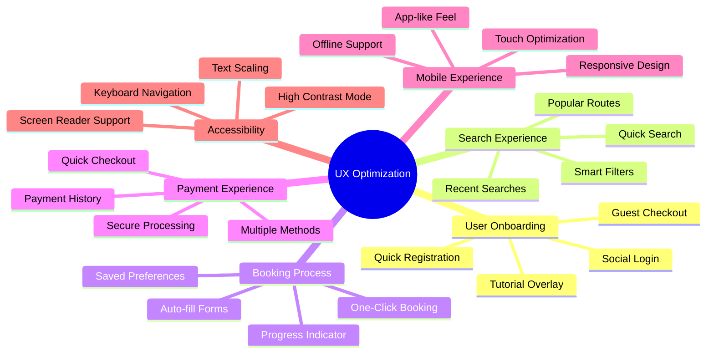
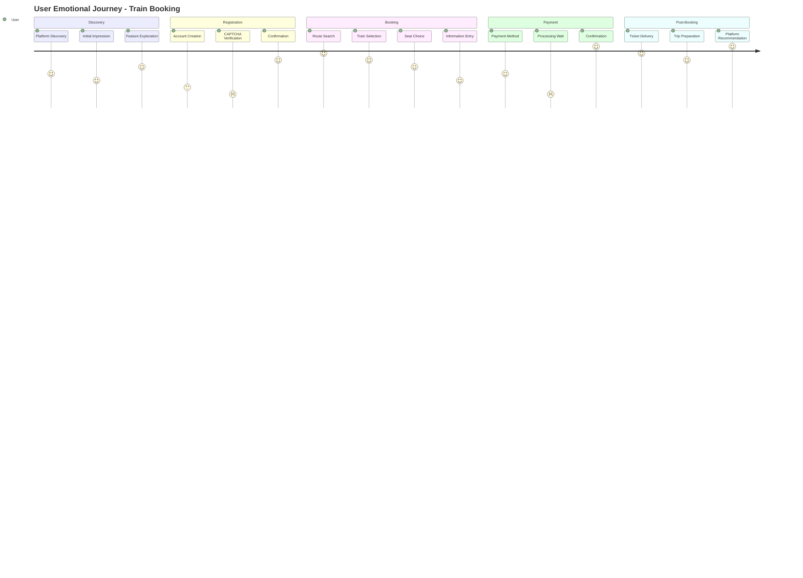
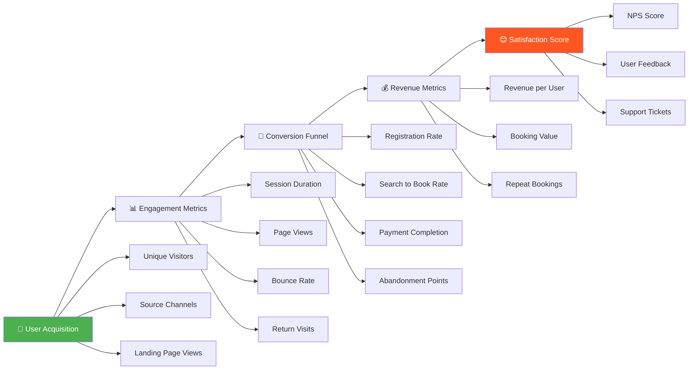

# 🎨 UX Flow - KAI Railway Ticketing Platform

## User Experience Journey Flow

```mermaid
flowchart TD
    Start([🚀 User Opens Platform]) --> Landing{👀 First Visit?}
    
    Landing -->|Yes| Onboarding[📱 Onboarding Experience]
    Landing -->|No| UserAuth{🔐 Authenticated?}
    
    Onboarding --> Features[✨ Feature Showcase]
    Features --> Benefits[💡 Benefits Explanation]
    Benefits --> CTA[📞 Call to Action]
    CTA --> UserAuth
    
    UserAuth -->|No| AuthChoice{Choose Action}
    AuthChoice --> Login[🔑 Login Page]
    AuthChoice --> Register[📝 Register Page]
    AuthChoice --> Guest[👤 Continue as Guest]
    
    Login --> Captcha1[🤖 CAPTCHA Verification]
    Register --> Captcha2[🤖 CAPTCHA Verification]
    
    Captcha1 --> LoginProcess[⚡ Login Process]
    Captcha2 --> RegisterProcess[⚡ Register Process]
    
    LoginProcess --> LoginSuccess{✅ Success?}
    RegisterProcess --> RegisterSuccess{✅ Success?}
    
    LoginSuccess -->|No| LoginError[❌ Error Feedback]
    RegisterSuccess -->|No| RegisterError[❌ Error Feedback]
    
    LoginError --> Login
    RegisterError --> Register
    
    LoginSuccess -->|Yes| Dashboard
    RegisterSuccess -->|Yes| Dashboard
    Guest --> Dashboard
    UserAuth -->|Yes| Dashboard
    
    Dashboard[🏠 Main Dashboard] --> SearchTrain[🔍 Search Trains]
    
    SearchTrain --> RouteSelect[🛤️ Select Route]
    RouteSelect --> DateSelect[📅 Select Date]
    DateSelect --> TrainList[🚂 Available Trains List]
    
    TrainList --> TrainDetails[📋 Train Details]
    TrainDetails --> SeatSelect[💺 Seat Selection]
    SeatSelect --> PassengerInfo[👥 Passenger Information]
    
    PassengerInfo --> BookingSummary[📄 Booking Summary]
    BookingSummary --> Payment[💳 Payment Gateway]
    
    Payment --> PaymentProcess[⚡ Payment Processing]
    PaymentProcess --> PaymentResult{💰 Payment Status}
    
    PaymentResult -->|Success| TicketConfirm[🎫 Ticket Confirmation]
    PaymentResult -->|Failed| PaymentError[❌ Payment Error]
    
    PaymentError --> Payment
    
    TicketConfirm --> DigitalTicket[📱 Digital Ticket]
    DigitalTicket --> EmailConfirm[📧 Email Confirmation]
    EmailConfirm --> BookingHistory[📚 Booking History]
    
    BookingHistory --> UserProfile[👤 User Profile]
    UserProfile --> Preferences[⚙️ User Preferences]
    
    Preferences --> Notifications[🔔 Notification Settings]
    Notifications --> Help[❓ Help & Support]
    
    Help --> FAQ[❓ FAQ Section]
    Help --> LiveChat[💬 Live Chat Support]
    Help --> ContactForm[📝 Contact Form]
    
    FAQ --> Resolution[✅ Issue Resolution]
    LiveChat --> Resolution
    ContactForm --> Resolution
    
    Resolution --> Satisfaction[😊 User Satisfaction]
    Satisfaction --> Feedback[📝 Feedback Collection]
    Feedback --> Improvement[🔄 Platform Improvement]
    
    Improvement --> Dashboard
    
    style Start fill:#4CAF50,stroke:#333,stroke-width:3px,color:#fff
    style Dashboard fill:#2196F3,stroke:#333,stroke-width:2px,color:#fff
    style TicketConfirm fill:#FF9800,stroke:#333,stroke-width:2px,color:#fff
    style Satisfaction fill:#9C27B0,stroke:#333,stroke-width:2px,color:#fff
```

## UX Pain Points & Solutions

```mermaid
mindmap
  root((UX Optimization))
    User Onboarding
      Quick Registration
      Social Login
      Guest Checkout
      Tutorial Overlay
    Search Experience
      Smart Filters
      Quick Search
      Recent Searches
      Popular Routes
    Booking Process
      One-Click Booking
      Saved Preferences
      Auto-fill Forms
      Progress Indicator
    Payment Experience
      Multiple Methods
      Secure Processing
      Quick Checkout
      Payment History
    Mobile Experience
      Responsive Design
      Touch Optimization
      Offline Support
      App-like Feel
    Accessibility
      Screen Reader Support
      Keyboard Navigation
      High Contrast Mode
      Text Scaling
```

## Emotional Journey Mapping

```mermaid
journey
    title User Emotional Journey - Train Booking
    section Discovery
      Platform Discovery: 5: User
      Initial Impression: 4: User
      Feature Exploration: 6: User
    section Registration
      Account Creation: 3: User
      CAPTCHA Verification: 2: User
      Confirmation: 7: User
    section Booking
      Route Search: 8: User
      Train Selection: 7: User
      Seat Choice: 6: User
      Information Entry: 4: User
    section Payment
      Payment Method: 5: User
      Processing Wait: 2: User
      Confirmation: 9: User
    section Post-Booking
      Ticket Delivery: 8: User
      Trip Preparation: 7: User
      Platform Recommendation: 9: User
```

## User Flow Metrics & KPIs

```mermaid
graph LR
    A[👤 User Acquisition] --> B[📊 Engagement Metrics]
    B --> C[🎯 Conversion Funnel]
    C --> D[💰 Revenue Metrics]
    D --> E[😊 Satisfaction Score]
    
    A --> A1[Unique Visitors]
    A --> A2[Source Channels]
    A --> A3[Landing Page Views]
    
    B --> B1[Session Duration]
    B --> B2[Page Views]
    B --> B3[Bounce Rate]
    B --> B4[Return Visits]
    
    C --> C1[Registration Rate]
    C --> C2[Search to Book Rate]
    C --> C3[Payment Completion]
    C --> C4[Abandonment Points]
    
    D --> D1[Revenue per User]
    D --> D2[Booking Value]
    D --> D3[Repeat Bookings]
    
    E --> E1[NPS Score]
    E --> E2[User Feedback]
    E --> E3[Support Tickets]
    
    style A fill:#4CAF50,color:#fff
    style E fill:#FF5722,color:#fff
```
