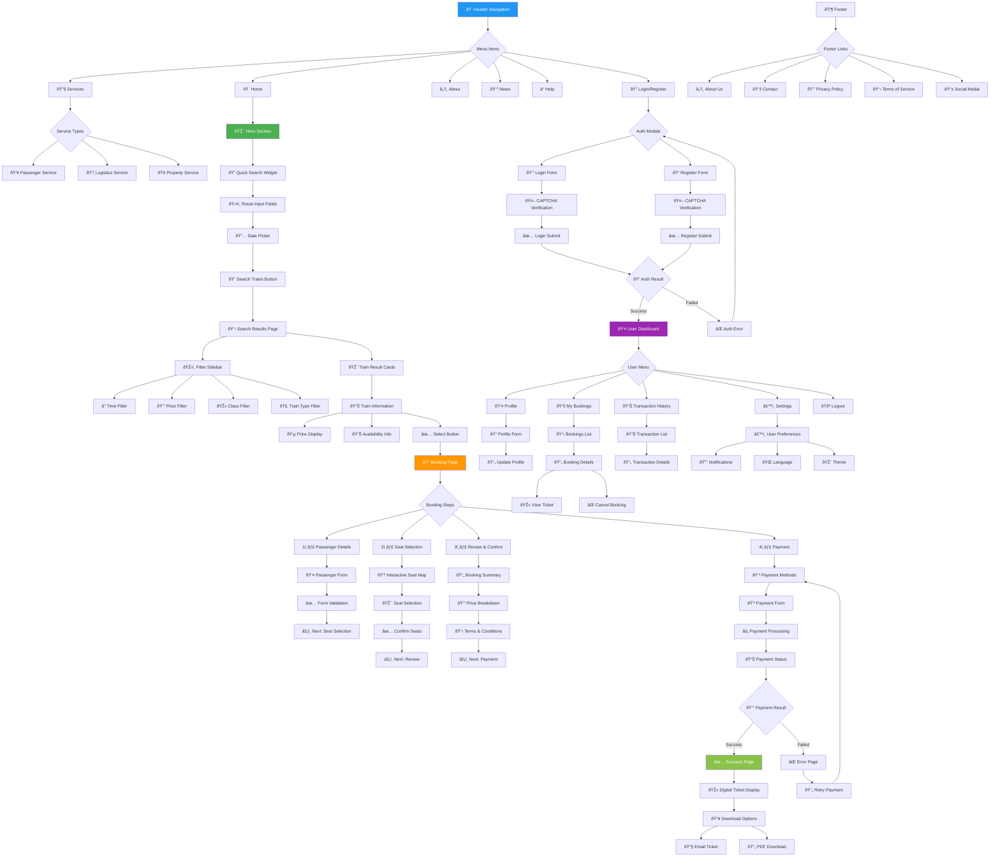
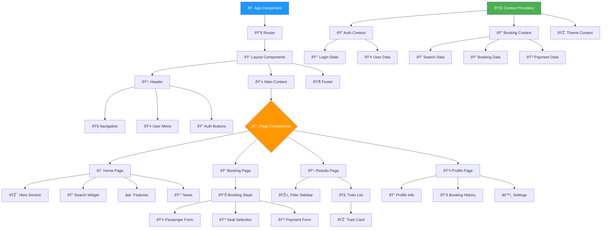
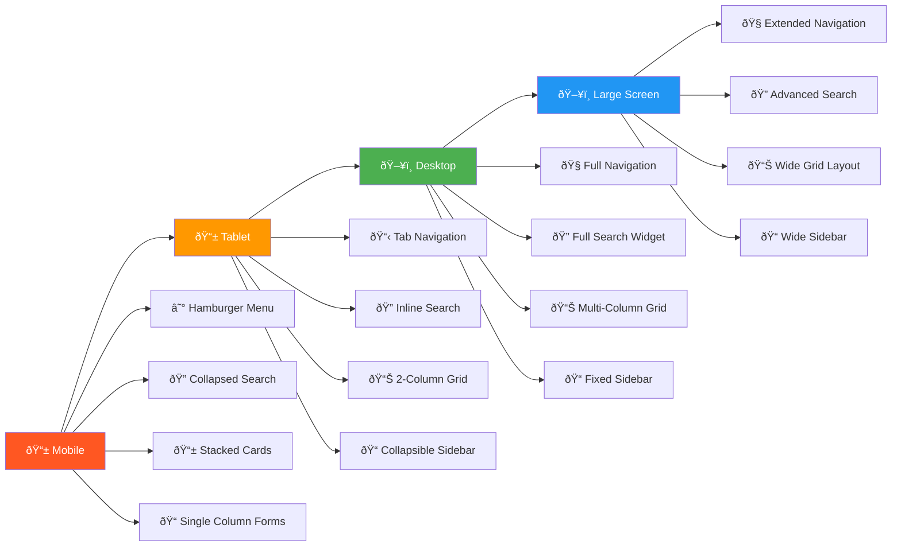
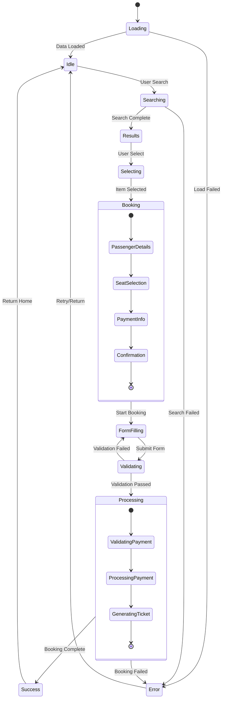

# 🎨 UI Flow - KAI Railway Ticketing Platform

## User Interface Navigation Flow

```mermaid
flowchart TD
    Header[🠠Header Navigation] --> HeaderMenu{Menu Items}
    HeaderMenu --> Home[🠠Home]
    HeaderMenu --> Services[🔧 Services]
    HeaderMenu --> About[â„¹ï¸ About]
    HeaderMenu --> News[📰 News]
    HeaderMenu --> Help[â“ Help]
    HeaderMenu --> AuthButtons[🔠Login/Register]
    
    Services --> ServiceSub{Service Types}
    ServiceSub --> Passenger[👥 Passenger Service]
    ServiceSub --> Logistics[📦 Logistics Service]
    ServiceSub --> Property[🢠Property Service]
    
    Home --> HeroSection[🎯 Hero Section]
    HeroSection --> SearchWidget[🔠Quick Search Widget]
    SearchWidget --> RouteInput[ðŸ›¤ï¸ Route Input Fields]
    RouteInput --> DatePicker[📅 Date Picker]
    DatePicker --> SearchButton[🔠Search Trains Button]
    
    SearchButton --> ResultsPage[📋 Search Results Page]
    
    ResultsPage --> Filters[ðŸŽ›ï¸ Filter Sidebar]
    Filters --> TimeFilter[â° Time Filter]
    Filters --> PriceFilter[💰 Price Filter]
    Filters --> ClassFilter[🎫 Class Filter]
    Filters --> TrainFilter[🚂 Train Type Filter]
    
    ResultsPage --> TrainCards[🎴 Train Result Cards]
    TrainCards --> TrainInfo[📊 Train Information]
    TrainInfo --> PriceDisplay[💵 Price Display]
    TrainInfo --> AvailabilityInfo[📊 Availability Info]
    TrainInfo --> SelectButton[✅ Select Button]
    
    SelectButton --> BookingPage[📠Booking Page]
    
    BookingPage --> BookingSteps{Booking Steps}
    BookingSteps --> Step1[1ï¸âƒ£ Passenger Details]
    BookingSteps --> Step2[2ï¸âƒ£ Seat Selection]
    BookingSteps --> Step3[3ï¸âƒ£ Review & Confirm]
    BookingSteps --> Step4[4ï¸âƒ£ Payment]
    
    Step1 --> PassengerForm[👤 Passenger Form]
    PassengerForm --> FormValidation[✅ Form Validation]
    FormValidation --> NextStep1[âž¡ï¸ Next: Seat Selection]
    
    Step2 --> SeatMap[💺 Interactive Seat Map]
    SeatMap --> SeatSelection[🎯 Seat Selection]
    SeatSelection --> SeatConfirm[✅ Confirm Seats]
    SeatConfirm --> NextStep2[âž¡ï¸ Next: Review]
    
    Step3 --> BookingSummary[📄 Booking Summary]
    BookingSummary --> PriceBreakdown[💰 Price Breakdown]
    PriceBreakdown --> TermsAccept[📋 Terms & Conditions]
    TermsAccept --> NextStep3[âž¡ï¸ Next: Payment]
    
    Step4 --> PaymentMethods[💳 Payment Methods]
    PaymentMethods --> PaymentForm[💳 Payment Form]
    PaymentForm --> PaymentProcess[âš¡ Payment Processing]
    PaymentProcess --> PaymentStatus[📊 Payment Status]
    
    PaymentStatus --> Success{💰 Payment Result}
    Success -->|Success| SuccessPage[✅ Success Page]
    Success -->|Failed| ErrorPage[⌠Error Page]
    
    SuccessPage --> TicketDisplay[🎫 Digital Ticket Display]
    TicketDisplay --> DownloadOptions[📥 Download Options]
    DownloadOptions --> EmailSend[📧 Email Ticket]
    DownloadOptions --> PDFDownload[📄 PDF Download]
    
    ErrorPage --> RetryPayment[🔄 Retry Payment]
    RetryPayment --> PaymentMethods
    
    AuthButtons --> LoginModal{Auth Modals}
    LoginModal --> LoginForm[🔑 Login Form]
    LoginModal --> RegisterForm[📠Register Form]
    
    LoginForm --> CaptchaLogin[🤖 CAPTCHA Verification]
    RegisterForm --> CaptchaRegister[🤖 CAPTCHA Verification]
    
    CaptchaLogin --> LoginSubmit[✅ Login Submit]
    CaptchaRegister --> RegisterSubmit[✅ Register Submit]
    
    LoginSubmit --> AuthSuccess{🔠Auth Result}
    RegisterSubmit --> AuthSuccess
    
    AuthSuccess -->|Success| UserDashboard[👤 User Dashboard]
    AuthSuccess -->|Failed| AuthError[⌠Auth Error]
    
    AuthError --> LoginModal
    
    UserDashboard --> UserMenu{User Menu}
    UserMenu --> Profile[👤 Profile]
    UserMenu --> Bookings[📚 My Bookings]
    UserMenu --> History[📊 Transaction History]
    UserMenu --> Settings[âš™ï¸ Settings]
    UserMenu --> Logout[🚪 Logout]
    
    Profile --> ProfileForm[📠Profile Form]
    ProfileForm --> UpdateProfile[🔄 Update Profile]
    
    Bookings --> BookingsList[📋 Bookings List]
    BookingsList --> BookingDetail[📄 Booking Details]
    BookingDetail --> TicketView[🎫 View Ticket]
    BookingDetail --> CancelBooking[⌠Cancel Booking]
    
    History --> TransactionList[📊 Transaction List]
    TransactionList --> TransactionDetail[📄 Transaction Details]
    
    Settings --> Preferences[âš™ï¸ User Preferences]
    Preferences --> NotificationSettings[🔔 Notifications]
    Preferences --> LanguageSettings[🌠Language]
    Preferences --> ThemeSettings[🎨 Theme]
    
    Footer[🦶 Footer] --> FooterLinks{Footer Links}
    FooterLinks --> AboutUs[â„¹ï¸ About Us]
    FooterLinks --> ContactUs[📞 Contact]
    FooterLinks --> Privacy[🔒 Privacy Policy]
    FooterLinks --> Terms[📋 Terms of Service]
    FooterLinks --> SocialMedia[📱 Social Media]
    
    style Header fill:#2196F3,color:#fff
    style HeroSection fill:#4CAF50,color:#fff
    style BookingPage fill:#FF9800,color:#fff
    style SuccessPage fill:#8BC34A,color:#fff
    style UserDashboard fill:#9C27B0,color:#fff
```

## Component Hierarchy & State Flow

```mermaid
graph TD
    App[🠠App Component] --> Router[🔀 Router]
    Router --> Layout[📠Layout Components]
    
    Layout --> Header[📋 Header]
    Layout --> Main[📱 Main Content]
    Layout --> Footer[🦶 Footer]
    
    Header --> Navigation[🧭 Navigation]
    Header --> UserMenu[👤 User Menu]
    Header --> AuthButtons[🔠Auth Buttons]
    
    Main --> Pages{📄 Page Components}
    
    Pages --> HomePage[🠠Home Page]
    Pages --> BookingPage[📠Booking Page]
    Pages --> ProfilePage[👤 Profile Page]
    Pages --> ResultsPage[📋 Results Page]
    
    HomePage --> HeroSection[🎯 Hero Section]
    HomePage --> SearchWidget[🔠Search Widget]
    HomePage --> FeaturesSection[✨ Features]
    HomePage --> NewsSection[📰 News]
    
    BookingPage --> BookingSteps[📊 Booking Steps]
    BookingSteps --> PassengerForm[👤 Passenger Form]
    BookingSteps --> SeatSelection[💺 Seat Selection]
    BookingSteps --> PaymentForm[💳 Payment Form]
    
    ResultsPage --> FilterSidebar[ðŸŽ›ï¸ Filter Sidebar]
    ResultsPage --> TrainList[🚂 Train List]
    TrainList --> TrainCard[🎴 Train Card]
    
    ProfilePage --> ProfileInfo[📠Profile Info]
    ProfilePage --> BookingHistory[📚 Booking History]
    ProfilePage --> Settings[âš™ï¸ Settings]
    
    Context[🌠Context Providers] --> AuthContext[🔠Auth Context]
    Context --> BookingContext[📠Booking Context]
    Context --> ThemeContext[🎨 Theme Context]
    
    AuthContext --> LoginState[🔑 Login State]
    AuthContext --> UserData[👤 User Data]
    
    BookingContext --> SearchData[🔠Search Data]
    BookingContext --> BookingData[📠Booking Data]
    BookingContext --> PaymentData[💳 Payment Data]
    
    style App fill:#2196F3,color:#fff
    style Context fill:#4CAF50,color:#fff
    style Pages fill:#FF9800,color:#fff
```

## Responsive Design Breakpoints

```mermaid
graph LR
    Mobile[📱 Mobile] --> Tablet[📱 Tablet] --> Desktop[ðŸ–¥ï¸ Desktop] --> Large[ðŸ–¥ï¸ Large Screen]
    
    Mobile --> M_Nav[☰ Hamburger Menu]
    Mobile --> M_Search[🔠Collapsed Search]
    Mobile --> M_Cards[📱 Stacked Cards]
    Mobile --> M_Forms[📠Single Column Forms]
    
    Tablet --> T_Nav[📋 Tab Navigation]
    Tablet --> T_Search[🔠Inline Search]
    Tablet --> T_Grid[📊 2-Column Grid]
    Tablet --> T_Sidebar[📠Collapsible Sidebar]
    
    Desktop --> D_Nav[🧭 Full Navigation]
    Desktop --> D_Search[🔠Full Search Widget]
    Desktop --> D_Grid[📊 Multi-Column Grid]
    Desktop --> D_Sidebar[📠Fixed Sidebar]
    
    Large --> L_Nav[🧭 Extended Navigation]
    Large --> L_Search[🔠Advanced Search]
    Large --> L_Grid[📊 Wide Grid Layout]
    Large --> L_Sidebar[📠Wide Sidebar]
    
    style Mobile fill:#FF5722,color:#fff
    style Tablet fill:#FF9800,color:#fff
    style Desktop fill:#4CAF50,color:#fff
    style Large fill:#2196F3,color:#fff
```

## UI State Management Flow

```mermaid
stateDiagram-v2
    [*] --> Loading
    Loading --> Idle: Data Loaded
    Loading --> Error: Load Failed
    
    Idle --> Searching: User Search
    Searching --> Results: Search Complete
    Searching --> Error: Search Failed
    
    Results --> Selecting: User Select
    Selecting --> Booking: Item Selected
    
    Booking --> FormFilling: Start Booking
    FormFilling --> Validating: Submit Form
    Validating --> FormFilling: Validation Failed
    Validating --> Processing: Validation Passed
    
    Processing --> Success: Booking Complete
    Processing --> Error: Booking Failed
    
    Success --> Idle: Return Home
    Error --> Idle: Retry/Return
    
    state Booking {
        [*] --> PassengerDetails
        PassengerDetails --> SeatSelection
        SeatSelection --> PaymentInfo
        PaymentInfo --> Confirmation
        Confirmation --> [*]
    }
    
    state Processing {
        [*] --> ValidatingPayment
        ValidatingPayment --> ProcessingPayment
        ProcessingPayment --> GeneratingTicket
        GeneratingTicket --> [*]
    }
```
