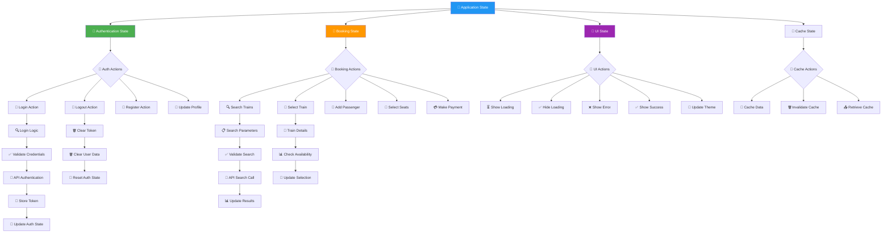
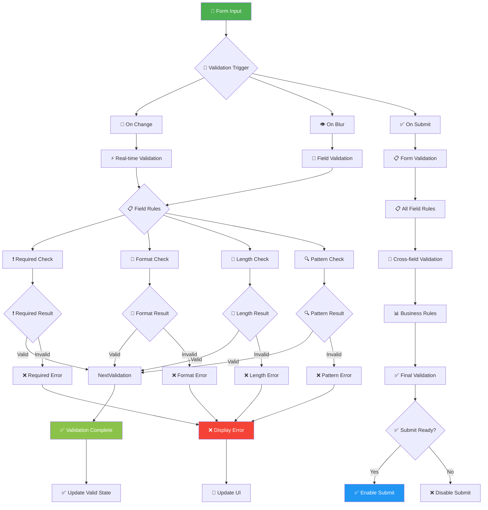
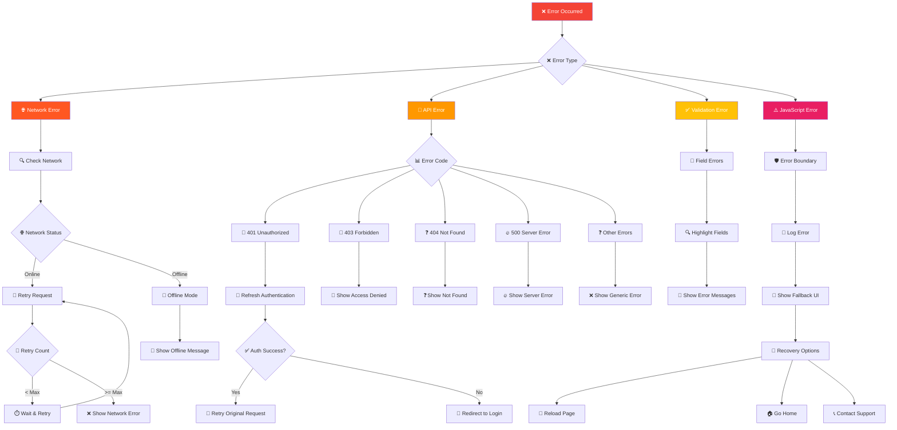

# 🧠 Frontend Logic Flow - KAI Railway Ticketing Platform

## React Component Logic Flow

```mermaid
flowchart TD
    AppMount[🚀 App Component Mount] --> RouterInit[🔀 Router Initialization]
    RouterInit --> ContextProviders[🌐 Context Providers Setup]
    
    ContextProviders --> AuthContext[🔐 Auth Context]
    ContextProviders --> BookingContext[📝 Booking Context]
    ContextProviders --> ThemeContext[🎨 Theme Context]
    
    AuthContext --> AuthCheck{🔍 Auth Status Check}
    AuthCheck -->|Authenticated| LoadUserData[👤 Load User Data]
    AuthCheck -->|Not Authenticated| GuestMode[👤 Guest Mode]
    
    LoadUserData --> UserDataSuccess{✅ Load Success?}
    UserDataSuccess -->|Yes| SetAuthState[🔐 Set Auth State]
    UserDataSuccess -->|No| AuthError[❌ Auth Error]
    
    AuthError --> RetryAuth[🔄 Retry Auth]
    RetryAuth --> AuthCheck
    
    SetAuthState --> AppReady[✅ App Ready]
    GuestMode --> AppReady
    
    AppReady --> RouteNavigation[🧭 Route Navigation]
    
    RouteNavigation --> HomePage{🏠 Home Page Logic}
    HomePage --> SearchFormLogic[🔍 Search Form Logic]
    
    SearchFormLogic --> FormValidation[✅ Form Validation]
    FormValidation --> ValidationResult{📋 Validation Result}
    
    ValidationResult -->|Valid| APICall[📡 API Call]
    ValidationResult -->|Invalid| ShowErrors[❌ Show Validation Errors]
    
    ShowErrors --> SearchFormLogic
    
    APICall --> LoadingState[⏳ Loading State]
    LoadingState --> APIResponse{📡 API Response}
    
    APIResponse -->|Success| ProcessResults[📊 Process Results]
    APIResponse -->|Error| HandleError[❌ Handle Error]
    
    ProcessResults --> UpdateState[🔄 Update Component State]
    UpdateState --> RenderResults[🎨 Render Results]
    
    HandleError --> ErrorState[❌ Error State]
    ErrorState --> RetryLogic[🔄 Retry Logic]
    RetryLogic --> APICall
    
    RenderResults --> UserInteraction{👆 User Interaction}
    
    UserInteraction --> TrainSelection[🚂 Train Selection]
    UserInteraction --> FilterChange[🎛️ Filter Change]
    UserInteraction --> Pagination[📄 Pagination]
    
    TrainSelection --> BookingFlow[📝 Booking Flow Logic]
    FilterChange --> FilterLogic[🎛️ Filter Logic]
    Pagination --> PaginationLogic[📄 Pagination Logic]
    
    FilterLogic --> UpdateFilters[🔄 Update Filters]
    UpdateFilters --> FilterResults[📊 Filter Results]
    FilterResults --> RenderResults
    
    PaginationLogic --> UpdatePage[📄 Update Page]
    UpdatePage --> LoadPageData[📊 Load Page Data]
    LoadPageData --> APICall
    
    BookingFlow --> BookingValidation[✅ Booking Validation]
    BookingValidation --> BookingSteps{📊 Booking Steps}
    
    BookingSteps --> PassengerStep[👤 Passenger Details Step]
    BookingSteps --> SeatStep[💺 Seat Selection Step]
    BookingSteps --> PaymentStep[💳 Payment Step]
    
    PassengerStep --> PassengerValidation[✅ Passenger Validation]
    PassengerValidation --> PassengerValid{📋 Valid Data?}
    
    PassengerValid -->|Yes| NextStepEnabled[➡️ Enable Next Step]
    PassengerValid -->|No| PassengerErrors[❌ Show Passenger Errors]
    
    PassengerErrors --> PassengerStep
    NextStepEnabled --> SeatStep
    
    SeatStep --> SeatAvailability[📊 Check Seat Availability]
    SeatAvailability --> SeatMap[🗺️ Render Seat Map]
    SeatMap --> SeatSelection[🎯 Seat Selection Logic]
    
    SeatSelection --> SeatValidation[✅ Seat Validation]
    SeatValidation --> SeatValid{💺 Valid Selection?}
    
    SeatValid -->|Yes| UpdateBookingData[📝 Update Booking Data]
    SeatValid -->|No| SeatErrors[❌ Show Seat Errors]
    
    SeatErrors --> SeatSelection
    UpdateBookingData --> PaymentStep
    
    PaymentStep --> PaymentMethods[💳 Load Payment Methods]
    PaymentMethods --> PaymentForm[📝 Payment Form]
    PaymentForm --> PaymentValidation[✅ Payment Validation]
    
    PaymentValidation --> PaymentValid{💰 Valid Payment?}
    PaymentValid -->|Yes| ProcessPayment[⚡ Process Payment]
    PaymentValid -->|No| PaymentErrors[❌ Show Payment Errors]
    
    PaymentErrors --> PaymentForm
    
    ProcessPayment --> PaymentLoading[⏳ Payment Loading]
    PaymentLoading --> PaymentResult{💰 Payment Result}
    
    PaymentResult -->|Success| PaymentSuccess[✅ Payment Success]
    PaymentResult -->|Failed| PaymentFailure[❌ Payment Failure]
    
    PaymentSuccess --> TicketGeneration[🎫 Generate Ticket]
    PaymentFailure --> PaymentRetry[🔄 Payment Retry]
    
    PaymentRetry --> PaymentStep
    
    TicketGeneration --> SuccessPage[✅ Success Page]
    SuccessPage --> TicketDisplay[🎫 Display Ticket]
    TicketDisplay --> EmailTicket[📧 Email Ticket]
    
    style AppMount fill:#4CAF50,color:#fff
    style BookingFlow fill:#FF9800,color:#fff
    style PaymentSuccess fill:#8BC34A,color:#fff
    style ErrorState fill:#F44336,color:#fff
```



## State Management Logic (React Context + Hooks)



## Custom Hooks Logic Flow

```mermaid
flowchart TD
    Hooks[🎣 Custom Hooks] --> useAuth[🔐 useAuth Hook]
    Hooks --> useBooking[📝 useBooking Hook]
    Hooks --> useAPI[📡 useAPI Hook]
    Hooks --> useLocalStorage[💾 useLocalStorage Hook]
    Hooks --> useDebounce[⏱️ useDebounce Hook]
    
    useAuth --> AuthMethods{🔐 Auth Methods}
    AuthMethods --> login[🔑 login()]
    AuthMethods --> logout[🚪 logout()]
    AuthMethods --> register[📝 register()]
    AuthMethods --> isAuthenticated[❓ isAuthenticated()]
    AuthMethods --> getUser[👤 getUser()]
    
    login --> LoginProcess[⚡ Login Process]
    LoginProcess --> ValidateInputs[✅ Validate Inputs]
    ValidateInputs --> CallAPI[📡 Call Login API]
    CallAPI --> HandleResponse[📊 Handle Response]
    HandleResponse --> StoreAuth[💾 Store Auth Data]
    
    useBooking --> BookingMethods{📝 Booking Methods}
    BookingMethods --> searchTrains[🔍 searchTrains()]
    BookingMethods --> selectTrain[🚂 selectTrain()]
    BookingMethods --> addPassengers[👥 addPassengers()]
    BookingMethods --> calculateTotal[💰 calculateTotal()]
    BookingMethods --> processBooking[⚡ processBooking()]
    
    searchTrains --> SearchLogic[🔍 Search Logic]
    SearchLogic --> BuildQuery[🔧 Build Query]
    BuildQuery --> ExecuteSearch[⚡ Execute Search]
    ExecuteSearch --> ProcessResults[📊 Process Results]
    
    useAPI --> APIConfig[⚙️ API Configuration]
    APIConfig --> BaseURL[🌐 Base URL]
    APIConfig --> Headers[📋 Headers]
    APIConfig --> Interceptors[🔄 Interceptors]
    
    Interceptors --> RequestInterceptor[📤 Request Interceptor]
    Interceptors --> ResponseInterceptor[📥 Response Interceptor]
    
    RequestInterceptor --> AddAuth[🔑 Add Auth Token]
    RequestInterceptor --> AddHeaders[📋 Add Headers]
    
    ResponseInterceptor --> HandleSuccess[✅ Handle Success]
    ResponseInterceptor --> HandleError[❌ Handle Error]
    
    HandleError --> ErrorTypes{❌ Error Types}
    ErrorTypes --> NetworkError[🌐 Network Error]
    ErrorTypes --> AuthError[🔐 Auth Error]
    ErrorTypes --> ValidationError[✅ Validation Error]
    ErrorTypes --> ServerError[🔥 Server Error]
    
    AuthError --> RefreshToken[🔄 Refresh Token]
    RefreshToken --> RetryRequest[🔄 Retry Request]
    
    useLocalStorage --> StorageMethods{💾 Storage Methods}
    StorageMethods --> setItem[💾 setItem()]
    StorageMethods --> getItem[📤 getItem()]
    StorageMethods --> removeItem[🗑️ removeItem()]
    StorageMethods --> clearStorage[🗑️ clearStorage()]
    
    setItem --> SerializeData[🔄 Serialize Data]
    SerializeData --> StoreData[💾 Store Data]
    
    getItem --> RetrieveData[📤 Retrieve Data]
    RetrieveData --> DeserializeData[🔄 Deserialize Data]
    
    useDebounce --> DebounceLogic[⏱️ Debounce Logic]
    DebounceLogic --> SetTimeout[⏱️ Set Timeout]
    SetTimeout --> ClearTimeout[🗑️ Clear Timeout]
    ClearTimeout --> ExecuteCallback[⚡ Execute Callback]
    
    style Hooks fill:#4CAF50,color:#fff
    style useAuth fill:#2196F3,color:#fff
    style useBooking fill:#FF9800,color:#fff
    style useAPI fill:#9C27B0,color:#fff
```

## Form Validation Logic



## Error Handling & Recovery Logic


