# 🧭 Navigation Flowchart - KAI Railway Ticketing Platform

## Main Navigation Structure

```mermaid
flowchart TD
    AppStart[🚀 App Start] --> AuthCheck[🔐 Authentication Check]
    
    AuthCheck --> UserAuthenticated{🔐 User Authenticated?}
    
    UserAuthenticated -->|No| GuestNavigation[👤 Guest Navigation]
    UserAuthenticated -->|Yes| AuthenticatedNavigation[🔐 Authenticated Navigation]
    
    GuestNavigation --> GuestMenu{👤 Guest Menu Options}
    
    GuestMenu --> HomePage[🏠 Home Page]
    GuestMenu --> TrainSearch[🔍 Train Search]
    GuestMenu --> SchedulePage[📅 Schedule Page]
    GuestMenu --> LoginPage[🔐 Login Page]
    GuestMenu --> RegisterPage[📝 Register Page]
    GuestMenu --> AboutPage[ℹ️ About Page]
    GuestMenu --> HelpPage[❓ Help Page]
    GuestMenu --> NewsPage[📰 News Page]
    
    AuthenticatedNavigation --> AuthenticatedMenu{🔐 Authenticated Menu Options}
    
    AuthenticatedMenu --> HomePage
    AuthenticatedMenu --> TrainSearch
    AuthenticatedMenu --> MyBookings[📝 My Bookings]
    AuthenticatedMenu --> MyProfile[👤 My Profile]
    AuthenticatedMenu --> PaymentHistory[💳 Payment History]
    AuthenticatedMenu --> TicketHistory[🎫 Ticket History]
    AuthenticatedMenu --> Notifications[🔔 Notifications]
    AuthenticatedMenu --> Settings[⚙️ Settings]
    AuthenticatedMenu --> LogoutOption[🚪 Logout]
    
    HomePage --> HomeActions{🏠 Home Actions}
    
    HomeActions --> QuickSearch[⚡ Quick Search]
    HomeActions --> PopularRoutes[⭐ Popular Routes]
    HomeActions --> PromotionalOffers[🎫 Promotional Offers]
    HomeActions --> RecentBookings[📝 Recent Bookings]
    HomeActions --> NewsUpdates[📰 News Updates]
    
    TrainSearch --> SearchForm[📋 Search Form]
    SearchForm --> SearchResults[📋 Search Results]
    SearchResults --> TrainDetails[🚂 Train Details]
    TrainDetails --> SeatSelection[💺 Seat Selection]
    SeatSelection --> BookingForm[📝 Booking Form]
    BookingForm --> PaymentPage[💳 Payment Page]
    PaymentPage --> BookingConfirmation[✅ Booking Confirmation]
    
    MyBookings --> BookingList[📋 Booking List]
    BookingList --> BookingDetails[📝 Booking Details]
    BookingDetails --> TicketView[🎫 Ticket View]
    BookingDetails --> CancellationOption[❌ Cancellation Option]
    BookingDetails --> ModificationOption[✏️ Modification Option]
    
    MyProfile --> ProfileView[👤 Profile View]
    ProfileView --> EditProfile[✏️ Edit Profile]
    ProfileView --> ChangePassword[🔐 Change Password]
    ProfileView --> PreferencesSettings[⚙️ Preferences Settings]
    
    PaymentHistory --> PaymentList[💳 Payment List]
    PaymentList --> PaymentDetails[💳 Payment Details]
    PaymentDetails --> RefundStatus[💰 Refund Status]
    PaymentDetails --> ReceiptDownload[🧾 Receipt Download]
    
    TicketHistory --> TicketList[🎫 Ticket List]
    TicketList --> TicketDetails[🎫 Ticket Details]
    TicketDetails --> QRCodeDisplay[📱 QR Code Display]
    TicketDetails --> TicketDownload[📥 Ticket Download]
    
    Notifications --> NotificationList[🔔 Notification List]
    NotificationList --> NotificationDetail[🔔 Notification Detail]
    NotificationDetail --> NotificationAction[⚡ Notification Action]
    
    Settings --> SettingsCategories{⚙️ Settings Categories}
    
    SettingsCategories --> AccountSettings[👤 Account Settings]
    SettingsCategories --> NotificationSettings[🔔 Notification Settings]
    SettingsCategories --> PrivacySettings[🔒 Privacy Settings]
    SettingsCategories --> DisplaySettings[🎨 Display Settings]
    SettingsCategories --> LanguageSettings[🌐 Language Settings]
    
    LoginPage --> LoginForm[📝 Login Form]
    LoginForm --> MFAVerification[🔒 MFA Verification]
    MFAVerification --> AuthenticatedNavigation
    
    RegisterPage --> RegistrationForm[📝 Registration Form]
    RegistrationForm --> EmailVerification[📧 Email Verification]
    EmailVerification --> RegistrationComplete[✅ Registration Complete]
    RegistrationComplete --> AuthenticatedNavigation
    
    style AppStart fill:#4CAF50,color:#fff
    style AuthenticatedNavigation fill:#2196F3,color:#fff
    style TrainSearch fill:#FF9800,color:#fff
    style MyBookings fill:#9C27B0,color:#fff
    style BookingConfirmation fill:#8BC34A,color:#fff
```

## Mobile Navigation Flow

```mermaid
flowchart TD
    MobileApp[📱 Mobile App Launch] --> SplashScreen[🎨 Splash Screen]
    
    SplashScreen --> AppInitialization[⚡ App Initialization]
    AppInitialization --> BottomNavigation[📱 Bottom Navigation Setup]
    
    BottomNavigation --> NavigationTabs{📱 Navigation Tabs}
    
    NavigationTabs --> HomeTab[🏠 Home Tab]
    NavigationTabs --> SearchTab[🔍 Search Tab]
    NavigationTabs --> BookingsTab[📝 Bookings Tab]
    NavigationTabs --> ProfileTab[👤 Profile Tab]
    NavigationTabs --> MoreTab[⋯ More Tab]
    
    HomeTab --> HomeScreen[🏠 Home Screen]
    HomeScreen --> QuickActions[⚡ Quick Actions]
    QuickActions --> SwipeGestures[👆 Swipe Gestures]
    
    SearchTab --> SearchInterface[🔍 Search Interface]
    SearchInterface --> VoiceSearch[🎤 Voice Search]
    SearchInterface --> FilterPanel[🔍 Filter Panel]
    SearchInterface --> MapView[🗺️ Map View]
    
    BookingsTab --> BookingsList[📝 Bookings List]
    BookingsList --> PullToRefresh[🔄 Pull to Refresh]
    BookingsList --> SwipeActions[👆 Swipe Actions]
    
    ProfileTab --> ProfileScreen[👤 Profile Screen]
    ProfileScreen --> AvatarUpload[📷 Avatar Upload]
    ProfileScreen --> BiometricSettings[👆 Biometric Settings]
    
    MoreTab --> MoreOptions[⋯ More Options]
    MoreOptions --> Settings[⚙️ Settings]
    MoreOptions --> Support[🆘 Support]
    MoreOptions --> About[ℹ️ About]
    MoreOptions --> Logout[🚪 Logout]
    
    VoiceSearch --> SpeechRecognition[🎤 Speech Recognition]
    SpeechRecognition --> VoiceProcessing[🧠 Voice Processing]
    VoiceProcessing --> SearchExecution[🔍 Search Execution]
    
    FilterPanel --> FilterOptions[🔍 Filter Options]
    FilterOptions --> DatePicker[📅 Date Picker]
    FilterOptions --> TimePicker[⏰ Time Picker]
    FilterOptions --> ClassSelector[🎫 Class Selector]
    FilterOptions --> PriceRange[💰 Price Range]
    
    MapView --> StationMarkers[📍 Station Markers]
    StationMarkers --> RouteVisualization[🛤️ Route Visualization]
    RouteVisualization --> DirectionsIntegration[🧭 Directions Integration]
    
    SwipeActions --> QuickCancel[❌ Quick Cancel]
    SwipeActions --> QuickRebook[🔄 Quick Rebook]
    SwipeActions --> QuickShare[📤 Quick Share]
    
    BiometricSettings --> FingerprintSetup[👆 Fingerprint Setup]
    BiometricSettings --> FaceIDSetup[👁️ Face ID Setup]
    BiometricSettings --> PINSetup[🔢 PIN Setup]
    
    Support --> LiveChat[💬 Live Chat]
    Support --> FAQ[❓ FAQ]
    Support --> ContactForm[📝 Contact Form]
    Support --> CallSupport[📞 Call Support]
    
    style MobileApp fill:#4CAF50,color:#fff
    style BottomNavigation fill:#2196F3,color:#fff
    style SearchInterface fill:#FF9800,color:#fff
    style SwipeActions fill:#9C27B0,color:#fff
    style BiometricSettings fill:#8BC34A,color:#fff
```

## Responsive Navigation Adaptation

```mermaid
flowchart TD
    DeviceDetection[📱 Device Detection] --> DeviceType{📱 Device Type?}
    
    DeviceType --> MobileDevice[📱 Mobile Device]
    DeviceType --> TabletDevice[📄 Tablet Device]
    DeviceType --> DesktopDevice[🖥️ Desktop Device]
    DeviceType --> LargeScreen[📺 Large Screen]
    
    MobileDevice --> MobileBreakpoint[📱 Mobile Breakpoint ≤ 768px]
    TabletDevice --> TabletBreakpoint[📄 Tablet Breakpoint 769-1024px]
    DesktopDevice --> DesktopBreakpoint[🖥️ Desktop Breakpoint 1025-1440px]
    LargeScreen --> LargeBreakpoint[📺 Large Breakpoint ≥ 1441px]
    
    MobileBreakpoint --> MobileNavigation[📱 Mobile Navigation]
    TabletBreakpoint --> TabletNavigation[📄 Tablet Navigation]
    DesktopBreakpoint --> DesktopNavigation[🖥️ Desktop Navigation]
    LargeBreakpoint --> LargeNavigation[📺 Large Screen Navigation]
    
    MobileNavigation --> HamburgerMenu[🍔 Hamburger Menu]
    MobileNavigation --> BottomTabs[📱 Bottom Tabs]
    MobileNavigation --> CollapsibleSections[📂 Collapsible Sections]
    
    TabletNavigation --> SidebarNavigation[📄 Sidebar Navigation]
    TabletNavigation --> TabBasedNavigation[📑 Tab-based Navigation]
    TabletNavigation --> ExpandableMenus[📂 Expandable Menus]
    
    DesktopNavigation --> HorizontalNavbar[🖥️ Horizontal Navbar]
    DesktopNavigation --> DropdownMenus[📋 Dropdown Menus]
    DesktopNavigation --> Breadcrumbs[🍞 Breadcrumbs]
    
    LargeNavigation --> MegaMenus[📺 Mega Menus]
    LargeNavigation --> SidebarPanels[📄 Sidebar Panels]
    LargeNavigation --> SplitView[📱 Split View]
    
    HamburgerMenu --> SlideOutMenu[📱 Slide-out Menu]
    BottomTabs --> TabSwitching[🔄 Tab Switching]
    CollapsibleSections --> AccordionNavigation[📂 Accordion Navigation]
    
    SidebarNavigation --> CollapsibleSidebar[📄 Collapsible Sidebar]
    TabBasedNavigation --> TabPersistence[📑 Tab Persistence]
    ExpandableMenus --> SubMenus[📂 Sub-menus]
    
    HorizontalNavbar --> StickyNavigation[📌 Sticky Navigation]
    DropdownMenus --> HoverInteractions[👆 Hover Interactions]
    Breadcrumbs --> NavigationHistory[📜 Navigation History]
    
    MegaMenus --> CategoryNavigation[📺 Category Navigation]
    SidebarPanels --> ResizablePanels[📏 Resizable Panels]
    SplitView --> DualPaneView[📱 Dual Pane View]
    
    OrientationChange[🔄 Orientation Change] --> OrientationDetection[🔄 Orientation Detection]
    
    OrientationDetection --> Portrait{📱 Portrait?}
    Portrait -->|Yes| PortraitLayout[📱 Portrait Layout]
    Portrait -->|No| LandscapeLayout[📱 Landscape Layout]
    
    PortraitLayout --> VerticalNavigation[📱 Vertical Navigation]
    LandscapeLayout --> HorizontalNavigation[📱 Horizontal Navigation]
    
    VerticalNavigation --> StackedLayout[📚 Stacked Layout]
    HorizontalNavigation --> GridLayout[📊 Grid Layout]
    
    AccessibilityCheck[♿ Accessibility Check] --> AccessibilityFeatures[♿ Accessibility Features]
    
    AccessibilityFeatures --> ScreenReaderSupport[👁️ Screen Reader Support]
    AccessibilityFeatures --> KeyboardNavigation[⌨️ Keyboard Navigation]
    AccessibilityFeatures --> HighContrastMode[🎨 High Contrast Mode]
    AccessibilityFeatures --> FontSizeAdjustment[📝 Font Size Adjustment]
    AccessibilityFeatures --> VoiceControl[🎤 Voice Control]
    
    style DeviceDetection fill:#4CAF50,color:#fff
    style MobileNavigation fill:#2196F3,color:#fff
    style TabletNavigation fill:#FF9800,color:#fff
    style DesktopNavigation fill:#9C27B0,color:#fff
    style AccessibilityFeatures fill:#8BC34A,color:#fff
```

## Deep Linking Navigation

## Navigation State Management

```mermaid
flowchart TD
    NavigationAction[🧭 Navigation Action] --> StateManager[🧠 Navigation State Manager]
    
    StateManager --> StateType{🧠 State Type?}
    
    StateType --> HistoryState[📜 History State]
    StateType --> CurrentState[📍 Current State]
    StateType --> FutureState[🔮 Future State]
    StateType --> SessionState[🔐 Session State]
    
    HistoryState --> HistoryStack[📚 History Stack]
    CurrentState --> CurrentLocation[📍 Current Location]
    FutureState --> FutureNavigation[🔮 Future Navigation]
    SessionState --> SessionData[🔐 Session Data]
    
    HistoryStack --> BackNavigation[⬅️ Back Navigation]
    HistoryStack --> ForwardNavigation[➡️ Forward Navigation]
    HistoryStack --> HistoryCleanup[🧹 History Cleanup]
    
    CurrentLocation --> LocationTracking[📍 Location Tracking]
    CurrentLocation --> BreadcrumbUpdate[🍞 Breadcrumb Update]
    CurrentLocation --> TabActivation[📑 Tab Activation]
    
    FutureNavigation --> PreloadContent[⚡ Preload Content]
    FutureNavigation --> PrefetchData[📊 Prefetch Data]
    FutureNavigation --> CacheWarming[🔥 Cache Warming]
    
    SessionData --> UserPreferences[👤 User Preferences]
    SessionData --> NavigationSettings[⚙️ Navigation Settings]
    SessionData --> RecentPages[📋 Recent Pages]
    
    BackNavigation --> StackPop[📚 Stack Pop]
    ForwardNavigation --> StackPush[📚 Stack Push]
    
    StackPop --> PreviousPage[⬅️ Previous Page]
    StackPush --> NextPage[➡️ Next Page]
    
    LocationTracking --> URLUpdate[🌐 URL Update]
    BreadcrumbUpdate --> BreadcrumbRender[🍞 Breadcrumb Render]
    TabActivation --> TabHighlight[📑 Tab Highlight]
    
    PreloadContent --> ComponentPreload[⚙️ Component Preload]
    PrefetchData --> DataPrefetch[📊 Data Prefetch]
    CacheWarming --> CacheUpdate[💾 Cache Update]
    
    UserPreferences --> PreferenceApplication[👤 Preference Application]
    NavigationSettings --> SettingsApplication[⚙️ Settings Application]
    RecentPages --> RecentPagesDisplay[📋 Recent Pages Display]
    
    NavigationGuards[🛡️ Navigation Guards] --> GuardType{🛡️ Guard Type?}
    
    GuardType --> BeforeEnter[🚪 Before Enter Guard]
    GuardType --> BeforeLeave[🚪 Before Leave Guard]
    GuardType --> BeforeResolve[🔄 Before Resolve Guard]
    GuardType --> AfterEach[✅ After Each Guard]
    
    BeforeEnter --> EnterValidation[✅ Enter Validation]
    BeforeLeave --> LeaveValidation[✅ Leave Validation]
    BeforeResolve --> ResolveValidation[✅ Resolve Validation]
    AfterEach --> PostNavigation[✅ Post Navigation]
    
    EnterValidation --> EnterAllowed{✅ Enter Allowed?}
    LeaveValidation --> LeaveAllowed{✅ Leave Allowed?}
    ResolveValidation --> ResolveAllowed{✅ Resolve Allowed?}
    
    EnterAllowed -->|Yes| NavigationProceed[✅ Navigation Proceed]
    EnterAllowed -->|No| NavigationBlock[🚫 Navigation Block]
    
    LeaveAllowed -->|Yes| NavigationProceed
    LeaveAllowed -->|No| NavigationBlock
    
    ResolveAllowed -->|Yes| NavigationProceed
    ResolveAllowed -->|No| NavigationBlock
    
    NavigationBlock --> BlockReason[🚫 Block Reason]
    BlockReason --> UserNotification[📢 User Notification]
    UserNotification --> AlternativeAction[🔄 Alternative Action]
    
    NavigationProceed --> StateUpdate[🧠 State Update]
    PostNavigation --> StateUpdate
    
    StateUpdate --> RenderUpdate[🎨 Render Update]
    RenderUpdate --> NavigationComplete[✅ Navigation Complete]
    
    style NavigationAction fill:#4CAF50,color:#fff
    style StateManager fill:#2196F3,color:#fff
    style NavigationGuards fill:#FF9800,color:#fff
    style StateUpdate fill:#9C27B0,color:#fff
    style NavigationComplete fill:#8BC34A,color:#fff
```

