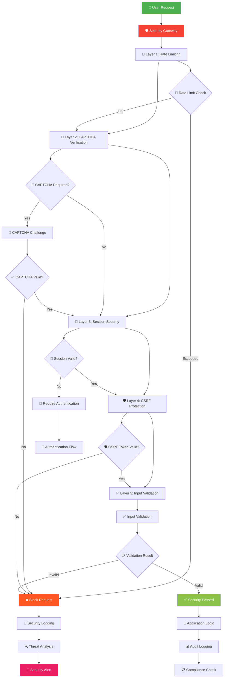
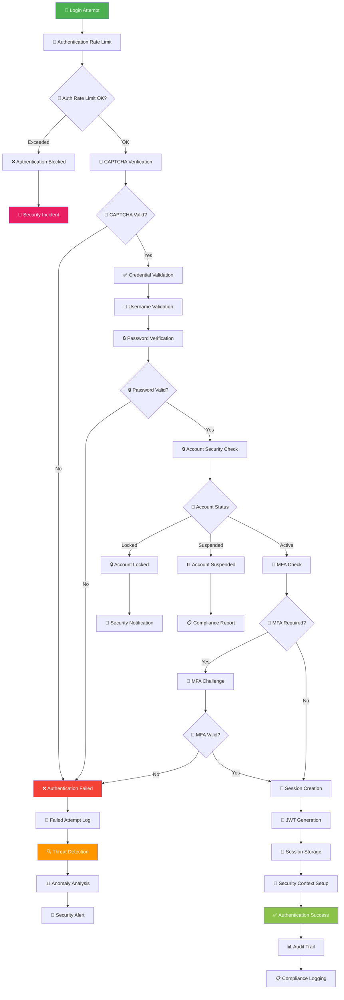
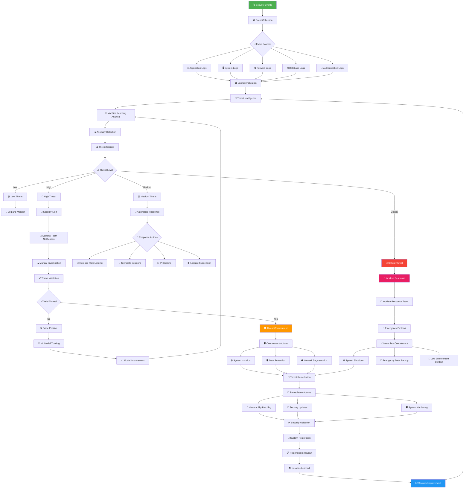
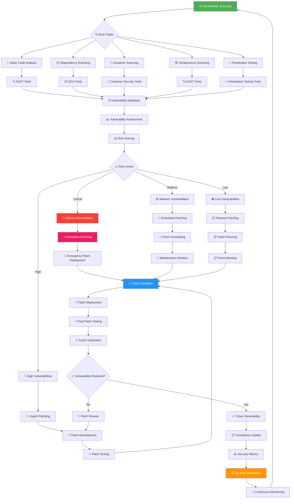
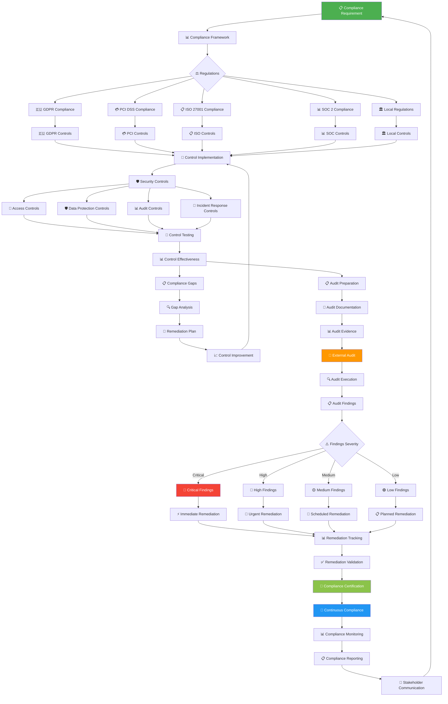

# 🔒 Security Flow - KAI Railway Ticketing Platform

## PENTA Security Framework Overview



## Authentication Security Flow



## Data Protection & Encryption Flow

```mermaid
flowchart TD
    DataInput[📝 Data Input] --> DataClassification[📊 Data Classification]
    
    DataClassification --> DataCategories{📋 Data Categories}
    
    DataCategories --> PII[👤 Personal Identifiable Information]
    DataCategories --> Financial[💳 Financial Data]
    DataCategories --> Authentication[🔐 Authentication Data]
    DataCategories --> System[🖥️ System Data]
    
    PII --> PIIEncryption[🔒 PII Encryption (AES-256)]
    Financial --> FinancialEncryption[🔒 Financial Encryption (AES-256)]
    Authentication --> AuthEncryption[🔒 Auth Data Encryption (bcrypt)]
    System --> SystemEncryption[🔒 System Encryption (TLS)]
    
    PIIEncryption --> PIIKeyManagement[🔑 PII Key Management]
    FinancialEncryption --> FinancialKeyManagement[🔑 Financial Key Management]
    AuthEncryption --> AuthKeyManagement[🔑 Auth Key Management]
    SystemEncryption --> SystemKeyManagement[🔑 System Key Management]
    
    PIIKeyManagement --> HSM[🔐 Hardware Security Module]
    FinancialKeyManagement --> HSM
    AuthKeyManagement --> HSM
    SystemKeyManagement --> HSM
    
    HSM --> KeyRotation[🔄 Key Rotation]
    KeyRotation --> KeyRotationSchedule[📅 Rotation Schedule]
    KeyRotationSchedule --> AutomatedRotation[🤖 Automated Rotation]
    
    PIIEncryption --> EncryptedStorage[💾 Encrypted Storage]
    FinancialEncryption --> EncryptedStorage
    AuthEncryption --> EncryptedStorage
    SystemEncryption --> EncryptedStorage
    
    EncryptedStorage --> DatabaseEncryption[🗄️ Database Encryption at Rest]
    EncryptedStorage --> FileEncryption[📁 File Encryption]
    EncryptedStorage --> BackupEncryption[💾 Backup Encryption]
    
    DatabaseEncryption --> TransitEncryption[🔒 Encryption in Transit]
    FileEncryption --> TransitEncryption
    BackupEncryption --> TransitEncryption
    
    TransitEncryption --> TLSEncryption[🔒 TLS 1.3 Encryption]
    TLSEncryption --> CertificateManagement[📜 Certificate Management]
    CertificateManagement --> CertificateRenewal[🔄 Certificate Renewal]
    
    AutomatedRotation --> ComplianceMonitoring[📋 Compliance Monitoring]
    CertificateRenewal --> ComplianceMonitoring
    
    ComplianceMonitoring --> DataProtectionAudit[📊 Data Protection Audit]
    DataProtectionAudit --> ComplianceReport[📋 Compliance Report]
    ComplianceReport --> RegulatoryCompliance[⚖️ Regulatory Compliance]
    
    style DataInput fill:#4CAF50,color:#fff
    style HSM fill:#F44336,color:#fff
    style EncryptedStorage fill:#2196F3,color:#fff
    style ComplianceMonitoring fill:#FF9800,color:#fff
    style RegulatoryCompliance fill:#9C27B0,color:#fff
```

## Threat Detection & Response Flow



## Vulnerability Management Flow



## Compliance & Audit Flow


