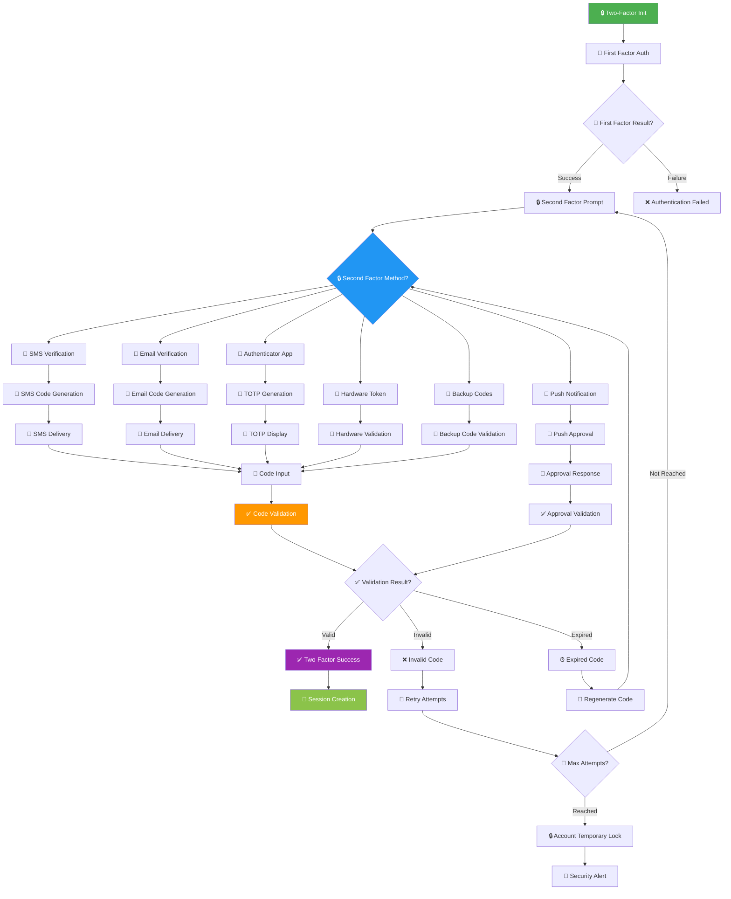

# 🔐 Authentication Flow (Detailed) - KAI Railway Ticketing Platform

## Comprehensive Authentication Architecture

```mermaid
flowchart TD
    AuthenticationRequest[🔐 Authentication Request] --> AuthenticationStrategy[🔐 Authentication Strategy]
    
    AuthenticationStrategy --> AuthMethod{🔐 Authentication Method?}
    
    AuthMethod --> PasswordAuthentication[🔑 Password Authentication]
    AuthMethod --> SocialAuthentication[📱 Social Authentication]
    AuthMethod --> BiometricAuthentication[👆 Biometric Authentication]
    AuthMethod --> TwoFactorAuthentication[🔒 Two-Factor Authentication]
    AuthMethod --> SingleSignOn[🎫 Single Sign-On (SSO)]
    AuthMethod --> TokenAuthentication[🎟️ Token Authentication]
    
    PasswordAuthentication --> PasswordValidation[🔑 Password Validation]
    SocialAuthentication --> OAuthFlow[📱 OAuth Flow]
    BiometricAuthentication --> BiometricVerification[👆 Biometric Verification]
    TwoFactorAuthentication --> TwoFactorProcess[🔒 Two-Factor Process]
    SingleSignOn --> SSOValidation[🎫 SSO Validation]
    TokenAuthentication --> TokenValidation[🎟️ Token Validation]
    
    PasswordValidation --> PasswordChecks{🔑 Password Checks?}
    
    PasswordChecks --> PasswordHashing[🔐 Password Hashing]
    PasswordChecks --> PasswordComplexity[💪 Password Complexity]
    PasswordChecks --> PasswordHistory[📚 Password History]
    PasswordChecks --> PasswordExpiry[⏰ Password Expiry]
    PasswordChecks --> BruteForceProtection[🛡️ Brute Force Protection]
    
    PasswordHashing --> BcryptHashing[🔐 Bcrypt Hashing]
    PasswordComplexity --> ComplexityRules[💪 Complexity Rules]
    PasswordHistory --> PreviousPasswords[📚 Previous Passwords]
    PasswordExpiry --> ExpiryCheck[⏰ Expiry Check]
    BruteForceProtection --> AccountLockout[🔒 Account Lockout]
    
    BcryptHashing --> SaltGeneration[🧂 Salt Generation]
    SaltGeneration --> HashComparison[🔍 Hash Comparison]
    ComplexityRules --> StrengthValidation[💪 Strength Validation]
    PreviousPasswords --> HistoryValidation[📚 History Validation]
    ExpiryCheck --> ForcePasswordChange[🔄 Force Password Change]
    AccountLockout --> LockoutDuration[⏰ Lockout Duration]
    
    OAuthFlow --> OAuthProvider{📱 OAuth Provider?}
    
    OAuthProvider --> GoogleOAuth[🔴 Google OAuth]
    OAuthProvider --> FacebookOAuth[🔵 Facebook OAuth]
    OAuthProvider --> TwitterOAuth[🐦 Twitter OAuth]
    OAuthProvider --> LinkedInOAuth[💼 LinkedIn OAuth]
    OAuthProvider --> AppleOAuth[🍎 Apple OAuth]
    
    GoogleOAuth --> GoogleAuthFlow[🔴 Google Auth Flow]
    FacebookOAuth --> FacebookAuthFlow[🔵 Facebook Auth Flow]
    TwitterOAuth --> TwitterAuthFlow[🐦 Twitter Auth Flow]
    LinkedInOAuth --> LinkedInAuthFlow[💼 LinkedIn Auth Flow]
    AppleOAuth --> AppleAuthFlow[🍎 Apple Auth Flow]
    
    GoogleAuthFlow --> OAuthCallback[📱 OAuth Callback]
    FacebookAuthFlow --> OAuthCallback
    TwitterAuthFlow --> OAuthCallback
    LinkedInAuthFlow --> OAuthCallback
    AppleAuthFlow --> OAuthCallback
    
    OAuthCallback --> AuthorizationCode[🎫 Authorization Code]
    AuthorizationCode --> TokenExchange[🔄 Token Exchange]
    TokenExchange --> AccessTokenReceived[🎟️ Access Token Received]
    AccessTokenReceived --> UserProfileRetrieval[👤 User Profile Retrieval]
    
    style AuthenticationRequest fill:#4CAF50,color:#fff
    style AuthenticationStrategy fill:#2196F3,color:#fff
    style PasswordValidation fill:#FF9800,color:#fff
    style OAuthFlow fill:#9C27B0,color:#fff
    style BiometricVerification fill:#8BC34A,color:#fff
```

## Two-Factor Authentication Flow



## JWT Token Management Flow

```mermaid
flowchart TD
    TokenRequest[🎟️ Token Request] --> TokenGeneration[🎟️ Token Generation]
    
    TokenGeneration --> TokenType{🎟️ Token Type?}
    
    TokenType --> AccessToken[🎟️ Access Token]
    TokenType --> RefreshToken[🔄 Refresh Token]
    TokenType --> IDToken[🆔 ID Token]
    
    AccessToken --> AccessTokenGeneration[🎟️ Access Token Generation]
    RefreshToken --> RefreshTokenGeneration[🔄 Refresh Token Generation]
    IDToken --> IDTokenGeneration[🆔 ID Token Generation]
    
    AccessTokenGeneration --> AccessTokenPayload[📦 Access Token Payload]
    AccessTokenPayload --> UserClaims[👤 User Claims]
    AccessTokenPayload --> PermissionClaims[🛡️ Permission Claims]
    AccessTokenPayload --> ExpirationClaim[⏰ Expiration Claim]
    AccessTokenPayload --> IssuedAtClaim[📅 Issued At Claim]
    AccessTokenPayload --> JWTIDClaim[🆔 JWT ID Claim]
    
    UserClaims --> UserID[👤 User ID]
    UserClaims --> Username[👤 Username]
    UserClaims --> EmailAddress[📧 Email Address]
    UserClaims --> UserRole[👤 User Role]
    
    PermissionClaims --> Scopes[🔍 Scopes]
    PermissionClaims --> Authorities[🛡️ Authorities]
    PermissionClaims --> Resources[📋 Resources]
    
    RefreshTokenGeneration --> RefreshTokenPayload[📦 Refresh Token Payload]
    RefreshTokenPayload --> LongExpiration[⏰ Long Expiration]
    RefreshTokenPayload --> TokenFamily[👨‍👩‍👧‍👦 Token Family]
    RefreshTokenPayload --> DeviceInfo[📱 Device Info]
    
    IDTokenGeneration --> IDTokenPayload[📦 ID Token Payload]
    IDTokenPayload --> IdentityClaims[🆔 Identity Claims]
    IDTokenPayload --> ProfileClaims[👤 Profile Claims]
    
    TokenSigning[✍️ Token Signing] --> SigningAlgorithm{✍️ Signing Algorithm?}
    
    SigningAlgorithm --> HMACSHA256[🔐 HMAC SHA256]
    SigningAlgorithm --> RSASHA256[🔐 RSA SHA256]
    SigningAlgorithm --> ECDSASHA256[🔐 ECDSA SHA256]
    
    HMACSHA256 --> SymmetricKey[🔑 Symmetric Key]
    RSASHA256 --> PrivateKey[🔐 Private Key]
    ECDSASHA256 --> ECPrivateKey[🔐 EC Private Key]
    
    SymmetricKey --> HMACSignature[✍️ HMAC Signature]
    PrivateKey --> RSASignature[✍️ RSA Signature]
    ECPrivateKey --> ECDSASignature[✍️ ECDSA Signature]
    
    TokenValidation[✅ Token Validation] --> ValidationSteps{✅ Validation Steps?}
    
    ValidationSteps --> SignatureVerification[✍️ Signature Verification]
    ValidationSteps --> ExpirationCheck[⏰ Expiration Check]
    ValidationSteps --> IssuerValidation[🏢 Issuer Validation]
    ValidationSteps --> AudienceValidation[👥 Audience Validation]
    ValidationSteps --> ClaimsValidation[📋 Claims Validation]
    
    SignatureVerification --> PublicKeyRetrieval[🔑 Public Key Retrieval]
    PublicKeyRetrieval --> SignatureComparison[🔍 Signature Comparison]
    
    ExpirationCheck --> CurrentTimeComparison[⏰ Current Time Comparison]
    CurrentTimeComparison --> TokenExpired{⏰ Token Expired?}
    
    TokenExpired -->|Yes| ExpiredTokenError[❌ Expired Token Error]
    TokenExpired -->|No| TokenValid[✅ Token Valid]
    
    IssuerValidation --> TrustedIssuerCheck[🏢 Trusted Issuer Check]
    AudienceValidation --> IntendedAudienceCheck[👥 Intended Audience Check]
    ClaimsValidation --> RequiredClaimsCheck[📋 Required Claims Check]
    
    TokenRefresh[🔄 Token Refresh] --> RefreshTokenValidation[🔄 Refresh Token Validation]
    
    RefreshTokenValidation --> RefreshTokenValid{🔄 Refresh Token Valid?}
    RefreshTokenValid -->|Yes| NewTokenGeneration[🎟️ New Token Generation]
    RefreshTokenValid -->|No| RefreshTokenError[❌ Refresh Token Error]
    
    NewTokenGeneration --> NewAccessToken[🎟️ New Access Token]
    NewAccessToken --> TokenRotation[🔄 Token Rotation]
    TokenRotation --> OldTokenInvalidation[❌ Old Token Invalidation]
    
    RefreshTokenError --> ReauthenticationRequired[🔐 Reauthentication Required]
    
    style TokenRequest fill:#4CAF50,color:#fff
    style TokenGeneration fill:#2196F3,color:#fff
    style TokenSigning fill:#FF9800,color:#fff
    style TokenValidation fill:#9C27B0,color:#fff
    style TokenRefresh fill:#8BC34A,color:#fff
```



## Session Management Flow

```mermaid
flowchart TD
    SessionInitiation[🔐 Session Initiation] --> SessionCreation[🔐 Session Creation]
    
    SessionCreation --> SessionData[📊 Session Data]
    SessionData --> SessionID[🆔 Session ID]
    SessionData --> UserInformation[👤 User Information]
    SessionData --> AuthenticationLevel[🔐 Authentication Level]
    SessionData --> DeviceInformation[📱 Device Information]
    SessionData --> IPAddress[🌐 IP Address]
    SessionData --> CreationTimestamp[📅 Creation Timestamp]
    SessionData --> LastAccessTime[⏰ Last Access Time]
    
    SessionID --> UUIDGeneration[🆔 UUID Generation]
    UserInformation --> UserContext[👤 User Context]
    AuthenticationLevel --> SecurityLevel[🔐 Security Level]
    DeviceInformation --> DeviceFingerprinting[📱 Device Fingerprinting]
    
    SessionStorage[💾 Session Storage] --> StorageType{💾 Storage Type?}
    
    StorageType --> ServerSideStorage[🖥️ Server-side Storage]
    StorageType --> ClientSideStorage[📱 Client-side Storage]
    StorageType --> HybridStorage[🔄 Hybrid Storage]
    
    ServerSideStorage --> InMemoryStorage[🧠 In-Memory Storage]
    ServerSideStorage --> DatabaseStorage[🗄️ Database Storage]
    ServerSideStorage --> RedisStorage[🔴 Redis Storage]
    
    ClientSideStorage --> CookieStorage[🍪 Cookie Storage]
    ClientSideStorage --> LocalStorage[📱 Local Storage]
    ClientSideStorage --> SessionStorageClient[📱 Session Storage]
    
    HybridStorage --> EncryptedClientData[🔐 Encrypted Client Data]
    HybridStorage --> ServerValidation[🖥️ Server Validation]
    
    SessionValidation[✅ Session Validation] --> ValidationChecks{✅ Validation Checks?}
    
    ValidationChecks --> SessionExists[🔍 Session Exists]
    ValidationChecks --> SessionExpiry[⏰ Session Expiry]
    ValidationChecks --> SessionIntegrity[🔐 Session Integrity]
    ValidationChecks --> DeviceConsistency[📱 Device Consistency]
    ValidationChecks --> IPConsistency[🌐 IP Consistency]
    ValidationChecks --> ActivityPattern[📊 Activity Pattern]
    
    SessionExists --> SessionLookup[🔍 Session Lookup]
    SessionExpiry --> ExpiryTimeCheck[⏰ Expiry Time Check]
    SessionIntegrity --> IntegrityVerification[🔐 Integrity Verification]
    DeviceConsistency --> DeviceComparison[📱 Device Comparison]
    IPConsistency --> IPValidation[🌐 IP Validation]
    ActivityPattern --> AnomalyDetection[🚨 Anomaly Detection]
    
    SessionLookup --> SessionFound{🔍 Session Found?}
    SessionFound -->|Yes| ContinueValidation[✅ Continue Validation]
    SessionFound -->|No| InvalidSession[❌ Invalid Session]
    
    ExpiryTimeCheck --> SessionExpired{⏰ Session Expired?}
    SessionExpired -->|Yes| ExpiredSession[⏰ Expired Session]
    SessionExpired -->|No| ValidSession[✅ Valid Session]
    
    style SessionInitiation fill:#4CAF50,color:#fff
    style SessionStorage fill:#2196F3,color:#fff
    style SessionValidation fill:#FF9800,color:#fff
    style SessionExists fill:#9C27B0,color:#fff
    style ValidSession fill:#8BC34A,color:#fff
```



## Authentication Security Flow

```mermaid
flowchart TD
    SecurityThreat[🚨 Security Threat] --> ThreatIdentification[🔍 Threat Identification]
    
    ThreatIdentification --> ThreatType{🚨 Threat Type?}
    
    ThreatType --> BruteForceAttack[💥 Brute Force Attack]
    ThreatType --> CredentialStuffing[🔄 Credential Stuffing]
    ThreatType --> PhishingAttack[🎣 Phishing Attack]
    ThreatType --> SessionHijacking[🔒 Session Hijacking]
    ThreatType --> TokenTheft[🎟️ Token Theft]
    ThreatType --> ManInTheMiddle[🕷️ Man-in-the-Middle]
    ThreatType --> AccountTakeover[👤 Account Takeover]
    
    BruteForceAttack --> BruteForceDetection[💥 Brute Force Detection]
    CredentialStuffing --> CredentialDetection[🔄 Credential Detection]
    PhishingAttack --> PhishingDetection[🎣 Phishing Detection]
    SessionHijacking --> HijackingDetection[🔒 Hijacking Detection]
    TokenTheft --> TokenTheftDetection[🎟️ Token Theft Detection]
    ManInTheMiddle --> MITMDetection[🕷️ MITM Detection]
    AccountTakeover --> TakeoverDetection[👤 Takeover Detection]
    
    BruteForceDetection --> FailedLoginTracking[💥 Failed Login Tracking]
    FailedLoginTracking --> AttemptRateAnalysis[📊 Attempt Rate Analysis]
    AttemptRateAnalysis --> BruteForceResponse[💥 Brute Force Response]
    
    BruteForceResponse --> RateLimitingAuth[⚡ Rate Limiting]
    BruteForceResponse --> CAPTCHAAuth[🤖 CAPTCHA]
    BruteForceResponse --> TemporaryAccountLock[🔒 Temporary Account Lock]
    BruteForceResponse --> IPBlocking[🚫 IP Blocking]
    
    CredentialDetection --> PasswordPatternAnalysis[🔄 Password Pattern Analysis]
    PasswordPatternAnalysis --> CommonPasswordCheck[🔄 Common Password Check]
    CommonPasswordCheck --> BreachedPasswordCheck[🚨 Breached Password Check]
    
    PhishingDetection --> URLAnalysis[🎣 URL Analysis]
    URLAnalysis --> DomainReputation[🌐 Domain Reputation]
    DomainReputation --> PhishingResponse[🎣 Phishing Response]
    
    PhishingResponse --> UserWarning[⚠️ User Warning]
    PhishingResponse --> DomainBlocking[🚫 Domain Blocking]
    PhishingResponse --> SecurityEducation[📚 Security Education]
    
    HijackingDetection --> SessionAnomalyDetection[🔒 Session Anomaly Detection]
    SessionAnomalyDetection --> DeviceFingerprintingAuth[📱 Device Fingerprinting]
    DeviceFingerprintingAuth --> LocationAnalysis[📍 Location Analysis]
    LocationAnalysis --> BehaviorAnalysis[👤 Behavior Analysis]
    
    TokenTheftDetection --> TokenUsageMonitoring[🎟️ Token Usage Monitoring]
    TokenUsageMonitoring --> ConcurrentUsageDetection[🔄 Concurrent Usage Detection]
    ConcurrentUsageDetection --> TokenRevocationAuth[❌ Token Revocation]
    
    MITMDetection --> CertificateValidation[🔒 Certificate Validation]
    CertificateValidation --> TLSInspection[🔒 TLS Inspection]
    TLSInspection --> EncryptionValidation[🔐 Encryption Validation]
    
    TakeoverDetection --> AccountActivityMonitoring[👤 Account Activity Monitoring]
    AccountActivityMonitoring --> ProfileChangeDetection[👤 Profile Change Detection]
    ProfileChangeDetection --> SuspiciousActivityAlert[🚨 Suspicious Activity Alert]
    
    SecurityResponse[🛡️ Security Response] --> ResponseAction{🛡️ Response Action?}
    
    ResponseAction --> AutomatedResponse[🤖 Automated Response]
    ResponseAction --> ManualResponse[👤 Manual Response]
    ResponseAction --> EscalatedResponse[⬆️ Escalated Response]
    
    AutomatedResponse --> ImmediateBlocking[🚫 Immediate Blocking]
    AutomatedResponse --> NotificationAlert[📢 Notification Alert]
    AutomatedResponse --> LoggingAction[📝 Logging Action]
    
    ManualResponse --> SecurityAnalyst[👨‍💻 Security Analyst]
    ManualResponse --> IncidentInvestigation[🔍 Incident Investigation]
    ManualResponse --> ThreatAssessment[🚨 Threat Assessment]
    
    EscalatedResponse --> SecurityTeam[👥 Security Team]
    EscalatedResponse --> ManagementAlert[👨‍💼 Management Alert]
    EscalatedResponse --> ExternalAuthorities[🏛️ External Authorities]
    
    style SecurityThreat fill:#4CAF50,color:#fff
    style ThreatIdentification fill:#2196F3,color:#fff
    style SecurityResponse fill:#FF9800,color:#fff
    style AutomatedResponse fill:#9C27B0,color:#fff
    style EscalatedResponse fill:#8BC34A,color:#fff
```


