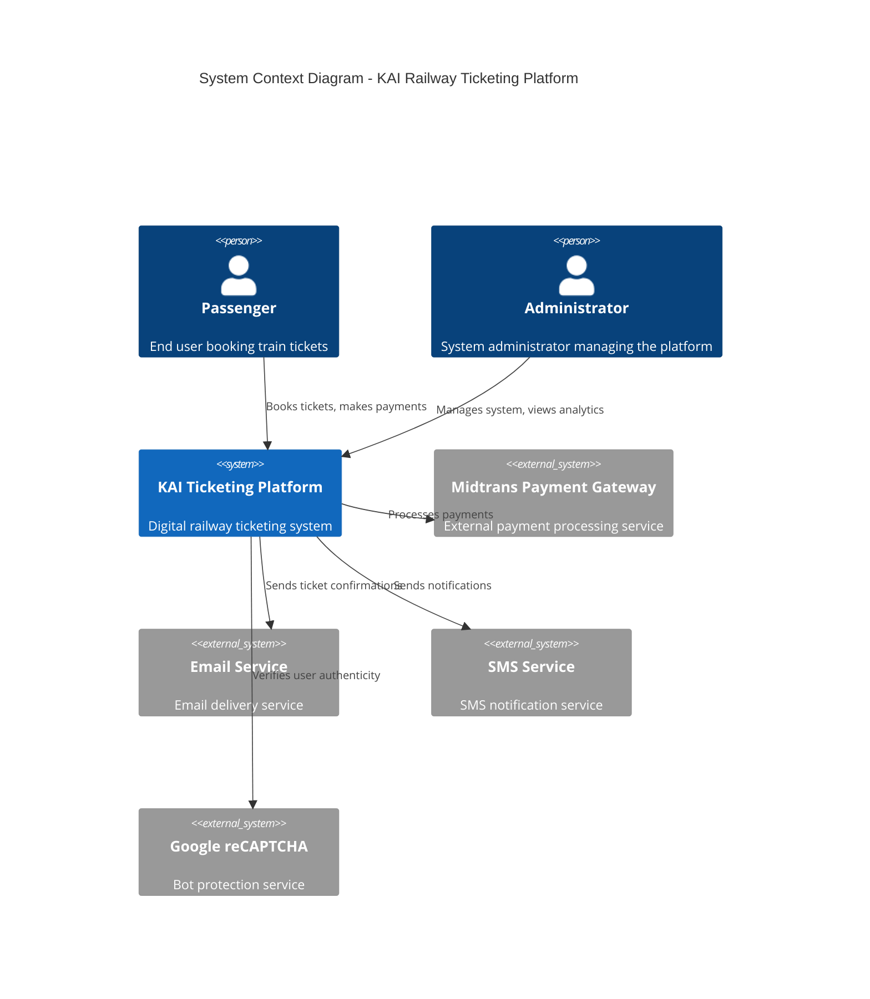
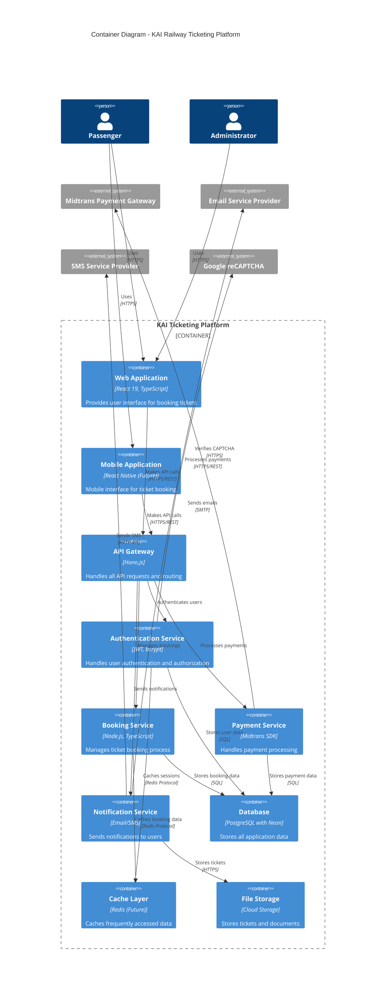
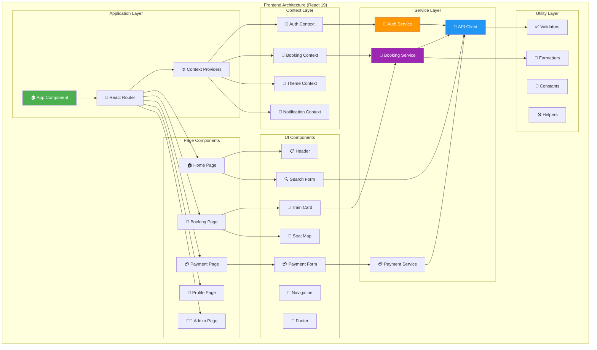
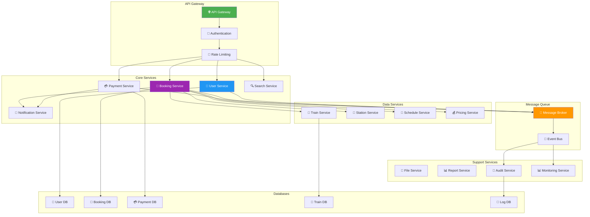
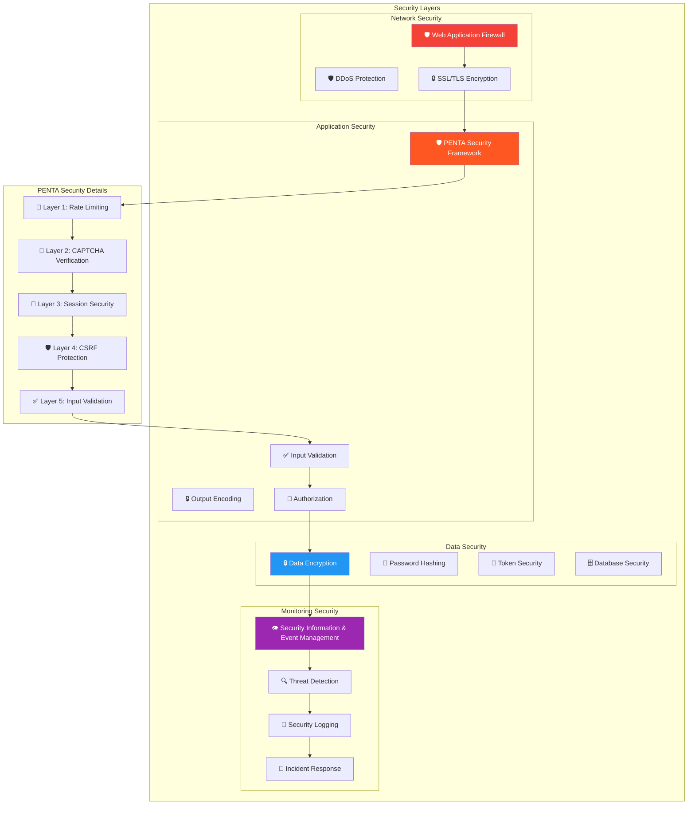

# 🏗️ Architecture Flow (System Architecture Diagram) - KAI Railway Ticketing Platform

## High-Level System Architecture



## Container Architecture Diagram



## Component Architecture - Frontend



## Component Architecture - Backend

```mermaid
flowchart TD
    subgraph "Backend Architecture (Hono.js)"
        subgraph "API Gateway Layer"
            Server[🖥️ Hono.js Server]
            CORS[🌐 CORS Middleware]
            Logger[📝 Logger Middleware]
            Metrics[📊 Prometheus Metrics]
        end
        
        subgraph "Security Layer (PENTA)"
            RateLimit[🚦 Rate Limiting]
            Captcha[🤖 CAPTCHA Verification]
            Session[🔐 Session Security]
            CSRF[🛡️ CSRF Protection]
            Validation[✅ Input Validation]
        end
        
        subgraph "Route Layer"
            AuthRoutes[🔐 Auth Routes]
            OrderRoutes[📋 Order Routes]
            MasterDataRoutes[🗃️ Master Data Routes]
            PaymentRoutes[💳 Payment Routes]
        end
        
        subgraph "Controller Layer"
            LoginController[🔑 Login Controller]
            RegisterController[📝 Register Controller]
            BookingController[📋 Booking Controller]
            PaymentController[💳 Payment Controller]
            UserController[👤 User Controller]
        end
        
        subgraph "Service Layer"
            AuthService[🔐 Auth Service]
            BookingService[📝 Booking Service]
            PaymentService[💳 Payment Service]
            NotificationService[📧 Notification Service]
        end
        
        subgraph "Repository Layer"
            UserRepository[👤 User Repository]
            OrderRepository[📋 Order Repository]
            PaymentRepository[💳 Payment Repository]
            TrainRepository[🚂 Train Repository]
        end
        
        subgraph "Data Layer"
            DrizzleORM[🔧 Drizzle ORM]
            Database[🗄️ PostgreSQL/Neon]
            Schemas[📊 Database Schemas]
        end
        
        subgraph "External Services"
            MidtransAPI[💳 Midtrans API]
            EmailAPI[📧 Email API]
            CaptchaAPI[🤖 reCAPTCHA API]
        end
    end
    
    Server --> CORS
    CORS --> Logger
    Logger --> Metrics
    Metrics --> RateLimit
    
    RateLimit --> Captcha
    Captcha --> Session
    Session --> CSRF
    CSRF --> Validation
    
    Validation --> AuthRoutes
    Validation --> OrderRoutes
    Validation --> MasterDataRoutes
    Validation --> PaymentRoutes
    
    AuthRoutes --> LoginController
    AuthRoutes --> RegisterController
    OrderRoutes --> BookingController
    PaymentRoutes --> PaymentController
    
    LoginController --> AuthService
    RegisterController --> AuthService
    BookingController --> BookingService
    PaymentController --> PaymentService
    
    AuthService --> UserRepository
    BookingService --> OrderRepository
    BookingService --> TrainRepository
    PaymentService --> PaymentRepository
    
    UserRepository --> DrizzleORM
    OrderRepository --> DrizzleORM
    PaymentRepository --> DrizzleORM
    TrainRepository --> DrizzleORM
    
    DrizzleORM --> Database
    DrizzleORM --> Schemas
    
    PaymentService --> MidtransAPI
    NotificationService --> EmailAPI
    AuthService --> CaptchaAPI
    
    style Server fill:#4CAF50,color:#fff
    style RateLimit fill:#F44336,color:#fff
    style DrizzleORM fill:#2196F3,color:#fff
    style Database fill:#FF9800,color:#fff
```



## Deployment Architecture

```mermaid
flowchart TD
    subgraph "Client Layer"
        Browser[🌐 Web Browser]
        MobileApp[📱 Mobile App]
    end
    
    subgraph "CDN & Load Balancer"
        CDN[🚀 CDN (Cloudflare)]
        LoadBalancer[⚖️ Load Balancer]
    end
    
    subgraph "Application Layer"
        subgraph "Frontend Deployment"
            StaticSite[🌐 Static Site Hosting]
            ReactApp[⚛️ React Application]
        end
        
        subgraph "Backend Deployment"
            APIServer1[🖥️ API Server 1]
            APIServer2[🖥️ API Server 2]
            APIServer3[🖥️ API Server 3]
        end
    end
    
    subgraph "Database Layer"
        PrimaryDB[🗄️ Primary Database]
        ReadReplica[📖 Read Replica]
        BackupDB[💾 Backup Database]
    end
    
    subgraph "Cache Layer"
        RedisCluster[🚀 Redis Cluster]
        MemoryCache[💾 Memory Cache]
    end
    
    subgraph "Storage Layer"
        FileStorage[📁 File Storage]
        LogStorage[📝 Log Storage]
    end
    
    subgraph "Monitoring & Security"
        Monitoring[📊 Monitoring (Prometheus)]
        Logging[📝 Centralized Logging]
        Security[🔒 Security Scanner]
        Firewall[🛡️ Web Application Firewall]
    end
    
    subgraph "External Services"
        PaymentGateway[💳 Midtrans]
        EmailService[📧 Email Provider]
        SMSService[📱 SMS Provider]
        CaptchaService[🤖 reCAPTCHA]
    end
    
    Browser --> CDN
    MobileApp --> CDN
    CDN --> LoadBalancer
    LoadBalancer --> Firewall
    
    Firewall --> StaticSite
    StaticSite --> ReactApp
    
    ReactApp --> LoadBalancer
    LoadBalancer --> APIServer1
    LoadBalancer --> APIServer2
    LoadBalancer --> APIServer3
    
    APIServer1 --> RedisCluster
    APIServer2 --> RedisCluster
    APIServer3 --> RedisCluster
    
    APIServer1 --> PrimaryDB
    APIServer2 --> ReadReplica
    APIServer3 --> ReadReplica
    
    PrimaryDB --> BackupDB
    
    APIServer1 --> FileStorage
    APIServer2 --> FileStorage
    APIServer3 --> FileStorage
    
    APIServer1 --> PaymentGateway
    APIServer2 --> EmailService
    APIServer3 --> SMSService
    
    APIServer1 --> CaptchaService
    APIServer2 --> CaptchaService
    APIServer3 --> CaptchaService
    
    Monitoring --> APIServer1
    Monitoring --> APIServer2
    Monitoring --> APIServer3
    Monitoring --> PrimaryDB
    Monitoring --> RedisCluster
    
    Logging --> LogStorage
    
    Security --> APIServer1
    Security --> APIServer2
    Security --> APIServer3
    
    style CDN fill:#4CAF50,color:#fff
    style LoadBalancer fill:#2196F3,color:#fff
    style PrimaryDB fill:#FF9800,color:#fff
    style RedisCluster fill:#9C27B0,color:#fff
    style Security fill:#F44336,color:#fff
```

## Microservices Architecture (Future Enhancement)



## Security Architecture


