# 🧩 Component Flowchart - KAI Railway Ticketing Platform

## Frontend Component Hierarchy

```mermaid
flowchart TD
    App[🏠 App Component] --> Providers[🌐 Context Providers]
    Providers --> Router[🔀 React Router]
    
    Router --> Layout[📐 Layout Component]
    Layout --> Header[📋 Header Component]
    Layout --> Main[📱 Main Content]
    Layout --> Footer[🦶 Footer Component]
    
    Header --> Navigation[🧭 Navigation Component]
    Header --> UserMenu[👤 User Menu Component]
    Header --> AuthButtons[🔐 Auth Buttons Component]
    
    Navigation --> NavItem[🔗 Navigation Item]
    UserMenu --> Dropdown[📋 Dropdown Component]
    AuthButtons --> LoginButton[🔑 Login Button]
    AuthButtons --> RegisterButton[📝 Register Button]
    
    Main --> Routes{📄 Route Components}
    
    Routes --> HomePage[🏠 Home Page Component]
    Routes --> BookingPage[📝 Booking Page Component]
    Routes --> PaymentPage[💳 Payment Page Component]
    Routes --> ProfilePage[👤 Profile Page Component]
    Routes --> AdminPage[👨‍💼 Admin Page Component]
    
    HomePage --> HeroSection[🎯 Hero Section Component]
    HomePage --> SearchWidget[🔍 Search Widget Component]
    HomePage --> FeaturesSection[✨ Features Section Component]
    HomePage --> NewsSection[📰 News Section Component]
    
    SearchWidget --> SearchForm[📝 Search Form Component]
    SearchForm --> FormField[📝 Form Field Component]
    SearchForm --> DatePicker[📅 Date Picker Component]
    SearchForm --> SubmitButton[✅ Submit Button Component]
    
    BookingPage --> BookingSteps[📊 Booking Steps Component]
    BookingSteps --> StepIndicator[📊 Step Indicator Component]
    BookingSteps --> StepContent[📄 Step Content Component]
    
    StepContent --> PassengerForm[👤 Passenger Form Component]
    StepContent --> SeatSelection[💺 Seat Selection Component]
    StepContent --> BookingSummary[📄 Booking Summary Component]
    
    PassengerForm --> InputField[📝 Input Field Component]
    PassengerForm --> ValidationMessage[❌ Validation Message Component]
    
    SeatSelection --> SeatMap[🗺️ Seat Map Component]
    SeatMap --> SeatButton[💺 Seat Button Component]
    SeatButton --> SeatStatus[📊 Seat Status Component]
    
    BookingSummary --> PriceBreakdown[💰 Price Breakdown Component]
    BookingSummary --> TermsCheckbox[☑️ Terms Checkbox Component]
    
    PaymentPage --> PaymentMethods[💳 Payment Methods Component]
    PaymentMethods --> PaymentOption[💳 Payment Option Component]
    PaymentOption --> PaymentForm[📝 Payment Form Component]
    PaymentForm --> PaymentField[💳 Payment Field Component]
    
    ProfilePage --> ProfileInfo[📝 Profile Info Component]
    ProfilePage --> BookingHistory[📚 Booking History Component]
    ProfilePage --> Settings[⚙️ Settings Component]
    
    BookingHistory --> BookingCard[🎴 Booking Card Component]
    BookingCard --> TicketDetails[🎫 Ticket Details Component]
    
    Footer --> FooterSection[📋 Footer Section Component]
    FooterSection --> FooterLink[🔗 Footer Link Component]
    FooterSection --> SocialMedia[📱 Social Media Component]
    
    style App fill:#4CAF50,color:#fff
    style Layout fill:#2196F3,color:#fff
    style SearchWidget fill:#FF9800,color:#fff
    style BookingSteps fill:#9C27B0,color:#fff
    style PaymentMethods fill:#F44336,color:#fff
```

## Backend Component Architecture

```mermaid
flowchart TD
    Server[🖥️ Hono.js Server] --> Middleware[🔧 Middleware Stack]
    
    Middleware --> GlobalMiddleware[🌐 Global Middleware]
    GlobalMiddleware --> CORS[🌐 CORS Middleware]
    GlobalMiddleware --> Logger[📝 Logger Middleware]
    GlobalMiddleware --> Metrics[📊 Metrics Middleware]
    
    Middleware --> SecurityMiddleware[🛡️ Security Middleware]
    SecurityMiddleware --> RateLimit[🚦 Rate Limit Middleware]
    SecurityMiddleware --> Captcha[🤖 CAPTCHA Middleware]
    SecurityMiddleware --> Session[🔐 Session Middleware]
    SecurityMiddleware --> CSRF[🛡️ CSRF Middleware]
    SecurityMiddleware --> Validation[✅ Validation Middleware]
    
    Server --> Routes[🔀 Route Handlers]
    
    Routes --> AuthRoutes[🔐 Authentication Routes]
    Routes --> OrderRoutes[📋 Order Routes]
    Routes --> MasterDataRoutes[🗃️ Master Data Routes]
    Routes --> PaymentRoutes[💳 Payment Routes]
    
    AuthRoutes --> AuthControllers[🎯 Auth Controllers]
    AuthControllers --> LoginController[🔑 Login Controller]
    AuthControllers --> RegisterController[📝 Register Controller]
    AuthControllers --> LogoutController[🚪 Logout Controller]
    AuthControllers --> UserController[👤 User Controller]
    
    OrderRoutes --> OrderControllers[🎯 Order Controllers]
    OrderControllers --> BookingController[📝 Booking Controller]
    OrderControllers --> TicketController[🎫 Ticket Controller]
    OrderControllers --> OrderHistoryController[📚 Order History Controller]
    
    MasterDataRoutes --> MasterDataControllers[🎯 Master Data Controllers]
    MasterDataControllers --> StationController[🚉 Station Controller]
    MasterDataControllers --> TrainController[🚂 Train Controller]
    MasterDataControllers --> ScheduleController[📅 Schedule Controller]
    
    PaymentRoutes --> PaymentControllers[🎯 Payment Controllers]
    PaymentControllers --> PaymentController[💳 Payment Controller]
    PaymentControllers --> WebhookController[🔗 Webhook Controller]
    PaymentControllers --> RefundController[💰 Refund Controller]
    
    LoginController --> AuthServices[🔧 Auth Services]
    RegisterController --> AuthServices
    LogoutController --> AuthServices
    
    AuthServices --> UserService[👤 User Service]
    AuthServices --> TokenService[🎫 Token Service]
    AuthServices --> SessionService[🔐 Session Service]
    
    BookingController --> BookingServices[🔧 Booking Services]
    BookingServices --> BookingService[📝 Booking Service]
    BookingServices --> AvailabilityService[📊 Availability Service]
    BookingServices --> PricingService[💰 Pricing Service]
    
    PaymentController --> PaymentServices[🔧 Payment Services]
    PaymentServices --> PaymentService[💳 Payment Service]
    PaymentServices --> WebhookService[🔗 Webhook Service]
    PaymentServices --> NotificationService[📧 Notification Service]
    
    UserService --> Repositories[📦 Repository Layer]
    BookingService --> Repositories
    PaymentService --> Repositories
    
    Repositories --> UserRepository[👤 User Repository]
    Repositories --> OrderRepository[📋 Order Repository]
    Repositories --> PaymentRepository[💳 Payment Repository]
    Repositories --> TrainRepository[🚂 Train Repository]
    Repositories --> StationRepository[🚉 Station Repository]
    
    UserRepository --> Database[🗄️ Database Layer]
    OrderRepository --> Database
    PaymentRepository --> Database
    TrainRepository --> Database
    StationRepository --> Database
    
    Database --> DrizzleORM[🔧 Drizzle ORM]
    DrizzleORM --> PostgreSQL[🐘 PostgreSQL/Neon]
    
    Database --> Schemas[📊 Database Schemas]
    Schemas --> UserSchema[👤 User Schema]
    Schemas --> OrderSchema[📋 Order Schema]
    Schemas --> PaymentSchema[💳 Payment Schema]
    Schemas --> TrainSchema[🚂 Train Schema]
    
    PaymentService --> ExternalAPIs[🔗 External APIs]
    ExternalAPIs --> MidtransAPI[💳 Midtrans API]
    ExternalAPIs --> EmailAPI[📧 Email API]
    ExternalAPIs --> SMSAPI[📱 SMS API]
    
    NotificationService --> ExternalAPIs
    
    style Server fill:#4CAF50,color:#fff
    style SecurityMiddleware fill:#F44336,color:#fff
    style Database fill:#2196F3,color:#fff
    style ExternalAPIs fill:#FF9800,color:#fff
```

## Authentication Component Flow

```mermaid
flowchart TD
    AuthRequest[🔐 Authentication Request] --> AuthMiddleware[🔧 Authentication Middleware]
    
    AuthMiddleware --> AuthType{🔍 Authentication Type}
    
    AuthType -->|Login| LoginFlow[🔑 Login Flow]
    AuthType -->|Register| RegisterFlow[📝 Register Flow]
    AuthType -->|Token Refresh| RefreshFlow[🔄 Token Refresh Flow]
    AuthType -->|Logout| LogoutFlow[🚪 Logout Flow]
    
    LoginFlow --> LoginValidation[✅ Login Validation Component]
    LoginValidation --> CredentialCheck[🔍 Credential Check Component]
    CredentialCheck --> PasswordVerification[🔒 Password Verification Component]
    PasswordVerification --> TokenGeneration[🎫 Token Generation Component]
    TokenGeneration --> SessionCreation[🔐 Session Creation Component]
    
    RegisterFlow --> RegisterValidation[✅ Register Validation Component]
    RegisterValidation --> UserCreation[👤 User Creation Component]
    UserCreation --> PasswordHashing[🔒 Password Hashing Component]
    PasswordHashing --> UserPersistence[💾 User Persistence Component]
    UserPersistence --> AutoLogin[🔑 Auto Login Component]
    
    RefreshFlow --> TokenValidation[✅ Token Validation Component]
    TokenValidation --> TokenRefresh[🔄 Token Refresh Component]
    TokenRefresh --> NewTokenGeneration[🎫 New Token Generation Component]
    
    LogoutFlow --> SessionValidation[✅ Session Validation Component]
    SessionValidation --> SessionDestruction[🗑️ Session Destruction Component]
    SessionDestruction --> TokenCleanup[🧹 Token Cleanup Component]
    
    SessionCreation --> AuthResponse[✅ Authentication Response]
    AutoLogin --> AuthResponse
    NewTokenGeneration --> AuthResponse
    TokenCleanup --> AuthResponse
    
    AuthResponse --> AuthSuccess{✅ Auth Success?}
    AuthSuccess -->|Yes| SuccessResponse[✅ Success Response Component]
    AuthSuccess -->|No| ErrorResponse[❌ Error Response Component]
    
    SuccessResponse --> UserContext[👤 User Context Update]
    ErrorResponse --> ErrorHandling[❌ Error Handling Component]
    
    UserContext --> AuthStateUpdate[🔄 Auth State Update]
    ErrorHandling --> RetryLogic[🔄 Retry Logic Component]
    
    style AuthRequest fill:#4CAF50,color:#fff
    style LoginFlow fill:#2196F3,color:#fff
    style RegisterFlow fill:#FF9800,color:#fff
    style TokenGeneration fill:#9C27B0,color:#fff
    style ErrorHandling fill:#F44336,color:#fff
```

## Booking Component Flow

```mermaid
flowchart TD
    BookingRequest[📝 Booking Request] --> BookingController[🎯 Booking Controller]
    
    BookingController --> BookingSteps{📊 Booking Steps}
    
    BookingSteps -->|Step 1| SearchComponent[🔍 Search Component]
    BookingSteps -->|Step 2| SelectionComponent[🚂 Selection Component]
    BookingSteps -->|Step 3| PassengerComponent[👤 Passenger Component]
    BookingSteps -->|Step 4| SeatComponent[💺 Seat Component]
    BookingSteps -->|Step 5| SummaryComponent[📄 Summary Component]
    
    SearchComponent --> SearchValidation[✅ Search Validation]
    SearchValidation --> RouteService[🛤️ Route Service]
    RouteService --> AvailabilityService[📊 Availability Service]
    AvailabilityService --> SearchResults[📋 Search Results Component]
    
    SelectionComponent --> TrainSelection[🚂 Train Selection Component]
    TrainSelection --> ClassSelection[🎫 Class Selection Component]
    ClassSelection --> PriceCalculation[💰 Price Calculation Component]
    
    PassengerComponent --> PassengerForm[👤 Passenger Form Component]
    PassengerForm --> PassengerValidation[✅ Passenger Validation]
    PassengerValidation --> ContactInfo[📞 Contact Info Component]
    
    SeatComponent --> SeatMapDisplay[🗺️ Seat Map Display Component]
    SeatMapDisplay --> SeatAvailability[📊 Seat Availability Component]
    SeatAvailability --> SeatSelectionLogic[🎯 Seat Selection Logic]
    SeatSelectionLogic --> SeatReservation[💺 Seat Reservation Component]
    
    SummaryComponent --> BookingSummary[📄 Booking Summary Display]
    BookingSummary --> PriceBreakdown[💰 Price Breakdown Component]
    PriceBreakdown --> TermsComponent[📋 Terms Component]
    TermsComponent --> BookingConfirmation[✅ Booking Confirmation]
    
    BookingConfirmation --> OrderCreation[📝 Order Creation Component]
    OrderCreation --> OrderValidation[✅ Order Validation]
    OrderValidation --> OrderPersistence[💾 Order Persistence]
    OrderPersistence --> PaymentInitiation[💳 Payment Initiation]
    
    PaymentInitiation --> PaymentGateway[🏦 Payment Gateway Component]
    PaymentGateway --> PaymentProcessing[⚡ Payment Processing]
    PaymentProcessing --> PaymentConfirmation[✅ Payment Confirmation]
    
    PaymentConfirmation --> TicketGeneration[🎫 Ticket Generation Component]
    TicketGeneration --> EmailNotification[📧 Email Notification Component]
    EmailNotification --> BookingComplete[✅ Booking Complete]
    
    style BookingRequest fill:#4CAF50,color:#fff
    style SearchComponent fill:#2196F3,color:#fff
    style SeatComponent fill:#FF9800,color:#fff
    style PaymentGateway fill:#9C27B0,color:#fff
    style TicketGeneration fill:#8BC34A,color:#fff
```

## Payment Component Architecture

## UI Component State Management

## Component Communication Flow

```mermaid
flowchart LR
    ParentComponent[👨‍👧‍👦 Parent Component] --> Props[📋 Props]
    Props --> ChildComponent[👶 Child Component]
    
    ChildComponent --> Events[📡 Events]
    Events --> ParentComponent
    
    ParentComponent --> Context[🌐 Context]
    Context --> GrandChildComponent[👶👶 Grandchild Component]
    
    ChildComponent --> LocalState[🏠 Local State]
    LocalState --> ChildComponent
    
    Context --> GlobalState[🌍 Global State]
    GlobalState --> StateManagement[🏪 State Management]
    
    StateManagement --> Actions[⚡ Actions]
    Actions --> Reducers[🔄 Reducers]
    Reducers --> StateUpdate[🔄 State Update]
    StateUpdate --> Context
    
    ParentComponent --> CustomHooks[🎣 Custom Hooks]
    CustomHooks --> APIService[📡 API Service]
    APIService --> BackendAPI[🖥️ Backend API]
    
    BackendAPI --> Response[📤 Response]
    Response --> CustomHooks
    CustomHooks --> StateUpdate
    
    style ParentComponent fill:#4CAF50,color:#fff
    style Context fill:#2196F3,color:#fff
    style StateManagement fill:#FF9800,color:#fff
    style CustomHooks fill:#9C27B0,color:#fff
```

