# 🔄 Sequence Diagram - KAI Railway Ticketing Platform

## User Authentication Sequence

```mermaid
sequenceDiagram
    participant U as 👤 User
    participant F as 🌐 Frontend
    participant G as 🚪 API Gateway
    participant RL as 🚦 Rate Limiter
    participant C as 🤖 CAPTCHA Service
    participant A as 🔐 Auth Service
    participant S as 🗄️ Session Store
    participant DB as 🗄️ Database
    participant JWT as 🎫 JWT Service
    
    Note over U,JWT: User Login Flow with PENTA Security
    
    U->>F: 1. Enter credentials & CAPTCHA
    F->>F: 2. Client-side validation
    F->>G: 3. POST /api/v1/auth/login
    
    Note over G,RL: Layer 1: Rate Limiting
    G->>RL: 4. Check rate limit
    RL-->>G: 5. Rate limit status
    alt Rate limit exceeded
        G-->>F: Rate limit error (429)
        F-->>U: "Too many attempts, try again later"
    else Rate limit OK
        Note over G,C: Layer 2: CAPTCHA Verification
        G->>C: 6. Verify CAPTCHA token
        C-->>G: 7. CAPTCHA verification result
        alt CAPTCHA failed
            G-->>F: CAPTCHA error (400)
            F-->>U: "CAPTCHA verification failed"
        else CAPTCHA OK
            Note over G,A: Layer 3: Authentication
            G->>A: 8. Validate credentials
            A->>DB: 9. Query user by email
            DB-->>A: 10. User data
            A->>A: 11. Verify password (bcrypt)
            alt Invalid credentials
                A-->>G: Authentication failed
                G-->>F: Auth error (401)
                F-->>U: "Invalid credentials"
            else Valid credentials
                Note over A,JWT: Layer 4: Token Generation
                A->>JWT: 12. Generate JWT token
                JWT-->>A: 13. JWT token
                Note over A,S: Layer 5: Session Creation
                A->>S: 14. Create session
                S-->>A: 15. Session ID
                A-->>G: 16. Auth success + tokens
                G-->>F: 17. Login success response
                F->>F: 18. Store tokens
                F-->>U: 19. Redirect to dashboard
            end
        end
    end
```

## Train Booking Sequence

```mermaid
sequenceDiagram
    participant U as 👤 User
    participant F as 🌐 Frontend
    participant G as 🚪 API Gateway
    participant A as 🔐 Auth Middleware
    participant B as 📝 Booking Service
    participant T as 🚂 Train Service
    participant S as 💺 Seat Service
    participant O as 📋 Order Service
    participant P as 💳 Payment Service
    participant M as 💳 Midtrans
    participant N as 📧 Notification Service
    participant DB as 🗄️ Database
    
    Note over U,DB: Complete Train Booking Flow
    
    U->>F: 1. Search trains (route, date)
    F->>G: 2. GET /api/v1/master-data/trains/search
    G->>A: 3. Validate session
    A-->>G: 4. Session valid
    G->>T: 5. Search available trains
    T->>DB: 6. Query trains & schedules
    DB-->>T: 7. Available trains data
    T-->>G: 8. Train search results
    G-->>F: 9. Search results response
    F-->>U: 10. Display train options
    
    U->>F: 11. Select train & class
    F->>G: 12. GET /api/v1/trains/{id}/availability
    G->>S: 13. Check seat availability
    S->>DB: 14. Query seat status
    DB-->>S: 15. Seat availability data
    S-->>G: 16. Availability response
    G-->>F: 17. Seat availability
    F-->>U: 18. Show seat map
    
    U->>F: 19. Select seats & enter passenger info
    F->>F: 20. Validate passenger data
    F->>G: 21. POST /api/v1/order/create
    G->>A: 22. Validate session & CSRF
    A-->>G: 23. Validation passed
    G->>B: 24. Create booking request
    
    B->>S: 25. Reserve selected seats
    S->>DB: 26. Lock seats (temporary)
    DB-->>S: 27. Seats locked
    S-->>B: 28. Seat reservation confirmed
    
    B->>O: 29. Create order
    O->>DB: 30. Insert order data
    DB-->>O: 31. Order created
    O-->>B: 32. Order ID
    B-->>G: 33. Booking created
    G-->>F: 34. Booking response
    F-->>U: 35. Show booking summary
    
    U->>F: 36. Proceed to payment
    F->>G: 37. POST /api/v1/payment/create
    G->>P: 38. Initialize payment
    P->>M: 39. Create payment request
    M-->>P: 40. Payment URL & token
    P->>DB: 41. Store payment record
    DB-->>P: 42. Payment stored
    P-->>G: 43. Payment initialized
    G-->>F: 44. Payment URL
    F-->>U: 45. Redirect to payment gateway
    
    U->>M: 46. Complete payment
    M->>P: 47. Payment webhook notification
    P->>DB: 48. Update payment status
    DB-->>P: 49. Payment updated
    
    alt Payment successful
        P->>O: 50. Confirm order
        O->>DB: 51. Update order status
        DB-->>O: 52. Order confirmed
        P->>S: 53. Confirm seat reservation
        S->>DB: 54. Finalize seat booking
        DB-->>S: 55. Seats booked
        P->>N: 56. Send confirmation email
        N-->>P: 57. Email sent
        P-->>F: 58. Payment success notification
        F-->>U: 59. Show success page with ticket
    else Payment failed
        P->>S: 60. Release reserved seats
        S->>DB: 61. Unlock seats
        DB-->>S: 62. Seats released
        P->>O: 63. Cancel order
        O->>DB: 64. Update order status to cancelled
        DB-->>O: 65. Order cancelled
        P-->>F: 66. Payment failed notification
        F-->>U: 67. Show payment error
    end
```

## Payment Processing Sequence

```mermaid
sequenceDiagram
    participant U as 👤 User
    participant F as 🌐 Frontend
    participant G as 🚪 API Gateway
    participant P as 💳 Payment Service
    participant M as 💳 Midtrans Gateway
    participant W as 🔗 Webhook Handler
    participant O as 📋 Order Service
    participant N as 📧 Notification Service
    participant DB as 🗄️ Database
    
    Note over U,DB: Payment Processing with Webhook
    
    U->>F: 1. Select payment method
    F->>G: 2. POST /api/v1/payment/create
    G->>P: 3. Create payment request
    
    P->>P: 4. Validate payment data
    P->>DB: 5. Create payment record (pending)
    DB-->>P: 6. Payment ID generated
    
    P->>M: 7. Initialize payment with Midtrans
    Note over P,M: Payment details & callback URL
    M-->>P: 8. Payment URL & snap token
    
    P->>DB: 9. Update payment with Midtrans data
    DB-->>P: 10. Payment updated
    P-->>G: 11. Payment initialization response
    G-->>F: 12. Payment URL & token
    
    F-->>U: 13. Redirect to payment page
    U->>M: 14. Complete payment on Midtrans
    
    Note over M,W: Real-time webhook notification
    M->>W: 15. Payment status webhook
    W->>W: 16. Validate webhook signature
    W->>DB: 17. Get payment record
    DB-->>W: 18. Payment data
    
    alt Payment Success
        W->>DB: 19. Update payment status (paid)
        DB-->>W: 20. Payment updated
        W->>O: 21. Confirm order
        O->>DB: 22. Update order status (confirmed)
        DB-->>O: 23. Order confirmed
        W->>N: 24. Trigger confirmation email
        N->>N: 25. Generate ticket PDF
        N->>U: 26. Send email with ticket
        W-->>M: 27. Webhook acknowledged
    else Payment Failed
        W->>DB: 28. Update payment status (failed)
        DB-->>W: 29. Payment updated
        W->>O: 30. Cancel order
        O->>DB: 31. Update order status (cancelled)
        DB-->>O: 32. Order cancelled
        W-->>M: 33. Webhook acknowledged
    else Payment Pending
        W->>DB: 34. Update payment status (pending)
        DB-->>W: 35. Payment updated
        W->>N: 36. Send pending notification
        N->>U: 37. Notify payment pending
        W-->>M: 38. Webhook acknowledged
    end
    
    Note over F,U: User checks payment status
    F->>G: 39. GET /api/v1/payment/{id}/status
    G->>P: 40. Get payment status
    P->>DB: 41. Query payment status
    DB-->>P: 42. Current payment status
    P-->>G: 43. Payment status response
    G-->>F: 44. Status update
    F-->>U: 45. Display current status
```

## Admin Management Sequence

```mermaid
sequenceDiagram
    participant A as 👨‍💼 Admin
    participant AF as 🌐 Admin Frontend
    participant G as 🚪 API Gateway
    participant Auth as 🔐 Auth Service
    participant AS as 🔧 Admin Service
    participant RS as 📊 Report Service
    participant US as 👤 User Service
    participant BS as 📝 Booking Service
    participant DB as 🗄️ Database
    
    Note over A,DB: Admin Dashboard & Management
    
    A->>AF: 1. Login as admin
    AF->>G: 2. POST /api/v1/auth/admin/login
    G->>Auth: 3. Validate admin credentials
    Auth->>DB: 4. Check admin role
    DB-->>Auth: 5. Admin user data
    Auth-->>G: 6. Admin authentication success
    G-->>AF: 7. Admin token & permissions
    AF-->>A: 8. Redirect to admin dashboard
    
    A->>AF: 9. Request dashboard data
    AF->>G: 10. GET /api/v1/admin/dashboard
    G->>Auth: 11. Verify admin token
    Auth-->>G: 12. Token valid
    
    par Dashboard Data Collection
        G->>RS: 13a. Get booking statistics
        RS->>DB: 14a. Query booking data
        DB-->>RS: 15a. Booking stats
        RS-->>G: 16a. Statistics response
    and
        G->>US: 13b. Get user statistics
        US->>DB: 14b. Query user data
        DB-->>US: 15b. User stats
        US-->>G: 16b. User statistics
    and
        G->>BS: 13c. Get revenue data
        BS->>DB: 14c. Query payment data
        DB-->>BS: 15c. Revenue stats
        BS-->>G: 16c. Revenue response
    end
    
    G-->>AF: 17. Combined dashboard data
    AF-->>A: 18. Display dashboard
    
    Note over A,DB: Train Management
    A->>AF: 19. Manage trains
    AF->>G: 20. GET /api/v1/admin/trains
    G->>AS: 21. Get all trains
    AS->>DB: 22. Query trains with details
    DB-->>AS: 23. Train data
    AS-->>G: 24. Train list response
    G-->>AF: 25. Train management interface
    AF-->>A: 26. Display train list
    
    A->>AF: 27. Add new train
    AF->>G: 28. POST /api/v1/admin/trains
    G->>AS: 29. Create train
    AS->>DB: 30. Insert train data
    DB-->>AS: 31. Train created
    AS-->>G: 32. Train creation response
    G-->>AF: 33. Success confirmation
    AF-->>A: 34. Train added successfully
    
    Note over A,DB: User Management
    A->>AF: 35. View user management
    AF->>G: 36. GET /api/v1/admin/users
    G->>US: 37. Get user list with pagination
    US->>DB: 38. Query users
    DB-->>US: 39. User data
    US-->>G: 40. User list response
    G-->>AF: 41. User management data
    AF-->>A: 42. Display user list
    
    A->>AF: 43. Suspend user account
    AF->>G: 44. PATCH /api/v1/admin/users/{id}/suspend
    G->>US: 45. Suspend user
    US->>DB: 46. Update user status
    DB-->>US: 47. User suspended
    US-->>G: 48. Suspension confirmation
    G-->>AF: 49. User suspended
    AF-->>A: 50. Suspension successful
```

## Error Handling Sequence

```mermaid
sequenceDiagram
    participant U as 👤 User
    participant F as 🌐 Frontend
    participant G as 🚪 API Gateway
    participant S as 🔧 Service
    participant DB as 🗄️ Database
    participant L as 📝 Logger
    participant M as 📊 Monitoring
    participant N as 📧 Notification
    
    Note over U,N: Error Handling & Recovery Flow
    
    U->>F: 1. User action (e.g., book ticket)
    F->>G: 2. API request
    G->>S: 3. Process request
    S->>DB: 4. Database operation
    
    alt Database Error
        DB-->>S: 5. Database error (connection timeout)
        S->>L: 6. Log database error
        L-->>S: 7. Error logged
        S->>S: 8. Retry logic (3 attempts)
        S->>DB: 9. Retry database operation
        DB-->>S: 10. Still failing
        S->>M: 11. Report critical error
        M-->>S: 12. Error recorded
        S-->>G: 13. Service unavailable error
        G-->>F: 14. HTTP 503 Service Unavailable
        F->>F: 15. Trigger error boundary
        F-->>U: 16. "Service temporarily unavailable"
        F->>N: 17. Notify admin of critical error
        N-->>F: 18. Notification sent
    else Validation Error
        S->>S: 19. Input validation fails
        S->>L: 20. Log validation error
        L-->>S: 21. Error logged
        S-->>G: 22. Validation error response
        G-->>F: 23. HTTP 400 Bad Request
        F->>F: 24. Parse error details
        F-->>U: 25. Show field-specific errors
    else Authentication Error
        G->>S: 26. Check authentication
        S-->>G: 27. Token expired
        G->>L: 28. Log auth error
        L-->>G: 29. Error logged
        G-->>F: 30. HTTP 401 Unauthorized
        F->>F: 31. Clear stored tokens
        F->>F: 32. Redirect to login
        F-->>U: 33. "Session expired, please login"
    else Network Error
        F->>G: 34. API request
        G-->>F: 35. Network timeout
        F->>F: 36. Detect network error
        F->>F: 37. Show retry option
        F-->>U: 38. "Network error, retry?"
        U->>F: 39. Click retry
        F->>F: 40. Implement exponential backoff
        F->>G: 41. Retry request with delay
        G-->>F: 42. Success response
        F-->>U: 43. Request completed
    else Business Logic Error
        S->>S: 44. Business rule violation
        S->>L: 45. Log business error
        L-->>S: 46. Error logged
        S-->>G: 47. Business error response
        G-->>F: 48. HTTP 422 Unprocessable Entity
        F-->>U: 49. "Seats no longer available"
        F->>F: 50. Suggest alternatives
        F-->>U: 51. Show alternative options
    end
    
    Note over L,M: Error Analytics & Monitoring
    L->>M: 52. Aggregate error metrics
    M->>M: 53. Analyze error patterns
    M->>N: 54. Alert if error threshold exceeded
    N-->>M: 55. Alert sent to admin
```

## Real-time Update Sequence (WebSocket)

```mermaid
sequenceDiagram
    participant U1 as 👤 User 1
    participant U2 as 👤 User 2
    participant F1 as 🌐 Frontend 1
    participant F2 as 🌐 Frontend 2
    participant WS as 🔗 WebSocket Server
    participant S as 🔧 Seat Service
    participant DB as 🗄️ Database
    participant B as 📡 Broadcast Service
    
    Note over U1,B: Real-time Seat Availability Updates
    
    U1->>F1: 1. Open booking page
    F1->>WS: 2. Connect WebSocket
    WS-->>F1: 3. Connection established
    F1->>WS: 4. Subscribe to train seats
    WS-->>F1: 5. Subscription confirmed
    
    U2->>F2: 6. Open same booking page
    F2->>WS: 7. Connect WebSocket
    WS-->>F2: 8. Connection established
    F2->>WS: 9. Subscribe to train seats
    WS-->>F2: 10. Subscription confirmed
    
    Note over U1,B: User 1 selects seat
    U1->>F1: 11. Select seat 12A
    F1->>S: 12. Reserve seat temporarily
    S->>DB: 13. Lock seat (5 min timeout)
    DB-->>S: 14. Seat locked
    S->>B: 15. Broadcast seat status change
    B->>WS: 16. Send update to subscribers
    WS-->>F1: 17. Seat 12A now reserved (self)
    WS-->>F2: 18. Seat 12A now unavailable
    F1-->>U1: 19. Seat selected (highlighted)
    F2-->>U2: 20. Seat 12A disabled (gray)
    
    Note over U1,B: User 1 abandons booking
    F1->>F1: 21. 5 minutes pass (timeout)
    F1->>S: 22. Release seat reservation
    S->>DB: 23. Unlock seat
    DB-->>S: 24. Seat available again
    S->>B: 25. Broadcast seat available
    B->>WS: 26. Send availability update
    WS-->>F2: 27. Seat 12A available again
    F2-->>U2: 28. Seat 12A enabled (clickable)
    
    Note over U2,B: User 2 books the seat
    U2->>F2: 29. Select seat 12A
    F2->>S: 30. Reserve and confirm seat
    S->>DB: 31. Permanently book seat
    DB-->>S: 32. Seat booked
    S->>B: 33. Broadcast seat booked
    B->>WS: 34. Send booking update
    WS-->>F2: 35. Seat 12A confirmed booked
    F2-->>U2: 36. Seat successfully booked
    
    Note over F1,F2: Connection cleanup
    F1->>WS: 37. User 1 leaves page
    WS->>WS: 38. Unsubscribe user 1
    F2->>WS: 39. User 2 leaves page
    WS->>WS: 40. Unsubscribe user 2
```

