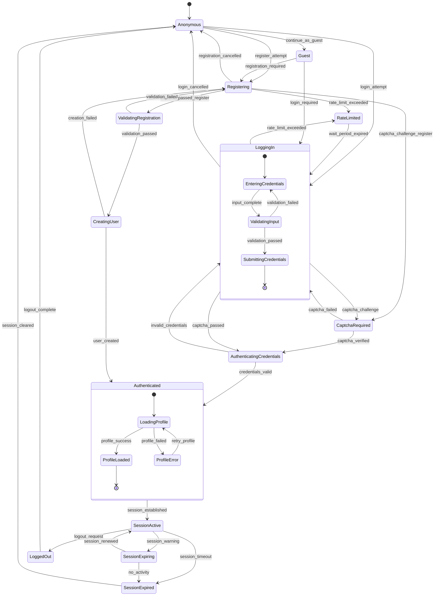
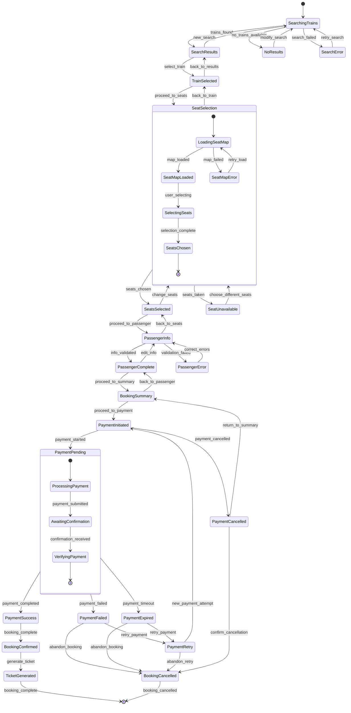
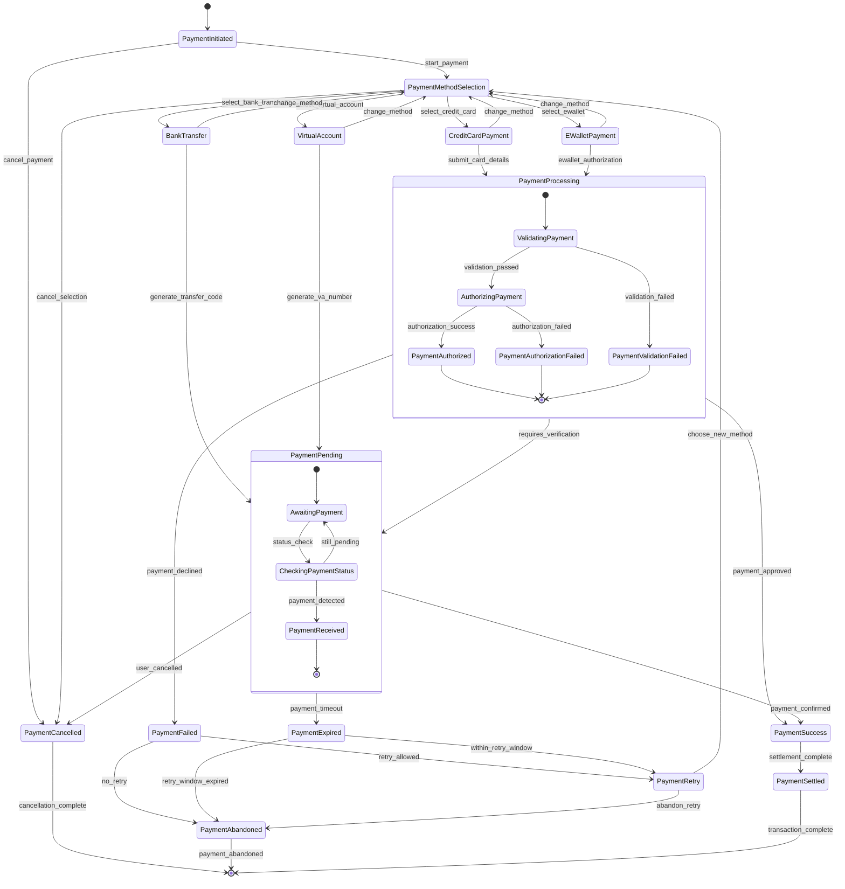
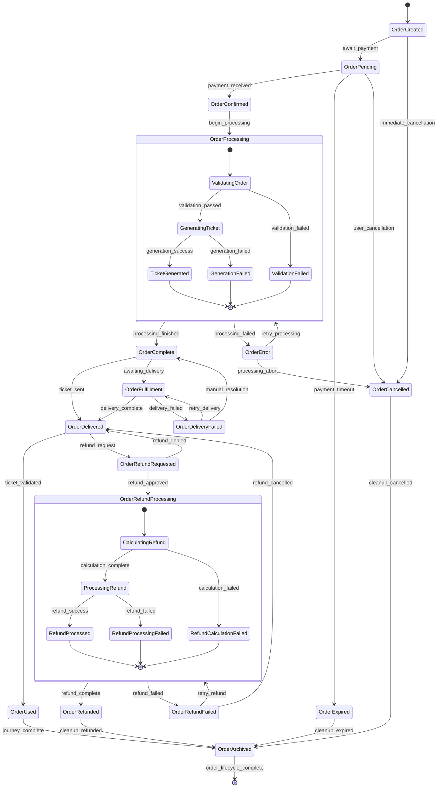
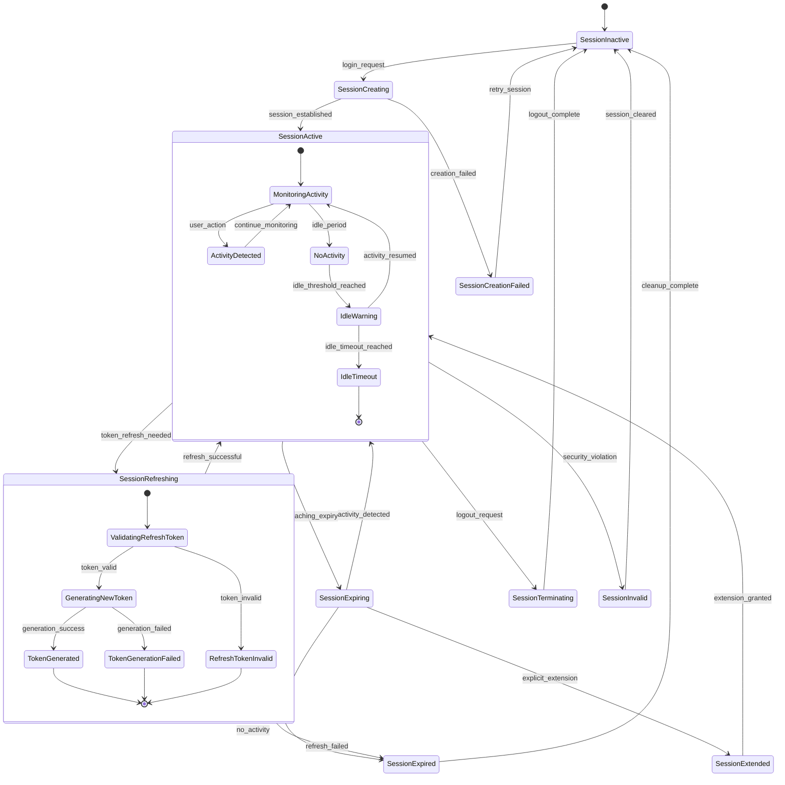
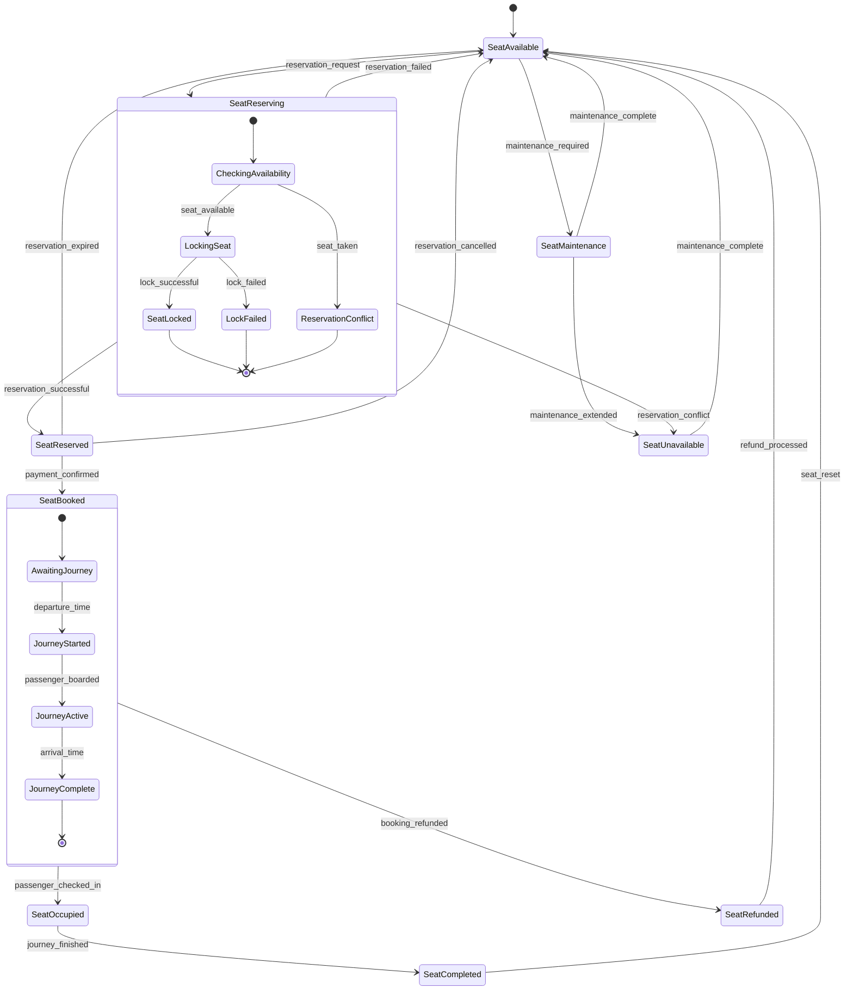
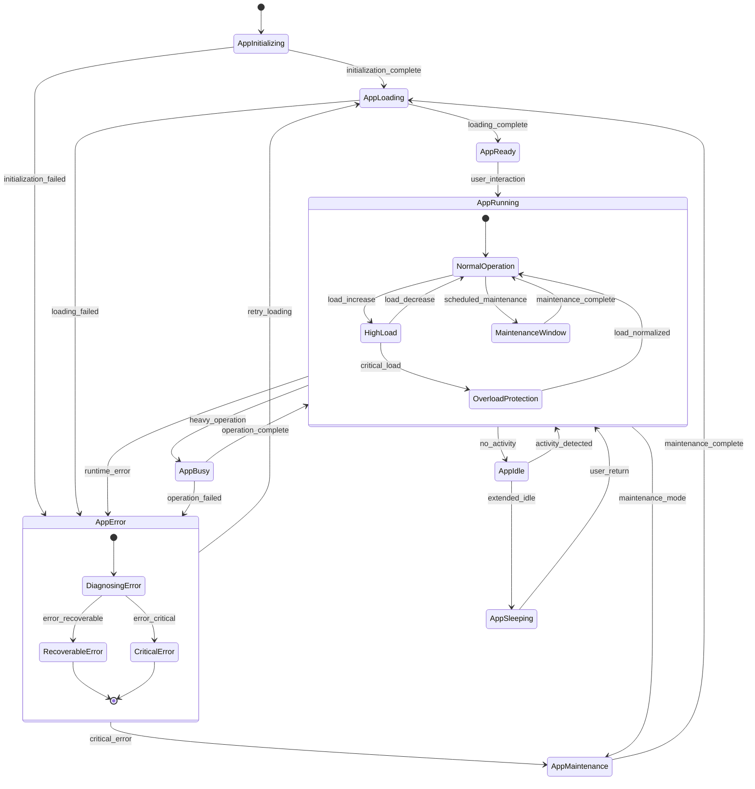

# 🔄 State Machine / State Transition Diagram - KAI Railway Ticketing Platform

## User Authentication State Machine

## Booking Process State Machine

## Payment Transaction State Machine

## Order Management State Machine

## Session Management State Machine

## Seat Reservation State Machine

## Application Global State Machine

